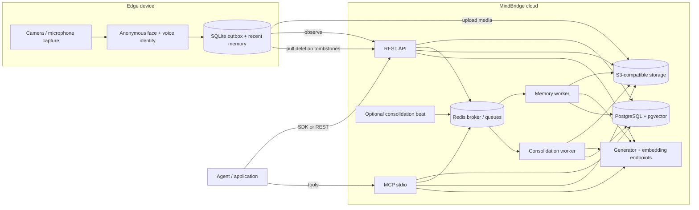

# MindBridge

[](https://github.com/EventHorizon-Lab/MindBridge/actions/workflows/ci.yml)
[](pyproject.toml)
[](LICENSE)

Evidence-grounded memory as a service for machines that see and hear.

MindBridge turns timestamped audio and video into structured, queryable memory while keeping
every derived result tied to replayable source evidence. It is built for robots, wearables,
cameras, and agents that need long-lived memory beyond a context window.

> **Project status:** pre-1.0 and not yet released. The REST, Python SDK, and MCP contracts are
> usable; storage migrations do not yet carry a compatibility guarantee. See
> [Project status](#project-status).

## Contents

- [Why MindBridge](#why-mindbridge)
- [What is implemented](#what-is-implemented)
- [Architecture](#architecture)
- [Quickstart](#quickstart)
- [Use the Python SDK](#use-the-python-sdk)
- [Ingest audio and video](#ingest-audio-and-video)
- [Interfaces and commands](#interfaces-and-commands)
- [Configuration](#configuration)
- [Development](#development)
- [Deployment](#deployment)
- [Benchmarking](#benchmarking)
- [Documentation](#documentation)
- [Project status](#project-status)
- [Contributing and security](#contributing-and-security)

## Why MindBridge

Conventional retrieval pipelines lose the properties embodied systems need:

- **Verifiable evidence.** A caption is not the recording. MindBridge retains exact
  `EvidenceSpan` timestamps and returns signed media that covers the cited span.
- **Memory that changes without changing model weights.** Recall, feedback, consolidation, and
  lifecycle state strengthen, correct, supersede, cool, or compress records while models remain
  frozen.
- **Deletion that reaches derived state.** `forget()` removes dependent graph records, vectors,
  and derived clips, while durable tombstones let offline devices reconcile when they reconnect.
- **One production path.** REST, MCP, the Python SDK, and benchmark runners share the same
  contracts and application kernel; there is no evaluation-only retrieval path.

## What is implemented

- Timestamped camera and microphone observations with idempotent, asynchronous processing.
- Explicit text memory writes, including batches of up to 100 memories in one encoder call.
- Event, Entity, Claim, Episode, and Summary construction grounded in source evidence.
- Dense evidence/memory/graph retrieval fused with PostgreSQL full-text search.
- `answer`, `search`, and bounded `enumerate` recall modes, including text and stored-media
  queries.
- Feedback, versioned corrections, explainable lifecycle transitions, and transitive deletion.
- Forced PostgreSQL row-level security plus bearer keys bound to tenant allowlists.
- REST/OpenAPI, an async Python SDK, seven MCP tools over stdio, and operational CLIs.
- Platform-neutral edge capture handoff, encrypted anonymous identity, SQLite outbox, offline
  recent memory, and deletion reconciliation.
- Official dataset adapters and production-API runners for twelve public benchmarks, plus an
  offline Agent Memory Leaderboard replay harness.

The complete current capability list and known gaps live in [CHANGELOG.md](CHANGELOG.md).

## Architecture

MindBridge is a modular Python monolith deployed as separate process roles. PostgreSQL is the
only primary database; Redis carries Celery job IDs, and S3-compatible storage holds original
media and rebuildable derived clips.



An observation write stops at durability: the API commits its metadata, publishes an ID-only
job, and returns `202 Accepted`. The worker then perceives the media, derives grounded records,
creates span-sized evidence clips, embeds the graph, and commits the derived batch atomically.
Callers poll or stream the returned processing job before expecting recall results.

The detailed write path, read path, storage rules, and failure behavior are in
[docs/architecture.md](docs/architecture.md).

## Quickstart

This path writes an explicit memory and recalls it. Raw audio/video ingestion adds the worker in
the next section.

### Prerequisites

| Requirement | Purpose |
| --- | --- |
| Python 3.10–3.14 | Supported runtime range. |
| [uv](https://docs.astral.sh/uv/) | Installs the checked-in lockfile. |
| Docker with Compose | Runs the pinned PostgreSQL and Redis development services. |
| S3-compatible object storage | Stores original media and evidence clips. |
| OpenAI-compatible generator endpoint | Produces answers and structured memory output. |
| Multimodal embedding endpoint | Encodes text, image, video, and audio into the configured space. |

The repository supplies a Jina v5 Omni embedding service, but it does not bundle a generator or
an object store. The committed `mindbridge.toml` points to local development addresses; change
them to services you control.

### 1. Install from source

```bash
git clone https://github.com/EventHorizon-Lab/MindBridge.git
cd MindBridge
uv sync --extra server
```

### 2. Start PostgreSQL and Redis

```bash
docker compose up -d postgres redis
for migration in migrations/*.sql; do
  docker compose exec -T postgres psql -v ON_ERROR_STOP=1 \
    -U mindbridge -d mindbridge < "$migration"
done
```

Migrations are explicit and ordered; no process migrates the database on startup.

### 3. Configure credentials and services

```bash
cp .env.example .env
openssl rand -hex 24
```

Put the generated key in `MINDBRIDGE_TENANT_API_KEYS_JSON`, fill the generator and embedder API
keys, and provide your object-storage credentials through Boto3's normal AWS environment or
instance configuration. Edit `mindbridge.toml` for endpoints, bucket, model IDs, and other
non-secret settings.

Validate the resolved API configuration without printing any secret:

```bash
uv run --env-file .env mindbridge config check --role api
```

### 4. Start the API

```bash
uv run --env-file .env --extra server \
  uvicorn mindbridge.server:create_app --factory
```

```bash
curl -s http://localhost:8000/healthz
```

`/healthz` is liveness only. It does not claim that PostgreSQL, Redis, object storage, or model
endpoints are ready.

For the complete local model and object-storage setup, use the
[complete quickstart](docs/quickstart.md).

## Use the Python SDK

The base package includes a typed asynchronous HTTP client and all public request/response
contracts.

```python
import asyncio
from datetime import datetime, timezone

from mindbridge import MemoryType, MindBridge, RecallQuery, RecallRequest, RememberRequest

API_KEY = "the key in MINDBRIDGE_TENANT_API_KEYS_JSON"


async def main() -> None:
    async with MindBridge.connect(base_url="http://localhost:8000", api_key=API_KEY) as memory:
        written = await memory.remember(
            RememberRequest(
                tenant_id="tenant_01",
                summary="The red screwdriver is in the blue toolbox.",
                memory_type=MemoryType.EPISODIC,
                occurred_at=datetime.now(timezone.utc),
            )
        )
        print(written.status, written.memory_id)

        result = await memory.recall(
            RecallRequest(
                tenant_id="tenant_01",
                query=RecallQuery(text="Where is the red screwdriver?"),
            )
        )
        print(result.answer, result.confidence)


asyncio.run(main())
```

An identical write returns the original memory with `status=duplicate`. An unsupported recall
returns `answer=None`; callers should treat that as an abstention, not a transport failure.

See the [Python SDK reference](docs/api/python-sdk.md) for media queries, strict follow-up scopes,
job streaming, feedback, deletion, and typed errors.

## Ingest audio and video

The worker always needs the media decoders, even when both model slots are remote:

```bash
uv sync --extra server --extra media
uv run --env-file .env --extra server --extra media \
  celery -A mindbridge.celery_app:app worker --loglevel=INFO
```

Only `prefork` (the default) and `solo` worker pools are supported. The worker owns one
synchronous event loop per process; thread and greenlet pools are rejected at startup.

The edge uploads bytes to tenant-scoped object storage before it submits
`POST /v1/observations`. The response contains a `processing_job_id`; poll
`GET /v1/jobs/{job_id}` or follow its SSE stream until the attempt succeeds.

Use [edge deployment](docs/edge.md) for the capture/outbox path and
[deployment](docs/deployment.md#memory-worker) for worker sizing and the optional in-process Jina
encoder.

## Interfaces and commands

| Surface | Entry point | Reference |
| --- | --- | --- |
| REST/OpenAPI | `uvicorn mindbridge.server:create_app --factory` | [REST API](docs/api/rest.md) |
| Python SDK | `mindbridge.MindBridge` | [SDK](docs/api/python-sdk.md) |
| MCP | `mindbridge mcp` | [MCP tools](docs/api/mcp.md) |
| Operations | `mindbridge <command>` | [CLI](docs/api/cli.md) |
| Benchmarks | `mindbridge-bench <benchmark>` | [Benchmarking](docs/benchmarking.md) |

```text
mindbridge
├── config check
├── consolidate
├── jobs
├── lifecycle
├── mcp
├── jina serve
├── sentence-transformers serve
└── edge sync
```

Every command documents its own flags, environment, defaults, and exit statuses with `--help`.

## Configuration

MindBridge uses two sources with a strict boundary:

- **Credentials** belong in environment variables only. `.env.example` is a template; MindBridge
  does not load it itself.
- **Non-secret structure** belongs in `mindbridge.toml`. An environment variable may override an
  individual key for a container or CI job.

Unknown keys, malformed plugin objects, missing credentials, incompatible embedding spaces, and
short tenant API keys fail during startup. Run `mindbridge config check --role <role>` to inspect
resolution without revealing values.

The complete role matrix and setting reference are in
[docs/configuration.md](docs/configuration.md).

## Development

Install the same dependency set used by the CI quality matrix:

```bash
uv sync --all-groups --extra media --extra server
```

Run all required gates:

```bash
uv run ruff format --check .
uv run ruff check .
uv run mypy
uv run pytest -W error
git diff --check
```

Without `MINDBRIDGE_TEST_DATABASE_URL`, PostgreSQL integration tests skip. Changes to recall,
consolidation, or deletion must use the required integration gate documented in
[CONTRIBUTING.md](CONTRIBUTING.md#the-integration-gate).

Documentation is checked in CI with pinned Markdown lint and link-check tools. Public REST and
MCP schemas are guarded by contract snapshots.

### Repository layout

```text
src/mindbridge/
├── core/            domain types and invariants
├── application/     use cases, pipelines, and ports
├── infrastructure/  PostgreSQL, S3, and Celery adapters
├── models/          generator/embedder plugins
├── api/             REST, MCP, authentication, and runtime composition
├── edge/            capture handoff, identity, SQLite, and sync
├── media/           lazy-loaded media clipping
└── benchmarks/      official dataset adapters and runners

tests/
├── unit/
├── contracts/
├── integration/
└── benchmarks/
```

Dependency direction and the benchmark leaf boundary are explained in
[docs/architecture.md](docs/architecture.md#code-layout).

## Deployment

Production uses separate roles for the REST API, observation worker, optional MCP server,
optional Jina embedding service, and consolidation/lifecycle runs. Consolidation can use the
built-in Celery beat schedule and its dedicated worker queue. Install only the extras a role needs
and provide PostgreSQL 18 with pgvector, Redis, private S3-compatible storage, and model endpoints.

The repository's Compose file is for PostgreSQL and Redis development only. It is not a complete
production deployment, and MindBridge does not currently ship a production image, Kubernetes
manifests, or automatic migrations. See [docs/deployment.md](docs/deployment.md) for the process
topology, security posture, capacity notes, and backup/deletion obligations.

## Benchmarking

`mindbridge-bench` drives the same deployed REST contract as applications. A result is citable
only when it uses a complete official split, a pinned deployment snapshot, a committed manifest,
and replayable outputs.

No complete public-set MindBridge baseline currently stands. Diagnostic runs are useful for
engineering but are not leaderboard scores. Read [docs/benchmarking.md](docs/benchmarking.md)
before quoting a number.

## Documentation

Start from the [documentation index](docs/README.md), or go directly to:

| Guide | Audience |
| --- | --- |
| [Quickstart](docs/quickstart.md) | First local deployment and recall. |
| [Concepts](docs/concepts.md) | Domain vocabulary and record relationships. |
| [Architecture](docs/architecture.md) | Runtime topology, read/write paths, and failure behavior. |
| [REST API](docs/api/rest.md) | Endpoint, schema, and error reference. |
| [Python SDK](docs/api/python-sdk.md) | Application integration. |
| [MCP tools](docs/api/mcp.md) | Agent integration. |
| [Configuration](docs/configuration.md) | Operators and deployment automation. |
| [Operations](docs/operations.md) | Sweeps, observability, alerts, and drills. |
| [Troubleshooting](docs/troubleshooting.md) | Startup, recall, jobs, performance, and deletion. |
| [Contributing](CONTRIBUTING.md) | Development workflow and review standards. |

## Project status

MindBridge has not published a release. `0.1.0` in `pyproject.toml` is the development version,
and security fixes currently land on `master`.

Known product gaps include per-tenant quotas/rate limits, automatic re-embedding, retrieval beyond
one-hop `same_as` entity aliases, a complete public benchmark baseline, and storage-schema
compatibility across migrations. Track the current list in [CHANGELOG.md](CHANGELOG.md#known-gaps).

## Contributing and security

Read [CONTRIBUTING.md](CONTRIBUTING.md) before opening a pull request. Structural changes should
start with an issue and, where appropriate, a design specification.

Report vulnerabilities through GitHub private vulnerability reporting as described in
[SECURITY.md](SECURITY.md). Do not open a public security issue.

## License

MindBridge is licensed under the [Apache License 2.0](LICENSE).
