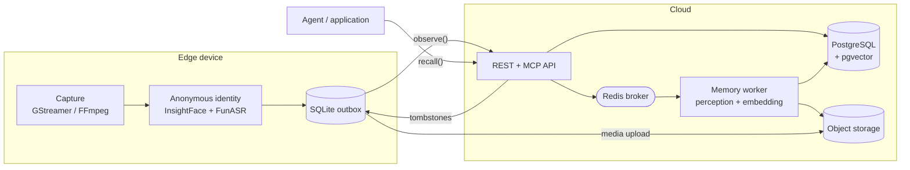

# MindBridge

[](LICENSE)
[](pyproject.toml)

Memory-as-a-Service for machines that see and hear.

MindBridge takes continuous audio and video off a camera, a robot, or a wearable, derives
structured memory from it, and answers questions about it — returning the exact slice of the
original recording each answer rests on. It is not a transcript store with a vector index in
front of it: the raw recording stays the source of truth, and every derived sentence keeps a
millisecond-accurate pointer back into the media it came from.

---

## What problem this solves

An agent embodied in the world accumulates more experience in a day than fits in any context
window, and most of that experience is not text. Three things break when you push that through
a conventional retrieval stack:

- **The evidence is gone.** Once video becomes a caption, nothing can check the caption. An
  answer that cannot be verified against what the sensor actually recorded is a guess with
  provenance-shaped decoration.
- **Nothing ages.** Real memory strengthens on use and decays on neglect. A vector table does
  neither, so week-old noise ranks beside what matters.
- **Deletion is a lie.** "Forget that" has to reach derived summaries, embeddings, cut clips,
  and the offline device that is still holding a copy — not just delete one row.

MindBridge treats all three as storage-layer problems rather than prompt-layer ones. Memory is
versioned, decays on an explicit schedule, consolidates into higher-order structure, and erases
transitively through a durable tombstone that offline devices reconcile against when they
reconnect.

## Design commitments

These are load-bearing, and reversing any of them is an architecture change rather than a
configuration change. The full record with the cost each one accepts is in
[the architecture decision log](docs/technical-architecture.md#17-关键架构决策记录).

| Commitment | What it means in practice |
| --- | --- |
| Raw audio and video are primary | Derived text is a view. Consolidation reopens the original media instead of re-reading its own summaries. |
| Models are frozen | No fine-tuning. Learning happens in the memory layer — feedback, consolidation, strength — so a model swap does not invalidate stored experience. |
| Evidence is addressable | Every memory carries `EvidenceSpan` pointers as `(media_object, start_ms, end_ms)`, returned as short-lived signed URLs. |
| Edge decides identity, cloud decides memory | The device does capture gating, anonymous face/voice identity, and a recent-memory cache. Raw embeddings and encryption keys never leave it. |
| One database | PostgreSQL 18 with pgvector, with forced row-level security per tenant. No second store to keep consistent. |
| Benchmarks use the production API | Evaluation runs through the same REST contract an application uses. There is no evaluation-only fast path to accidentally tune against. |

## How it fits together



An observation is accepted synchronously and processed durably. `POST /v1/observations`
registers the media and returns a `processing_job_id` immediately; the worker then inspects the
original AV once, writes an evidence-grounded Event/Entity/Claim graph, and cuts one derived
clip per grounded span so each vector covers that span rather than the whole file. Recall fuses
dense, lexical, and graph retrieval, and can reopen source media to verify a candidate before
answering.

## Quickstart

Bring up the datastores, apply the migrations, and make the first call:

```bash
uv sync --extra server
docker compose up -d postgres redis
for migration in migrations/*.sql; do
  docker compose exec -T postgres psql -v ON_ERROR_STOP=1 -U mindbridge -d mindbridge < "$migration"
done
```

Then write and recall a memory through the typed async client:

```python
from datetime import datetime, timezone

from mindbridge import MemoryType, MindBridge, RecallQuery, RecallRequest, RememberRequest

async with MindBridge.connect(base_url="http://localhost:8000", api_key=api_key) as memory:
    await memory.remember(
        RememberRequest(
            tenant_id="tenant_01",
            summary="The red screwdriver went into the blue toolbox on the workbench.",
            memory_type=MemoryType.EPISODIC,
            occurred_at=datetime.now(timezone.utc),
        )
    )
    result = await memory.recall(
        RecallRequest(tenant_id="tenant_01", query=RecallQuery(text="Where is the screwdriver?"))
    )
    print(result.answer, result.confidence)
```

The full path, including the model endpoints the server needs before it will start, is in the
[quickstart guide](docs/quickstart.md).

## Documentation

| | |
| --- | --- |
| **[Quickstart](docs/quickstart.md)** | Local stack running and answering in about fifteen minutes. |
| **[Concepts](docs/concepts.md)** | Observation, Event, Claim, Memory, Evidence — the domain model and how records relate. |
| **[Architecture](docs/architecture.md)** | Process topology, write and read paths, storage layout, failure behaviour. |
| **[Configuration](docs/configuration.md)** | Every environment variable, which process reads it, and what happens when it is wrong. |
| **[Deployment](docs/deployment.md)** | Running the API, the worker, and the scheduled sweeps in production. |
| **[Edge deployment](docs/edge.md)** | Capture handoff, on-device identity, outbox sync, deletion reconciliation. |
| **[Operations](docs/operations.md)** | Consolidation, lifecycle decay, telemetry, backup and deletion drills. |
| **[REST API](docs/api/rest.md)** | Every endpoint, request and response schema, and the complete error-code table. |
| **[Python SDK](docs/api/python-sdk.md)** | The async client, streaming job progress, error handling. |
| **[MCP tools](docs/api/mcp.md)** | The seven agent-facing tools and their argument shapes. |
| **[CLI](docs/api/cli.md)** | `mindbridge` and `mindbridge-bench`, their flags and exit codes. |
| **[Benchmarking](docs/benchmarking.md)** | Running the official harnesses and what the numbers may be claimed to mean. |
| **[Troubleshooting](docs/troubleshooting.md)** | Startup refusals, empty recalls, stuck jobs, and what each one actually indicates. |
| **[Contributing](CONTRIBUTING.md)** | Development setup, quality gates, review standards. |

Reference material that predates this guide set and remains current:
[technical architecture](docs/technical-architecture.md) (Chinese, the design specification),
[model plugin contract](docs/plugin-architecture.md),
[edge identity model selection](docs/edge-identity-sota.md),
[benchmark SOTA targets](docs/benchmarks-sota.md).

## Project status

Pre-1.0. The REST contract, the Python SDK, and the MCP tool surface are stable enough to build
against; the storage schema still changes through numbered migrations, and there is no
compatibility promise across them yet.

On evaluation, the honest position: the four full public-benchmark baselines were retired on
2026-08-19 because their numbers could not be reproduced under a single protocol, and **no
complete public-set baseline currently stands**. Diagnostic subset runs exist and are recorded
in `.benchmarks/`, but a subset run is not a leaderboard score. Any SOTA claim has to come from
a fresh same-protocol rerun with a committed manifest. See
[benchmarking](docs/benchmarking.md) for what the harness does and does not license you to say.

## Contributing

Read [CONTRIBUTING.md](CONTRIBUTING.md). The short version: `uv sync --all-groups --extra edge
--extra media --extra server`, then make `ruff format --check`, `ruff check`, `mypy`, and
`pytest -W error` pass before you open a pull request. Changes touching recall, consolidation,
or deletion must run the integration suite against a real PostgreSQL rather than letting it
skip.

Security issues go through [SECURITY.md](SECURITY.md), not the public issue tracker.

## License

[Apache License 2.0](LICENSE).
