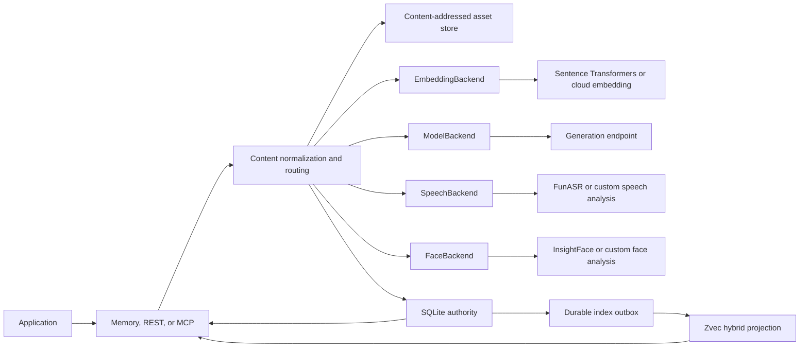
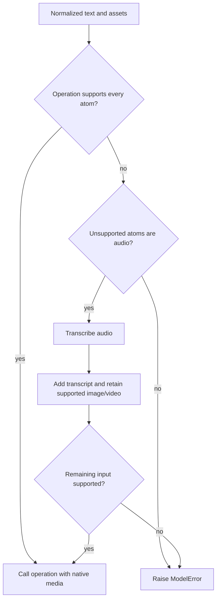
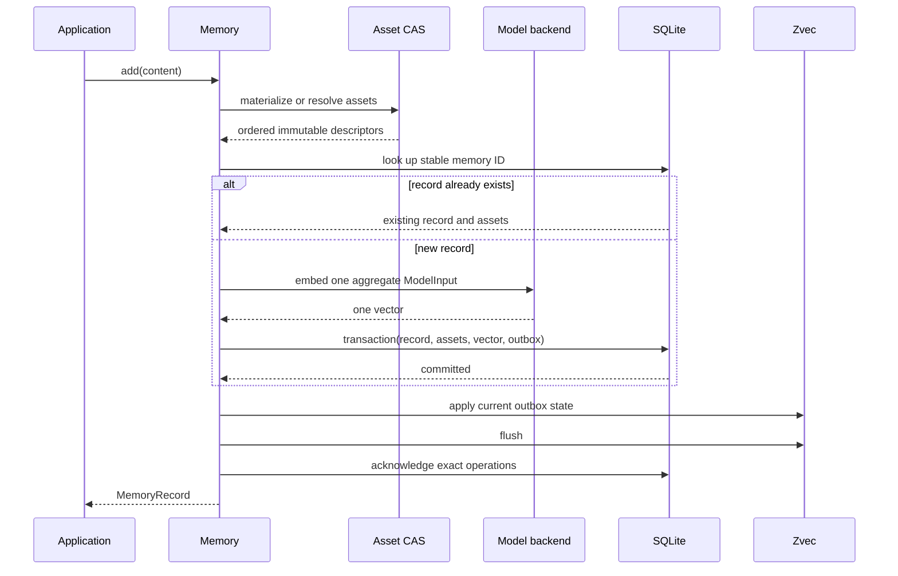

# Architecture

MindBridge is an embedded library, not a distributed memory service. The process that imports
`Memory` owns persistence, media materialization, indexing, and model calls for one directory.

## Components

| Component | Responsibility |
| --- | --- |
| `Memory` | Content normalization, capability routing, identity, orchestration, public errors |
| `AsyncMemory` | `asyncio.to_thread` facade over the same synchronous core |
| `AssetStore` | Safe Path/URL/Blob ingestion, public-IP connection pinning, immutable SHA-256 files |
| `LocalStore` | SQLite records, roles/times, assets, FP32 embeddings, biometric identities, outbox |
| `ZvecIndex` | Dense/full-text hybrid retrieval plus role and event-time filters |
| `EmbeddingBackend` | Embedding capabilities, stable model/space identity, query/document batches |
| `ModelBackend` | Combined cloud embedding compatibility, grounded generation, and transcription |
| `SpeechBackend` | Timed transcription, diarization, and stable speech-space identity |
| `FunASRTranscriber` | Lazy Fun-ASR-Nano with AutoModel/vLLM, FSMN-VAD, and CAM++ |
| `FaceBackend` | Face boxes and embeddings with a stable recognition-space identity |
| `InsightFaceRecognizer` | Lazy upstream InsightFace model pack through ONNX Runtime |
| `JinaOmniEmbedder` | Pinned default model and isolated Jina tuple/remote-code compatibility |
| `SentenceTransformersEmbedder` | Standard multimodal dict/message input and model capability discovery |
| FastAPI adapter | Optional `/v1` JSON transport, body limit, bearer authentication |
| MCP adapter | Optional five-tool stdio transport with strict argument allowlists |

Python, REST, and MCP call the same local core. Protocol adapters translate wire parts; they do not
reimplement modality, identity, storage, or retrieval rules.

## Isolation boundary

One physical `data_dir` belongs to one live `Memory` instance. An operating-system file lock is
held for its lifetime, so a second instance or process fails at construction rather than racing
SQLite, the CAS, or Zvec. On POSIX, opening the directory enforces top-level mode `0700`; an
existing broader mode is tightened rather than preserved.

Independent directories are the only supported isolation mechanism:

1. Parallel benchmark cases allocate separate leaf directories.
2. A REST or MCP deployment uses one process per directory.
3. Applications that require distinct memory domains use distinct paths.

There is no tenant, user, run, or hidden scope key inside SQLite or Zvec. Metadata is not an
authorization boundary.

## Content and model routing

The core first turns `str`, `Path`, `URL`, `Blob`, and `AssetRef` atoms into normalized text and
resolved immutable assets. It computes modality from media families, then routes each model
operation from `ModelCapabilities`.

This is capability-driven, not a model-name heuristic. A visual-language model without audio
support receives ASR text plus retained visual parts. Native audio-capable operations receive the
original audio. Audio-only input becomes transcript-only only when fallback is required.

Embedding is local Jina v5 Omni by default. Another standard Sentence Transformers model plugs in
through `embedder=`; Qwen3-VL uses its native dict/message contract and advertised capabilities.
A combined cloud `ModelBackend` can still own embedding and transcription when passed explicitly
without `embedder=` or `transcriber=`. Generation uses OpenAI-compatible HTTP by default; speech
uses local FunASR by default, and `faces` uses a lazy InsightFace `buffalo_l` adapter.
Embedding, transcription, and face-recognition space IDs are persisted in SQLite. A different
active value fails at startup so vectors and cached analyses never mix semantic recipes in one
directory. Face and voice profiles share one identity row only after an explicit confirmed merge;
their modality-specific vectors are never compared.

The built-in `data` transport limits each embedding or generation request to 64 MiB of aggregate
raw media before base64 expansion. Answer construction includes a distinct asset's binary part only
once, even when multiple hits reference it. Trusted co-located deployments can use `file` transport;
large-video integrations can implement streaming or provider-native upload in `ModelBackend`.

## Write consistency

An add follows this order:

SQLite commits before Zvec changes. The outbox is acknowledged only after a successful index
flush. If indexing fails after commit, the call can raise `IndexUnavailableError` even though the
record, asset references, and embedding are durable. Retrying the same idempotent add or reopening
after repair drains pending work without duplicating the record.

CAS bytes are installed atomically by digest. SQLite owns whether a file is referenced; deletion
removes the file only after its final memory relationship is gone. Asset display names are also
digest-level metadata: the first authoritative non-empty name wins when the same bytes arrive under
different names.

Potentially slow model calls happen outside the local write lock, so concurrent operations may
overlap remote inference. MindBridge serializes only the SQLite commit/outbox and Zvec critical
sections needed to preserve local consistency; maintenance operations such as reindex and optimize
remain exclusive.

## Read consistency

Search drains pending index work and prepares one aggregate query embedding. A routed query with
text uses Zvec hybrid search; a pure-media query uses dense search. Optional role and detected
event-time filters reduce candidates. MindBridge then hydrates records and ordered assets from
SQLite, rechecks those constraints, and drops candidates missing from authoritative state.
Temporal intent and enabled decay over-fetch a bounded pool and apply a deterministic rerank.

Listing bypasses Zvec and reads newest records directly from SQLite with an opaque keyset cursor
over `(created_at, id)`.

## Recovery model

SQLite stores authoritative FP32 embeddings and CAS descriptors, so index recovery needs neither
the source media nor another historical model call:

- Pending outbox work is replayed at open and before dependent operations.
- If `zvec/` is absent, startup checkpoints all embeddings before creating the replacement index.
- A recognized older index recipe is discarded and rebuilt automatically after SQLite migration.
- `reindex()` replaces the derived collection from SQLite in bounded batches.
- `optimize()` compacts and flushes staged Zvec state.

Backups must include both `state.sqlite3` and `assets/`; `zvec/` is useful for faster restore but is
not authoritative.

## Dependency boundary

The core package depends on HTTPX, Pydantic, and Zvec. Sentence Transformers and speech decoders
live in the `local` extra; InsightFace, ONNX Runtime, and OpenCV live in `face`; FastAPI/Uvicorn live
in `server`; and MCP lives in `mcp`. Importing MindBridge does not import those optional runtimes.

The current retrieval unit is one memory and one aggregate embedding. The architecture does not
claim content chunking, multiple vectors per memory, autonomous consolidation, or learned
reranking. For table and flow details, read [technical architecture](technical-architecture.md)
and [memory types, temporal reasoning, and decay](memory-types-time-and-decay.md).
