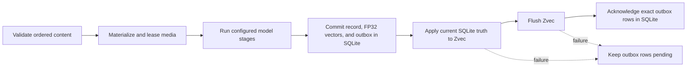

# Architecture

MindBridge is an embedded Python runtime. The host application constructs one `Memory`, supplies
model backends, and owns process and transport policy. `Memory` owns validation, durable state,
retrieval, and resource lifecycle.

This page defines implementation invariants. See [core concepts](concepts.md) for the user model,
[deployment](deployment.md) for topology choices, and [operations](operations.md) for procedures.

## System boundary

| Component | Responsibility |
| --- | --- |
| `Memory` | Coordinate public operations, model capabilities, storage, retrieval, and lifecycle. |
| Model backends | Embed, generate, transcribe or analyze speech, analyze faces, describe images, or propose typed formations through narrow protocols. |
| `LocalStore` | Persist authoritative records, FP32 embeddings, analysis and identity state, compatibility metadata, and the index outbox in SQLite. |
| `AssetStore` | Persist immutable image, video, and audio bytes by SHA-256. |
| `ZvecIndex` | Maintain rebuildable dense, lexical, type, and event-time search projections. |
| REST, MCP, and CLI adapters | Translate their protocol and call the same `Memory` kernel. |

One physical `data_dir` is one memory domain and may have one live owner. Metadata is application
data, not an account, authorization, request, or isolation boundary.

## Durable state

| Path | Authority | Recovery role |
| --- | --- | --- |
| `state.sqlite3` | Authoritative | Records, FP32 embeddings, model and index compatibility markers, cached analyses, identities, typed semantics with evidence, bitemporal versions, durable formation completion, and pending index operations. |
| `assets/` | Authoritative | Original media bytes, stored by digest. SQLite cannot recreate a missing asset. |
| `zvec/` | Derived | Disposable search projection. It may be deleted while stopped; startup rebuilds it from SQLite without re-embedding stored content. |
| `.mindbridge.lock` | Coordination only | Operating-system lock target; the file normally remains after shutdown, so its presence says nothing about a live owner. |
| `.asset-staging/` | Transient | In-progress content-addressed writes, cleaned when the store opens. |

SQLite uses WAL, foreign keys, `synchronous=FULL`, and `BEGIN IMMEDIATE` for writes. The asset
store writes and fsyncs a temporary object before publishing it under its digest, so identical
bytes reuse one object. A backup needs SQLite and `assets/`; see the
[backup runbook](operations.md#backup).

The store also records the embedding model, space, dimension, transcription space, configured face
spaces, and the index recipe. An unrecognized mismatch fails at open instead of mixing
incompatible state. A known index-only recipe change rebuilds Zvec from stored vectors; a
recognized embedding recipe upgrade may re-embed records before publishing the new marker.

## Write consistency

Media is copied to the content-addressed store before any model receives it. SQLite triggers
enqueue an upsert or delete for each embedding mutation. MindBridge commits that transaction
before changing Zvec, flushes Zvec before acknowledging work, and acknowledges the exact rows it
applied. Startup, add, delete, search, `reindex()`, and `optimize()` drain pending work.

The ordering determines failure behavior:

- Validation or model failure before the SQLite transaction creates no record; unreferenced media
  is cleaned after its operation lease is released.
- A SQLite failure rolls back the record, embeddings, and outbox together.
- A Zvec mutation or flush failure can fail the public call after SQLite committed. The record is
  still durable and the unacknowledged projection work is retryable.
- Stale IDs left in Zvec cannot resurrect deleted data because final hydration uses SQLite.

A memory ID is the SHA-256 digest of canonical ordered content, media digests, metadata, event
time, memory type, and optional typed observation context. Repeating the same add is idempotent.
`add_many()` uses one model batch and one SQLite transaction. `add_stream()` commits each completed
item through the ordinary add path, so a later source failure preserves the committed prefix. It
applies and acknowledges those commits to Zvec in bounded groups instead of once per item: the
group ends after 32 items or 250 ms, and covers exactly the outbox rows the commits behind it left
pending. Only the projection is grouped, so the order and the failure behavior above are unchanged;
a group the process never reaches leaves its rows pending for the next drain, and `search` drains
before it reads, so a committed item is retrievable during the stream either way.

Formation follows the same authority rule: a `FormationBackend` only proposes. After the source
observation commits, the kernel assigns identity, validates source binding and source modality,
and resolves validity and conflicts. Derived records, evidence edges, bitemporal versions,
embeddings, the durable per-source completion marker, and outbox work then commit in one SQLite
transaction. Formation is idempotent for a given source memory and formation recipe, so a model
failure leaves the raw observation durable and the formation retryable. Retiring or losing a source
recomputes derived confidence and visibility from the remaining independent evidence instead of
destroying the observation.

## Retrieval consistency

```mermaid
flowchart LR
    query["Validate and prepare query"] --> embed["Embed aggregate and focused keys"]
    embed --> sync["Drain durable outbox"]
    sync --> routes["Run dense and lexical Zvec routes"]
    routes --> hydrate["Hydrate candidate IDs from SQLite"]
    hydrate --> filter["Discard stale IDs and apply authoritative filters"]
    filter --> rank["Collapse, rank, and hydrate final records"]
    rank --> hits["Return SearchHit values"]
```

Zvec proposes candidates; SQLite decides whether they exist and whether hard event-time,
bitemporal, spatial, and memory-type filters pass. Composite records use an aggregate embedding
plus bounded, de-duplicated text and media keys, and long text contributes bounded overlapping
contextual keys. A query uses its complete aggregate plus bounded keys focused on the first text
atom and query media. Dense routes and the lexical route may run concurrently, with at most four
outer search workers. Every route runs at a fixed candidate depth that does not depend on the
requested `limit`, so a narrow request returns the prefix of a wider one and each hit reports the
same score at both. A scope that leaves fewer survivors than the request asked for still widens the
pool.

Ranking combines the strongest dense evidence with bounded lexical, temporal, ambiguity, and
optional decay signals. `RetrievalScope` filters apply as authoritative SQLite checks rather than
projection ranking: `valid_at` and `known_at` select the assertion valid in the world and known to
the system at those instants, while `near` and `radius_m` compare distance only within a matching
spatial frame and anchor, with no implicit frame transform.

`search_with_trace()` exposes bounded ranking signals and terminal rejection reasons without
copying memory content or metadata into the trace. `ask()` uses the same retrieval path, applies
the evidence budget, routes the question and hits through the generation backend's declared
capabilities, and returns only evidence the backend actually used.

## Ownership and concurrency

Opening the store takes a non-blocking operating-system lock for the lifetime of its `Memory`.
Another owner of the same directory fails immediately with `reason="data_dir_in_use"`; different
directories can run concurrently. A `Memory` created before `fork()` is rejected in the child.

Model calls and separate SQLite transactions may overlap. SQLite serializes its own writers with
`BEGIN IMMEDIATE`. A process-local write lock protects outbox application, destructive operations,
index replacement, final record and asset hydration, and add-time speaker identity updates, whose
identity changes must roll back with a failed add. Ordinary Zvec queries may overlap; replacement
and close wait for active queries.

`reindex()` reads authoritative SQLite pages, replaces the Zvec collection, then replays the
outbox so writes committed during the scan are retained. `close()` rejects new work, waits for
active operations, releases asset leases, and closes each unique backend and storage resource
once. `AsyncMemory` delegates to this same synchronous core with `asyncio.to_thread`; it does not
create a service or a second consistency model.

## Model boundary

The extension contracts are `EmbeddingBackend`, `GenerationBackend`, `TranscriptionBackend`,
`SpeechBackend`, `VisionDescriptionBackend`, `FaceBackend`, and `FormationBackend`;
`StreamingGenerationBackend` adds streamed generation. Routing follows declared atomic modalities,
not provider or model names. Unsupported visual evidence fails; unsupported audio can fall back to
transcript text only when a configured transcription backend declares the required capability.
Provider output is validated before persistence or return.

Applications may inject backend objects directly or use `MemoryPlugins` and
`Memory.from_plugins()`. `Memory.from_config()` validates a closed catalog of bundled providers and
delegates to the same kernel. There is no global plugin registry, package discovery, or live
backend swap during a `Memory` lifetime. SQLite, the asset store, and Zvec are internal components
rather than public storage plugins: a model backend may perform inference but cannot bypass
validation, stable identity, durability, or final SQLite hydration.

Model code is part of the application's trust boundary. The bundled Jina adapter in particular
executes upstream code with model and code revisions pinned; [configuration](configuration.md)
owns the exact recipe and license constraints.

## Public and trust boundaries

Supported SDK values are imported from `mindbridge`, and the SDK exposes the complete set of
product operations. REST exposes add, batch add, search, reinforce, get, list, delete, and ask
under `/v1`. MCP exposes fourteen tools: that subset without batch add, plus the embodied and
identity operations. The local CLI can call the SDK operations; `--url` is limited to operations
REST implements.

Transport adapters do not create another owner: `create_app(memory=...)` and
`build_mcp_server(memory)` use a caller-owned instance and never close it. They also do not add
authentication, authorization, TLS, rate limits, quotas, or audit policy. See
[deployment](deployment.md) for process and network setup.

Python callers may intentionally pass regular local `Path` values; MindBridge opens only regular
files and avoids following the final symlink where the platform supports it. REST and MCP accept
inline bytes or existing asset IDs, and reject server paths and remote URLs. No transport
serializes provider exception bodies or credentials. REST also withholds subjects naming storage,
index, or internal state; MCP and the local CLI retain owner-local subjects, so a network MCP host
must protect or redact its error envelope.

Backup, restore, index repair, and telemetry procedures are in [operations](operations.md).
