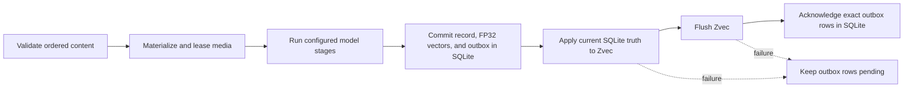
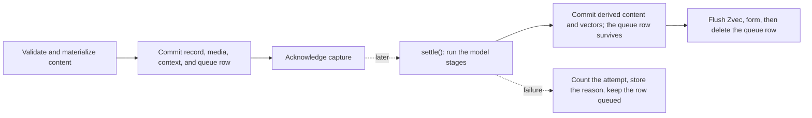

# Architecture

MindBridge is an embedded Python runtime. The host application constructs one `Memory`, supplies
model backends, and owns process and transport policy. `Memory` owns validation, durable state,
retrieval, and resource lifecycle.

This page defines implementation invariants. See [core concepts](concepts.md) for the user model,
[deployment](deployment.md) for topology choices, and [operations](operations.md) for procedures.

## System boundary

| Component | Responsibility |
| --- | --- |
| `Memory` | Coordinate public operations, model capabilities, storage, retrieval, and lifecycle. |
| Model backends | Embed, generate, transcribe or analyze speech, analyze faces, describe images, propose typed formations, or propose memory-control-plane operations. |
| `LocalStore` | Persist authoritative records, FP32 embeddings, analysis and identity state, compatibility metadata, and the index outbox in SQLite. |
| `AssetStore` | Persist immutable image, video, and audio bytes by SHA-256. |
| `ZvecIndex` | Maintain rebuildable dense, lexical, type, and event-time search projections. |
| REST, MCP, and CLI adapters | Translate their protocol and call the same `Memory` kernel. |

One physical `data_dir` is one memory domain and may have one live owner. Metadata is application
data, not an account, authorization, request, or isolation boundary.

## Durable state

| Path | Authority | Recovery role |
| --- | --- | --- |
| `state.sqlite3` | Authoritative | Records, FP32 embeddings, model and index compatibility markers, cached analyses, identities, typed semantics, forgetting state, deferred capture work, the memory-operation log, and pending index operations. |
| `assets/` | Authoritative | Original media bytes. SQLite cannot recreate a missing asset. |
| `zvec/` | Derived | Disposable search projection rebuilt from SQLite without re-embedding stored content. |
| `.mindbridge.lock` | Coordination only | Operating-system lock target; the file normally remains after shutdown. |
| `.asset-staging/` | Transient | In-progress content-addressed writes, cleaned when the store opens. |

SQLite uses WAL, foreign keys, `synchronous=FULL`, and `BEGIN IMMEDIATE` for writes. The asset store
writes and fsyncs a temporary object before publishing it under its digest. A backup needs SQLite
and `assets/`; see the [backup runbook](operations.md#backup).

## Write consistency

SQLite triggers enqueue an upsert or delete for each embedding mutation. MindBridge commits that
transaction before changing Zvec, flushes Zvec before acknowledging work, and acknowledges the
exact rows it applied. Startup, add, delete, search, `reindex()`, and `optimize()` drain pending
work.

The ordering determines failure behavior:

- Validation or model failure before the SQLite transaction creates no record; unreferenced media
  is cleaned after its operation lease is released.
- A SQLite failure rolls back the record, embeddings, and outbox together.
- A Zvec mutation or flush failure can fail the public call after SQLite committed. The record is
  still durable and the unacknowledged projection work is retryable.
- Stale IDs left in Zvec cannot resurrect deleted data because final hydration uses SQLite.

`delete()` is physical forgetting and runs the same ordering in reverse. One SQLite transaction
removes the record and everything keyed on it -- semantics, versions, evidence, formation runs,
the capture-queue row, and the embeddings, whose delete triggers enqueue the projection work the
call then drains. Media is content-addressed and therefore shared: the transaction returns the
assets no remaining memory references, and only those lose their blob, their descriptor, their
cached transcript, and the speech and face rows keyed on them. Removing the last observation of an
anonymous identity also removes that identity and its exemplar template, so no biometric vector
outlives the media it was derived from; a named or merged person survives, because a name is an
assertion a caller made and `forget_identity()` is what erases one. The single deliberate survivor
is `memory_operations`: the operation log is append-only audit history over ids, proposals, and
rationales, and rewriting it would make `rollback()` unsound. The Python SDK reference owns the
row-by-row contract.

A memory ID is the SHA-256 digest of canonical ordered content, media digests, metadata, event
time, memory type, and optional observation context. Repeating the same add is idempotent.
`add_many()` uses one model batch and one SQLite transaction. `add_stream()` commits each completed
item through the ordinary add path, so a later source failure preserves the committed prefix.

### Deferred capture

`capture()` takes the same path with the model stages removed. It validates content, materializes
media, and commits the record, its assets, its observation context, and one `capture_queue` row in
one transaction. Capture acknowledges after that commit and before any model call, which is the
invariant that keeps slow work off the acknowledgement path.

A captured record is durable and readable but has no vectors, so it enqueues no index work and
`search()` cannot return it. `settle()` and the `add()` path share one enrichment routine over the
committed row, so a settled record holds exactly the derived content, vectors, and formation a
blocking `add()` would have produced. Retrieval and shutdown never settle. That shared routine
runs under one process-wide settlement lock, so a concurrent `settle()` or an `add()` of the same
captured content waits instead of running the model stages twice.

Enrichment appends. Derived text is added to `memory_records.content` behind a per-asset marker —
`[transcript:<asset_id>]`, `[visual description:<asset_id>]`, or `[speech identities:<asset_id>]`
— so the caller's own text stays byte-identical at the front of the record and model
interpretation stays separable from evidence. Media bytes are never rewritten: they stay in
`assets/` under their digest, and a transcript is also cached on the asset row.

`settle()` attempts every record it read: a failing one keeps its queue row, its attempt count,
and its reason while the records behind it still settle, and the first failure is raised once the
batch is done. A record that has already failed `max_attempts` times is skipped rather than
retried, so one poisoned capture cannot block the queue. `capture()` applies the same
embedder-capability check `add()` applies, so media no configured model could ever take is
refused before the commit instead of becoming a durable row that can never settle.

### Formation and consolidation

Formation follows the same authority rule. A `FormationBackend` proposes typed state after the
source observation commits; the kernel validates source binding, modality, identity, validity, and
conflicts. Derived records, evidence, versions, embeddings, the per-source recipe marker, and
outbox work commit together.

A failed formation leaves the source durable and retryable on both paths. `add()` enqueues each
new record in `capture_queue` inside its own write transaction whenever a formation backend is
configured, and deletes that row after formation returns; a crash in between leaves the row, and
the next `settle()` finds a record that is already embedded and owes formation only, so it forms
it without buying the same vectors twice. `capture()` keeps its queue row through the settle
commit for the same reason. The per-source recipe marker makes the retry idempotent: a source
that already formed is skipped.

`memory_semantics.identity_id` binds a typed claim to a recognized person, and the kernel is the
only writer of it. It is `ON DELETE SET NULL` on purpose: erasing a person drops the attribution
and keeps the claim, which is the same promise as keeping the evening after forgetting who was in
it. Naming a person travels this path too, as an `ENTITY` assertion carrying that binding, so it
needs no formation backend and inherits versioning, visibility, and rollback rather than getting
its own. `identities.name` and `identities.relationship` are then a projection of the current
visible assertion, not an independently writable field, and every recompute replaces the affected
indexed documents in the same transaction. Every write that can change a bound assertion's
visibility recomputes the projection in its own transaction -- naming, evidence, correction,
cognitive forgetting, rollback, a merge that re-points the assertion onto the survivor, an
unlink, an erasure, and the ordinary deletion of the assertion record -- so no committed state
exists in which `identities.name`, the stored text, and the currently visible assertion
disagree.

The binding is deterministic policy, never a model's choice: the kernel stamps it when a
proposed claim's subject matches the canonical subject of a visible naming assertion under the
same NFKC casefold the lineage key uses, and `_formation_lineage_id` then keys on the identity,
so claims about one person converge however a turn spelled the name. A model's `ENTITY` proposal
is never bound, because a bound `ENTITY` row is a naming assertion and naming stays with the
host. Undoing a merge re-evaluates the claims bound to the survivor: one resting only on media
that moved back is re-attributed to the restored person, one resting on both people's media is
unbound, and none is left attributed to somebody it was never about.

An identity with no visible naming assertion is provisional: derived state, not a stored flag.
`IdentityProfile.confirmed` reports it, and a compiled bundle's `actors` carries one
`ProvisionalActor` per unnamed person in its evidence, because an unrecognized person in the room
must be distinguishable from one who is absent.

## Retrieval consistency

```mermaid
flowchart LR
    query["Validate and prepare query"] --> embed["Embed aggregate and focused keys"]
    embed --> sync["Drain durable outbox"]
    sync --> routes["Run dense and lexical Zvec routes"]
    routes --> hydrate["Hydrate candidate IDs from SQLite"]
    hydrate --> filter["Discard stale IDs and apply authoritative filters"]
    filter --> rank["Collapse, rank, and hydrate final records"]
    rank --> hits["Return SearchHit values"]
```

Zvec proposes candidates; SQLite decides whether they exist and whether hard event-time,
bitemporal, symbolic-place, metric-spatial, and memory-type filters pass. Composite records use an
aggregate embedding plus bounded, de-duplicated text and media keys. Dense routes and the lexical
route may run concurrently, with at most four outer search workers.

`search_with_trace()` exposes bounded ranking signals and terminal rejection reasons without
copying memory content or metadata into the trace. `ask()` uses the same retrieval path, applies
the evidence budget, and returns only evidence the generation backend actually used.
`compile()` reuses that same retrieval path, so SQLite reapplies authoritative visibility, scope,
and forgetting before any hit reaches a [context bundle](context-compilation.md).

## Ownership and concurrency

Opening the store takes a non-blocking operating-system lock for the lifetime of its `Memory`.
Another owner of the same directory fails immediately with `reason="data_dir_in_use"`; different
directories can run concurrently. The presence of `.mindbridge.lock` alone says nothing about a
live owner. A `Memory` created before `fork()` is rejected in the child.

Model calls and separate SQLite transactions may overlap. SQLite serializes writers. A
process-local write lock protects outbox application, deletion, index replacement, final asset
hydration, and add-time speaker identity updates. Ordinary Zvec queries may overlap; replacement
and close wait for active queries.

`reindex()` reads authoritative SQLite pages, replaces the Zvec collection, then replays the
outbox so writes committed during the scan are retained. `close()` rejects new work, waits for
active operations, releases asset leases, and closes each unique backend and storage resource
once. `AsyncMemory` delegates to this same synchronous core with `asyncio.to_thread`; it does not
create a service or a second consistency model.

## Model boundary

The extension contracts are `EmbeddingBackend`, `GenerationBackend`, `TranscriptionBackend`,
`SpeechBackend`, `VisionDescriptionBackend`, `FaceBackend`, `FormationBackend`, and
`ConsolidationBackend`; `StreamingGenerationBackend` adds streamed generation. Routing follows
declared modalities, not provider names. Provider output is validated before persistence or
return.

The two reasoning contracts differ only in horizon and authority scope. A `FormationBackend`
proposes typed semantics from one committed observation. A `ConsolidationBackend` proposes
reinforcement, consolidation, correction, or cognitive forgetting over a bounded set of records
that already exist. Neither writes SQLite: the kernel validates every field, applies only the
effect the declared intent allows, and commits each operation with an append-only
`memory_operations` row that `Memory.rollback()` can reverse. A consolidation proposal may name
targets only inside the evidence window the kernel gathered for it, must be eligible in every
target it names or be refused whole, and has those preconditions re-checked inside the apply
transaction, so a record that moved since validation is refused as stale rather than half
applied. Physical deletion is not a proposable intent.

Applications may inject backend objects directly or use `MemoryPlugins` and `Memory.from_plugins()`.
`Memory.from_config()` validates the bundled provider catalog and delegates to the same kernel.
There is no global plugin registry, package discovery, or live backend swap. SQLite, the asset
store, and Zvec are internal components rather than public storage plugins.

Model code is part of the application's trust boundary. The bundled Jina adapter, for example,
executes pinned upstream model code; [configuration](configuration.md) owns its exact recipe and
license constraints. No backend can bypass validation, stable identity, durability, or final
SQLite hydration.

Typed lineage and evidence are a SQLite projection, not a graph database or traversal service. A
future entity/relation search projection must remain derived and rebuildable and pass the evidence
gate in the [benchmark protocol](benchmarking.md#mandatory-controls).

## Public and trust boundaries

Supported SDK values are imported from `mindbridge`. The `Memory` SDK exposes 28 product
operations. REST exposes twelve `/v1` routes: add, batch add, list, search, reinforce, get,
delete, answer, compile context, capture, settle, and pending captures. Six more -- speech, face,
register identity, get identity, unlink identity, and forget identity -- exist only when the host
enables the matching `identity_operations` or `embodied_operations` switch on `create_app`,
mirroring the same-named MCP switch. MCP exposes fifteen tools: the eight corresponding non-batch
operations plus speech, face, and identity operations, or ten when the host builds it with
`identity_operations=False`, because naming and erasing a person is host authority and the host
decides whether it is on the wire at all. The local CLI exposes the 28 operations
plus `doctor`; `--url` is limited to a fixed subset of operations regardless of what REST exposes,
listed in [the CLI reference](api/cli.md#operations-without-a-remote-route).

Compiling context is a read-only view. The memory control plane — `consolidation_candidates()`,
`consolidate()`, `forget()`, `rollback()`, and `operations()` — and physical deletion stay in the
owner process, which is also the process that can audit and reverse an operation through its log.

`create_app(memory=...)` and `build_mcp_server(memory)` use a caller-owned instance and do not
close it. They also do not add authentication, authorization, TLS, rate limits, quotas, or audit
policy. See [deployment](deployment.md) for process and network setup.

Python callers may intentionally pass local `Path` values; MindBridge opens only regular files and
avoids following the final symlink where the platform supports it. REST and MCP accept inline
bytes or existing asset IDs, and reject local paths and remote URLs. Provider output is validated
before persistence or return. Every transport omits provider bodies and credentials. REST also
withholds subjects naming storage, index, or internal state; MCP retains SDK subjects and can expose
owner-local paths, so a network host must protect or redact its error envelope.

Backup, restore, index repair, and telemetry procedures are in [operations](operations.md).
