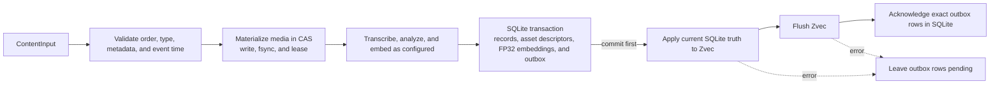
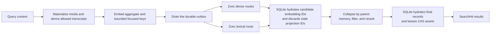

# Architecture

MindBridge is an embedded Python memory runtime. The host application constructs one `Memory`
instance, supplies model backends, and owns transport and process policy. `Memory` owns memory
semantics, capability routing, local durability, retrieval, and resource lifecycle.

This page owns implementation invariants. Use [core concepts](concepts.md) for the user mental
model and [operations](operations.md) for procedures.

## System boundary

| Component | Responsibility |
| --- | --- |
| `Memory` | Validate content, route model work, coordinate writes and retrieval, and expose the public SDK. |
| Model backends | Embed, generate, transcribe/analyze speech, or analyze faces through narrow protocols. |
| `LocalStore` | Store authoritative records, FP32 embeddings, compatibility metadata, identity state, and the index outbox in SQLite. |
| `AssetStore` | Store immutable image, video, and audio bytes by SHA-256 under `assets/`. |
| `ZvecIndex` | Provide disposable dense, lexical, type, and event-time search projections. |
| REST, MCP, and CLI adapters | Decode and encode their transport, then call the same `Memory` operations. |

One physical `data_dir` is one memory domain. Metadata is application data; it is not an account,
authorization, or isolation boundary.

## Write path

Media is copied to the content-addressed store before a model receives it. A failed operation
removes unreferenced temporary media after its leases are released. Identical bytes reuse one CAS
object.

Records, asset descriptors, normalized FP32 embeddings, and outbox rows commit in one SQLite
transaction. SQLite triggers enqueue an upsert or delete for every embedding mutation. Only after
that commit does MindBridge update and flush Zvec, then delete the exact acknowledged outbox rows.
An index failure can therefore fail the current call while leaving the record durable and the
projection work retryable. Startup and later operations drain pending work.

A memory ID is the SHA-256 digest of canonical ordered content, media digests, metadata, event
time, and memory type. Repeating the same add is idempotent. `add_many` uses one model batch and one
SQLite transaction; `add_stream` deliberately calls the ordinary add path once per completed item,
so a later stream failure preserves the committed prefix.

## Retrieval path

Composite records have one aggregate embedding plus de-duplicated text and media embeddings.
Long text contributes bounded overlapping contextual keys. A query uses its complete aggregate
and bounded keys focused on the first text atom and query media. Dense routes and the lexical route
run concurrently, with at most four outer search workers.

Zvec groups dense candidates by parent memory where possible. SQLite then hydrates candidate IDs,
rechecks hard event-time filters, drops stale IDs, and collapses all evidence to authoritative
records. Ranking combines the strongest dense evidence with bounded lexical, temporal, ambiguity,
and optional decay signals. `search_with_trace` exposes these score components without copying
memory content or metadata into the trace.

`ask` uses this same retrieval path, limits the grounded evidence, routes the question and hits
through the generation backend's declared capabilities, and returns only the hits the backend
actually used.

## Storage authority and recovery

| State | Role | Recovery behavior |
| --- | --- | --- |
| `state.sqlite3` | Authoritative records, embeddings, metadata, cached analyses, identity state, and outbox | Required for recovery. Unsupported schemas or incompatible durable model identities fail at open. |
| `assets/` | Authoritative original media bytes | Required for media-bearing records; SQLite alone cannot recreate it. |
| `zvec/` | Derived search collection | May be deleted while stopped; startup rebuilds it from SQLite without re-embedding stored content. |
| `.mindbridge.lock` | Operating-system lock target | Its presence does not indicate a live owner. |

The store records embedding model, space, dimension, transcription space, configured face spaces,
and the index recipe. An unrecognized mismatch fails instead of mixing incompatible state. A known
index-only recipe change rebuilds Zvec from stored vectors; a recognized embedding recipe upgrade
may re-embed records before publishing the new marker.

## Concurrency and lifecycle

Opening `LocalStore` takes a non-blocking operating-system lock for the lifetime of the instance.
A second owner of the same directory fails immediately; different directories can run
concurrently. A `Memory` created before `fork()` is rejected in the child process.

Model calls and independent SQLite write transactions can overlap. SQLite serializes its own
writers with `BEGIN IMMEDIATE`. MindBridge's process-local write lock serializes outbox replay,
destructive operations, final record/asset hydration, and index replacement. Add-time speech
identity indexing is also serialized because its identity changes must roll back with a failed add.

Ordinary Zvec queries may overlap. Collection replacement and close wait for active queries. A
reindex takes a SQLite snapshot, replaces the collection, then replays the outbox so a record
committed during the rebuild is not lost.

`close()` rejects new operations, waits for active operations, releases media leases, and closes
each unique backend and storage resource once. `AsyncMemory` is an `asyncio.to_thread` facade over
this same synchronous core; it does not introduce a worker service or a second consistency model.

## Model and plugin boundary

The implemented extension contracts are `EmbeddingBackend`, `GenerationBackend`,
`TranscriptionBackend`, `SpeechBackend`, and `FaceBackend`. A generation backend may additionally
implement `StreamingGenerationBackend`. Routing uses declared atomic modalities, never provider or
model names. Unsupported visual evidence fails; unsupported audio can fall back to transcript text
only when a configured transcription backend declares the required capability.

Applications can pass backend objects directly or bundle them in `MemoryPlugins` for
`Memory.from_plugins`. `Memory.from_config` validates a closed catalog of bundled providers,
constructs their adapters, and delegates to the same kernel. There is no global plugin registry,
package discovery, or hot swap during a `Memory` lifetime.

Model code is part of the application's trust boundary. In particular, the bundled Jina adapter
executes upstream code with model and code revisions pinned; [configuration](configuration.md)
owns the exact recipe and license constraints.

SQLite, CAS, and Zvec are internal implementation components, not public storage plugins. A model
backend may perform inference but cannot bypass validation, stable identity, durability, or final
SQLite hydration.

## Interface and trust boundaries

The `Memory` SDK exposes the complete set of product operations. REST exposes the `/v1` add, batch
add, search, ask, get, list, and delete subset. MCP exposes six corresponding tools without batch
add. The local CLI can call the SDK operations; `--url` is limited to operations implemented by
REST.

`create_app(memory=...)` and `build_mcp_server(memory)` use a caller-owned instance and do not
close it. They also do not add authentication, authorization, TLS, rate limits, quotas, or audit
policy. See [deployment](deployment.md) for process and network setup.

Python callers may intentionally pass local `Path` values; MindBridge opens only regular files and
avoids following the final symlink where the platform supports it. REST and MCP accept inline
bytes or existing asset IDs, and reject local paths and remote URLs. Provider output is validated
before persistence or return. Every transport omits provider bodies and credentials. REST also
withholds subjects naming storage, index, or internal state; MCP retains SDK subjects and can expose
owner-local paths, so a network host must protect or redact its error envelope.

Backup, restore, index repair, and telemetry procedures are in [operations](operations.md).
