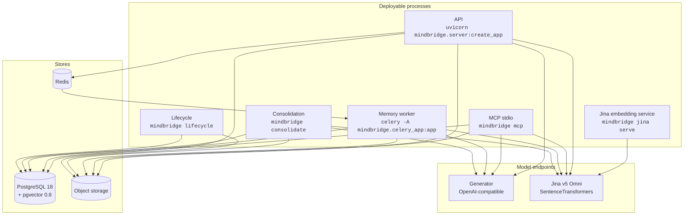
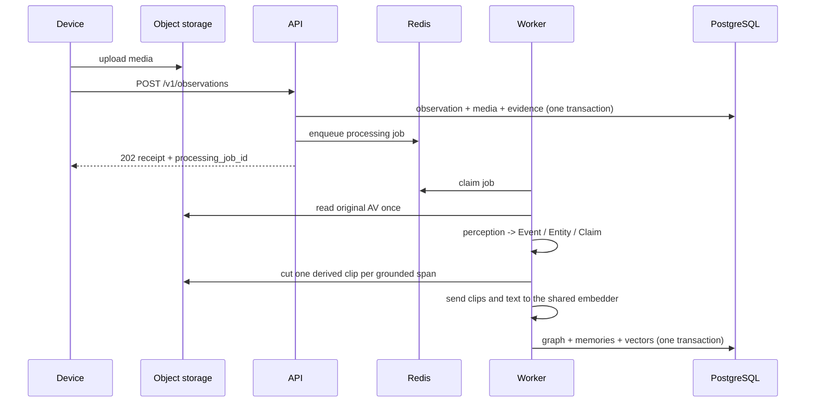
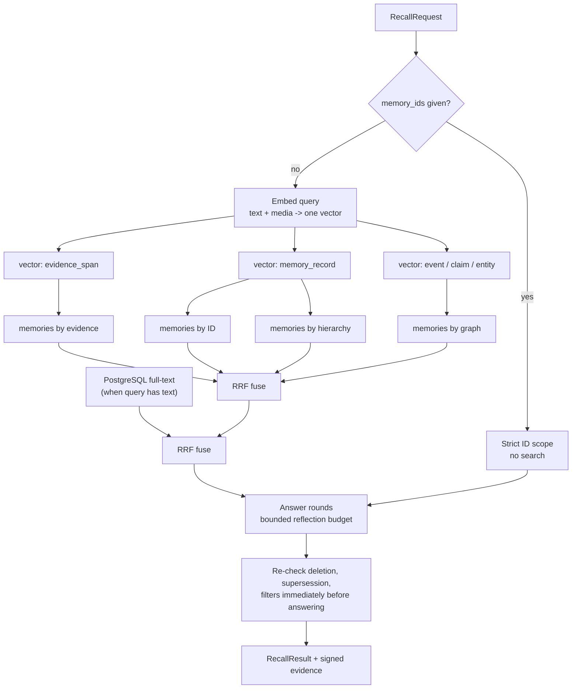

# Architecture

How MindBridge is put together at runtime, and why the boundaries fall where they do. For the
domain vocabulary, read [concepts](concepts.md) first. The full design specification, including
the decision log and the constraints each decision accepts, is
[docs/technical-architecture.md](technical-architecture.md) (Chinese).

## Code layout

MindBridge is a modular monolith with one asynchronous worker. Dependencies point inward, and
the import direction is enforced rather than merely documented.

```text
src/mindbridge/
├── core/            Domain types and invariants. Imports nothing from the layers below.
├── application/     Use cases and ports. The memory kernel lives here.
├── infrastructure/  PostgreSQL, S3, Celery adapters.
├── models/          Generator and embedder plugin adapters.
├── api/             REST, MCP, and auth. Protocol translation only.
├── edge/            On-device capture, identity, outbox, sync.
├── media/           Lazy-loaded AV decoders.
└── benchmarks/      Evaluation harness. A leaf: no product module may import it.
```

Two rules are load-bearing:

**One kernel, three protocol faces.** `application.kernel.MemoryKernel` holds every use case.
REST, MCP, and the Python SDK are translation layers over it, sharing schemas generated from the
same Pydantic contracts. A behaviour cannot be available over one protocol and missing from
another by accident.

**`benchmarks/` is a leaf.** It may call only the public SDK and contracts. This is why
`mindbridge` and `mindbridge-bench` are separate binaries — a single command tree would have to
reference benchmark modules by string to route to them, which is exactly the loophole the AST
guard was tightened to catch.

## Process topology



| Process | Extra | Scaling unit | Holds a model? |
| --- | --- | --- | --- |
| Jina service | `server` + `cloud-models` | One process per GPU | Yes — Jina v5 Omni |
| API | `server` | Stateless; scale horizontally | No |
| MCP stdio | `server` | One per agent session | No |
| Memory worker | `server` | One process per queue | No |
| Consolidation | `server` | One scheduled run per tenant | No |
| Lifecycle | `server` | One scheduled run per tenant | No |
| Edge sync | `edge` | One per device, one-shot | Yes — on-device identity models |

The API and worker load no model. One SentenceTransformers process owns the Jina weights and
serves every modality, keeping the application images small and independently scalable.

## Write path



`observe()` is synchronous only up to durability. It registers the observation, its media, and
its evidence spans in one transaction, enqueues the job, and returns — memory does not exist
yet when that receipt returns. Callers poll `GET /v1/jobs/{job_id}` or follow the SSE stream.

Three properties of the worker stage are worth knowing before you tune it:

- **The original AV is read once.** Perception, clip derivation, and embedding all work from
  that one pass rather than re-fetching.
- **One clip per grounded span.** Each vector covers the event's own slice of the recording, not
  the whole file. Frame rate therefore sets the entire write cost of a video deployment: one cut,
  one encoder call, one stored object per sampled window.
- **Clips are uploaded before the transaction that registers them.** An interrupted attempt can
  leave an object no record references. Clip keys are content-addressed so a retry cannot
  multiply it, and `mindbridge lifecycle --reclaim-orphan-clips` deletes what is already there.

### Idempotency

Every write accepts an `idempotency_key`, and derives one from the content when it is omitted.
An identical resend answers `duplicate` with the original record rather than storing a second
copy. A *different* body under a key already in use fails with `idempotency_conflict` rather
than silently overwriting.

## Read path



Reciprocal rank fusion is applied twice — once across the four structure-derived rankings, once
against the lexical ranking — with a rank constant of 60. Fusion combines *ranks*, never raw
scores, because a cosine similarity and a `ts_rank` are not on a comparable scale and averaging
them produces a number that means nothing.

Two details that matter operationally:

- **Filters apply before ranking, not after.** A time or person filter narrows the candidate
  set rather than trimming an already-ranked list, so a filtered query does not silently return
  fewer results than its limit because the filter ate the top of the ranking.
- **Visibility is re-checked immediately before answering.** A memory deleted or superseded
  during a long reflection round does not reach the answer.

`occurred_after` is inclusive and `occurred_before` is **exclusive**. The asymmetry is
deliberate — it makes adjacent windows tile without overlap — but it does surprise people.

### Recall modes

| Mode | Behaviour |
| --- | --- |
| `answer` | Reasons over retrieved memories and fills `answer`. The default. |
| `search` | Ranks and returns memories; `answer` stays null. |
| `enumerate` | Scans the complete structured-filter scope for count and timeline questions, verifies candidates against original media in bounded generator batches, and returns every occurrence chronologically. |

`enumerate` fails with `enumeration_limit_exceeded` above 1,000 candidates rather than silently
truncating. A count that quietly drops its tail is worse than no count.

## Connection budget

One recall peaks near ten PostgreSQL connections: a lexical search runs concurrently with three
vector searches, then four memory searches, and a reflection round runs several such waves at
once. `MINDBRIDGE_DATABASE_MAX_POOL_SIZE` defaults to 32 for that reason — a value near ten
would let a single recall occupy the entire pool. The pool still opens one connection eagerly,
so a higher ceiling costs nothing until load asks for it. Keep it under the server's own
`max_connections`.

## Storage

PostgreSQL is the only primary store. Schema changes go through numbered SQL in `migrations/`,
applied in order.

**Row-level security is forced, not advisory.** Migration `0005` creates the non-login
`mindbridge_runtime` role and enables forced RLS on every table carrying a `tenant_id`; each
store transaction sets one tenant locally. Granting the API login `SUPERUSER` or `BYPASSRLS`
disables tenant isolation completely, so don't.

One index decision is worth recording because it looks like a regression: migration `0018` drops
the HNSW vector index. Under RLS the planner always has a tenant predicate available — RLS
injects `tenant_id`, and `embeddings_space_search_idx` leads with it — so it reached one tenant's
vectors directly and never read the HNSW index at all. Measured on 200,000 vectors across 40
tenants through the real `mindbridge_runtime` role: 0 scans, 1,196 MB occupied, while the btree
served all 25 scans from 1,648 kB. It was not free either — maintaining the graph on insert cost
18.8×.

This is a consequence of the multi-tenant shape, not a claim that approximate search is useless.
Exact scan cost grows linearly with **one tenant's** vector count — roughly 5 ms at 1,000 rows
and 51 ms at 11,000 — so a deployment that ever concentrates millions of vectors in a single
tenant should add the index back. The migration file carries the exact `CREATE INDEX` to use and
the `hnsw.iterative_scan` setting that must stay alongside it.

Object storage holds original media and derived clips under
`s3://<bucket>/tenants/<tenant_id>/<key>`. MindBridge owns no region setting; Boto3's own chain
resolves region and credentials exactly as it does for every other tool on the host.

## Model boundary

Models are frozen. Learning happens in the memory layer — feedback, consolidation, strength —
never in weights. Three slots, selected by plugin name:

| Slot | Default | Loaded by |
| --- | --- | --- |
| Generator | `openai` | API, MCP, worker, consolidation |
| Embedder | `openai` wire adapter to the Jina SentenceTransformers service | API, MCP, worker, consolidation |
| Media embedder override | inherits Embedder | Worker only |

Plugins resolve through `importlib.metadata` entry points (`mindbridge.generators`,
`mindbridge.embedders`), so a third-party adapter is installable without a fork. The author
contract is in [plugin-architecture.md](plugin-architecture.md).

The worker's text slot deliberately reuses `MINDBRIDGE_EMBEDDER_*` rather than owning a parallel
variable family. It has to land in the space the API queries; a second name is a second thing
that can silently disagree. A worker that genuinely needs a different endpoint sets a different
value for the same name, since each process has its own environment.

## Edge boundary

The edge is platform-neutral — Jetson, RDK, RK, OpenVINO x86, generic ARM, or a workstation
where the "edge" is a 4090. Only the capture backend and inference runtime change; the
observation timeline, identity gates, and forget semantics are identical everywhere.

What crosses the boundary is deliberately narrow. The device sends anonymous identity IDs, time
ranges, optional transcripts, identity scope, and normalized face boxes. **Raw face and voice
embeddings and the device encryption key never leave it** — they are AES-256-GCM encrypted in a
local SQLite store keyed from the device TPM or secret manager.

Deletion reconciles in the other direction: an offline device pages `GET /v1/deletions` from its
last cursor on reconnect, and removes matching cache rows and identity samples before advancing
it.

See [edge deployment](edge.md).

## Failure behaviour

| Failure | What happens |
| --- | --- |
| Embedding space mismatch at startup | API refuses to serve, naming each stranded object type. Not a silent empty recall. |
| Broker unreachable | `observe()` returns `task_broker_unavailable` (503). Nothing is half-written. |
| Worker job fails | Job records `failed` with an `error_code`. The stale-job sweep can retry it, so `failed` settles the *attempt*, not the job. |
| Model returns unusable output | `model_output_invalid` (502), distinct from `model_request_failed` and `model_unavailable`. |
| Stored state inconsistent | `memory_integrity_failed` (500) rather than a bare unhandled 500. |
| Media proxy encode fails | Degrades to the pre-proxy behaviour rather than failing the observation. |

Every code in that table is in one table in `api/errors.py`, from which both the raise sites and
the OpenAPI document are generated. A code cannot reach a caller without also reaching the
published contract. The full list is in [the REST reference](api/rest.md#error-codes).

## Observability

OpenTelemetry activates only when a standard OTLP endpoint is configured; without one it is a
no-op. The official FastAPI, HTTPX, psycopg, Celery, and Botocore instrumentations propagate W3C
context across REST, model calls, PostgreSQL, S3, and queued jobs.

MindBridge captures no authorization headers, request bodies, prompts, memory text, or media in
telemetry. Response `trace_id` values take the form `trace_<32-hex W3C trace ID>`, so the suffix
maps directly onto the configured backend.

See [operations](operations.md#telemetry).
