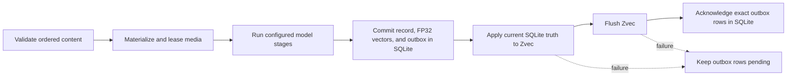

# Architecture

MindBridge is an embedded Python runtime. The host application constructs one `Memory`, supplies
model backends, and owns process and transport policy. `Memory` owns validation, durable state,
retrieval, and resource lifecycle.

This page defines implementation invariants. See [core concepts](concepts.md) for the user model,
[deployment](deployment.md) for topology choices, and [operations](operations.md) for procedures.

## System boundary

| Component | Responsibility |
| --- | --- |
| `Memory` | Coordinate public operations, model capabilities, storage, retrieval, and lifecycle. |
| Model backends | Embed, generate, transcribe or analyze speech, analyze faces, describe images, or propose typed formations. |
| `LocalStore` | Persist authoritative records, FP32 embeddings, analysis and identity state, compatibility metadata, and the index outbox in SQLite. |
| `AssetStore` | Persist immutable image, video, and audio bytes by SHA-256. |
| `ZvecIndex` | Maintain rebuildable dense, lexical, type, and event-time search projections. |
| REST, MCP, and CLI adapters | Translate their protocol and call the same `Memory` kernel. |

One physical `data_dir` is one memory domain and may have one live owner. Metadata is application
data, not an account, authorization, request, or isolation boundary.

## Durable state

| Path | Authority | Recovery role |
| --- | --- | --- |
| `state.sqlite3` | Authoritative | Records, FP32 embeddings, model and index compatibility markers, cached analyses, identities, typed semantics, and pending index operations. |
| `assets/` | Authoritative | Original media bytes. SQLite cannot recreate a missing asset. |
| `zvec/` | Derived | Disposable search projection rebuilt from SQLite without re-embedding stored content. |
| `.mindbridge.lock` | Coordination only | Operating-system lock target; the file normally remains after shutdown. |
| `.asset-staging/` | Transient | In-progress content-addressed writes, cleaned when the store opens. |

SQLite uses WAL, foreign keys, `synchronous=FULL`, and `BEGIN IMMEDIATE` for writes. The asset store
writes and fsyncs a temporary object before publishing it under its digest. A backup needs SQLite
and `assets/`; see the [backup runbook](operations.md#backup).

## Write consistency

SQLite triggers enqueue an upsert or delete for each embedding mutation. MindBridge commits that
transaction before changing Zvec, flushes Zvec before acknowledging work, and acknowledges the
exact rows it applied. Startup, add, delete, search, `reindex()`, and `optimize()` drain pending
work.

The ordering determines failure behavior:

- Validation or model failure before the SQLite transaction creates no record; unreferenced media
  is cleaned after its operation lease is released.
- A SQLite failure rolls back the record, embeddings, and outbox together.
- A Zvec mutation or flush failure can fail the public call after SQLite committed. The record is
  still durable and the unacknowledged projection work is retryable.
- Stale IDs left in Zvec cannot resurrect deleted data because final hydration uses SQLite.

A memory ID is the SHA-256 digest of canonical ordered content, media digests, metadata, event
time, memory type, and optional observation context. Repeating the same add is idempotent.
`add_many()` uses one model batch and one SQLite transaction. `add_stream()` commits each completed
item through the ordinary add path, so a later source failure preserves the committed prefix.

Formation follows the same authority rule. A `FormationBackend` proposes typed state after the
source observation commits; the kernel validates source binding, modality, identity, validity, and
conflicts. Derived records, evidence, versions, embeddings, the per-source recipe marker, and
outbox work commit together. A failed formation leaves the source durable and retryable.

## Retrieval consistency

```mermaid
flowchart LR
    query["Validate and prepare query"] --> embed["Embed aggregate and focused keys"]
    embed --> sync["Drain durable outbox"]
    sync --> routes["Run dense and lexical Zvec routes"]
    routes --> hydrate["Hydrate candidate IDs from SQLite"]
    hydrate --> filter["Discard stale IDs and apply authoritative filters"]
    filter --> rank["Collapse, rank, and hydrate final records"]
    rank --> hits["Return SearchHit values"]
```

Zvec proposes candidates; SQLite decides whether they exist and whether hard event-time,
bitemporal, symbolic-place, metric-spatial, and memory-type filters pass. Composite records use an
aggregate embedding plus bounded, de-duplicated text and media keys. Dense routes and the lexical
route may run concurrently, with at most four outer search workers.

`search_with_trace()` exposes bounded ranking signals and terminal rejection reasons without
copying memory content or metadata into the trace. `ask()` uses the same retrieval path, applies
the evidence budget, and returns only evidence the generation backend actually used.

## Ownership and concurrency

Opening the store takes a non-blocking operating-system lock for the lifetime of its `Memory`.
Another owner of the same directory fails immediately with `reason="data_dir_in_use"`; different
directories can run concurrently. The presence of `.mindbridge.lock` alone says nothing about a
live owner. A `Memory` created before `fork()` is rejected in the child.

Model calls and separate SQLite transactions may overlap. SQLite serializes writers. A
process-local write lock protects outbox application, deletion, index replacement, final asset
hydration, and add-time speaker identity updates. Ordinary Zvec queries may overlap; replacement
and close wait for active queries.

`reindex()` reads authoritative SQLite pages, replaces the Zvec collection, then replays the
outbox so writes committed during the scan are retained. `close()` rejects new work, waits for
active operations, releases asset leases, and closes each unique backend and storage resource
once. `AsyncMemory` delegates to this same synchronous core with `asyncio.to_thread`; it does not
create a service or a second consistency model.

## Model boundary

The extension contracts are `EmbeddingBackend`, `GenerationBackend`, `TranscriptionBackend`,
`SpeechBackend`, `VisionDescriptionBackend`, `FaceBackend`, and `FormationBackend`;
`StreamingGenerationBackend` adds streamed generation. Routing follows declared modalities, not
provider names. Provider output is validated before persistence or return.

Applications may inject backend objects directly or use `MemoryPlugins` and `Memory.from_plugins()`.
`Memory.from_config()` validates the bundled provider catalog and delegates to the same kernel.
There is no global plugin registry, package discovery, or live backend swap. SQLite, the asset
store, and Zvec are internal components rather than public storage plugins.

Model code is part of the application's trust boundary. The bundled Jina adapter, for example,
executes pinned upstream model code; [configuration](configuration.md) owns its exact recipe and
license constraints. No backend can bypass validation, stable identity, durability, or final
SQLite hydration.

Typed lineage and evidence are a SQLite projection, not a graph database or traversal service. A
future entity/relation search projection must remain derived and rebuildable and pass the evidence
gate in the [benchmark protocol](benchmarking.md#mandatory-controls).

## Public and trust boundaries

Supported SDK values are imported from `mindbridge`. The `Memory` SDK exposes 19 product
operations. REST exposes eight `/v1` routes: add, batch add, list, search, reinforce, get, delete,
and answer. MCP exposes fourteen tools: the seven corresponding non-batch operations plus speech,
face, and identity operations. The local CLI exposes the 19 operations plus `doctor`; `--url` is
limited to operations implemented by REST.

`create_app(memory=...)` and `build_mcp_server(memory)` use a caller-owned instance and do not
close it. They also do not add authentication, authorization, TLS, rate limits, quotas, or audit
policy. See [deployment](deployment.md) for process and network setup.

Python callers may intentionally pass local `Path` values; MindBridge opens only regular files and
avoids following the final symlink where the platform supports it. REST and MCP accept inline
bytes or existing asset IDs, and reject local paths and remote URLs. Provider output is validated
before persistence or return. Every transport omits provider bodies and credentials. REST also
withholds subjects naming storage, index, or internal state; MCP retains SDK subjects and can expose
owner-local paths, so a network host must protect or redact its error envelope.

Backup, restore, index repair, and telemetry procedures are in [operations](operations.md).
