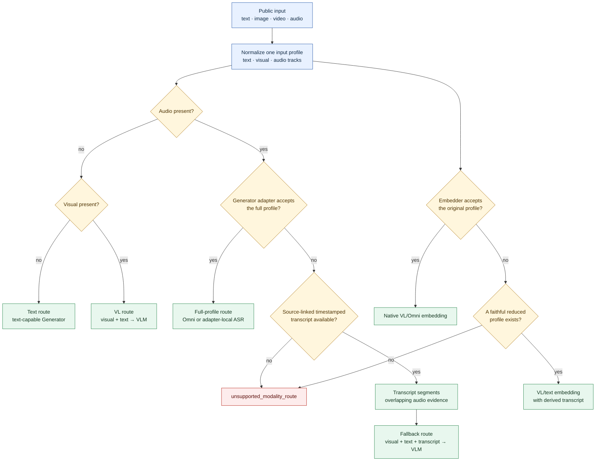
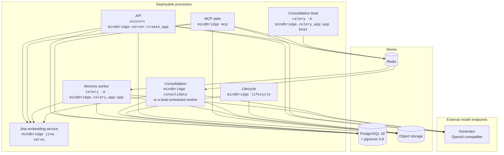
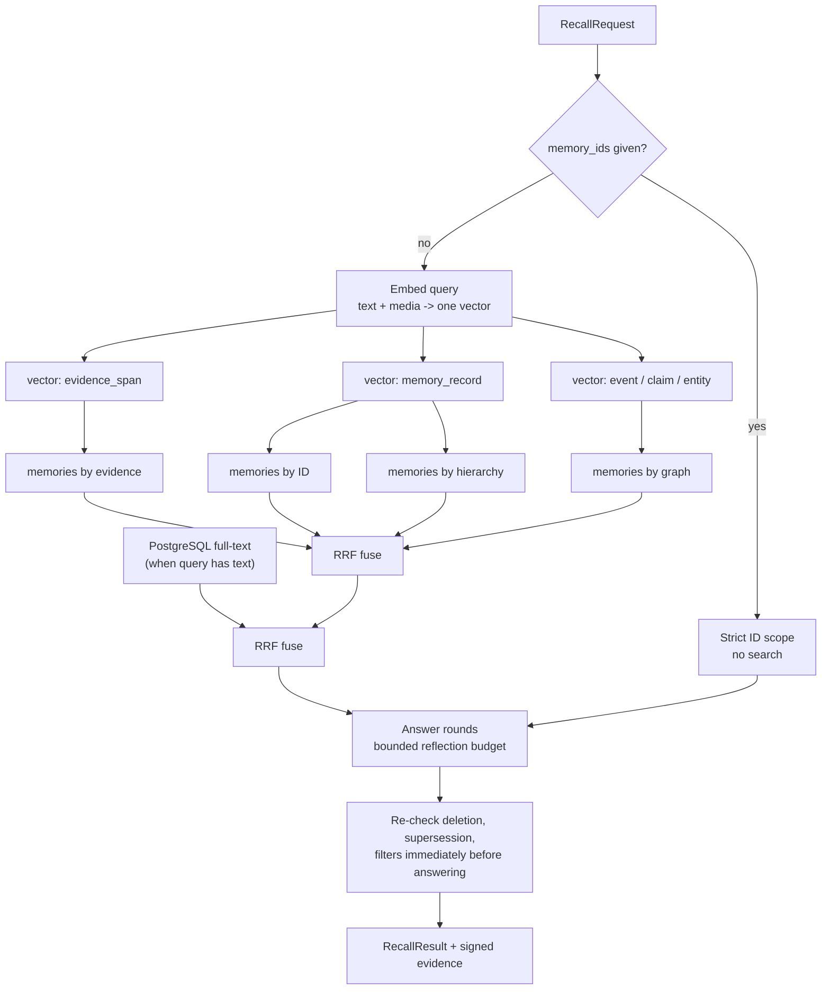

# Architecture

How MindBridge is put together at runtime, and why the boundaries fall where they do. For the
domain vocabulary, read [concepts](concepts.md) first. The full design specification, including
the decision log and the constraints each decision accepts, is
[docs/technical-architecture.md](technical-architecture.md) (Chinese).

## Code layout

MindBridge is a modular monolith with separate asynchronous worker roles. Dependencies point
inward, and the import direction is enforced rather than merely documented.

```text
src/mindbridge/
├── core/            Domain types and invariants. Imports nothing from the layers below.
├── application/     Use cases and ports. The memory kernel lives here.
├── infrastructure/  PostgreSQL, S3, Celery adapters.
├── models/          Generator and embedder plugin adapters.
├── api/             REST, MCP, and auth. Protocol translation only.
├── edge/            On-device capture, identity, outbox, sync.
├── media/           Lazy-loaded AV decoders.
└── benchmarks/      Evaluation harness. A leaf: no product module may import it.
```

Two rules are load-bearing:

**One kernel, two protocol adapters.** `application.kernel.MemoryKernel` holds the public use
cases. REST and MCP translate the same Pydantic contracts into it; the Python SDK calls REST.
REST-only transport features such as SSE job progress remain explicit instead of being simulated
over MCP.

**`benchmarks/` is a leaf.** It may call only the public SDK and contracts. This is why
`mindbridge` and `mindbridge-bench` are separate binaries — a single command tree would have to
reference benchmark modules by string to route to them, which is exactly the loophole the AST
guard was tightened to catch.

## Multimodal routing and portability

MindBridge is one public memory system for text, image, video, audio, and mixed input, with model
and hardware choices made at deployment boundaries rather than exposed as provider-specific
product APIs. **The software routing target is substantially, but not universally, implemented as
of 2026-08-27.** Text-only writes, mixed observation text, declared model capabilities, native
VL/Omni requests, source-linked ASR-to-VLM perception, bundled Worker-side FunASR composition for
a VLM Generator, and ASR-text evidence embedding from source-linked observation transcripts are
executable. A provider-neutral Transcriber whose output can be reused by both generation and a
VL-only Embedder, per-request model selection, and several claimed hardware adapters remain outside
the current implementation.

### Current implementation

| Requirement | Status | What the current runtime actually does |
| --- | --- | --- |
| Recall with text, image, video, audio, or a mixture | Shipped, capability-gated | `RecallQuery` accepts text, up to eight stored media IDs, or both. The recall path signs those objects, creates one ordered `ModelInput`, and sends it to one Embedder. Text also enables PostgreSQL full-text search. Answering sends query media and recalled evidence to the configured Generator. Bundled adapters reject undeclared media before their provider call. Recall has no on-demand ASR fallback, and query media must already belong to the tenant. |
| Write image, video, audio, or mixed media | Shipped | `ObserveRequest` accepts one to eight media objects, and perception routes every resolved object according to Generator capabilities. Supported derived clips go to the media Embedder. If that Embedder is VL-only, source-linked audio transcript windows use its text route instead. Graph and memory text use the text Embedder, and both embedders must declare the same search space. |
| Write text alone, or text plus media | Shipped across the public write surface | `remember()` is the text-only path. `ObserveRequest.text` persists caller text beside one to eight evidence objects and perception receives it in `observation_context`. An Observation intentionally remains evidence-bearing and therefore still requires media; MindBridge does not manufacture evidence for text-only memories. |
| Select a text, VL, or Omni path from input and model capabilities | Shipped for observation writes and capability-gated elsewhere | Every loaded Generator and Embedder adapter declares `supported_media_kinds`. The bundled adapters validate every `ModelInput` before inference. The OpenAI Embedder uses its text call for text-only input and its multimodal wire shape otherwise. Perception selects native VL, native Omni, or ASR-to-VLM; observation processing independently selects native media embedding or same-space transcript embedding. Recall validates unsupported raw query media rather than manufacturing a transcript. |
| Use native Omni when the configured Generator accepts AV | Shipped | With `supported_media_kinds = ["image", "video", "audio"]`, perception preserves the original ordered parts and the bundled Generator serializes them for its OpenAI-compatible endpoint. Capability comes from configuration, never a model-name guess. |
| Fall back from a VLM-only Generator to ASR + VL/text embedding + VLM | Shipped, with an embedding caveat | With `audio_mode = "transcribe"` and endpoint `supported_media_kinds = ["image", "video"]`, the bundled Generator lazily runs local FunASR + CAM++, removes raw audio, keeps video, and sends diarized transcript text to the VLM. Independently, generic perception can use source-linked timestamped transcripts already attached to the Observation. An Omni media Embedder can embed the original audio; a VL-only media Embedder still requires those attached transcripts because the bundled Generator's request-local transcript is not persisted or shared with embedding. Missing, ambiguous, or non-overlapping transcript ownership fails as `unsupported_modality_route`. Original evidence remains authoritative. |
| Let operators replace models without forking product pipelines | Shipped with limits | Python entry points select Generator and Embedder adapters, and each process can point at a different endpoint. The bundled set is one OpenAI-compatible Generator plus OpenAI-wire and local Jina Embedders. Model selection is per deployment process, not per request, and a third-party adapter still has to implement the current wire-neutral protocol. |
| Run cloud-only or cloud-edge | Shipped, with route-dependent ASR | API, Worker, stores, and model endpoints can all run in the cloud; edge capture is optional. The edge package supplies FunASR transcripts, capture handoff, encrypted identity state, an offline outbox, sync, and deletion reconciliation. A cloud-only VLM deployment can run FunASR in the Worker through `audio_mode = "transcribe"`. If its media Embedder is VL-only, raw audio still needs a source-linked transcript for embedding; selecting an Omni media Embedder avoids that reduction. Cloud-only still needs PostgreSQL, Redis, and S3-compatible storage. |
| Run unchanged on Jetson, RDK, RK, OpenVINO, generic ARM, or dGPU | Architecture boundary only for several targets | The common edge contracts are vendor-neutral. Bundled local Jina selects Torch CPU/CUDA, and portable identity code selects available ONNX Runtime CPU/CUDA/TensorRT providers. Ready-to-run and measured RDK BPU, RKNN, OpenVINO, and complete Jetson capture/runtime adapters remain validation work, as recorded in the [technical architecture roadmap](technical-architecture.md#16-实施路线图). |

The important distinction is **multimodal representation versus multimodal routing**.
`ModelInput` solves representation. It deliberately has no `OmniInput` subtype: Omni is one way
to execute a combination of parts, not another kind of user data. Capability declarations now
prove whether a configured adapter accepts those parts. Perception owns generation fallback and
observation processing owns evidence-embedding fallback; both use the same source-linked
timestamped transcript index. No general planner claims a fallback for data it cannot derive.

### Routing contract and remaining target

MindBridge forms a profile from the explicit input parts: text, image, video, and audio. The generic
planner does not inspect media manifests, so a video's audio track is not a separate input part.
The bundled `audio_mode = "transcribe"` Generator can still extract that track for request-local
generation; publishing it as reusable, source-linked transcript evidence remains open. No route
may silently discard a declared part to fit a model.

| Input profile | Preferred generation path | Embedding path | Valid fallback |
| --- | --- | --- | --- |
| Text | Text-capable Generator | Text Embedder | None needed; a VLM or Omni model may satisfy the text capability. |
| Text + image or silent video | VLM | VL or Omni Embedder over the supplied parts | A text-only model is not a faithful fallback. Fail if no visual-capable Generator is configured. |
| Audio, with optional text | Audio-capable Omni Generator | Native audio embedding | Use `audio_mode = "transcribe"` for the bundled VLM adapter, or a source-linked timestamped transcript with a text-capable Generator. A VL-only Embedder needs the source-linked transcript on its text route. Preserve original audio as evidence. |
| Visual + audio, with optional text | Omni Generator over the original AV and text | Native embeddings for accepted media clips | Use `audio_mode = "transcribe"`, or send visual parts, caller text, and a source-linked transcript to a VLM. Keep native VL embeddings for visual clips; a VL-only Embedder needs matching audio transcript windows on its text route. |



Generation and embedding are planned independently because a deployment may have a VLM
Generator and an Omni Embedder, or the reverse. The planner chooses the path before any provider
call; a provider error is not capability discovery and must not trigger an unrecorded switch of
model or evidence.

The capability contract is:

- A Generator adapter declares its accepted media parts in `supported_media_kinds`; text support
  is part of the base capability. The adapter remains responsible for provider-specific blocks.
- An Embedder declares the same media set in addition to its `space_reference`. Every document and
  query vector that can meet must still land in one declared space.
- A provider-neutral Transcriber capability is not yet exposed. The bundled OpenAI Generator can
  compose FunASR internally when `audio_mode = "transcribe"`, but that request-local transcript is
  neither persisted nor reused by evidence embedding. A shared capability must return timestamped
  text with model provenance and source spans.
- Perception composes the declared Generator capability with those transcripts. Provider names do
  not create duplicate Perception, Recall, or Answer pipelines.
- `IdentityObservationInput.transcript_media_object_id` binds ASR output to the audio or video
  object that produced it. A missing link is inferred only when the observation has exactly one
  explicit audio object; multiple audio sources require explicit links. Generation events and
  evidence-embedding clips must overlap the linked transcript time range. A clip window with no
  speech keeps its evidence clip but gets no fabricated text vector.
- An unsupported combination fails with `unsupported_modality_route` before the incompatible
  adapter call. Derived transcripts are representations of original audio, never replacement
  evidence.

### Model, provider, and hardware freedom

The public contracts must depend on semantic parts and evidence references, not on CUDA tensors,
provider SDK objects, or vendor model names. Deployment configuration selects adapters and model
IDs. Python entry points remain the extension mechanism; OpenAI-compatible APIs are one adapter
family rather than the definition of compatibility.

Prefer existing open interfaces at each boundary:

| Boundary | Preferred contract | Portability consequence |
| --- | --- | --- |
| Agent and application clients | REST + OpenAPI, Python SDK, MCP | Clients do not change with the model provider or hardware placement. |
| Model plugins | Python entry points and MindBridge capability types | Local runtimes and official provider SDKs can coexist without provider branches in application code. |
| Served generation and embedding | OpenAI-compatible APIs where the endpoint truly supports the required content blocks | Common text calls are reusable; audio/video extensions must stay explicit because their request shapes are not universal standards. |
| Media | Addressable image/audio/video objects, S3-compatible storage, FFmpeg/PyAV decoding | Cloud and edge processes exchange durable media references rather than device memory. |
| Persistence and messaging | PostgreSQL + pgvector, Redis + Celery | The memory kernel is independent of a GPU vendor and model-serving topology. |
| Telemetry | OpenTelemetry and W3C trace context | Local and hosted components share one trace without a proprietary observer. |
| Edge inference | Platform-native runtimes behind the same normalized output contracts | TensorRT/DeepStream, ONNX Runtime, OpenVINO, RKNN, and BPU adapters may differ internally; evidence spans, identities, outbox records, and deletion semantics may not. |

Three deployment shapes must remain valid:

1. **Cloud-only:** clients place media in object storage and call the public API; API, workers,
   databases, and model endpoints run in cloud infrastructure. Edge identity is absent unless the
   client supplies equivalent anonymous metadata.
2. **Cloud-edge:** the device captures media, optionally performs ASR/identity/event gating, and
   syncs through the durable outbox; cloud workers perform global perception, retrieval, and
   consolidation.
3. **Locally served models:** a cloud or edge host runs selected Generator/Embedder adapters near
   its accelerator while the same application contracts remain intact. This is an extension seam,
   not yet a turnkey fully offline MindBridge deployment.

Model freedom currently means **operator-selected models per process**. Per-request or per-tenant
model selection is not part of this target: it would change reproducibility, capacity isolation,
and embedding-space migration semantics, and should be added only for a concrete product need.

### Completion gates

The remaining completion gates are explicit so shipped routing is not confused with universal
routing:

1. **Shipped:** the public write surface accepts text-only, media-only, and mixed input while
   preserving provenance and idempotency.
2. **Shipped:** contract and processing tests cover native Omni, source-linked ASR-to-VLM,
   VL/text reduced evidence embedding, multi-audio ambiguity rejection, and rejection without ASR.
3. **Partial:** a VLM-only edge deployment processes AV through timestamped ASR without dropping
   original audio. A VLM-only cloud deployment can derive a request-local transcript for bundled
   Generator calls, but a VL-only Embedder cannot yet reuse that result as evidence input.
4. **Shipped:** unsupported combinations fail before the incompatible provider call and name the
   missing capability.
5. **Open:** cloud-only and cloud-edge integration tests must cover every claimed route; each
   claimed hardware family also needs a
   real-device report for capture, runtime, memory, throughput, power, disconnect recovery, and
   deletion propagation. A portable interface alone is not hardware support.

## Process topology



| Process | Extra | Scaling unit | Holds a model? |
| --- | --- | --- | --- |
| Jina service | `server` + `cloud-models` | One process per GPU | Yes — Jina v5 Omni |
| API | `server` | Stateless; scale horizontally | No |
| MCP stdio | `server` | One per agent session | No |
| Memory worker | `server` + `media` | One process per queue | Only with local Jina or Generator `audio_mode = "transcribe"`. |
| Consolidation beat | `server` | One per deployment | No |
| Consolidation | `server` | One scheduled run per tenant | No |
| Lifecycle | `server` | One scheduled run per tenant | No |
| Edge sync/identity | `edge` | One per device | Yes — on-device identity models |

In the recommended served path with native Generator audio, the API and workers load no model: one
SentenceTransformers process owns the Jina weights and serves every modality. Selecting local Jina
or Generator `audio_mode = "transcribe"` loads a model in each Worker process that uses it.

## Write path

```mermaid
sequenceDiagram
  participant D as Device
  participant S as Object storage
  participant A as API
  participant Q as Redis
  participant W as Worker
  participant P as PostgreSQL

  D->>S: upload media
  D->>A: POST /v1/observations
  A->>P: observation + media + evidence (one transaction)
  A->>Q: enqueue processing job
  A-->>D: 202 receipt + processing_job_id
  W->>Q: claim job
  W->>S: build generation proxy (when enabled)
  W->>W: perception -> Event / Entity / Claim
  W->>S: reread source; cut span-sized derived clips
  W->>W: embed native clips or matching ASR windows in one vector space
  W->>P: graph + memories + vectors (one transaction)
```

`observe()` is synchronous only up to durability. It registers the observation, its media, and
its evidence spans in one transaction, enqueues the job, and returns — memory does not exist
yet when that receipt returns. Callers poll `GET /v1/jobs/{job_id}` or follow the SSE stream.

Three properties of the worker stage are worth knowing before you tune it:

- **Source reads are explicit.** With the generation proxy enabled, the worker reads a video once
  to build the model-sized proxy and again after perception to derive evidence clips. With it
  disabled or skipped, the model reads the signed source and the worker reads it once for clip
  derivation.
- **Clips follow grounded spans.** Image and video spans produce one derived clip; audio longer
  than the encoder's 30-second window is split so its tail is not lost. Each vector therefore
  covers a span-sized window instead of the whole source. With a VL-only media Embedder, audio
  windows use only overlapping source-linked transcript segments; silent windows are stored as
  evidence but are not assigned made-up text vectors.
- **Clips are uploaded before the transaction that registers them.** An interrupted attempt can
  leave an object no record references. Clip keys are content-addressed so a retry cannot
  multiply it, and `mindbridge lifecycle --reclaim-orphan-clips` deletes what is already there.

### Idempotency

Every write accepts an `idempotency_key`, and derives one from the content when it is omitted.
An identical resend answers `duplicate` with the original record rather than storing a second
copy. A *different* body under a key already in use fails with `idempotency_conflict` rather
than silently overwriting.

## Read path



Reciprocal rank fusion is applied twice — once across the four structure-derived rankings, once
against the lexical ranking — with a rank constant of 60. Fusion combines *ranks*, never raw
scores, because a cosine similarity and a `ts_rank` are not on a comparable scale and averaging
them produces a number that means nothing.

Three details that matter operationally:

- **Filters apply before ranking, not after.** A time or person filter narrows the candidate
  set rather than trimming an already-ranked list, so a filtered query does not silently return
  fewer results than its limit because the filter ate the top of the ranking.
- **Visibility is re-checked immediately before answering.** A memory deleted or superseded
  during a long reflection round does not reach the answer.
- **The hierarchy ranking is empty until consolidation runs.** `memories by hierarchy` walks
  `contains` edges, which only the Summary sweep writes, so a deployment that never consolidates
  fuses three rankings rather than four and can answer only from individual moments. See
  [operations](operations.md#built-in-consolidation-schedule).

`occurred_after` is inclusive and `occurred_before` is **exclusive**. The asymmetry is
deliberate — it makes adjacent windows tile without overlap — but it does surprise people.

### Recall modes

| Mode | Behaviour |
| --- | --- |
| `answer` | Reasons over retrieved memories and fills `answer`. The default. |
| `search` | Ranks and returns memories; `answer` stays null. |
| `enumerate` | Scans the complete structured-filter scope for count and timeline questions, verifies candidates against original media in bounded generator batches, and returns every occurrence chronologically. |

`enumerate` fails with `enumeration_limit_exceeded` above 1,000 candidates rather than silently
truncating. A count that quietly drops its tail is worse than no count.

## Connection budget

One recall peaks near ten PostgreSQL connections: a lexical search runs concurrently with three
vector searches, then four memory searches, and a reflection round runs several such waves at
once. `MINDBRIDGE_DATABASE_MAX_POOL_SIZE` defaults to 32 for that reason — a value near ten
would let a single recall occupy the entire pool. The pool still opens one connection eagerly,
so a higher ceiling costs nothing until load asks for it. Keep it under the server's own
`max_connections`.

## Storage

PostgreSQL is the only primary store. Schema changes go through numbered SQL in `migrations/`,
applied in order.

**Row-level security is forced, not advisory.** Migration `0005` creates the non-login
`mindbridge_runtime` role and enables forced RLS on every table carrying a `tenant_id`; each
store transaction sets one tenant locally. Granting the API login `SUPERUSER` or `BYPASSRLS`
disables tenant isolation completely, so don't.

One index decision is worth recording because it looks like a regression: migration `0018` drops
the HNSW vector index. Under RLS the planner always has a tenant predicate available — RLS
injects `tenant_id`, and `embeddings_space_search_idx` leads with it — so it reached one tenant's
vectors directly and never read the HNSW index at all. Measured on 200,000 vectors across 40
tenants through the real `mindbridge_runtime` role: 0 scans, 1,196 MB occupied, while the btree
served all 25 scans from 1,648 kB. It was not free either — maintaining the graph on insert cost
18.8×.

This is a consequence of the multi-tenant shape, not a claim that approximate search is useless.
Exact scan cost grows linearly with **one tenant's** vector count — roughly 5 ms at 1,000 rows
and 51 ms at 11,000 — so a deployment that ever concentrates millions of vectors in a single
tenant should add the index back. The migration file carries the exact `CREATE INDEX` to use and
the `hnsw.iterative_scan` setting that must stay alongside it.

Object storage holds original media and derived clips under
`s3://<bucket>/tenants/<tenant_id>/<key>`. MindBridge owns no region setting; Boto3's own chain
resolves region and credentials exactly as it does for every other tool on the host.

## Model boundary

Models are frozen. Learning happens in the memory layer — feedback, consolidation, strength —
never in weights. Three slots are currently shipped, selected by plugin name:

| Slot | Default | Loaded by |
| --- | --- | --- |
| Generator | `openai` | API, MCP, worker, consolidation |
| Embedder | `openai` wire adapter to the Jina SentenceTransformers service | API, MCP, worker, consolidation |
| Media embedder override | inherits Embedder | Worker only |

Plugins resolve through `importlib.metadata` entry points (`mindbridge.generators`,
`mindbridge.embedders`), so a third-party adapter is installable without a fork. The author
contract is in [plugin-architecture.md](plugin-architecture.md).

Each loaded adapter declares `supported_media_kinds`, and the bundled adapters validate it before
provider calls. The optional Transcriber composition and remaining routing limits are specified in
[multimodal routing and portability](#multimodal-routing-and-portability). Capabilities must not be
inferred from a model name.

The worker's text slot deliberately reuses `MINDBRIDGE_EMBEDDER_*` rather than owning a parallel
variable family. It has to land in the space the API queries; a second name is a second thing
that can silently disagree. A worker that genuinely needs a different endpoint sets a different
value for the same name, since each process has its own environment.

## Edge boundary

The edge **code boundary** is platform-neutral — Jetson, RDK, RK, OpenVINO x86, generic ARM, or a
workstation where the "edge" is a 4090. Only the capture backend and inference runtime may change;
the observation timeline, identity gates, and forget semantics are identical everywhere. This is
an adapter contract, not a claim that every named backend is already shipped or validated; see the
[current portability status](#current-implementation).

What crosses the boundary is deliberately narrow. The device sends anonymous identity IDs, time
ranges, optional transcripts with source media IDs, identity scope, and normalized face boxes.
**Raw face and voice embeddings and the device encryption key never leave it** — they are
AES-256-GCM encrypted in a local SQLite store keyed from the device TPM or secret manager.

Deletion reconciles in the other direction: an offline device pages `GET /v1/deletions` from its
last cursor on reconnect, and removes matching cache rows and identity samples before advancing
it.

See [edge deployment](edge.md).

## Failure behaviour

| Failure | What happens |
| --- | --- |
| Embedding space mismatch at startup | API refuses to serve, naming each stranded object type. Not a silent empty recall. |
| Broker unreachable | `observe()` returns `task_broker_unavailable` (503). Nothing is half-written. |
| Worker job fails | Job records `failed` with an `error_code`. The stale-job sweep can retry it, so `failed` settles the *attempt*, not the job. |
| Model returns unusable output | `model_output_invalid` (502), distinct from `model_request_failed` and `model_unavailable`. |
| Stored state inconsistent | `memory_integrity_failed` (500) rather than a bare unhandled 500. |
| Media proxy encode fails | Degrades to the pre-proxy behaviour rather than failing the observation. |

Every code in that table is in one table in `api/errors.py`, from which both the raise sites and
the OpenAPI document are generated. A code cannot reach a caller without also reaching the
published contract. The full list is in [the REST reference](api/rest.md#error-codes).

## Observability

OpenTelemetry activates per signal. The default OTLP exporter is a no-op without an endpoint;
`console` emits without a collector, and `none` disables the signal. The official FastAPI,
HTTPX, psycopg, Celery, and Botocore instrumentations propagate W3C context across REST, model
calls, PostgreSQL, S3, and queued jobs.

MindBridge captures no authorization headers, request bodies, prompts, memory text, or media in
telemetry. Response `trace_id` values take the form `trace_<32-hex W3C trace ID>`, so the suffix
maps directly onto the configured backend.

See [operations](operations.md#telemetry).
