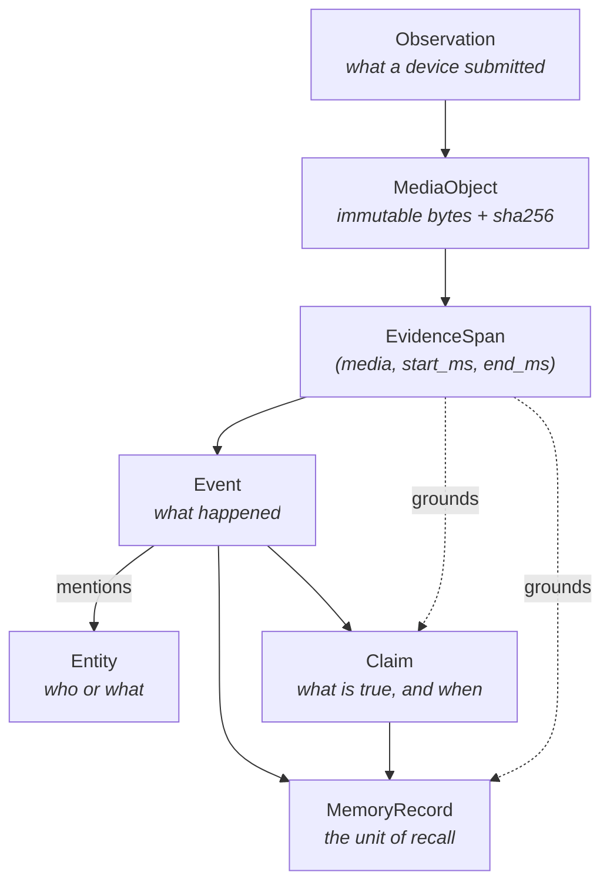
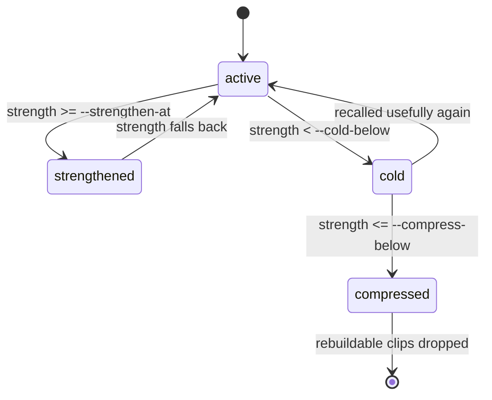

# Concepts

MindBridge stores seven kinds of record. They exist separately because they answer different
questions and fail differently: collapsing them into one "document" table is what makes an
answer impossible to verify and a deletion impossible to complete.

Solid arrows are derivation. Dotted arrows are grounding — the reason a derived record can be
checked against what the sensor actually recorded.

## Tenant

The isolation boundary. Every table carrying a `tenant_id` has **forced** row-level security
enabled by migration `0005`, and every store transaction sets exactly one tenant locally. This
is not filtering in application code that a missing `WHERE` clause could defeat; the database
refuses to return another tenant's rows even to a query that asks for them.

An API key is bound to an explicit tenant allowlist. Requests naming a `tenant_id` outside that
allowlist are rejected with `tenant_access_denied` regardless of whether the row exists.

## Observation

One timestamped capture from one sensor: `device_id`, `boot_id`, `sequence`, `sensor`, and the
media it refers to. Only two sensors are admissible — `camera` and `microphone` — because those
are the two that can carry the image, video, or audio evidence every observation is required to
have.

Three timestamps, deliberately distinct:

| Field | Meaning |
| --- | --- |
| `occurred_at` | When the observed events began. |
| `ended_at` | When they ended. Must not precede `occurred_at`. |
| `observed_at` | When the device recorded them, which may trail `ended_at`. |

`clock_offset_ms` records known device clock skew, so a drifting edge clock stays reconcilable
rather than silently corrupting the timeline. `(boot_id, sequence)` orders and deduplicates
without requiring the counter to survive a restart.

MindBridge does not accept an upload. The device puts bytes in object storage first, then
submits an observation that refers to them.

## MediaObject

An immutable reference to bytes that already exist: `uri`, `sha256`, `size_bytes`, `kind`, and
optional `duration_ms`. The URI must take the tenant-safe shape
`s3://<bucket>/tenants/<tenant_id>/<key>`; anything else is refused before it can become a path
traversal.

`kind` drives all downstream modality routing, so it is cross-checked against the URI extension
when the extension is recognized. Declaring `video` and pointing at a `.wav` fails at the
boundary rather than as a decode error in a worker three minutes later. Extensionless keys are
normal and imply nothing.

Derived clips carry `derived_from_media_object_id`, which is what makes them rebuildable and
therefore safe for the lifecycle sweep to purge.

## EvidenceSpan

The load-bearing concept. An `EvidenceSpan` is `(media_object_id, start_ms, end_ms)` — a
precise, replayable location inside an original recording.

Every derived record that claims to be verified must reference at least one. The domain layer
enforces this directly: constructing a `Claim` or a `MemoryRecord` with
`verification_status = verified` and no `evidence_ids` raises `DomainInvariantError`. There is
no path by which the system produces a verified assertion it cannot point at the proof for.

Callers receive evidence as an `EvidenceView` carrying a short-lived signed `media_url`, so
verifying an answer needs no second call to private storage.

## Event

What happened, derived from one or more observations by a perception model that inspected the
original AV. An Event carries its own `evidence_ids`, the `model_reference` and `prompt_version`
that produced it, a `salience`, and its time span.

Events form a two-level hierarchy through `hierarchy_level`:

- `event` — directly perceived, one grounded span of recording.
- `episode` — a consolidated parent that atomically claims child events.

`status` moves through `candidate → active → superseded`. Consolidation writes atomically, so a
child cannot be claimed by two parents.

## Entity

Who or what an event involves: `person`, `object`, `place`, `device`, `organization`, or
`topic`.

A named entity is keyed by `(tenant, entity_type, casefolded name)`, so every event mentioning
that name shares one graph node. Casefolding is applied before the key is derived and the
casefolded form is what gets stored — keeping the perceived casing would make the row depend on
which clip happened to arrive first.

One consequence is deliberate and worth knowing: **two different people with the same name merge.**
Splitting them is an evidence problem, deferred until a real corpus shows the false merges rather
than guessed at in advance.

Perception names what it sees once per clip, so the same person can accumulate a different name
in every clip. Identical names already collapse and the edge identity signal keeps anonymous
people stable, which leaves one real problem: the same entity described two different ways.
Entity consolidation pairs same-type entities, reopens spans of each one's original recording,
and asks the generator to judge that pair alone.

A verdict is recorded only when the judge reached one — a confident `same_as`, or a confident
`not_same_as` so the pair is not paid for again. Anything else leaves the pair unjudged for a
later sweep. Verdicts are **pairwise and never composed**: `same_as` between A and B and between
B and C implies nothing about A and C. The cue the judge's verdict rested on is stored in
`entity_resolution_verdicts` beside the confidence, so a merge that turns out wrong can be read
back rather than guessed at.

Retrieval does not traverse `same_as` yet. The edge is written for the graph and for agents
reading it.

## Claim

A versioned assertion: `fact`, `state`, `intent`, or `relation`. Claims carry validity time
(`valid_from`, `valid_to`) separately from creation time, which is what lets "the toolbox is on
the workbench" stop being true without being deleted.

`verification_status` distinguishes three genuinely different things:

| Status | Meaning |
| --- | --- |
| `verified` | Original media was inspected. Requires evidence. |
| `attested` | The writer asserted it. Nothing inspected it. |
| `unverified` | Neither. |

Conflicting claims produce durable `contradicts` and `supersedes` edges rather than a silent
overwrite. Supersession also versions the `MemoryRecord` that represents the claim.

## MemoryRecord

The unit of recall — what `recall()` returns and what feedback and forgetting address. Six
types, distinguished by the role the content serves:

| Type | Role |
| --- | --- |
| `episodic` | Something that happened at a time. |
| `semantic` | A durable fact. |
| `procedural` | How to do something. |
| `prospective` | A future intention. |
| `working` | Short-lived task state. |
| `perceptual` | A raw sensory detail. |

A memory also carries the lifecycle counters that make its ranking explainable:
`strength`, `salience`, `useful_access_count`, `positive_feedback_count`,
`negative_feedback_count`, `last_accessed_at`. Corrections version rather than overwrite, linked
by `supersedes_memory_id` and `superseded_at`.

## Relations

The graph layer, as typed edges between events, entities, claims, and memories:

`represented_by`, `mentions`, `asserts`, `about`, `contains`, `supports`, `contradicts`,
`supersedes`, `same_as`, `not_same_as`, `same_episode`, `before`, `after`.

Recall expands a bounded number of hops across these edges and fuses the result with dense and
lexical retrieval, which is how a query reaches a memory whose text never matched it.

## Lifecycle

Memories decay on an explicit, inspectable schedule rather than by model judgement. Four states:

Strength rises with useful access and positive feedback, falls with negative feedback and idle
time. Every coefficient is a CLI flag on `mindbridge lifecycle`, not a model weight, so
retention policy and hardware cadence can be calibrated without touching code. The default
`--age-decay-weight` of 0.005 cools a memory of median salience after 100 unused days.

`compressed` drops rebuildable derived clips while keeping the record and its pointers into the
original recording. It is a storage reduction, not a deletion.

## Forgetting

Deletion is a durable, transitive operation, not a row removal. `forget()` writes a
`DeletionTombstone` naming either one `memory_record` or an entire `observation` — the latter
erasing everything derived from it, including identity samples the edge learned from that
source.

The tombstone survives the content and carries a propagation state:

| State | Meaning |
| --- | --- |
| `pending` | Recorded, not yet propagating. |
| `propagating` | Reaching central PostgreSQL and object storage. |
| `complete` | Central deletion finished. |
| `failed` | Central deletion stalled; `error_code` says why. |

`complete` describes central storage only. Tombstones are content-free by construction, so
retaining them after physical erasure is safe — which is what lets a device that was offline
during the deletion reconcile when it reconnects, by paging `GET /v1/deletions` from its last
cursor. The server does not claim that device has already reconnected or acknowledge deletion.

## Embedding space

A vector is meaningless without knowing what produced it, so every embedding carries both the
encoder that produced it (`model_id`) and the compatibility space it belongs to
(`MINDBRIDGE_EMBEDDING_SPACE_ID`).

Those are two different facts. Several independently served encoders can write into one
comparable space. Separating them is what allows a re-embedding to run while the deployment keeps
serving.

The API probes every configured tenant at startup and refuses to serve if one holds vectors the
configured space cannot reach. Pointing a deployment at a new embedder without re-embedding
therefore fails loudly instead of returning empty recalls. Vectors in several spaces are
accepted while a migration is in progress.

`MINDBRIDGE_EMBEDDING_DIMENSION` is one width shared by the pgvector column and every encoder in
the deployment. It defaults to 1024 and accepts only widths Jina v5 was trained to truncate to:
32, 64, 128, 256, 512, 768, 1024. Changing it requires re-embedding.

## Where to go next

- [Architecture](architecture.md) — how these records are written and read at runtime.
- [REST API](api/rest.md) — the wire representation of each one.
- [Operations](operations.md) — running consolidation and lifecycle against them.
