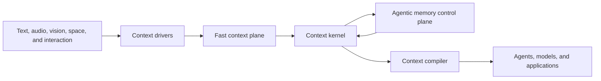

# Context OS direction

This page defines MindBridge's long-term product and architecture direction. It does not claim
that every behavior below is implemented or public. [Architecture](architecture.md) owns current
implementation invariants, and the API references own current contracts.

> MindBridge is an embodied-native, agentic context operating system. It turns continuous
> multimodal experience into governed, task-ready context for agents.

`Embodied-native` describes where context comes from and which semantics survive ingestion.
`Agentic` describes how slow memory is managed. `Context OS` describes MindBridge's position
between perception and action.

## Why an operating system

A memory runtime stores and retrieves records. A Context OS additionally owns:

- the lifecycle from transient observation to durable, formed, consolidated, archived, or deleted
  context;
- scheduling between latency-sensitive work and slower reasoning;
- evidence, version, permission, resource, and privacy policy;
- selection and compilation of context for a downstream task; and
- stable interfaces through which applications, models, and agents consume those capabilities.

The term does not mean that MindBridge is a host operating system or a general AgentOS. The host
agent still owns user goals, planning, tool selection, and action. MindBridge owns the narrower
goal of managing context well.

## Product boundary



| Layer | Responsibility |
| --- | --- |
| Context drivers | Normalize device, provider, and application events into immutable observations and explicit finality. |
| Fast context plane | Maintain changing working context, speculative recall, and low-latency durable capture. |
| Context kernel | Enforce evidence, identity, time, space, version, durability, and permission invariants. |
| Agentic memory control plane | Deliberate over longer histories and propose reinforcement, consolidation, correction, and forgetting. |
| Context compiler | Select a task-ready context bundle within latency, size, freshness, evidence, and privacy budgets. |
| SDK, REST, and MCP | Present different views of the same kernel to developers, services, and agents. |

Governance crosses every layer. Model output is a proposal at a trust boundary, never authority to
rewrite evidence or bypass policy.

MindBridge owns the lifecycle and meaning of context. It does not own camera or microphone drivers,
VAD, SLAM, general task planning, GPU scheduling, or the final action taken by an agent.

## Consumers and authority

Developers and agents both consume MindBridge, but they are not the same kind of consumer. A human
whose life is observed is also a first-class participant even when they never call an API.

| Participant | Role | Authority |
| --- | --- | --- |
| Developer or operator | Select models, connect sensors, set policy, diagnose, migrate, and recover the runtime. | Full instance administration inside the host's security boundary. |
| Agent | Request context, add explicit observations, and report outcomes or feedback. | Bounded capabilities granted by the host. |
| Human data subject | Own consent, identity naming, correction, export, retention, and physical deletion decisions. | Final authority over sensitive personal context. |

An agent must not gain identity enrollment, irreversible merge, or physical deletion authority
merely because it can call ordinary recall tools. The host chooses whether to expose sensitive
operations and when human confirmation is required.

## Time scale is not memory type

Fast and slow memory describe processing policy. Semantic, episodic, and procedural memory describe
cognitive role. They remain orthogonal and use one authoritative evidence model.

| Plane | Latency concern | State | Typical work |
| --- | --- | --- | --- |
| Working context | Current interaction deadline | Volatile | Coalesce partial text, audio, and frames; run speculative recall; discard abandoned turns. |
| Fast durable context | Capture acknowledgement | Authoritative observation | Persist final content, provenance, event time, and media identity without waiting for slow reasoning. |
| Search-ready context | Time to useful recall | Durable projection | Transcribe, embed, index, and expose readiness. |
| Slow memory | Intelligence and cost budget | Derived, evidence-linked state | Form entities and events, resolve conflicts, consolidate patterns, update traits, and manage retention. |

These are lifecycle milestones, not a requirement for four databases or one public status enum.
SQLite remains authoritative and Zvec remains a rebuildable projection.

### Fast context plane

The current streaming contract already distinguishes speculative `UPDATE`, durable `FINAL`, and
discarded `CANCEL` events. The target fast path extends that distinction to acknowledgement:

1. Validate and materialize a final observation.
2. Commit its raw evidence and durable follow-up work in SQLite.
3. Acknowledge capture.
4. Perform model-dependent enrichment and indexing outside the capture deadline.

The current `add()` contract remains the strong path: a successful return means the record is
searchable through its completed model and index work. The fast path is explicit rather than a
silent weakening of `add()`: `capture()` acknowledges after the SQLite commit and `settle()` runs
the deferred model stages, with the contract in
[the Python SDK reference](api/python-sdk.md#memory-operations).

No universal millisecond promise is meaningful. Latency objectives must name the hardware,
payload, modality, model placement, warm or cold state, percentile, and required readiness level.
At minimum, measure capture acknowledgement, time to searchable, warm search, speculative
time-to-first-hit, and slow-formation lag separately.

### Agentic memory control plane

Slow memory requires intelligence because retention cannot be reduced to recency or retrieval
count. Its loop is bounded and proposal-driven:

```text
durable trigger
-> gather a bounded evidence set
-> identify contradiction, redundancy, pattern, or utility
-> propose memory operations
-> validate policy and kernel invariants
-> commit atomically
-> record outcomes for evaluation and rollback
```

Useful triggers include new independent evidence, explicit feedback, a contradiction, repeated
query failure, memory pressure, and an operator-approved idle or charging window. A periodic timer
alone is not evidence that work is useful.

The first implementation should be one memory-management loop, not a swarm of specialized agents.
The reasoning backend may change, but the proposal vocabulary and kernel validation remain stable.

| Intent | Kernel semantics |
| --- | --- |
| Reinforce | Record independent supporting evidence or observed utility; retrieval alone is not reinforcement, though a hit an answerer cited is observed utility. |
| Consolidate | Create a higher-level derived memory with explicit evidence links; preserve source observations. |
| Merge | Unify compatible derived identity or meaning while retaining reversible lineage. Kernel-initiated from corroborated cross-modal evidence, not backend vocabulary: a proposed merge is refused. |
| Update | Add a new valid and transaction-time version that supersedes prior state; do not overwrite history. Realized as consolidate into an existing lineage. |
| Correct or split | Reverse a bad inference, identity merge, or consolidation without manufacturing new source evidence. |
| Forget | Change retrieval visibility or retention state under policy; do not equate it with physical deletion. |

Every proposal names its evidence, model and recipe, expected effect, and idempotency identity. The
kernel rejects unsupported, unauthorized, internally inconsistent, or stale proposals. The loop
never writes SQLite directly. All four rejections are enforced, not aspirational: a proposal may
name targets only inside the window the kernel gathered for it, must be eligible in every target
it names or be refused whole, and is re-checked inside the apply transaction so a target that was
forgotten, corrected, or deleted since validation is refused as stale rather than half-applied.

`FormationBackend` is the seed of this plane: it proposes typed state from one committed
observation while the kernel validates and persists it. `ConsolidationBackend` is the plane itself:
`consolidate()` gathers a bounded, active evidence set, the backend proposes `MemoryOperation`
values with the four intents reinforce, consolidate, correct, and forget, and the kernel validates
each one, commits it with its log row, and can `rollback()` it. Merge is the one intent no backend
may propose: a cross-modal identity merge is committed by the kernel from co-occurrence evidence it
counted itself, with its own reversible log row, and a proposed `MERGE` is rejected as
`unauthorized`. `consolidation_candidates()` is the
durable trigger in front of that loop: it derives due work -- new independent evidence, a lineage
that contradicts itself, a record confirmed since it was last weighed, a question recall answered
with nothing, a store over its declared budget, an operator-approved idle window -- from committed
state, so deliberation is scheduled on evidence rather than on a clock. `deliberate()` is the loop
itself, running those two halves to a fixed point and reporting what the run cost and yielded, and
`apply(operation)` is the same kernel validation for an operation a host supplies, which makes
replay of a logged sequence a public path. Neither a clock nor a candidate that always comes back
is evidence that work is useful, so each pass records that it weighed its evidence set even when
it yielded nothing. The Python SDK reference owns the exact contract; the reasoning backend can
change without changing that vocabulary.

## Forgetting is three operations

| Form | Effect | Authority |
| --- | --- | --- |
| Cognitive forgetting | Exclude or downrank context in ordinary recall while retaining auditability and recovery. | Policy may act automatically within configured bounds. |
| Consolidation forgetting | Prefer a compact derived memory and move detailed evidence out of the normal recall path. | The memory loop may propose it; the kernel preserves lineage. |
| Physical forgetting | Delete records and media so they cannot be recovered by MindBridge. | Explicit human or deterministic retention policy. |

Decay is cognitive ranking only, and `forget()` is cognitive forgetting: a forgotten record leaves
recall, stays readable through `get()` and `list()` with its `forgotten_at`, and returns through
`rollback()`. Consolidation forgetting is a control-plane proposal over evidence lineage: a
`CONSOLIDATE` may name sources of its own to retire, they leave recall in the same transaction that
creates the derived record, the evidence links stay, and the log row carries them as
`forgotten_ids` so the two halves reverse together. Physical forgetting remains `delete()` and
`forget_identity()` under host authority and is not a proposal intent. Retention work must keep
these meanings separate in APIs, telemetry, and user-facing controls, and the operation log already
does: `delete()` leaves no row, cognitive forgetting is a `FORGET` row over `target_ids`, and
consolidation forgetting is a `CONSOLIDATE` row carrying `forgotten_ids`. Erasing a *person* is the
one physical forgetting that does leave a row, because a data subject's request has to be
auditable: it is a `FORGET` row over an `IdentityChange` rather than over memory IDs, it carries
only the identity, its aliases, and the naming assertions it deleted, and `rollback()` refuses it.
Which of the two a `FORGET` row names is the discriminator: a row over records is reversible, a row
over a person is not.

## Context compiler

Retrieval returns candidate evidence. The Context OS becomes useful to downstream output when it
can compile that evidence into a bounded context view for a particular task.

A context compilation request supplies a goal or query plus constraints such as maximum latency,
text or media budget, freshness, allowed sensitivity, spatial scope, and minimum evidence quality.
The resulting bundle may contain:

- current actors, relationships, and scene state, each in its own bundle section, with a named
  actor's identity edge resolved through the same read path whether or not the naming assertion
  itself ranked into the bundle;
- relevant episodic, semantic, and procedural memories;
- affect cues separated from longer-horizon traits;
- temporal and spatial bounds, both metric frames and symbolic places;
- conflicts, uncertainty, and explicit unknowns; and
- provenance needed to inspect or correct the result.

The compiler selects and structures context; it does not choose the agent's final answer or action.
`ask()` may remain a convenient grounded-generation surface, but it is not the operating-system
boundary. `compile()` is implemented and exposed on all three interfaces; see
[context compilation](context-compilation.md) for the contract and
[REST](api/rest.md#endpoints) and [MCP](api/mcp.md#tools) for the transport forms.

The first compiler should remain request-response and reuse the existing retrieval kernel. Push
subscriptions, proactive interruption, and shared multi-agent working sets wait for a demonstrated
application requirement.

## Models, modalities, and plugins

Model independence means replacement behind a declared capability contract. It does not mean that
durable representation spaces can be swapped without migration. Embedding model, dimension, input
recipe, identity space, and formation recipe remain explicit compatibility identities.

New modalities enter through the smallest adapter that can normalize them to immutable content,
declared capability, event time, provenance, and optional spatial context. Accepting a file format
alone is not omni-modal memory; cross-modal evidence must remain connected to the same event,
person, relationship, place, and source.

Model capabilities are extensible. Storage authority, transaction ordering, evidence semantics,
and lifecycle validation are kernel policy rather than storage plugins. A global registry, live
backend swap, external queue, or alternate database is added only for a measured requirement that
the embedded runtime cannot satisfy.

## Interfaces

The Python SDK is the full developer and device integration surface. REST exposes process-safe
application operations. MCP exposes a small agent-appropriate capability view rather than mirroring
every administrative method.

The three surfaces carry different authority, not different capability. The SDK is the full
surface: every public `Memory` operation, including the control plane, is reachable because the
SDK runs inside the process that owns the memory. REST is a network-safe subset of that same
process: the ordinary application path -- add, search, ask, compile, and the fast-capture plane
(`capture`, `settle`, `pending_captures`) -- is always on, because it is an operation on the
caller's own records rather than authority over a person, while identity administration (naming,
reading, unlinking, and erasing a person) and embodied analysis (`speech`, `faces`) are opt-in
behind `create_app`'s `identity_operations` and `embodied_operations`, both defaulting to off,
because a caller reaching REST over a network is not automatically the memory's owner. MCP is the
agent view of the same process and carries its own `identity_operations` switch with the same
name and the same default-on-for-a-trusted-agent-host reasoning; a host that wants REST and MCP to
grant the same agent the same authority sets both switches the same way. Neither transport ever
reaches the control plane -- `consolidation_candidates`, `consolidate`, `forget`, `rollback`, and
`operations` stay SDK-only regardless of any switch.

The compiler is that view's centre. `POST /v1/context` and the `compile_context` MCP tool return a
budgeted bundle with provenance, and `GET /healthz` and the MCP server instructions advertise the
configured modalities and backends so an agent does not discover them through failure. Both
resolve nothing and write no memory beyond the same query-audio transcript cache `search` writes,
which is why neither is annotated read-only. A compilation that finds nothing does record that,
as the bounded signal the control plane's `QUERY_FAILURE` trigger reads, which changes no
evidence and no memory.
Answering stays available as a convenience rather than the operating-system boundary.

High-rate sensor streams stay on the embedded SDK boundary. Agents operate on completed
observations or stable asset identifiers. Cognitive forgetting, consolidation, operation rollback,
retention policy, and physical deletion stay with the process that owns the memory; identity
naming, merge reversal, and erasure are separate trusted tools that no ordinary recall or compile
call grants, and a host withholds them, the two analysis tools, or every mutating tool by
building the server without that group.

All interfaces call one owner of one physical `data_dir`. Supporting several agents against that
owner does not introduce logical account or request scope into the memory contract. A hosted
multi-tenant product remains a deployment layer with physically isolated memory domains.

## Invariants that survive the evolution

- Raw observations are evidence and are never silently rewritten into model interpretations.
- SQLite commits authoritative state before any derived index is acknowledged.
- Every derived memory retains evidence, model, recipe, and version lineage.
- Model reasoning proposes; deterministic kernel policy authorizes and commits.
- Slow work never blocks the explicit fast-capture acknowledgement path.
- Search hydration and context compilation reapply authoritative visibility and scope.
- An agent cannot convert ordinary tool access into sensitive administrative authority.
- Physical deletion is distinguishable from ranking decay and consolidation.
- One physical data directory remains one live memory domain.

## Product measurements

`SOTA` is a benchmark result, not an architecture property. The product objective is the best
context utility under the target device's latency, resource, and privacy constraints.

| Outcome | Required measurements |
| --- | --- |
| Real-time behavior | Capture acknowledgement and search p50, p95, and p99; time to searchable; speculative first-hit latency; CPU, memory, energy, and disk. |
| Context utility | Downstream task success against no-memory, full-context, and retrieval-only baselines; useful evidence per token and per millisecond. |
| Embodied quality | Multimodal, temporal, and spatial recall; identity false merge and fragmentation; affect attribution and trait false positives. |
| Slow-loop quality | Consolidation precision, contradiction recovery, false retirement, rollback success, model cost, and formation lag. |
| Trust | Crash recovery, replay determinism, provenance coverage, permission enforcement, and deletion completeness. |
| Developer and agent experience | Time to first memory, integration code, tool-call success, context size, and correction effort. |

The existing [benchmark harness](benchmarking.md) measures many retrieval and task-quality axes.
Context OS claims additionally require end-to-end companion scenarios and measurements on named
deployment hardware. External results guide hypotheses; only reproducible MindBridge runs select
defaults or justify superiority claims.

## Evolution gates

1. Measure the current strong `add`, streaming prefetch, search, and formation paths on target
   hardware before setting latency objectives. Open: no named-hardware measurement exists yet.
   The [benchmark harness](benchmarking.md#reported-performance-and-resource-metrics) can now
   produce most of these numbers from a real run: capture acknowledgement, time to searchable,
   and formation lag from `mindbridge-bench eval --ingest capture`, search and answer latency
   from any run, and CPU, memory, disk, and energy (Intel RAPL and `nvidia-smi` power draw, where
   the platform exposes them) for the whole run. Speculative first-hit latency stays unmeasured:
   the streaming prefetch path issues an ordinary `Memory.search()`, indistinguishable in
   telemetry from any other search, and the harness does not exercise streaming ingest. Running
   this on named hardware and publishing the result is still what closes the gate.
2. Add an explicit fast-capture path and SQLite-backed durable enrichment work without changing
   current `add()` semantics. Done: `capture()`, `settle()`, and `pending_captures()`;
   `settle()` honours a retry ceiling so one poisoned capture cannot block the queue,
   `pending_captures()` answers per-record readiness with attempts, last error, and the stage the
   record is stopped at, `settle(memory_ids=...)` runs named records past that ceiling, one
   settlement runs at a time per `Memory`, and a record whose formation was interrupted after
   `add()` committed is completed by the next `settle()` through the same queue. `capture=True`
   on `add_stream()` and the three async reducers routes streaming `FINAL` events through the
   capture path, so continuous observation reaches durable acknowledgement without waiting for a
   model.
3. Generalize formation into one bounded memory-management loop with structured proposals,
   replay, rollback, and privacy tests. Done: the operation log and authority tests
   (`consolidate()`, `forget()`, `rollback()`, `operations()`), the `identify` intent that
   makes naming a person an evidence-bearing, reversible claim, consolidation forgetting as one
   reversible operation, the declarative `consolidation` slot that makes the loop reachable
   without a Python app loader, kernel rejection of proposals that name records the backend was
   not shown, of partial multi-target operations, and of proposals whose targets moved before the
   commit, and native media in the bundled consolidation backend's input. The loop is now an
   entity rather than two primitives a host joins: `deliberate()` and `mindbridge deliberate`
   run candidates through consolidation to a fixed point, all six triggers are produced from
   committed state rather than named in an enum -- `QUERY_FAILURE` from recorded empty recalls,
   `PRESSURE` from a declared record budget, `IDLE` from an operator-declared window -- and every
   pass records that it weighed its evidence set whatever it yielded, so a candidate the model
   could not resolve stops coming back until its own signal moves instead of being paid for every
   round. `consolidate()` holds no lock across the backend round trip, so slow reasoning does not
   stall a concurrent `add()`; the in-transaction re-check remains the correctness guarantee.
   Replay is a public, tested path through `apply(operation)`, and `record_outcome()` writes the
   post-hoc outcome the slow-loop measurements need. The identity lifecycle joined the same log:
   the corroborated cross-modal `MERGE` the kernel commits and `rollback()` re-splits, the
   `CORRECT` that `unlink_identity` logs and `rollback()` re-links, and the irreversible `FORGET`
   row an identity erasure leaves so the request is auditable without being recoverable. Open:
   companion-scenario privacy tests.
4. Add a context compiler whose output improves downstream tasks within declared budgets. Done
   for selection, budgeting, the latency deadline, the explicit unknowns a thin bundle reports,
   and the person link: `compile()` resolves a memory's identity edge -- its own bound semantic
   assertion or its media's asset-keyed speech speaker or face observation -- into a `NamedActor`
   or `ProvisionalActor`, whether or not the naming assertion itself ranked into the bundle. Open:
   a downstream-task measurement against the no-memory, full-context, and retrieval-only
   baselines. The [benchmark harness's `compile` arm](benchmarking.md#baseline-arms) can now
   produce that comparison -- it answers from `compile()`'s rendered bundle beside `blind`,
   `full-context`, and the product's own `mindbridge` (retrieval-only) arm on the same questions,
   and reports each answered question's bundle chars and item count as the numerator half of
   useful evidence per token. Running it across the benchmark suite and publishing the result is
   still what closes the gate.
5. Extend REST or MCP only after the Python contract and authority model are stable. Done: the
   compiler; one capability document rendered identically by `/healthz`, the MCP server
   instructions, and `mindbridge doctor`; and the three switches
   `build_mcp_server(identity_operations=, embodied_operations=, write_operations=)`, which
   withhold naming and erasing a person, the two analysis tools -- and with them the
   cross-modal identity merge `analyze_faces` commits -- and adding, deleting and reinforcing.
   Each withholds by never registering the group, so a withheld tool is unknown rather than
   refused, and the instructions name what is missing. `ask_memory` reaches the same face
   recognition `analyze_faces` uses to answer a question over a photo or video, so
   `embodied_operations=False` also passes `Memory.ask(..., link_identities=False)`: recognition
   may still run, but the corroborated bind never commits. All three False therefore leaves
   exactly the five read tools with no path to merge authority, which is recall and compile
   alone. REST reaches the fast-capture plane always, and the same identity and embodied
   operations behind its own `identity_operations` and `embodied_operations` switches on
   `create_app`, mirroring the MCP switches of the same name, so a networked application can use
   `capture`/`settle`/`pending_captures` unconditionally and, where the host opts in, name, read,
   unlink, or erase a person or run face and speech analysis exactly as an MCP-connected agent
   can. The control-plane intents stay off REST and MCP.

Fast capture is now independent of slow reasoning, the control plane governs the lifecycle through
validated, logged, reversible operations, and the compiler produces budgeted task-ready context.
Apart from the open items named above, the remaining gates are measurements, not mechanisms:
named-hardware latency, downstream task utility, and slow-loop quality on companion scenarios
decide whether the defaults are right.
