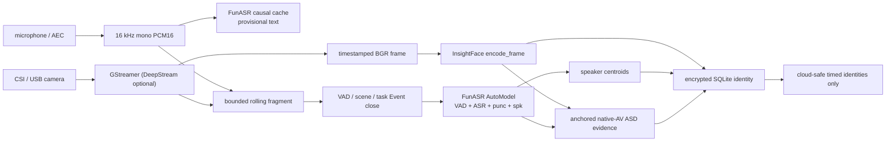

# 端侧人物一致性感知与 FunASR 收敛决策

> 状态：Phase 3 可执行基线，目标端侧平台真值验收前不得宣称人物一致性 SOTA
>
> 更新日期：2026-08-17
>
> 范围：原生视听流、人脸、VAD/ASR/标点/diarization、声纹、face↔voice 和端侧遗忘

## 1. 结论

MindBridge 当前默认链路只保留一套语音生态：

| 能力 | 当前默认 | 说明 |
| --- | --- | --- |
| 原生视频流 | GStreamer appsink（DeepStream 可选）→ `InsightFaceVideoEncoder.encode_frame()` | 直接接受带毫秒时间戳的 BGR frame，不重新打开视频；采集后端可替换，帧契约不变 |
| 原生音频流 | 16 kHz mono PCM16 → FunASR causal Paraformer | 任意输入 chunk；内部使用官方 600ms 窗口和 cache |
| Event-close 语音理解 | 一个 FunASR `AutoModel` 组合 ASR + VAD + punctuation + speaker model | 一次推理返回 transcript、毫秒 sentence、speaker label 和 centroid |
| 人脸 | InsightFace SCRFD + ArcFace | 在各目标端侧平台上再比较检测器档位；模板留在设备 |
| 声纹 | FunASR 返回的 CAM++ speaker centroid | 不再二次解码波形或重复加载 speaker encoder |
| 活跃说话人 | 带 face anchor 且保留音轨的 Omni/VLM 复核 | 只产出可撤销证据；LR-ASD 仍是本地质量候选 |
| 本地身份 | AES-256-GCM 加密 SQLite prototype | 绝对阈值 + runner-up margin；显式遗忘同步删除 |

因此，**当前产品路径应以 FunASR 替换 NeMo**。这次替换删除了第二套 diarization runtime、
ASR/turn 融合器、波形临时文件和独立 ERes2NetV2 重推理，开发者只需提供同步 AV、一个 FunASR
pipeline 和设备校准阈值。NeMo/Sortformer 不再是安装依赖；只有带真值的相同硬件 bake-off 证明其
DER/false-link 收益足以覆盖额外依赖和编排成本时，才作为质量挑战者重新评估。

这条链路的选型标准里包含**全平台可用**：MindBridge 的 Edge 不限定 Jetson，同一套身份感知必须能跑在
地瓜 RDK、Rockchip RK、Intel/OpenVINO x86、通用 ARM 主机，以及把 4090/5090/A100 直接当作“端”的
GPU 主机上。InsightFace 与 FunASR 之所以是默认，正因为它们都有 ONNX/GGUF 可移植路径；平台差异只
允许出现在 runtime 与编译工件上，bbox 归一化、embedding 维度、身份门禁和遗忘语义在所有平台完全
一致。任何只能在单一厂商 SDK 上成立的做法都不进默认路径。

这不表示 FunASR 已经包办所有实时语义。在线 Paraformer 的 partial transcript 是 provisional；
punctuation、稳定 speaker label 和长期 voiceprint 在 Event/window 关闭后才确认。当前 realtime
diarization 上游会随窗口增长重新聚类，不能把早期 speaker number 当成稳定身份。

## 2. 为什么这比原组合更适合 MindBridge

原组合需要 FunASR 产 ASR/VAD、NeMo 产 speaker turns、MindBridge 自写 overlap/margin 融合，再把
每个 turn 解码为 WAV 交给独立 ERes2NetV2。它有三个问题：

1. 两个模型栈给出的边界需要自定义启发式合并，错误归属会直接污染声纹；
2. 相同音频被重复读取和推理，显存、冷启动和每一个端侧平台的镜像都变重；
3. 开发者必须理解四个中间类型，却仍无法获得真正的 microphone chunk API。

这次收敛正是 **Code is the Product** 的直接结果：它删除的是一整套 MindBridge 自维护的融合代码，
而不是新增一层封装。判断标准不是“支持的能力更多”，而是“更少的代码做同一件事且更难出错”。任何
反向提案——重新引入第二套 runtime、为未来平台预建 provider 抽象——都必须先证明它删掉的比加入的多。

[FunASR](https://github.com/modelscope/FunASR) 的官方 `AutoModel` 已能组合 VAD、ASR、标点和
speaker model，并在 `sentence_info` 中返回 `start/end/text/spk/timestamp`。当前上游的
`return_spk_center=True` 还直接返回与 `spk` 索引对应的 centroid。MindBridge 只解析这一份结果，
保留自己的领域职责：加密模板、匹配门槛、证据、撤销和云端安全输出。

减重边界必须诚实：FunASR Python 发行本身仍包含 Torch、ModelScope/Transformers 和音频科学计算
依赖，因此它不进入 Core/SDK/server 的通用 lock。每个平台的设备镜像各自安装与本平台 SDK 匹配的
Torch/ONNX Runtime、FunASR 和 ModelScope（Jetson 用 JetPack/CUDA 工件，地瓜 RDK 用 OpenExplorer，
RK 用 RKNN Toolkit，x86 用 OpenVINO 或标准 CUDA/CPU wheel）；`mindbridge[edge]` 只携带同步、安全、
OpenAI SDK 与可观测边界，不钉死任何一家的加速器 wheel。减掉的是**重复模型栈和 MindBridge 代码**，
不是把 FunASR 描述成小型纯 Python 包。

## 3. 与 M3-Agent、TaskMem 的差异

### 3.1 M3-Agent

依据 M3-Agent 固定 revision
`0e3e41939bd8a0b66d756e7b7eb8d5fe9992da5c`：

| 环节 | M3-Agent | MindBridge |
| --- | --- | --- |
| 人脸 | InsightFace `buffalo_l`，CPU、5 FPS、HDBSCAN 与固定阈值 | 同样复用 InsightFace，但自动选择并核验 CUDA provider；有质量门、绝对阈值和 runner-up margin |
| 说话区间 | Gemini 看整段视频生成秒级 ASR 区间 | PCM causal ASR 给低延迟 partial；FunASR 质量路径给毫秒 VAD/ASR/punc/spk |
| 声纹 | 自行构造 ERes2NetV2，逐区间再次推理 | 直接使用同一次 FunASR/CAM++ 调用返回的 speaker centroid |
| face↔voice | Prompt 可直接写 `Equivalence` 并刷新图 | Omni 只能写可撤销 ASD 证据；跨 Observation 双向互为最佳后才解析 ID |
| 隐私/遗忘 | Benchmark 图预处理 | 生物模板只在加密设备库；Observation/identity tombstone 真实删除 |

MindBridge 复用了它的原子事件、稳定人物 ID、外观变化、对话、关系与因果要求，但没有复制固定阈值、
全模板均值匹配或让 Prompt 直接合并身份。错误合并人物的产品代价远高于暂时保留两个匿名 ID。

### 3.2 TaskMem

[TaskMem](https://github.com/ByteDance-Seed/TaskMem) 的公开路径以 10 秒 AV block 和约 50 秒滚动
上下文处理连续经历，并组合 ASR/diarization、face/voice 与 episode generation。MindBridge 采用其
滚动上下文和可视身份锚点思路，但不采用依赖训练/RL 的 memorization policy：模型必须冻结，学习
发生在记忆、索引、反馈和生命周期状态。

## 4. 当前可执行数据流



采集线程不等待模型。模型通过有界队列消费 frame/PCM；积压时先降低人脸/ASD 采样，不能破坏原始
时间轴或丢掉 rolling fragment。`FunASRStreamingTranscriber` 对可变 chunk 做缓存和异步背压，
模型失败后关闭该 session，避免上游 cache 已变化时重放同一 PCM。最后一个非空 chunk 必须携带
`is_final=True`；断流则同时丢弃 cache 和 provisional 文本。

## 5. 模型与门禁

### 5.1 人脸

[InsightFace](https://github.com/deepinsight/insightface) 的 SCRFD/ArcFace 生态提供多个检测器档位、
五点对齐和 ONNX Runtime。**ONNX 是选择它的关键原因**：同一份权重可以在 CUDA、OpenVINO、RKNN、
地瓜 BPU 和纯 CPU 上落地，档位划分因此按算力而不是厂商展开。当前代码直接复用 `buffalo_l` 验证质量
路径；产品 bake-off 比较：

- 嵌入式 NPU（Orin Nano、RDK X5、RK3588）：SCRFD-500MF 或 YuNet/SFace；
- 中算力 SoC / x86（Orin NX、高配 RK3588、Intel + OpenVINO）：SCRFD-2.5GF + ArcFace R50；
- 高算力端侧与 dGPU（AGX Orin、4090/5090/A100 主机）：SCRFD-10GF + ArcFace R50。

`encode_frame()` 只接受调用方已解码的 BGR frame、`timestamp_ms` 和 `duration_ms`，输出归一化 bbox
与 embedding。真实生产 tracking 交给平台原生组件（DeepStream/NvDCF、RKNN、OpenVINO 或平台自带
tracker）；MindBridge 不复制 decoder/tracker，也不为它们建统一抽象层。
只有清晰度、尺寸、姿态、遮挡和检测分数合格的轨迹样本才能进入 identity memory。

### 5.2 FunASR 在线与质量路径

当前固定模型如下：

```text
online_asr = iic/speech_paraformer-large_asr_nat-zh-cn-16k-common-vocab8404-online@v2.0.4
quality_asr = iic/speech_seaco_paraformer_large_asr_nat-zh-cn-16k-common-vocab8404-pytorch@v2.0.4
vad = iic/speech_fsmn_vad_zh-cn-16k-common-pytorch@v2.0.4
punc = iic/punc_ct-transformer_zh-cn-common-vad_realtime-vocab272727@v2.0.4
speaker = iic/speech_campplus_sv_zh-cn_16k-common@v2.0.2
```

在线模型使用官方 `(0, 10, 5)` chunk 配置，即 600ms 中间窗口，并保留 encoder/decoder look-back
cache。质量路径的一次 `generate()` 开启 `sentence_timestamp`、`return_spk_res` 和
`return_spk_center`。speaker centroid 只在以下条件全部满足时进入长期设备身份：

1. 同 label 的累计有效语音不少于部署门槛，当前默认 1 秒；
2. turn confidence 通过设备校准门槛；
3. 不与另一 speaker turn 重叠；
4. 最佳本地 prototype 通过绝对 cosine threshold，并以足够 margin 胜过第二名。

FunASR 当前结果没有可解释的逐 turn diarization probability，因此构造器中的 confidence 是物理环境
校准旋钮，不是模型置信度。重叠段会封顶为 0.5，只保留 observation-scoped transcript；不能让一个
全局 centroid 因混叠音频污染长期声纹。

### 5.3 llama.cpp 多端路径

[llama.cpp](https://github.com/ggml-org/llama.cpp) 及其 FunASR/GGUF 生态让 ASR/VAD 在 x86、ARM、
Apple 和全部非 CUDA 设备上共享一个轻运行时，是**全平台 Edge 目标下最重要的候选**：Torch + CUDA
在地瓜 RDK、RK 和部分 x86 NPU 平台上要么装不上，要么代价过高，而 GGUF 权重可以直接落地。

但它现在仍不是默认路径，也不被包装成抽象 provider：没有上游证据证明同一运行时完整返回
MindBridge 所需的 punctuation、稳定 diarization 和 CAM++ centroid。先在低算力 NPU 与纯 CPU 平台上
比较 WER、RTF、内存与功耗；真正通过后再加一个薄适配器，不能为了未来可能性预建 factory/registry。
在此之前，非 CUDA 平台的语音路径按“先跑通 ONNX Runtime + FunASR，再评估 llama.cpp 替换在线
front-end”的顺序推进。

## 6. face↔voice 闭环

音频 diarization 只能回答“哪个匿名 speaker 在说话”，不能知道画面中的哪张脸属于该声纹。
MindBridge 当前将 face box 标为 `F0/F1/...`，保留原视频音轨，并通过异步 OpenAI SDK 让 Omni/VLM
联合检查口型、语音起止和可见行为。它只返回 `FaceVoiceAssociationEvidence`，不能直接合并模板。

一对 face↔voice 必须满足：

1. 时间区间真实重叠，排除画外音、屏幕人物、机器人 TTS 和明显音画不同步；
2. 证据绑定 Observation、精确区间和模型 deployment revision；
3. 跨多个 Observation 达到累计时长和加权 confidence；
4. face→voice 与 voice→face 双向互为最佳，且都以校准 margin 胜过第二名；
5. 新竞争证据或 tombstone 能立即让解析退回未绑定。

`SQLiteIdentityMemory` 不创建不可逆 equivalence。它保存有界证据，并在读取时解析后续上传的匿名
ID；加密 face/voice templates 仍各自存在。云端当前不会回写已经导入的历史 voice Entity；只有
产品明确需要历史回补时，才增加版本化、可撤销的 cloud alias 关系。

## 7. 自适应算力

`device=auto` 在 CUDA 可用时选择 GPU；显式请求 CUDA 而 runtime/provider 回落到 CPU 会立即失败。
同一条规则适用于其他加速器：显式请求 OpenVINO、RKNN 或 BPU 而实际回落到 CPU 同样必须报错，
静默降级会让功耗和延迟验收失去意义。本地入口在空闲加速器内存达到配置门槛时并发人脸与统一
speech pipeline，否则顺序复用同一加速器。CPU 承担 SQLite、AES、哈希、FFmpeg 控制与调度；没有
可用加速器时才执行模型降级。8 GiB 当前只是 5090 软件验证门槛，每个目标平台都必须与机器人主任务
共同校准出自己的数值。

2026-08-13 的 RTX 5090 功能验证使用真实仓库音频，不是 mock：

| 路径 | 输入 | 结果 | 实测 |
| --- | --- | --- | --- |
| FunASR 质量路径 | 20 秒 16kHz mono WAV | 6 个毫秒 speech segment、标点、1 个 speaker、192 维 centroid | 推理 1.283s；峰值 CUDA allocation 1.93 GiB |
| FunASR 在线路径 | 6 秒 PCM，60 次 100ms push | 6 个 partial/final 文本 delta，最终 offset 6000ms | 推理 0.369s；峰值 872 MiB |
| 加密声纹 | 同一真实 centroid，两个 Observation | 两次均为 device scope 且命中同一匿名 ID | 通过 |

这些数字证明当前代码真实使用 GPU 和完整数据流，只适用于这台 5090 与该样本；没有 DER/WER/真值
身份标注，也没有任何非 CUDA 平台的数据，因此不能据此宣称模型精度或端侧 SOTA。

## 8. 安装与依赖边界

- Core/SDK：`uv pip install .`；
- 任意端侧/机器人编排（Jetson、地瓜 RDK、RK、OpenVINO x86、ARM 主机、dGPU 工作站）：
  `uv pip install '.[edge]'`——同一个 extra，不按平台分叉；
- 云服务：`uv pip install '.[server]'`；
- Jina SentenceTransformers 服务：再叠加 `'.[cloud-models]'`；
- InsightFace、ONNX Runtime、FunASR、ModelScope 和设备 Torch：由目标平台镜像提供。

通用 lock 不钉死任何平台的加速器 wheel（Jetson Torch、RKNN Toolkit、OpenVINO runtime、BPU
工具链都一样）。CI 用独立 venv 对 Core、Edge、Server 分别 build/install，并在
隔离解释器中导入对应入口，防止 Edge 再次拖入 FastAPI、Celery、MCP 或 PostgreSQL。FunASR 安装
成功还不等于模型路径可用；设备镜像必须在启动验收中加载固定 revision，并核对**实际生效的
device/provider**——不能因为进程起得来就认为加速器在工作。

## 9. 真值 bake-off 与 SOTA 门槛

公开数据和一套经同意采集的机器人 replay 必须同时报告：

- 人脸：track recall、TAR@固定 FAR、false merge、跨日 IDF1；
- diarization：DER/JER、speaker confusion、overlap DER、在线标签稳定性；
- ASR：中英/噪声/远场分桶 WER/CER；
- 声纹：EER、minDCF、TAR@固定 FAR，按 2s/3s/full、语言与距离分桶；
- ASD/闭环：mAP、off-screen FP、pair precision/recall、false-link、time-to-link、撤销延迟；
- 系统：完整链路 RTF/FPS、P50/P95、加速器/CPU/RAM/显存占用、功耗、温度、丢帧和队列深度，
  **按平台分别报告**，不做跨平台外推。

质量指标（人脸、diarization、ASR、声纹、ASD）追求的是绝对分数，评测时可以直接使用各自当前最强的
可部署模型与配置，不要求为了可比性刻意压低档位；系统指标则必须来自真实目标平台。两类指标同时
报告，不允许用其中一类掩盖另一类。

候选晋级顺序是：先满足 false-link 与隐私/遗忘约束，再最大化 recall，最后在合格候选中选择更轻的
运行时。两小时目标功耗 soak、机器人主任务并发、断电重启、幂等重放和 tombstone 都是门禁。

下一步只做三件事：固定带真值的跨日 identity replay；在至少一个 NVIDIA 平台和一个非 NVIDIA 平台
（地瓜 RDK、RK 或 OpenVINO x86）实测当前 FunASR 路径；用同一 replay 决定 LR-ASD 是否替换 Omni
ASD。没有结果前不恢复 NeMo 并行栈，也不新增 provider 框架——包括不为多平台预建抽象层。
