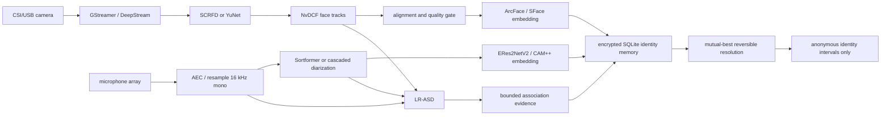

# 端侧人物一致性感知模型选型与闭环

> 状态：Phase 3 决策基线，待目标 Jetson 实测后锁定
>
> 调研日期：2026-08-13
>
> 范围：人脸检测/跟踪/表征、说话人分离（diarization）、声纹表征、
> face↔voice 等价关系；不包含 ASR、波形级语音源分离或生物认证

## 1. 结论

MindBridge 不应寻找一个包办全部能力的“总 SOTA”。四段链路的最佳生产组合是：

| 能力 | 首选生产候选 | 资源受限候选 | 质量挑战者 | 决策 |
| --- | --- | --- | --- | --- |
| 人脸检测 | SCRFD-2.5GF-KPS | SCRFD-500MF-KPS；YuNet | SCRFD-10GF-KPS | 按 Jetson 档位切换检测器，不降低五点对齐要求 |
| 人脸表征 | ArcFace R50（`buffalo_m/l` 同一识别器） | SFace；EdgeFace-XS 进入 bake-off | AdaFace R50/R100 | 当前效果验证直接使用质量最强候选，发布合规另行审查 |
| 在线说话人分离 | NVIDIA Streaming Sortformer 4spk v2.1 | 3D-Speaker 级联管线，按事件批处理 | pyannote Community-1 离线复核 | 机器人常见 ≤4 人时优先真正流式模型；超过四人自动走级联路径 |
| 声纹表征 | 3D-Speaker ERes2NetV2 | 3D-Speaker CAM++ | WeSpeaker 同条件运行时模型 | 短语音质量优先用 ERes2NetV2，资源不足才退到 CAM++ |
| 活跃说话人检测 | LR-ASD | LR-ASD 降低候选脸 FPS | GateFusion、LoCoNet、SCAN | LR-ASD 的质量/体积/权重/许可组合最好，先完成 ONNX/TensorRT 验证 |
| face↔voice 闭环 | ASD 证据 + 多 Observation 累积 + 双向互为最佳 | 相同算法，降低输入频率 | SCAN 式声纹辅助 ASD | 不允许按时间重叠或 LLM 单次判断直接合并 |

这不是“保守地选择旧模型”。在第一视角 ASD 上，2026 年的 GateFusion 达到
Ego4D-ASD 77.8% mAP，明显高于此前方法，但论文使用强预训练编码器和宽度 1280 的融合解码器，
尚没有与 LR-ASD 同等级的官方端侧运行时、权重交付和 Jetson 证据。LR-ASD 只有 0.84M 参数、
0.51G FLOPs，官方仓库包含权重且采用 MIT 许可；它在 AVA 上为 94.45% mAP，并报告无需微调的
跨数据集鲁棒性。因此当前默认选择 LR-ASD，GateFusion 保留为质量挑战者，而不是把论文榜首直接
写成生产默认。

## 2. 选型原则

候选模型按以下顺序淘汰，而不是把不同论文中的单个榜单数字相加：

1. **任务吻合**：第一视角、运动模糊、遮挡、远场、多人和中英文噪声必须覆盖；
2. **工件完整**：官方代码、官方权重、固定 revision、输入预处理和官方评测缺一不可；
3. **来源可追溯**：当前阶段 License 不参与候选淘汰，但代码、权重、revision 和工件 hash 必须可重放；
4. **运行时路径**：优先 ONNX、TensorRT、DeepStream、NeMo 和 C++ Runtime，不以 PyTorch demo
   能运行替代可部署性；
5. **端侧效率**：比较完整管线的 FPS、RTF、显存、功耗、温度和排队延迟，不只比较模型 FLOPs；
6. **错误代价**：人物错误合并比暂时不合并更危险，face↔voice 以 precision 和 false-link rate
   为第一目标；
7. **可回滚**：所有模型、阈值和派生关系可按 revision 重算，原始生物模板仍只留在设备。

当前阶段按效果“拿来即用”；License 不阻塞实现或 bake-off，商业发布前再集中审查。

## 3. 与 M3-Agent 的真实差异

M3-Agent 是重要的记忆图基线，但其公开实现不能原样成为端侧生产感知层：

| 环节 | M3-Agent 固定实现 | MindBridge 决策 |
| --- | --- | --- |
| 人脸 | InsightFace `buffalo_l`，固定 CPU `ctx_id=-1`；5 FPS 抽帧、并行检测、HDBSCAN 聚类 | 当前同样复用 `buffalo_l`，但 `auto` 实测走 CUDA ONNX provider；保留归一化 bbox、双质量门和 runner-up margin，Jetson 再 bake-off SCRFD 档位/DeepStream |
| 说话人区间 | `gemini-1.5-pro-002` 看整段视频生成秒级 ASR 区间 | 当前 FunASR ASR+VAD 产生毫秒时间戳，可选 NeMo Streaming Sortformer 给稳定 turn 和帧概率；只在 overlap 与 margin 明确时融合 |
| 声纹 | 自行构造 CUDA ERes2NetV2，192 维，2 秒以上区间入图 | 直接加载 3D-Speaker/ModelScope 官方 ERes2NetV2；CUDA 可用时上 GPU，固定 revision 本地缓存优先；短/低置信/重叠 turn 不入长期模板 |
| face↔voice | Caption/Thinking Prompt 可直接输出 `Equivalence: <face_x>, <voice_y>` 并刷新图关系 | 当前把 `F0/F1/...` bbox 烧录到临时视频，VLM 只做可撤销 ASD 证据；跨 Observation、累计时长、双向互为最佳和 margin 全部过门后才解析匿名 ID |
| 生命周期 | 图中刷新 equivalence | 本地证据受 tombstone 管理；只上传统一后的匿名 ID，不上传 embedding |

依据是 M3-Agent 固定 revision `0e3e41939bd8a0b66d756e7b7eb8d5fe9992da5c` 的
[`face_processing.py`](https://github.com/ByteDance-Seed/m3-agent/blob/0e3e41939bd8a0b66d756e7b7eb8d5fe9992da5c/mmagent/face_processing.py)、
[`voice_processing.py`](https://github.com/ByteDance-Seed/m3-agent/blob/0e3e41939bd8a0b66d756e7b7eb8d5fe9992da5c/mmagent/voice_processing.py)
和 [`prompts.py`](https://github.com/ByteDance-Seed/m3-agent/blob/0e3e41939bd8a0b66d756e7b7eb8d5fe9992da5c/mmagent/prompts.py)。
MindBridge 要补的是可部署、可校准、可遗忘的感知闭环，而不是复刻其 Benchmark 预处理。

更细看，M3-Agent 的片段内 HDBSCAN 调用把 `distance_threshold=0.5` 传进函数，但实现没有使用
该参数；跨片段人脸节点把新旧所有模板两两 cosine 后取均值，以固定 `0.3` 为门槛，也没有
runner-up margin。声纹节点使用相同的全模板均值策略和固定 `0.6` 门槛。MindBridge 没有照抄
这些易误合并的部分：每个身份只聚合最强三个有界样本形成 prototype；最佳候选未过绝对阈值，
或没有以配置 margin 胜过第二名时，宁可创建新的匿名身份。模板仍以 AES-256-GCM 加密留在设备，
云端只看到匿名 ID、时间、模态、模型版本和人脸空间锚点。

当前可执行链路不是架构图中的未来式：`InsightFaceVideoEncoder`、`FunASRSpeechTranscriber`、
`NemoSortformerSpeechDiarizer`、`ERes2NetV2SpeakerEncoder` 和
`OpenAIVisualActiveSpeakerMatcher` 由 `recognize_identities_in_av_segment()` 接到同一个本地
身份记忆和同步 video/audio segment。VLM 只接收压缩后的标注视频和
不含 embedding 的时间元数据；标注视频保留 16kHz mono 音轨，让一次原生 AV 请求同时对齐口型与
声音，并且只通过异步 OpenAI SDK。云端模型失败或输出波动时，本地
ASR/声纹仍完整工作。LR-ASD、NvDCF、DeepStream 和 TensorRT 是目标 Jetson 的下一轮候选，
没有实测前不能写成当前实现。

这里的 NeMo 适配器真实运行了 Streaming Sortformer 权重和流式配置，但当前入口仍以已关闭的
capture segment 调用官方 `diarize()`；持续 microphone chunk、speaker cache 跨 segment 和回压
尚未接入。文档因此不能把“模型支持 streaming”写成“MindBridge 实时流 API 已验收”。

M3-Agent 的 Prompt 要求每条 caption 原子化、稳定引用 face/voice ID，并覆盖外观、动作、对话、
关系和因果；这些通用要求已经进入 MindBridge `perceive_events_v8`。没有照搬的是让 Prompt 直接写
`Equivalence` 并刷新图：MindBridge 把 equivalence 拆成带 Observation、时间、模型版本和 tombstone
的证据，再经过累计时长、双向互为最佳和 margin 解析。这样提升的是所有机器人经历的可追问性，
不是 M3-Bench 专用输出格式。

RTX 5090 的 30 秒正例完整编排稳定输出为：143 个 face interval/2 个 face ID、16 个
Sortformer turn/3 个 speaker，并额外保留 2 个无法无歧义归入 turn 的 ASR 区间，避免丢失可检索语音；
18 个 voice interval 中只有 1 个通过长期声纹门禁，其余 17 个保持 observation scope。人脸实际
ONNX provider 为 CUDA，FunASR、Sortformer 和 ERes2NetV2 的实际 device 也均为 CUDA。同一正例的
Omni ASD 重复运行分别返回过 1 条和 0 条证据；成功运行形成 1 个 face/voice 共享匿名 ID，空结果则
安全保持未绑定，不重试到命中。为单片段覆盖正向分支，诊断显式使用 1 个 Observation、500ms 和
`0.65` 关联门槛；生产阈值仍必须跨 Observation 真值标定。

## 4. 人脸链路

### 4.1 为什么仍以 SCRFD/ArcFace 生态为主

[SCRFD 官方实现](https://github.com/deepinsight/insightface/tree/master/detection/scrfd)同时给出
500MF、2.5GF、10GF 和 34GF 档位、五点关键点、ONNX 转换与 WIDER FACE 评测。官方表中
SCRFD-2.5GF 在 Easy/Medium/Hard 上为 93.78/92.16/77.87，10GF 为
95.16/93.87/83.05。2.5GF 是 Orin Nano/NX 更合理的起点；10GF 的主要收益在小脸和困难集，
应留给 AGX Orin 或降低检测频率后的质量档。

[InsightFace 模型包](https://github.com/deepinsight/insightface/tree/master/python-package)显示：
`buffalo_m` 使用 SCRFD-2.5GF + ResNet50@WebFace600K，`buffalo_l` 使用 SCRFD-10GF +
同一个 ResNet50 识别器；两者识别精度相同。因此端侧没有理由仅因 M3-Agent 使用 `buffalo_l`
就把 10GF 检测器设为全平台默认。

生产管线必须包含：

1. SCRFD 五点关键点和相似变换对齐；
2. DeepStream `nvtracker`/NvDCF 维持短期 face track，检测器不必逐帧运行；
3. 只从清晰度、尺寸、姿态、遮挡和检测分数合格的轨迹帧提取 embedding；
4. 同轨迹先聚合，再调用 `SQLiteIdentityMemory.recognize_and_remember()`；
5. FP16 为初始精度，INT8 只有在真实摄像头集上不增加错误合并后才能启用。

### 4.2 生态完整的对照组合

采用 [OpenCV Zoo YuNet](https://github.com/opencv/opencv_zoo/tree/main/models/face_detection_yunet)
与 [SFace](https://github.com/opencv/opencv_zoo/tree/main/models/face_recognition_sface) 作为生态与运行时
对照：两者均有官方 ONNX、C++/Python demo 和量化工件。YuNet 官方当前 WIDER FACE
Easy/Medium/Hard 为 88.44/86.56/75.03，SFace 官方 LFW accuracy 为 99.40%。这套组合生态完整、
许可清晰，但必须在 MindBridge 的低清、运动和人群分布上证明其 false-match 不高于产品预算。

EdgeFace-XS/S 在轻量识别上很有竞争力，官方仓库采用 BSD-3-Clause 且提供权重；AdaFace 对低质量
脸有优势。两者的官方 TensorRT/DeepStream 交付都弱于上述组合，因此只进入 bake-off，不做首发默认。

## 5. 说话人分离

本文的“说话人分离”指 diarization，即回答“谁在什么时候说话”，不要求把混叠波形重建为多条
干净音轨。重叠语音要输出多说话人活动区间，但不把源分离加入首版热路径。

### 5.1 在线默认：Streaming Sortformer v2.1

[NVIDIA Streaming Sortformer 4spk v2.1](https://huggingface.co/nvidia/diar_streaming_sortformer_4spk-v2.1)
是当前最匹配 MindBridge 的在线候选：NeMo 官方权重、流式 speaker cache、80ms 帧概率输出和
NVIDIA Open Model License。官方提供两种边界：30.4 秒输入缓冲配置在 RTX 6000 Ada 上 RTF
0.002，1.04 秒低延迟配置 RTF 0.093。后者在 DIHARD III ≤4 人上 DER 15.09、CALLHOME
2 人上 6.65；30.4 秒配置通常质量更好。

这些 RTF **不是 Jetson 数字**。模型还明确限制最多四名说话人，并提示以英语训练为主、噪声和域外
语言可能退化。因此：

- 机器人交互确认场景人数 ≤4 且目标 Jetson 实测通过时，使用 1.04 秒配置；
- 离线事件构建可使用 30.4 秒质量配置；
- 检测到第五个稳定声纹、场景人数未知或显存/RTF 超预算时，切换到级联 diarization；
- 中文、混合语言、远场和机器人自身扬声器回声必须单独报告 DER。

### 5.2 级联与离线候选

[3D-Speaker](https://github.com/modelscope/3D-Speaker) 的 diarization recipe 已包含 VAD、分段、
speaker embedding、聚类和可选 overlap detection，且同时报告 AISHELL-4、AliMeeting、AMI、
VoxConverse 与中文内部会议集结果。它对人数没有 Sortformer 的固定四人输出头限制，和声纹模型共享
生态，适合资源受限设备上的事件批处理及 >4 人 fallback。

[pyannote Community-1](https://huggingface.co/pyannote/speaker-diarization-community-1) 是优秀的
离线质量对照：CC-BY-4.0、可完全离线、生态成熟。官方 full DER（无 collar、计入重叠）在
AISHELL-4 为 11.7、AMI IHM 为 17.0、Ego4D 为 46.8。Ego4D 数字也说明仅凭音频 diarization
无法解决动态第一视角人物一致性，必须加入视觉 ASD。它需要接受 Hugging Face gated 条款，且没有
官方 Jetson TensorRT 路径，故不作为热路径默认。

## 6. 声纹表征

[3D-Speaker 官方表](https://github.com/modelscope/3D-Speaker#benchmark)中，ERes2NetV2 为
17.8M 参数，在 VoxCeleb1-O/CNCeleb/3D-Speaker 上的 EER 分别为 0.61/6.14/6.52；CAM++ 为
7.2M 参数，对应 0.65/6.78/7.75。ERes2Net-large 的 VoxCeleb EER 更低，但参数更多，且并未在
CNCeleb 上胜过 V2。

[ERes2NetV2 论文](https://arxiv.org/abs/2406.02167)专门优化短语音，在 VoxCeleb1-O 的完整、
3 秒和 2 秒试验上分别报告 0.61%、0.98% 和 1.48% EER。这正好匹配 diarization 后常见的短 turn，
所以默认保持：

```text
model_id = iic/speech_eres2netv2_sv_zh-cn_16k-common
embedding_dimension = 192
sample_rate = 16000
comparison = L2 normalize + cosine similarity
```

3D-Speaker 已提供 ONNX Runtime 相关 recipe 与导出路径；MindBridge 当前可执行适配器直接复用
ModelScope 的 `SpeakerVerificationERes2NetV2` PyTorch 实现，并核对实际 CUDA device。TensorRT
可尝试导入 ONNX，但在完成算子支持、数值漂移和目标 Jetson 性能验证前，不能把“存在 ONNX”写成
“已有官方 TensorRT 生产包”。CAM++ 是 Nano 档的明确降级点。WeSpeaker 具有 Apache-2.0、
C++ ONNX Runtime、MNN 和 Triton 生态，
作为第二实现用于验证 3D-Speaker 运行时是否成为瓶颈，不在首版同时维护两套默认模型。

声纹只在以下音频上学习：有效语音时长达标、非重叠或目标说话人占优、非机器人扬声器回放、SNR/质量
达标。阈值按 2 秒、3 秒和完整 turn 分桶校准，不把论文 EER 直接转换成 cosine threshold。

## 7. face↔voice 等价关系

### 7.1 ASD 模型选择

| 模型 | 官方结果/规模 | 工程成熟度 | MindBridge 位置 |
| --- | --- | --- | --- |
| LR-ASD | AVA 94.45% mAP；0.84M 参数；0.51G FLOPs | MIT；官方代码和权重；PyTorch，无官方 ONNX/TRT | 默认，先做导出与 Jetson 契约测试 |
| Light-ASD | AVA 94.06% mAP；1.0M 参数；0.6G FLOPs | MIT；官方代码和权重 | LR-ASD 回归基线 |
| LoCoNet | AVA 95.2% mAP，长短上下文 | 研究仓库、权重经外部网盘、部署链较重 | 质量对照 |
| GateFusion | Ego4D 77.8、UniTalk 86.1、WASD 96.1 mAP | 2026 SOTA；尚无同等级官方端侧工件 | 第一质量挑战者，不进首发热路径 |
| SCAN | 在 Ego4D 上使 TalkNet/Light-ASD 相对提升 14.5%/10.3% | 针对第一视角且利用声纹库，但生产工件不足 | 下一代闭环方向 |

来源：[LR-ASD 官方仓库](https://github.com/Junhua-Liao/LR-ASD)、
[GateFusion WACV 2026](https://openaccess.thecvf.com/content/WACV2026/html/Wang_GateFusion_Hierarchical_Gated_Cross-Modal_Fusion_for_Active_Speaker_Detection_WACV_2026_paper.html)、
[LoCoNet 官方仓库](https://github.com/SJTUwxz/LoCoNet_ASD)和
[SCAN 论文](https://arxiv.org/abs/2502.06012)。

### 7.2 闭环判定

LR-ASD/GateFusion 的逐帧输出不是身份合并命令。只有满足以下条件的区间才成为本地关联证据：

1. diarization 给出目标 voice identity，目标 face track 在相同时间可见；
2. ASD 分数、脸质量、语音质量和有效重叠时长均达配置阈值；
3. 排除重叠语音、画外音、电视/手机屏幕、机器人自身 TTS 和明显音画不同步；
4. 每条证据绑定 Observation、精确区间和 ASD `model_id/revision`；
5. 同一 face↔voice 至少跨多个独立 Observation 且累计时长达标；
6. 对 voice 而言该 face 是最高分候选，对 face 而言该 voice 也必须是最高分候选；
7. 两个方向都必须以可校准 margin 胜过第二名，否则保持未绑定；
8. 出现合格竞争候选或 tombstone 删除证据时，关系立即退回未绑定，不破坏或合并原始模板。

证据分数采用时长加权 ASD confidence：

```text
pair_score = Σ(duration_ms × asd_confidence)
pair_confidence = pair_score / Σduration_ms
margin = (best_score - second_score) / best_score
```

当前最小闭环已落在 [`edge/identity.py`](../src/mindbridge/edge/identity.py)：
`record_face_voice_evidence()` 只保存幂等证据；`resolve_identity()` 在读取时用上述门槛和双向互为最佳
判定，将已验证 voice 的云端匿名 ID 解析为 face pseudonym。证据按 pair 有界保留，Observation 或
identity 遗忘会同步删除证据，因此无需不可逆“合并模板”。

关联证据使用显式部署 revision 作为稳定键，不使用供应商可能随请求变化的 system fingerprint。
后续片段即使没有新的可见说话人证据，仍会在同一 revision 下重新评估历史累计证据；模型升级则
自然进入隔离的新证据空间。

高层入口按实时可用 CUDA 显存调度：空闲显存达到 8 GiB 时并发人脸、ASR 和 diarization，否则
串行运行；显式 CUDA 失败不静默落到 CPU。8 GiB 只是当前 5090 软件验证门槛，Jetson 部署必须用
`parallel_model_inference` 与主机器人任务共同标定。5090 在模型加载后满足该门槛，`auto` 真实选择
并行路径，并在 `1.256s` 内完成 30 秒片段的本地编排（复用已真实提取的人脸 embedding）。

当前证据生产器落在
[`edge/identity_diarization.py`](../src/mindbridge/edge/identity_diarization.py)：它把本地人脸
bbox 与短标签烧录进有界 MP4，将设备域声纹区间和 transcript 作为结构化上下文交给 VLM。输出
必须引用已提供的 face/voice、与脸可见区间真实重叠，并只写
`FaceVoiceAssociationEvidence`。这条路径是 TaskMem 可视锚点思路的可部署保守版本，不是
LR-ASD 的替代终点；当官方 LR-ASD 权重通过 ONNX/TensorRT 和目标 Jetson 真值 replay 后，应以
本地逐帧分数作为默认，VLM 退为疑难片段复核。

端侧主入口是：

```python
identity = await recognize_identities_in_av_segment(
    video_path,
    audio_path=audio_path,
    tenant_id=tenant_id,
    observation_id=observation_id,
    duration_ms=duration_ms,
    memory=identity_memory,
    face_encoder=face_encoder,
    speech_transcriber=asr,
    speaker_diarizer=diarizer,
    speaker_encoder=speaker_encoder,
    active_speaker_matcher=asd,
    thresholds=deployment.identity_thresholds,
)
enqueue_captured_video(..., identity_observations=identity.identity_observations)
```

这些门槛故意没有默认值。摄像头位置、麦克风阵列、场景人数和 Jetson 帧率会改变统计分布，必须由
部署配置显式给出并写入 run manifest。

### 7.3 已知边界

当前云端契约只接收匿名身份区间，不接收 equivalence provenance。端侧解析会统一**后续上传**的
face/voice ID，但不会改写已进入云端的历史 voice Entity。若产品要求首次证据确认后回补全部历史
记录，下一步应新增显式、模型版本化、可撤销的 cloud identity-alias 关系；不能靠批量改写 Entity ID
或让 Omni 猜测。这个边界不影响端侧证据闭环，但在完成 alias 契约前不得声称已实现跨设备身份合并。

## 8. 生产数据流



视频热路径使用 DeepStream 的零拷贝解码、批处理、`nvinfer` 和 `nvtracker`；Python package 只维护
MindBridge 的本地身份状态、幂等性和删除语义，不复制第三方推理实现。音频模型可以是独立受控进程，
通过有界队列接收 16kHz PCM 和时间戳；队列积压时优先降低检测/ASD 采样频率，不能丢失原始事件
时间轴或让推理阻塞采集。

## 9. Jetson 分档

| 档位 | 视频 | 音频 | face↔voice | 默认策略 |
| --- | --- | --- | --- | --- |
| Orin Nano 8/16GB | SCRFD-500MF-KPS；YuNet + SFace 对照；tracker 后稀疏 embedding | CAM++；3D-Speaker 事件批处理 | LR-ASD 低 FPS | 保证采集/缓存优先，通用 Omni 不常驻 |
| Orin NX 16GB | SCRFD-2.5GF-KPS + ArcFace R50 | ERes2NetV2；Sortformer 1.04s 仅实测通过后启用 | LR-ASD FP16 | 推荐首个产品校准档 |
| AGX Orin 32/64GB | SCRFD-10GF-KPS + ArcFace R50 | Sortformer 1.04s 在线 + 30.4s 事件复核；ERes2NetV2 | LR-ASD；并行影子跑 GateFusion | 质量优先且保留主机器人任务余量 |
| 独立 dGPU 主机 | SCRFD-10GF/更高质量候选 | Sortformer + pyannote/3D-Speaker 复核 | GateFusion 可进入主路径 bake-off | 仍不得把云端模型延迟带进采集线程 |

表中是初始候选，不是承诺 FPS。每个 SKU 必须用相同真实回放在目标功耗模式、温度环境和机器人主
任务并发下选择模型。模型能加载不代表可以常驻。

## 10. NVIDIA 部署约束

截至调研日，[DeepStream 9.1 release notes](https://docs.nvidia.com/metropolis/deepstream/dev-guide/text/DS_Release_notes.html)
已列出 Orin Nano/NX/AGX 支持，Jetson 包基于 JetPack 7.2 GA；已有 JetPack 6.1 镜像可以继续使用
[DeepStream 7.1](https://docs.nvidia.com/metropolis/deepstream/7.1/text/DS_Installation.html)，其官方
组合为 TensorRT 10.3。不要为追版本而破坏已验证的机器人 BSP、驱动或传感器插件。

部署约定：

- ONNX + SHA-256 是可移植模型工件，TensorRT plan 是目标镜像缓存；
- engine key 至少包含 GPU SKU、OS/CPU 架构、JetPack、TensorRT、precision、shape profile 和
  ONNX hash；
- [TensorRT 官方文档](https://docs.nvidia.com/deeplearning/tensorrt/latest/architecture/how-trt-works.html#compatibility)
  明确说明默认序列化 engine 只保证在相同 OS、CPU 架构、GPU 型号和 TensorRT 版本工作；
- 先用官方 PyTorch/ONNX 输出做 golden parity，再生成 FP16 engine；
- INT8 calibration set 必须覆盖肤色、脸尺寸、姿态、噪声、语言、混响和重叠说话；
- DeepStream parser、landmark 顺序、BGR/RGB、归一化、音频窗函数和采样率都是模型契约的一部分；
- 每个执行线程独立 TensorRT execution context，不共享可变 context；
- NeMo/PyTorch 无法满足资源预算时切到级联管线，不能用未验证的非官方量化工件静默替换模型。

## 11. Bake-off 与验收

### 11.1 固定测试集

公开集只用于可比性，生产决策必须加一套同意采集的真实机器人回放：

| 能力 | 公开对照 | 机器人切片必须覆盖 |
| --- | --- | --- |
| 人脸检测/识别 | WIDER FACE Hard、IJB-C/TinyFace 或许可允许的等价集 | 运动模糊、逆光、口罩、侧脸、小脸、不同肤色、屏幕人脸 |
| diarization | DIHARD III、AISHELL-4、AliMeeting、AMI、VoxConverse | 中英混说、远场、混响、机器人电机、AEC 残留、多人重叠 |
| 声纹 | VoxCeleb1-O、CNCeleb，按 2s/3s/full 分桶 | 麦克风距离、短回应、感冒/情绪、跨天、回放攻击样本 |
| ASD | AVA-ActiveSpeaker、Ego4D-ASD、WASD | 摄像头运动、说话人出画、遮挡、背对、屏幕/电视、多人可见 |
| 闭环 | 无单一公开集可替代 | 跨日 face↔voice 真值、竞争候选、首次绑定时间、撤销和 tombstone |

### 11.2 必报指标

- 人脸：检测 AP/track recall、TAR@固定 FAR、错误合并率、每轨迹有效样本率；
- diarization：DER、JER、speaker confusion、overlap DER、流式标签稳定性；
- 声纹：EER、minDCF、TAR@固定 FAR，分别报告 2s/3s/full 与语言/距离分桶；
- ASD：mAP、off-screen false positive、低分辨率/遮挡/多人分桶；
- 闭环：pair precision/recall、false-link rate、time-to-link、revocation latency、跨日 IDF1；
- 系统：端到端 FPS/RTF、P50/P95 延迟、GPU/DLA/CPU、显存、RAM、功耗、温度、丢帧和队列深度。

### 11.3 晋级门禁

1. 工件 hash、来源、许可、预处理和 revision 完整；
2. 官方参考实现结果可复现，ONNX 与 TensorRT 的输出漂移通过模型契约测试；
3. 公开集和机器人集均达到部署定义的质量预算，不能用平均分掩盖人群或场景退化；
4. 两小时以上目标功耗模式 soak 无热降频、OOM、采集丢帧或队列无界增长；
5. 与机器人主任务并发时仍满足资源余量；
6. face↔voice false-link、歧义撤销、断电重启、幂等重放和 tombstone 全部通过；
7. 结果、预测、失败样本、模型 hash、engine key、阈值和代码 commit 写入 run manifest。

具体数值不能在没有目标 SKU、传感器和产品错误预算时拍脑袋固定。选择顺序是先满足错误合并预算，
再最大化 recall，最后在合格候选中选择更快、更省电者。

## 12. 实施顺序

1. 固定一套真实机器人 identity replay 和标注格式；
2. 在 x86/dGPU 复现所有官方参考结果，冻结模型 hash 与预处理；
3. 先部署 InsightFace、3D-Speaker 和 LR-ASD 的 shadow 路径；
4. 在相同回放比较 SCRFD-500MF/2.5GF/10GF + ArcFace R50 与 YuNet/SFace；
5. 在 Orin NX 评测 Sortformer 1.04s 与 3D-Speaker 级联路径，再向 Nano/AGX 扩展；
6. 让闭环只在 shadow 模式记录证据和拟议映射，人工审核 false link；
7. 达到产品 precision 预算后启用后续 Observation 的匿名 ID 解析；
8. 最后再评估 GateFusion/SCAN，以及是否需要云端可撤销 alias 契约。

在以上实测完成前，文档中的模型均是“首选候选”，不能对外宣称 Jetson 实时 SOTA 或生产验收完成。
