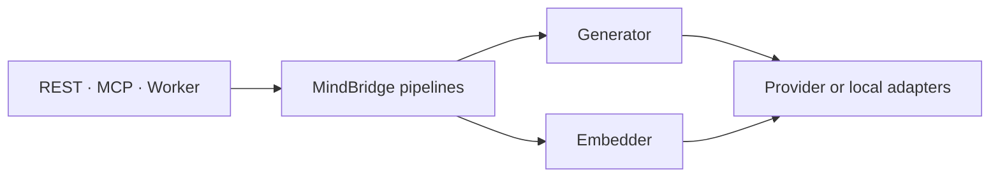

# MindBridge Plugin Architecture

MindBridge exposes two model capabilities: `Generator` and `Embedder`. They are the
only model-level extension points. Provider names, deployment tiers, and product tasks do not create
new capability interfaces.

A capability exists once a real implementation does. The former `Reranker` capability was removed
because it never had one: only a protocol, three configuration fields, and one call branch. Ranking
is currently owned by the application (reciprocal rank fusion plus frozen-model evidence
inspection). Reranking returns as an explicit additive protocol change when a bake-off produces a
model worth serving.

## Boundary



The application owns the meaning of Answer, Occurrence, Perception, Episode, Claim, and Summary.
Those pipelines consume `Generator`; they are never implemented by `OpenAIAnswerer`,
`GeminiPerceiver`, or another provider-specific task class. Retrieval consumes one `Embedder` for
both query and document tasks.

The application owns these ports in `mindbridge.application.capabilities`; the stable plugin-author
surface re-exports them from `mindbridge.models`:

```python
from mindbridge.models import (
    Embedder,
    EmbedRequest,
    EmbedResult,
    Generator,
    GenerateRequest,
    GenerateResult,
)
```

Each capability has one operation. `ModelInput` carries an ordered combination of `TextPart` and
`MediaPart`, so callers provide only the modalities they have. An `Embedding` carries the exact
producing model and compatible search-space references; this keeps asymmetric query/document
encoders aligned without creating multiple Embedder interfaces.

## Discovery

Plugins use standard Python package entry points. MindBridge loads only the selected entry point at
process composition time:

| Capability | Entry-point group | Factory result |
| --- | --- | --- |
| Generation | `mindbridge.generators` | `Generator` |
| Embedding | `mindbridge.embedders` | `Embedder` |

A third-party package can expose an adapter without changing MindBridge:

```toml
[project.entry-points."mindbridge.generators"]
anthropic = "mindbridge_anthropic:create_generator"
```

```python
from collections.abc import Mapping

from mindbridge.models import Generator


def create_generator(config: Mapping[str, object]) -> Generator:
    return AnthropicGenerator.connect(config)
```

Factories receive one JSON-compatible mapping, reject unknown keys, validate credentials and model
identity, and return the requested runtime-checkable protocol. Entry-point names are trimmed
lowercase text. Missing, duplicate, or wrong-capability plugins fail during process construction.

An adapter that owns network or model resources may provide `close()`. Composition roots call it on
shutdown and support both synchronous and asynchronous implementations. Provider failures must be
normalized to MindBridge's `ModelUnavailableError`, `ModelRequestError`, or `ModelOutputError` at
the adapter boundary.

## Bundled adapters

MindBridge ships these adapters:

| Plugin | Capability | Purpose |
| --- | --- | --- |
| `openai` | Generator | OpenAI and OpenAI-compatible multimodal generation |
| `openai` | Embedder | Aligned query/document OpenAI-compatible embedding endpoints |
| `jina` | Embedder | Local Hugging Face Jina v5 Omni embedding |

Anthropic, Gemini, and local runtimes belong in provider packages using the
same entry points. Adding one does not add a new MindBridge pipeline or public task API.

## Configuration

There is no Profile abstraction. Each process selects plugins and passes their configuration
directly. The server uses:

```text
MINDBRIDGE_GENERATOR_PLUGIN
MINDBRIDGE_GENERATOR_CONFIG_JSON
MINDBRIDGE_EMBEDDER_PLUGIN
MINDBRIDGE_EMBEDDER_CONFIG_JSON
```

The bundled defaults also accept documented provider-specific environment variables so a normal
deployment does not need inline JSON. A supplied `*_CONFIG_JSON` value is authoritative and does not
require the bundled provider's variables. Worker and consolidation processes follow the same naming
scheme for the capability slots they own.

Benchmark runners require `--deployment-config`. The referenced JSON records every selected server
and Worker plugin, its owning Python distribution and version, plus its non-secret resolved
configuration. The runner reads and validates those bytes before inference starts, then embeds the
frozen snapshot and the SHA-256 of the same bytes in the run manifest. Credential-like keys are
rejected. This makes comparisons reproducible without creating named Profiles or leaking secrets.
Worker Generator, media Embedder, and text Embedder snapshots are provided as one complete set;
raw-media runs reject a missing Worker set.

## Compatibility rules

- Follow Python naming conventions: `PascalCase` types, `snake_case` operations and modules, and
  lowercase entry-point names.
- Do not add provider branches to application code. Provider behavior stays inside its adapter.
- Do not add task-specific model capabilities. A new task first composes the three existing
  capabilities; a new capability is justified only by genuinely different I/O semantics.
- Do not silently fall back to another plugin or model. Benchmark identity and production behavior
  must remain observable.
- Public protocol changes are explicit breaking changes. MindBridge does not retain compatibility
  aliases around a replaced extension contract.
