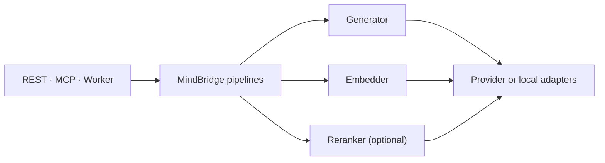

# MindBridge Plugin Architecture

MindBridge exposes three model capabilities: `Generator`, `Embedder`, and `Reranker`. They are the
only model-level extension points. Provider names, deployment tiers, and product tasks do not create
new capability interfaces.

## Boundary



The application owns the meaning of Answer, Occurrence, Perception, Episode, Claim, and Summary.
Those pipelines consume `Generator`; they are never implemented by `OpenAIAnswerer`,
`GeminiPerceiver`, or another provider-specific task class. Retrieval consumes one `Embedder` for
both query and document tasks and may consume one `Reranker`.

The application owns these ports in `mindbridge.application.capabilities`; the stable plugin-author
surface re-exports them from `mindbridge.models`:

```python
from mindbridge.models import (
    Embedder,
    EmbedRequest,
    EmbedResult,
    Generator,
    GenerateRequest,
    GenerateResult,
    Reranker,
    RerankRequest,
    RerankResult,
)
```

Each capability has one operation. `ModelInput` carries an ordered combination of `TextPart` and
`MediaPart`, so callers provide only the modalities they have. An `Embedding` carries the exact
producing model and compatible search-space references; this keeps asymmetric query/document
encoders aligned without creating multiple Embedder interfaces.

`Embedder` additionally declares `space_reference`, the search space every vector it produces
belongs to. Declaring it before the first call is what lets a process that composes more than one
Embedder reject a mismatch during construction instead of writing vectors that silently never
match at recall. A plugin that omits `space_reference` fails the capability check at load time: the
protocol member raises rather than returning a `None` that a subclass would inherit and that would
make the space guards compare equal and pass vacuously.

## Discovery

Plugins use standard Python package entry points. MindBridge loads only the selected entry point at
process composition time:

| Capability | Entry-point group | Factory result |
| --- | --- | --- |
| Generation | `mindbridge.generators` | `Generator` |
| Embedding | `mindbridge.embedders` | `Embedder` |
| Reranking | `mindbridge.rerankers` | `Reranker` |

A third-party package can expose an adapter without changing MindBridge:

```toml
[project.entry-points."mindbridge.generators"]
anthropic = "mindbridge_anthropic:create_generator"
```

```python
from collections.abc import Mapping

from mindbridge.models import Generator


def create_generator(config: Mapping[str, object]) -> Generator:
    return AnthropicGenerator.connect(config)
```

Factories receive one JSON-compatible mapping, reject unknown keys, validate credentials and model
identity, and return the requested runtime-checkable protocol. Entry-point names are trimmed
lowercase text. Missing, duplicate, or wrong-capability plugins fail during process construction.

An adapter that owns network or model resources may provide `close()`. Composition roots call it on
shutdown and support both synchronous and asynchronous implementations. Provider failures must be
normalized to MindBridge's `ModelUnavailableError`, `ModelRequestError`, or `ModelOutputError` at
the adapter boundary.

## Bundled adapters

MindBridge ships these adapters:

| Plugin | Capability | Purpose |
| --- | --- | --- |
| `openai` | Generator | OpenAI and OpenAI-compatible multimodal generation |
| `openai` | Embedder | Aligned query/document OpenAI-compatible embedding endpoints |
| `jina` | Embedder | Local Hugging Face Jina v5 Omni embedding |

Anthropic, Gemini, local runtimes, and experimental rerankers belong in provider packages using the
same entry points. Adding one does not add a new MindBridge pipeline or public task API.

## Configuration

There is no Profile abstraction. Each process selects plugins and passes their configuration
directly. The server uses:

```text
MINDBRIDGE_GENERATOR_PLUGIN
MINDBRIDGE_GENERATOR_CONFIG_JSON
MINDBRIDGE_EMBEDDER_PLUGIN
MINDBRIDGE_EMBEDDER_CONFIG_JSON
MINDBRIDGE_RERANKER_PLUGIN
MINDBRIDGE_RERANKER_CONFIG_JSON
```

The bundled defaults also accept documented provider-specific environment variables so a normal
deployment does not need inline JSON. A supplied `*_CONFIG_JSON` value is authoritative and does not
require the bundled provider's variables. Worker and consolidation processes read the same names for
the same capability slots: the Worker adds only `MINDBRIDGE_MEDIA_EMBEDDER_*` for its local media
encoder, and its text encoder shares the deployment-wide `MINDBRIDGE_EMBEDDER_*` contract rather than
owning a second family of names that could disagree about the search space.

Every bundled fallback is built in one place, `mindbridge.models.defaults`, so a variable is read by
exactly one function no matter how many processes need it. A plugin author adding a bundled default
extends that module instead of copying a builder into each process.

A bundled fallback covers credentials and model identity only. Optional settings stay reachable
through the slot's `*_CONFIG_JSON` object and do not get an environment variable each, so adding a
knob to a plugin schema does not widen the deployment surface. `MINDBRIDGE_MEDIA_EMBEDDER_DEVICE` is
the one deliberate exception: it selects hardware rather than model behaviour, and routing it through
`select_torch_device` turns a missing GPU into a startup failure instead of a silent fall back to CPU.

Both embedding plugins spell the pinned model revision `model_revision` in their configuration
objects. `PluginConfigModel` sets `extra="forbid"`, so a stale key such as `revision` fails the
factory at startup rather than being ignored.

Benchmark runners require `--deployment-config`. The referenced JSON records every selected server
and Worker plugin, its owning Python distribution and version, plus its non-secret resolved
configuration. The runner reads and validates those bytes before inference starts, then embeds the
frozen snapshot and the SHA-256 of the same bytes in the run manifest. Credential-like keys are
rejected. This makes comparisons reproducible without creating named Profiles or leaking secrets.
Worker Generator, media Embedder, and text Embedder snapshots are provided as one complete set;
raw-media runs reject a missing Worker set.

## Compatibility rules

- Follow Python naming conventions: `PascalCase` types, `snake_case` operations and modules, and
  lowercase entry-point names.
- Do not add provider branches to application code. Provider behavior stays inside its adapter.
- Do not add task-specific model capabilities. A new task first composes the three existing
  capabilities; a new capability is justified only by genuinely different I/O semantics.
- Do not silently fall back to another plugin or model. Benchmark identity and production behavior
  must remain observable.
- A process that composes more than one Embedder must resolve them into one embedding space. The
  Worker rejects a media/text space mismatch while constructing the processing use case.
- Replacing an Embedder with one in a different space is a data migration, not a configuration
  change. The server probes every configured tenant at startup and refuses to serve when a tenant
  holds vectors that the selected space cannot reach. The probe is per embedded object type, because
  the Worker owns evidence, event, and claim vectors while the server owns memory records: a
  whole-tenant probe would let the server's own writes vouch for everything the Worker stranded.
  Row-level security scopes the probe per tenant, so a process with no configured tenants — the
  stdio MCP server — cannot perform it.
- Public protocol changes are explicit breaking changes. MindBridge does not retain compatibility
  aliases around a replaced extension contract.
