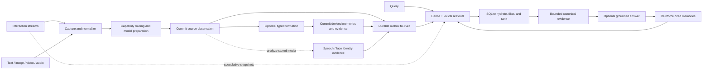

# Product capabilities

MindBridge 0.2 is an embedded, local-first implementation of an **Agentic Native Embodied
Omni-Modal Memory System**. Its reference product is an emotional companion robot; the same memory
contract extends to desktop robots, personal work assistants, chatbots, voice agents, and other
long-lived intelligent products.

Omni-modal means that text, image, video, and audio can be remembered independently or in arbitrary
ordered combinations. MindBridge turns those observations into durable records that an agent can
retrieve, inspect as evidence, and optionally use for grounded answers. Persistent state stays in
one local memory domain; inference may stay local or use explicitly configured remote model
backends.

Memory semantics are native to the agent runtime; physical-world evidence keeps its time, place,
modality, and identity context; model providers and integration surfaces remain replaceable. This
page describes what the current release implements.
For future direction and decision criteria, see [product goals and design
principles](design-principles.md). To run the shortest working path, start with the
[quick start](quickstart.md).

## Positioning and suitable use cases

MindBridge fits applications that need memory to survive beyond one prompt or process session and
need more structure than an unqualified nearest-neighbour lookup. The emotional companion robot is
the reference case because it combines long-lived personal context, continuous multimodal
perception, identity, low latency, privacy, and constrained hardware. Representative uses include:

- Emotional companion and desktop robots that remember events, places, people, preferences, and
  response guidance from mixed sensor observations.
- Personal work assistants, chatbots, and voice agents that need durable recall, explicit deletion,
  and evidence-backed answers across sessions.
- Multimodal agents that must retain original media while using native embeddings, transcripts, or
  visual descriptions for retrieval.
- Agent hosts that need the same memory semantics through Python, REST, MCP, or a machine-readable
  command line.
- Edge or private deployments that want local authoritative state while choosing local and remote
  inference capabilities independently.

MindBridge pursues **stronger**, **faster**, and **leaner** memory than competing stacks: SOTA-level
quality for every supported modality route, lower end-to-end latency, and lower model, memory,
storage, and operational cost. These are measured product targets. A release may claim an advantage
only with a reproducible benchmark that reports quality, latency, resources, model, runtime,
hardware, and dataset identity together.

MindBridge adds the following product properties beyond a raw vector-search component:

| Product choice | Implemented behavior | Why it matters |
| --- | --- | --- |
| Memory semantics | Semantic, episodic, and procedural roles; optional typed entity, event, state, relation, affect, trait, and response-policy records | Applications retrieve memories by cognitive role and can preserve how derived knowledge was formed. |
| Native omni-modality | One ordered content contract for text, image, video, audio, and arbitrary mixed `omni` input | Every modality works alone or in combination, and source media is retained instead of becoming one text surrogate. |
| User-owned input forms | Applications normalize custom capture objects, sensor events, and interaction formats at the boundary | Product-specific input can evolve without widening the memory kernel to unvalidated objects. |
| Evidence before generation | Retrieval returns canonical records; answers return only the retrieved hits the answer backend actually used | The caller can inspect what supported an answer and handle abstention explicitly. |
| Embodied context | Event intervals, valid time, knowledge time, metric pose, symbolic place, speech, faces, and local identities | Recall can be constrained by when and where something was true or observed, and by who appeared. |
| Durable local authority | SQLite and immutable media are authoritative; Zvec is a rebuildable search projection | Index loss or stale index IDs do not redefine the stored truth. |
| One execution plane | SDK, REST, MCP, and CLI adapters dispatch to the same `Memory` kernel | Shared operations keep the same IDs, defaults, result meanings, and failure semantics. |
| Plugin composition | Typed backend protocols declare their supported modalities; routing does not infer capability from provider names | A deployment can change model providers without forking storage or memory semantics. |
| Developer- and agent-friendly APIs | Typed SDK values, OpenAPI, self-described MCP tools, structured CLI results, stable errors, and bounded output | Humans and agents can discover and call the same operations without scraping prose or logs. |

## Capability map

| Area | What ships today | Requirement | Owning documentation |
| --- | --- | --- | --- |
| Capture | `add`, transactional `add_many`, incremental `add_stream`, and async capture reducers | An embedding backend is required; media handling depends on the selected route | [Core concepts](concepts.md#content-becomes-a-record) |
| Formation | Optional source-grounded typed memories with lineage, evidence, validity, visibility, and supersession | A `FormationBackend`; disabled when omitted | [Memory formation](configuration.md#automatic-memory-formation) |
| Storage | SQLite records and FP32 embeddings, SHA-256 media CAS, durable index outbox, and Zvec projection | One writable local `data_dir` | [Architecture](architecture.md#durable-state) |
| Retrieval | Dense and lexical candidates, composite retrieval keys, memory-type filters, event-time overlap, bitemporal and spatial scope, relevance and ambiguity gates | The configured embedder must support a valid route for the query | [Memory types, time, and decay](memory-types-time-and-decay.md) |
| Evidence | Ranked `SearchHit` records, typed source evidence for formed memories, and opt-in bounded retrieval traces | Core; richer typed evidence requires formation | [Python retrieval contract](api/python-sdk.md#memory-operations) |
| Answer | Grounded `ask` with explicit abstention and the canonical hits actually used | A `GenerationBackend` | [Core concepts](concepts.md#retrieval-can-return-no-evidence) |
| Reinforcement | Explicit positive feedback plus automatic reinforcement of evidence cited by `ask`; optional recency decay | Core policy; automatic answer reinforcement is configurable | [Decay and reinforcement](memory-types-time-and-decay.md#decay-and-reinforcement) |
| Omni-modal analysis | Native modality routing, transcription fallback, speech analysis, visual-description hook, and face analysis | Route-specific embedding, speech, vision, or face backends | [Configuration](configuration.md) |
| Identity | Durable voice and face exemplars, local identity resolution, names and relationships, corroborated face/voice linking, unlinking, and person erasure | A `SpeechBackend` and/or `FaceBackend` for observations | [Cross-modal identity binding](api/python-sdk.md#cross-modal-identity-binding) |
| Interaction | Speculative recall over changing observations; final-boundary persistence for generic, audio, and vision streams | `AsyncMemory` and application-supplied capture events | [Omni streaming and interaction memory](omni-streaming-and-interaction-memory.md) |
| Operations | Capability reporting, pagination, deletion, index rebuild and optimization, backup/restore procedures, and OpenTelemetry spans | Exporting telemetry requires an SDK/exporter configured by the host | [Operations](operations.md) |

## End-to-end memory loop



### 1. Capture and normalization

Python accepts text, a regular local `Path`, inline `Blob` bytes, an existing `AssetRef`, or an
ordered sequence of those atoms. REST and MCP normalize their typed content parts into the same
contract but never accept a server path or remote URL. A URL-shaped string is ordinary text;
network fetching remains application policy.

`add` writes one observation. `add_many` prepares one model batch and commits one SQLite
transaction. `add_stream` accepts caller-segmented completed observations and commits each item
before requesting the next, so a later source failure preserves the committed prefix. Record IDs
cover canonical ordered content, media digests, metadata, event time, memory type, and optional
observation context; adding the same logical record again is idempotent.

Use `ObservationContext` when the producer knows evidence basis, source identity, confidence,
world-time validity, metric pose, or symbolic `place_id`. Metadata remains uninterpreted
application JSON and is never an isolation, authorization, or retrieval-filter boundary.

### 2. Capability routing and multimodal preparation

Every backend declares the atomic modalities it accepts. MindBridge builds aggregate and focused
model inputs from the content actually present, then selects a supported route. Mixed content keeps
its supported native media. When a text-only route cannot consume audio, a configured transcription
backend can provide a text fallback without discarding visual evidence. A configured visual
description backend can add searchable text for visual content while the original image or video
remains attached to the record.

Unsupported content fails explicitly when no information-preserving route exists. Omitting an
optional backend makes its capability unavailable and adds no hidden model call. The precise
content and fallback rules live in the [Python SDK content
contract](api/python-sdk.md#content-contract).

### 3. Source storage and optional formation

The raw source commits before formation begins. When a `FormationBackend` is present and declares
support for the source modalities, it may propose `entity`, `event`, `state`, `relation`, `affect`,
`trait`, or `response_policy` records. MindBridge validates the proposal's source binding,
modality, confidence, validity interval, spatial frame, and kind-specific fields. The source record
is never replaced.

Accepted derived records carry their source memory in `evidence_ids`, the model and recipe identity,
and a stable semantic lineage. Derived records, evidence rows, state versions, formation completion
marker, embeddings, and index work commit together. Conflicting state proposals from one source are
rejected. Deleting source evidence retracts unsupported derived facts and replays the remaining
lineage. Formation is opt-in because it adds inference cost and model-derived claims to the write
path.

### 4. Authoritative storage and search projection

One `data_dir` contains:

```text
state.sqlite3       authoritative records, FP32 embeddings, identities, evidence, and outbox
assets/             authoritative immutable media, addressed by SHA-256
zvec/               disposable dense and lexical search projection
.mindbridge.lock    operating-system ownership lock target
```

A durable write commits SQLite before applying Zvec changes. Zvec work is acknowledged only after
the index flush succeeds; startup, add, delete, search, `reindex`, and `optimize` drain pending work.
A missing Zvec collection or an index-recipe change can be rebuilt from stored embeddings without
re-embedding content; an embedding-space change is a separate migration and can require
re-embedding. Search always hydrates candidates from SQLite, so a stale index ID cannot resurrect a
deleted record. See [write and retrieval consistency](architecture.md#write-consistency) for
failure ordering and recovery behavior.

### 5. Retrieval and evidence selection

`search` embeds aggregate and focused query keys and combines dense and lexical candidate routes.
It can filter by `MemoryType`, strict event-time overlap, world time (`valid_at`), knowledge time
(`known_at`), metric radius in one coordinate frame, and symbolic `place_id`. SQLite reapplies the
authoritative filters after candidate generation.

Ranking combines semantic or lexical relevance with optional temporal proximity, observation
confidence, reinforcement, and configured retention decay. The relevance floor controls evidence
admission; an empty result is normal. With `limit=1`, an unresolved top-two ambiguity can also
produce no result. `SearchHit.score` ranks hits within one request and is not a probability.

`search_with_trace`, or `explain=true` on REST and MCP search, returns bounded candidate diagnostics
and terminal rejection reasons. Traces intentionally exclude memory content and metadata; use the
returned hits or `get` to inspect evidence.

### 6. Grounded answers and reinforcement

`ask` runs the same retrieval plane, applies the configured grounding policy, and passes canonical
hits to a generation backend. The returned `AnswerResult` contains only the retrieved hits the
backend cited, not every candidate and never a provider-fabricated record. A backend can abstain
with `no_evidence` or `insufficient_evidence`; callers should treat abstention as a normal outcome.

`reinforce` records explicit positive feedback for existing IDs. By default, a successful `ask`
also reinforces only its cited hits. Reinforcement affects later ranking but does not alter content,
metadata, or timestamps. Recency decay is optional and demotes old records without using age alone
as a reason to hide otherwise relevant evidence. Evaluation runs can disable automatic answer
reinforcement for reproducibility.

### 7. Speech, faces, and identity

`speech` analyzes stored audio and video into timed speaker segments. A speech-capable backend
matches local voice exemplars to stable speaker IDs; speech indexing is enabled by default when
that capability is configured. `faces` analyzes stored images and video into normalized bounding
boxes and local identity IDs. Results are cached under stable model-space recipes.

When one asset contains exactly one eligible voice and one eligible face, MindBridge records
co-occurrence evidence. A face/voice merge requires corroboration across distinct assets (two by
default), preserves the merged-away ID as an alias, and can be reversed with `unlink_identity`.
Reversing a merge restores the alias as an unnamed identity and repaints the indexed transcript
projection in the same commit, so no stored text keeps attributing the words to the other person.
Applications can attach a name and relationship with `register_speaker` or `register_identity` and
resolve either current IDs or aliases with `identity`.

Naming a person records an `ENTITY` assertion bound to that identity, and the recorded name and
relationship are a projection of it. A name is therefore retrievable knowledge and not a label on
a registry row: it needs no formation backend, it is visible at once because the host asserted it,
it is listed by `operations()` and reversed by `rollback()`, and every recompute rewrites the
indexed transcript text in the same commit. The visible consequence is that naming a person adds
a searchable memory record, which appears in `list()` and `search()` results. See
[typed assertions](memory-types-time-and-decay.md#naming-a-person-is-a-typed-assertion).

`forget_identity` removes the person's biometric exemplars, aliases, naming assertions, and
indexed name while retaining the surrounding memories, media, and transcript words. It is intentionally different from
deleting an event. A later encounter can create a new unnamed identity because recognizing a
forgotten person would require retaining the template that erasure destroys.

### 8. Continuous interaction

`AsyncOmniPrefetch` coalesces evolving query snapshots and confirms one final revision. The generic
`AsyncCaptureStream` treats updates as speculative retrieval, a final event as the durable write,
and cancellation or incomplete end-of-stream as discard. `AsyncAudioStream` reduces PCM, VAD, ASR
partials, and acoustic boundaries; `AsyncVisionStream` reduces encoded frames, descriptions, and
scene boundaries while retaining only the final scene's latest keyframe.

Speculative snapshots are never persisted. A final observation commits through the ordinary
`Memory.add` path, and retrieval failure after that commit is reported separately without losing the
observation. Capture, segmentation, sensor control, and turn policy remain application concerns;
the complete event contracts are in [omni streaming and interaction
memory](omni-streaming-and-interaction-memory.md).

## Python, REST, MCP, and CLI surfaces

The table is a navigation map, not a signature reference. Follow the [Python
SDK](api/python-sdk.md), [REST](api/rest.md), [MCP](api/mcp.md), and [CLI](api/cli.md) references for
arguments, schemas, limits, and errors.

| Capability | Python `Memory` | REST | MCP | `mindbridge` CLI |
| --- | --- | --- | --- | --- |
| Add one | `add` | `POST /v1/memories` | `add_memory` | `add` |
| Add atomic batch | `add_many` | `POST /v1/memories/batch` | — | `add-many` |
| Add completed stream | `add_stream` | — | — | `add-stream` |
| Search | `search` | `POST /v1/memories/search` | `search_memories` | `search` |
| Explain search | `search_with_trace` | Search with `explain=true` | Search with `explain=true` | `search-with-trace` |
| Answer | `ask` | `POST /v1/answers` | `ask_memory` | `ask` |
| Get by ID | `get` | `GET /v1/memories/{memory_id}` | `get_memory` | `get` |
| List newest | `list` | `GET /v1/memories` | `list_memories` | `list` |
| Delete memory | `delete` | `DELETE /v1/memories/{memory_id}` | `delete_memory` | `delete` |
| Reinforce | `reinforce` | `POST /v1/memories/reinforce` | `reinforce_memories` | `reinforce` |
| Analyze speech | `speech` | — | `analyze_speech` | `speech` |
| Analyze faces | `faces` | — | `analyze_faces` | `faces` |
| Name speaker | `register_speaker` | — | `register_speaker` | `register-speaker` |
| Name identity | `register_identity` | — | `register_identity` | `register-identity` |
| Read identity | `identity` | — | `get_identity` | `identity` |
| Reverse merge | `unlink_identity` | — | `unlink_identity` | `unlink-identity` |
| Erase person | `forget_identity` | — | `forget_identity` | `forget-identity` |
| Rebuild index | `reindex` | — | — | `reindex` |
| Optimize index | `optimize` | — | — | `optimize` |
| Declare capabilities | `capabilities` property | `GET /healthz` | — | `--explain` resolves composition |
| Validate loaders | — | — | — | `doctor` |

The synchronous SDK therefore exposes 19 product operations, plus construction, capability
inspection, and lifecycle. REST exposes eight `/v1` product routes plus `/healthz`; MCP exposes
fourteen tools; the product CLI exposes all 19 operations plus `doctor`. `AsyncMemory` mirrors the
finite SDK operations except `forget_identity`, which currently requires synchronous `Memory`, and
adds async stream consumption.

## Deployment and isolation model

MindBridge supports three practical topologies, all with one owner for one physical data directory:

| Topology | Use | Boundary |
| --- | --- | --- |
| Embedded Python | One application process owns memory directly | Keep one long-lived `Memory` or `AsyncMemory` and close it on shutdown. |
| REST owner | Other processes need HTTP access | Construct one caller-owned `Memory`, run one ASGI worker, and add network security outside MindBridge. |
| MCP owner | An agent host needs typed tools | Prefer stdio; secure SSE or streamable HTTP as a network service. |

The operating-system lock is non-blocking: a second live owner of the same directory fails
immediately, while different directories operate concurrently. A `Memory` created before `fork()`
cannot be reused in the child. Network filesystems, shared-volume multi-writer access, and several
independent REST/MCP/Python processes over one directory are unsupported.

Physical directories are the isolation boundary. Allocate a different directory for every
application, tenant, worker, benchmark case, or security domain that must not share records.
Metadata is not a tenant selector. Filesystem permissions, encryption, authentication,
authorization, TLS, quotas, rate limits, retention, and audit policy belong to the host deployment.

Back up SQLite and `assets/` together; Zvec may be rebuilt. The detailed topology, hardening, and
lifecycle guidance is in [deployment](deployment.md), with backup and repair procedures in
[operations](operations.md).

## Generality and extensibility

MindBridge keeps a stable memory kernel and varies computation at typed capability boundaries:
`EmbeddingBackend`, `GenerationBackend`, `StreamingGenerationBackend`, `TranscriptionBackend`,
`SpeechBackend`, `VisionDescriptionBackend`, `FaceBackend`, and `FormationBackend`. Routing reads
declared modalities and stable model-space identities, while the kernel retains control of
validation, record identity, durability, evidence, final hydration, and lifecycle.

Applications can compose those objects directly, group them in `MemoryPlugins`, or use
`Memory.from_config` for the bundled provider catalog. Current bundled adapters cover Jina Omni and
Sentence Transformers embedding, OpenAI-compatible embedding/generation/transcription/formation,
FunASR speech, and OpenCV face analysis. Exact extras, provider fields, model revisions, and license
constraints are maintained in [configuration](configuration.md).

This boundary generalizes in three directions without changing the memory API:

- A sensor or application object is normalized into `ContentInput`, `StreamInput`, or an async
  capture packet outside the kernel.
- A local, edge, or remote inference implementation can satisfy the same narrow backend protocol
  and declare only the modalities it actually supports.
- A new transport can call the same `Memory` operations and preserve their IDs, results, defaults,
  and errors rather than reimplementing memory policy.

Composition is fixed for one `Memory` lifetime. There is no global registry, package discovery, or
live backend swap. SQLite, the media CAS, and Zvec are internal components, not public storage
plugins. See [plugin architecture](plugin-architecture.md) for the admission rule for a new
capability.

## Limits and non-goals

- MindBridge is an embedded runtime, not a hosted memory service, distributed database, or
  multi-writer synchronization layer.
- It does not provide tenants, accounts, authorization, authentication, TLS, rate limiting, quotas,
  or an audit service. A `data_dir`, not metadata, is the isolation unit.
- It does not fetch remote media. REST and MCP also do not accept host filesystem paths; the
  application must enforce its own network and download policy before creating a `Blob`.
- Multimodal coverage is the intersection of input and configured backend capabilities. Unsupported
  routes fail; installing an extra does not by itself configure a model.
- `VisionDescriptionBackend` is public and reachable by object injection, but no bundled vision
  description implementation currently ships.
- Formation is optional model inference, not guaranteed truth. Its records retain basis,
  confidence, source evidence, model, and recipe so callers can apply their own trust policy.
- Search can return no evidence. Scores are request-local ranking values, not calibrated
  probabilities, and retrieval quality depends on the chosen embedding and generation recipes.
- Voice and face matching are local, model-dependent similarity decisions, not biometric
  authentication. Cross-modal linking is corroborated and reversible but cannot be made infallible.
- `delete` and `forget_identity` update live authoritative state; they are not secure erasure from
  SQLite free pages, WAL files, filesystem snapshots, or backups. See the
  [security model](../SECURITY.md#storage-deletion-and-backups).
- Typed lineage and evidence are a SQLite projection, not a graph database, relationship query
  language, or traversal service.
- Procedural and response-policy memories are evidence for an agent. MindBridge never executes them
  as code or robot actions.
- MindBridge is not an agent framework, planner, skill runner, sensor stack, robot controller,
  foundation model, model trainer, GPU scheduler, or automatic edge/cloud router.
- `AsyncMemory` is a thread-delegating facade over the same synchronous consistency core; it does
  not make synchronous provider SDKs natively asynchronous.

These boundaries keep the product focused on the part it owns: turning heterogeneous observations
into durable, retrievable, evidence-bearing memory with consistent semantics across agent and
developer interfaces.
