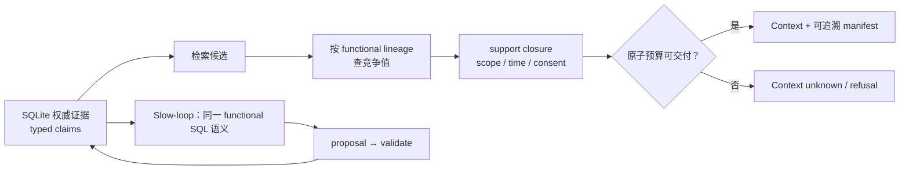

# MindBridge Memory Backend 增量研究：证据闭包、竞争事实与情感来源

## 研究边界与证据口径

本报告承接 MindBridge 2026-09-07 至 2026-09-09 的代码审计、竞品研究和因果实验，不重复把已经实现的能力写成待建路线。当前基线已经包括：typed raw `Observation → FormationProposal → ENTITY/EVENT/STATE/RELATION/AFFECT/TRAIT/RESPONSE_POLICY`；双时态、identity/scope 资格约束；`(A AND B) OR C` 的持久化 provenance；预算内原子 evidence closure；同 lineage 的候选内冲突处理；SQLite 权威存储与可重建索引。

本文把陈述分为四类：

- **已验证的 MindBridge 能力**：当前源码与本地门禁/实验支持。
- **外部公开事实**：论文、官方仓库或官方数据卡明确记载，使用 `[Sx]` 引用。
- **设计推论**：从现有证据推出的工程判断，不声称是论文结论。
- **待证伪假说**：需要冻结实现、对照和 holdout 才能成立。

所有外部性能数字都视为作者报告，除非另有独立复现。报告不宣布 SOTA。检索范围截至 2026-09-09；重点深读 Mem0、MemGPT/Letta、Graphiti/Zep、Hindsight、A-MEM、MemOS、MemIR、VoiceMem、A-MBER、MemEmo、LifeSide 和 Ella 的原始材料，并核对优先 benchmark 的官方论文、仓库或数据卡。

## 增量结论

**设计推论 1：长期记忆的目标函数应是最小化未来决策损失，而不是最大化召回。** 召回率高只说明证据可能进入候选；错误主体、错误有效时间、缺失反证或来源角色坍缩，都会让“更高召回”变成更强的错误确信。MindBridge 的 identity、time、provenance 应继续作为可交付资格条件，而不是排序加分项。

**设计推论 2：修改前最窄而有价值的缺口是竞争事实的 indexed completion，本轮已实现其结构修复。** baseline commit `e763d6f` 的编译器只会在有限 ranked window 内发现功能性 lineage 的冲突。一个高排名 `STATE` 或用户自述 `TRAIT` 进入窗口后，其同 lineage、同 scope、同查询时态的竞争值可能在窗外；把 top-K 缺失解释成“不存在竞争事实”会静默输出单侧。本轮候选在 anchor 确定后通过权威索引查竞争值，再将竞争项及其各自 support closure 原子打包；预算不足或资格不全时拒绝该组。它不需要额外模型调用。尚未解决的是 formation cardinality、actor reference，以及广泛 benchmark 上的答案收益和成本边界。

外部先例形成了明确边界：Graphiti/Zep 与 Mem0 在**写入时**比较近邻事实并失效旧关系；Hindsight 在候选内对 opinion 做 `reinforce/weaken/contradict`；MemIR 对已关联 claim 做 provenance closure；多源 RAG 文献会显式检索 counterevidence。审阅的公开论文/官方代码中，尚未发现“以已选 functional-lineage anchor 为钥匙，在读时从 top-K 外补齐同 identity/scope/时态竞争事实，并把双方 provenance closure 在硬预算下原子交付或拒绝”的同构机制。这里能主张的只是 **MindBridge 的具体设计组合与待验证假说**，不能主张一般意义上的首次提出冲突感知检索。[S2][S3][S6][S8][S20]

**设计推论 3：情感显著性可以影响注意、保留和检索，但不能提高事实真值。** “用户说自己难过”“语音/表情模型估计为难过”“代理按难过作答”“多次事件支持一个长期倾向”是四种不同来源角色。情感强度可提升事件保留优先级或触发局部上下文扩展，但不能让一个模型推断覆盖用户自述，不能把一次状态固化为人格，也不能作为 identity 证据。

**设计推论 4：快路径与慢路径应有不同写入权力。** 快路径记录可撤回、带原始媒体指针的观察；慢路径只生成带支持义务的 AFFECT/TRAIT/RESPONSE_POLICY 等派生判断。VoiceMem 的短期 attribution 与 session 后长期 consolidation、Ella 的时空 episode 与 name-centric semantic memory、A-MBER 的当前状态推断与历史证据，均支持这种时间尺度分离；但审阅的公开材料未阐明它们是否提供 MindBridge 已有的完整事务撤回和 OR-of-AND provenance 合约。[S9][S11][S12]

**证据边界：现有结构正确性尚未转化为答案收益。** MindBridge 的[冻结 LoCoMo 实验](2026-09-08-memory-backend-evaluation.md#locomo-results)把 conv-26 的声明证据闭包从 2/138 提升到 138/138，但同一 judge 的答案仍为 97/138；[fresh-writer 验证](2026-09-08-memory-backend-evaluation.md#fresh-writer-validation)中 schema-17 的 conv-30 只从 52/72 到 54/72，样本仅一个对话；[因果前缀实验](2026-09-08-memory-backend-evaluation.md#fresh-formed-causal-prefix-pair)中 compact prompt 节省 12.0% tokens，但质量方向分裂。新机制必须同时报告结构指标和任务指标，不能用 closure coverage 代理答案质量。

**本轮实现验证快照。** 固定的 8 项公共 SDK 变形测试在 baseline commit `e763d6f` 上为 5/8，通过当前候选为 8/8；三个修复点分别是窗外竞争值漏检、distinct-value 资源义务和不安全 support 经派生闭包回流。该 suite 使用 deterministic formation/embedding doubles，只验证 compiler 结构因果，不证明模型质量或 SOTA。本机生成、gitignored 的证据清单位于 `.benchmarks/results/20260909-companion-evidence-obligations/manifest.md`；它是可复查运行产物，不是公开文档链接。

真实 LongMemEval-S 单题 `e47becba` 的 formation-null smoke 用 27.21 秒完成，compile 为 158.8 ms、15,981 chars、19 items；运行报告 191,003 tokens，其中 embedding 185,969、generation 4,906、judge 128。它完全绕过 typed formation，因此不测本轮 functional conflict、provenance closure 或 P0 compiler 义务。非官方 proxy 的 1/1 因无 blind control 被归档为 **uninterpretable**，只能作为一次运行/成本观测。相同 closed raw store 的 baseline/candidate context bundle 均为 15,892 bytes 且 SHA-256 相同，只证明该 raw-only 样本没有读阶段变化；不能据此推断下述 typed store 的行为。

formation-enabled 同一单题最终写入 550 个 raw `OBSERVATION` 和 671 个 derived records：`EVENT=506`、`STATE=85`、`AFFECT=61`、`ENTITY=11`、`RELATION=8`。产品侧共 167 次模型请求、465,508 tokens：formation 55 次/259,318 tokens（185,789 input + 73,529 output），embedding 111 次/200,815 tokens，answer generation 1 次/5,375 tokens；judge 在产品计数外为 1 次/128 tokens。整次运行 wall time 1,188.154 秒，其中 ingest active 1,185.056 秒，formation batch latency p50 为 20,959.5 ms；固定问题 compile 200.265 ms，交付 24 items/14,988 accounted chars，reader latency 1,305.44 ms。这里的 `memory_type=semantic` 计数 104 只等于 `STATE+ENTITY+RELATION`，不能误写成 typed derived 总量；proxy 仍为 n=1、无 blind、`controls_complete=false`，所以没有可解释 QA 分数。

固定 degree 问题与 posthoc podcast 问题的 baseline/candidate bundle 均 byte-identical：前者各 24 hits、14,953 accounted chars、15,218 rendered bytes，后者各 24 hits、14,845 chars、15,507 bytes；podcast 问题两边都显示相同的三值 `STATE` conflict。paired replay 没有单独打点 compile latency，整个 baseline/candidate 进程的 1.887/1.937 秒包含配置、两次远端 query embedding、编译与关闭，不能做性能归因。因此本 patch 在这两个真实样本上没有增量触发，既未显示回归，也未证明任务收益。本机原始产物分别在 `.benchmarks/results/20260909-companion-evidence-obligations/` 和 `.benchmarks/results/longmemeval-e47becba-formation-compile-20260909/`；这些目录不进入 Git。

**重大未解决风险：`MemoryKind` 不能单独充当 predicate cardinality。** formation-enabled LongMemEval 的最终语义审计观察到五个 `STATE` lineage 含多个 distinct value：收听多个 podcast、对多个主题感兴趣、同时考虑 own business 与瑜伽垫、偏好多个项目、觉得多个事项困难。这是 cardinality 一致性诊断而非人工真值标注；五组 basis 均为 `MODEL_INFERENCE`，本机原始记录位于 `.benchmarks/results/20260909-companion-evidence-obligations/typed-lineage-audit.json`。当前 kernel 的 `STATE` 功能性契约本身一致，但真实 formation 未稳定满足这个契约，compiler 因而可能把上游 cardinality 错分放大为冲突或拒绝。不能通过为本题谓词加白名单、关闭冲突或调整 judge 来刷掉这个问题。

下一阶段需要显式、可验证的 predicate cardinality/role 合约：formation proposal 必须声明为何该 `(subject, predicate, scope, time)` 只有一个 standing value，validator 结合 schema 和来源角色检查后才允许进入 functional lineage；无法证明时保留为累积 claim 或拒绝派生。该机制尚未实现，也没有独立语料证据；需冻结 schema 后用跨域 holdout 测 false-functional、missed-conflict、unsupported-certainty 与 answerable coverage。

## 系统设计哲学与可迁移边界

| 系统 | memory 的基本单位与哲学 | 冲突、证据与身份 | 主要价值 | 对当前 MindBridge 的剩余缺口/限制 |
| --- | --- | --- | --- | --- |
| MemGPT / Letta | 把上下文窗口当主存、外部 recall/archive 当虚拟内存；模型通过工具和中断自己分页。[S1] | 论文核心是控制流和 tier movement，不是 claim-level provenance；当前 Letta 有有界 memory blocks 和持久消息。 | Agent 可决定何时读写，适合 Agentic slow memory。 | 模型自主管理会增加调用并可能错误改写 core memory；不能替代 evidence kernel。 |
| Mem0 / Mem0g | 从对话抽取原子事实；对相似旧记忆执行 ADD/UPDATE/DELETE/NOOP；图版存实体关系。[S2] | 图版用 LLM 检测冲突并标记旧关系失效；论文答题提示又以“最新记忆优先”。 | 写入压缩简单，生产接口清晰。 | 冲突比较受语义近邻召回限制；“最新到达”不等于更高权威；当前 OSS 与论文 graph/managed 路径不可混同。 |
| Graphiti / Zep | episode 是输入证据，entity/fact graph 是演化投影；双时态区分事实有效时间与系统获知时间。[S3] | edge 与 source episode 双向索引；新 edge 与语义相关旧 edge 比较，时间重叠冲突会使旧 edge 失效。 | 时态世界状态与来源回查最成熟的公开先例之一。 | 主要在写入阶段发现冲突；默认倾向新信息；生产 Zep 含专有组件，不能用托管成绩证明 OSS。 |
| A-MEM | Zettelkasten：每条 memory 是含 context、keywords、tags、links 的 note；新记忆可让旧 note 演化。[S5] | 关联和演化由 LLM 决定；审阅的公开实现未阐明完整 source lineage、双时态或事务回滚。 | 记忆组织可随经验成长，而非固定 schema。 | LLM 重写旧 note 容易产生语义漂移；写入成本随邻居分析增长；对当前 evidence kernel 主要是反例和可选离线投影。 |
| Hindsight | 四个逻辑网络分开 world facts、agent experience、entity observations/summaries、opinions；`retain/recall/reflect`。[S6] | opinion 有 confidence，按新事实被强化、削弱或反驳；recall 组合 dense、BM25、graph、temporal 并接受 token budget。 | 明确区分证据与主观看法，保留可演化 belief。 | profile 参数（skepticism/literalism/empathy）是生成控制，不是观测到的人格真值；confidence 由模型更新，不是证据校准；审阅的公开结构未阐明 OR-of-AND 支持语义。 |
| MemOS | 把 parametric、activation、plaintext memory 统一为可调度资源；MemCube 携带 payload 和 governance metadata。[S7] | 论文描述 provenance ID、caller identity、scope、权限、生命周期和迁移。 | 把 memory 生命周期、迁移、共享、调度提升为系统资源。 | 范围很大，丰富路径依赖模型与外部服务；论文的完整架构、当前 OSS cheap path、云服务评测不能视为同一实现。 |
| MemIR | 把 raw evidence、retrieval cue、truth-bearing claim 分成 typed atoms；稀疏/稠密命中投影为 claim-centered bundle，并做 provenance closure。[S8] | 只有 supported claim 可作为事实；读取端把完整 claim association set 带入 bundle。 | 是 evidence/claim bundle、typed provenance、closure 的直接近邻先例。 | 它闭合的是已有 claim-support 关联；公开描述未显示按功能性 lineage 从候选窗外查竞争值。选择器和 reranker含额外模型成本。 |
| VoiceMem | informational left brain 与 affect/persona right brain；schema-entity densification；短期 attribution 与 session 后长期归纳；流式预处理。[S9] | persona 分为 intrinsic nodes 与 entity-bound affect nodes；支持项指向 backend memories；speaker/voiceprint 参与路由。 | 直接覆盖流式语音、身份、情感、persona 的组合问题。 | 其 persona/情感分数大多来自合成或通用 persona benchmark；“134 ms”是特定并行部署作者值；论文未阐明 consent、误绑定、擦除、事务 rollback 的完整契约。 |
| Ella | name-centric semantic graph + spatiotemporal episodic memory，事件绑定时间、地点、观察内容和重要性。[S12] | 依靠角色名和视觉观察积累社会知识；检索综合 location、time、relevance、importance。 | 说明具身世界中 episodic 与 semantic 需要共存，地点是检索约束。 | 3D 模拟环境、15 个 agent、同步且假设充足算力；name-centric 不等于可校准身份；无法直接证明真实传感器连续性。 |
| TiMem | Temporal Memory Tree 从细粒度片段逐级 consolidation 到稳定 persona；查询复杂度决定回忆层级。[S13] | 强项是 temporal hierarchy；审阅的公开摘要未阐明 claim-level evidence obligation。 | 提示 Context Compiler 应按问题复杂度选择粒度，不应固定 top-k。 | 层级摘要可能丢失反证和主体边界；作者成绩依赖具体 reader/judge；与硬证据闭包不是同一保证。 |

## 竞争事实的窗外补全：先例、增量和形式化边界

图中的“同一语义”限于本轮复用的 SQL eligibility 与对齐的行为契约，不表示所有 Python predicate 已合并；图也不把尚未实现的 identity-aware affect 绑定画成现有能力。

### 已有先例

1. **写入时局部冲突检测。** Graphiti 把新 edge 与语义相关已有 edge 比较；若冲突且有效区间重叠，则设置旧 edge 的 `invalid_at`，并在 transaction timeline 上优先新信息。[S3] Mem0g 也通过 LLM resolver 使冲突关系 obsolete，而不是物理删除。[S2]
2. **候选或关联集内的证据闭合。** MemIR 从 sparse/dense evidence hit 投影到 claim，并将该 claim 的完整 association set 组成 provenance closure；这直接证明“命中一片证据后补齐它所属 claim 的关联证据”已有先例。[S8]
3. **主观 belief 的反证更新。** Hindsight 用 entity overlap 和 embedding similarity 找 candidate opinions，再将新事实分类为 reinforce/weaken/contradict/neutral；强反证可改 confidence 或文本。[S6]
4. **反证检索的 RAG 先例。** CounterRefine 等近期工作在生成候选答案后显式检索 counterevidence，说明“主动寻找可能推翻当前解释的材料”不是新概念；但它是开放域问答中的模型驱动二次检索，并非嵌入式 memory lineage lookup。[S20]

### MindBridge 新实现的准确表述

**已实现基础：** ranked-window 内，功能性 `STATE` 与用户自述 `TRAIT` 的同 lineage 冲突会一起打包或一起拒绝；双方各自的 evidence closure 按相同 identity、scope、valid/known time、consent 资格检查。

**已实现、待端到端验收：** anchor 进入后，使用权威 SQLite 的 functional-lineage 索引查询相同 lineage、identity/scope 和查询时态下的其它有效代表，不受原始 top-K 限制。对每个竞争代表分别求 durable OR-of-AND support closure，构成一个竞争组；组内任何必需记录不合格、缺失或超预算时，编译器不得静默输出其中一侧。这里的完成状态只指源码和定向回归，held-out QA、风险—覆盖曲线及完整质量门仍待统一验收。

可用集合表示：初始候选为 `C_K(q)`；已选 anchor 为 `a`；资格谓词为 `Eligible(x, scope, valid_at, known_at)`；功能性 lineage 查询为 `R(a)`。新增 closure 是：

`Comp(a) = ⋃_{x ∈ R(a), Eligible(x, ...)} ({x} ∪ Support*(x))`。

这里的 `R(a)` 是本次查询 scope/时态下为不同 value 选择的代表，不列举所有同值记录。当前 completion 只从 ranked functional anchors 启动，也不会递归地把 support 中碰到的新 lineage 当作下一轮 anchor；因此该公式不是全图冲突穷举。

Context Compiler 接受 `a` 的必要条件不再只是 `a ∈ C_K(q)` 且 `Support*(a)` 可装入，而是整个 `Comp(a)` 可原子交付；否则返回明确 conflict/budget/eligibility refusal。这里的“complete”只相对索引定义、查询时点和 scope 完整，不代表全世界反证已经穷尽。

### 它新增的价值

- 修复 ranking truncation 与 epistemic completeness 的混淆：一个竞争事实 rank 低，不等于它不存在。
- 把冲突发现从开放式语义搜索缩成 lineage-indexed SQLite read，无 query-time LLM。实际查询工作取决于该 lineage 的索引命中行及其后的 scope hydration，并非只受最终活跃代表数控制；distinct-value cap 限制交付义务，却不限制为确定这些值而扫描的行，因此还必须测 rows scanned/returned 与编译延迟。
- 让拒绝可解释：预算不够、来源不可见、支持缺失、时间范围不确定分别暴露，不让模型猜。
- 保留历史而不强制“最新写入获胜”，允许 source authority、用户更正、transaction time 与 valid time 分开裁决。

### 它仍不保证什么

- lineage key 生成错误会造成漏补或误补；predicate alias/实体消歧仍是上游语义问题。
- 两个值不同不一定矛盾：多值 RELATION、模型推断 TRAIT、不同时间段 STATE 不应被强制互斥。
- provenance closure 证明声明的依赖关系完整，不证明来源真实、独立或蕴含 claim。
- refusal 增多可能降低覆盖率；若只以“拒答更安全”计分会构成 reward hacking。

### Agentic Slow Memory 必须与编译器共享同一竞争语义

**当前审计发现：** `store.py` 的 `_CONFLICT_SEMANTIC_KINDS` 与 `context.py` 的 `_functional` 判定不一致。若 slow loop 在写入、巩固或修正阶段把更宽的 semantic kind 当成互斥事实，而编译器只把功能性 lineage 当冲突，两条路径会对同一记忆产生不同世界观。

应统一的语义边界是：

- `STATE` 是功能性：在相同 subject/predicate、identity/scope 与重叠有效时间内，通常只能有一个 standing value，因此进入 contradiction candidate。
- 用户自述 `TRAIT` 保持现有功能性契约：同一 lineage 的竞争值进入 contradiction candidate，但不能改变当前对用户明确陈述的权威与修正语义。
- `RELATION` 默认是累积型：例如一个人可以同时“与 A 合作”和“与 B 合作”，不同 object 不构成冲突。只有 schema 显式声明 functional relation 时才可互斥；本轮不扩大契约。
- 模型推断 `TRAIT` 默认是证据累积和置信演化：不同描述可能是互补、情境化或不同粒度，不能因 value 不同就自动 supersede。需要另行的语义归并或反证判断，但不得借用用户自述 trait 的硬冲突路径。

**设计推论与当前实现边界：** functional predicate、lineage key 生成和 SQL eligibility 应保持同一内部语义。当前改动让 slow-loop 的候选发现和成员 hydration 复用 `_FUNCTIONAL_CLAIM_SQL/PARAMETERS`，compiler 的 competition completion 也复用这组 SQL 常量；`context.py`、`memory.py` 中的 Python predicate 仍分别存在，但行为保持一致。这里不能声称三条路径已完全代码复用。语义一致可避免 slow memory 无谓触发 `correct/supersede`，破坏合法多值 relation 或把推断人格过早定型；它是内部一致性修复，不改变公共类型或用户自述 trait 的现有契约。

**与文献的关系：** Graphiti/Mem0 的 LLM 冲突 resolver 依赖语义近邻，Hindsight 的 opinion update 允许 reinforce/weaken/contradict，说明并非所有不同值都应互斥。[S2][S3][S6] 关系数据库中的 functional dependency 与时态知识图的 overlap constraint 是更早的概念先例。MindBridge 的可测增量是让 deterministic store/slow-loop/compiler 共用同一功能性判定；不能称为新冲突理论。

**定向实现与验收结果：**

| 验收项 | 预期 | 当前结果 |
| --- | --- | --- |
| 多值 `RELATION` | 不进入硬 contradiction，不触发自动修正 | public `Memory.consolidate` 回归构造同 lineage 多值关系，`CONTRADICTION` 工作数为 0；通过。 |
| 模型推断 `TRAIT` | 可积累；不复用用户自述 trait 的互斥路径 | 同一回归构造含独立证据的多值推断 trait，`CONTRADICTION` 工作数为 0；通过。 |
| 用户自述 `TRAIT` | 维持现有同 lineage 竞争与修正契约 | public formation/add-many 回归保留一个两成员 contradiction；通过。 |
| `STATE` | 只把不同值且有效期重叠的成员视为 contradiction | public formation/add-many 回归覆盖重叠正例、相邻半开区间负例，以及同 lineage 中孤立时间段不被夹带；通过。 |
| 回归门禁 | 相关 unit/contract tests 与完整质量门通过 | 6 个相关定向测试通过；整文件与全局门禁状态见最终验证，不在此扩大结论。 |

独立 before/after 使用同一份四项公共入口测试：detached baseline `e763d6f` 为 1/4，通过当前候选为 4/4。baseline 会为累积 relation/inferred trait 和相邻不重叠 state 产生错误 contradiction，并把真实重叠 pair 之外的第三个孤立时段夹带进候选；它仍通过真实 functional conflict 正例。本机原始日志和固定命令位于 `.benchmarks/results/20260909-companion-evidence-obligations/slow-loop/`；`baseline.log`/`candidate.log` 的 SHA-256 分别为 `33a6d6b7…a1792`、`ac273016…52f1`。

这些回归只证明“合法累积或分期 lineage 不产生不必要 contradiction 工作，同时真实功能性冲突仍产生工作”。它们没有测 slow-loop 的实际模型调用、输入 token 或完整生命周期成本，因此尚不能证明总 token 节省。SQL 使用同 lineage 的相关 `EXISTS` 和索引局部性，消除了应用层显式 pair 物化和二次枚举；无匹配的长 lineage 仍可能触发多次相关扫描，worst-case 不能表述为线性或恒定成本。

现有 control-plane synthetic benchmark 也修正了 fixture 协议：旧场景用累积 `RELATION` 人造冲突，已不符合当前契约；新场景用 deterministic former 在同一 `add_many` 事务形成内容明确为“唯一座位偏好”的 `USER_STATEMENT TRAIT` 两侧。confirmed、wrong-side 和评分阈值未降低，但 fixture 协议已经变化，因此不能把修正前后的总 confirmed rate 当同协议历史对照或产品收益。`_claim` 还通过 SDK search 找预先已知的 ground truth ID；若比较 control-plane runtime，必须计入该读成本并冻结 fixture 版本。本轮“更省”的直接证据仍只限于上述四项 A/B 中移除了 false candidates。

## 情感状态、人格与来源角色

### 公开研究的共同发现

MemEmo/HLME 将任务拆为 emotion information extraction、emotion memory update 和 emotion QA，并单独测 evidence grounding；它区分 basic profile、dynamic state、preferences 和 plan，但其数据由 persona/event/emotion pipeline 合成，情绪真值主要是数据生成标注，不是传感器校准。[S10]

A-MBER 的目标更窄：在 anchor turn 解释**当前 affect**，必须找历史证据并给 grounded justification；它包含 modality degradation 和 insufficient-evidence 条件。这能验证“历史是否帮助当前情感判断”，不能验证 agent 的共情话术是否好，也不能验证长期人格是否真实。[S11]

LifeSide 明确保持 latent thoughts 与 observable expressions 的差距，并把 memory、emotion、environment 置于跨 session 循环；它还测 privacy boundary 和 inappropriate personalization。其 2,000 personas 与 111K tasks 来自多代理模拟，因此适合系统压力测试，不足以证明真实人的情绪或人格测量效度。[S14]

VoiceMem 的最有价值机制是把 intrinsic persona node 与 entity-bound affect node 分开：一次对某人/事件的情绪反应不应直接成为人格；短期 attribution 保存情境对象和原因，长期 attribution 只从重复证据归纳稳定倾向。[S9] 但论文把 affect estimator 输出 `(x_t, e_t)` 作为短期更新证据；审阅的公开描述未进一步区分 `e_t` 是用户自述、声学观察还是模型推断。这正是 MindBridge typed basis 可以更严格的地方。

### 建议保持的来源角色矩阵

下表的 role 是概念分类与字段映射建议，不全是当前 SDK 的 `EvidenceBasis` 枚举值。当前枚举可直接表达 `USER_STATEMENT`、`OBSERVATION`、`MODEL_INFERENCE` 与 `RESPONSE_FEEDBACK`；`AGENT_ACTION/OUTCOME` 是待设计字段或由操作结果映射的概念角色，读者不应将它理解为现有 enum member。

| 记录 | 例子 | epistemic role | 可影响 | 不可自动影响 |
| --- | --- | --- | --- | --- |
| 用户自述 | “我现在很焦虑” | `USER_STATEMENT`，主体与 asserter 显式 | 当前情感候选、响应方式、后续核对 | 不能证明医学状态或稳定人格 |
| 外部观察 | 声音颤抖、皱眉、沉默、姿态 | `OBSERVATION`，带传感器/模型版本、分布和质量 | 触发注意、保留、局部检索、AFFECT proposal | 不能覆盖用户自述，不能作为 identity 单独证明 |
| 模型推断 | “可能因面试而焦虑” | `MODEL_INFERENCE`，必须有 support clause | 情境化 AFFECT、待验证因果假说 | 不能升级为 raw evidence 或 durable trait truth |
| 稳定 trait | “在不确定任务中倾向先寻求确认” | 多事件、跨时间支持的 `TRAIT` | 个性化规划和 response policy | 不能由一次高强度 affect 或一次失败反应生成 |
| 代理行为 | 代理采用安抚口吻；用户随后纠正 | `AGENT_ACTION/OUTCOME` | RESPONSE_POLICY utility、反事实评估 | 不能回写“用户当时确实悲伤” |

**设计推论：情感显著性应调节资源，而不是调节真值。** 可用于提升原始事件的保留级、决定是否携带音视频片段、缩短 consolidation 延迟，或在预算内优先带入近因事件；不能直接提高 claim confidence。若情感权重进入 relevance score，需要单独测事实污染，因为高唤醒但无关的事件可能挤掉低唤醒的关键证据。

**设计推论：人格是慢变量，情感是状态变量，response policy 是面向消费者和任务的行为策略。** Hindsight 的 empathy/skepticism/literalism 参数、VoiceMem 的 persona nodes、PersonaMem 的 preference score 都不能视为情感真实性。PersonaMem-v3 还显式测试 over-personalization 和“何时不该个性化”，说明 profile 命中率高也可能产生产品伤害。[S6][S9][S19]

### 下一阶段 P0：局部 actor 地址先于 canonical identity（未实现）

以下是本项目的设计推论与待验证合约，不是当前能力，也不主张排他性首创。`AFFECT.experiencer` 应先引用 `Observation` 内的局部 actor 地址，例如 `(asset, track, time-span)`；只有当 host 能证明该 observation member 与已登记身份的关系时，才把它投影到 canonical `identity_id`。formation model 可以提出局部 actor 或多个身份候选，不能直接创造可信 canonical identity。身份不确定时保留 local actor/候选分布；同场共现本身不是绑定依据。

三个量必须分开保存和校准：身份绑定置信、情感 observation 的测量置信、以及从 observation 派生 AFFECT/TRAIT 的支持强度。identity merge/split 只重投影可撤回绑定，不改写原始媒体、track 或 observation；这样 speaker 更正不会把“谁说的”和“说话时可能怎样”压成一次不可逆改写。一次 affect 无论强度多高，都不能在没有新的跨事件支持时升级为 durable trait。

这一合约至少需要五类可证伪探针：未命名但同一 speaker 的连续性；双人同时出现时零主体串扰；speaker 更正或 identity split 后历史重投影且 raw evidence 不变；用户自述与声学推断可并存、来源角色不坍缩；单次高强度 affect 不产生 trait。还应联合报告 identity merge/split precision、wrong-subject affect rate、撤回后残留和 answerable coverage，而不是只看情感分类或 persona score。

## 多模态、具身与流式记忆

Ella 的时空 episodic memory、M3-Agent 的 entity-centric video/audio memory、MM-Lifelong 的 day/week/month 视频、MemLens 与 Mem-Gallery 的跨 session 图文对话，共同说明文本事实不是足够的 durable unit。[S12][S16][S17][S18]

可迁移的共同结构是“事件地址 + 模态视图 + 原始指针”：

- 一个 event 拥有 event-time、ingest-time、place/coordinate、actor/identity hypothesis、modality-specific observations；
- caption、ASR、face/speaker/emotion embedding 是派生视图，可重算且记录 recipe/model；
- raw frame/clip/audio pointer 允许在高风险或低置信问题中重新打开原证据；
- 流式预取只能产生 speculation/candidate，VAD/事件闭合后才提交 durable observation；
- retrieval 应按问题选择文本、视觉、音频、空间或时间视图，并在最终 context 中保留跨模态同一事件绑定。

MemLens 的关键负结果是：去掉 evidence images 后，两个 frontier LVLM 在 80.4% 含图像证据的问题上准确率低于 2%；memory agents 随长度更稳定，但存储时压缩损失视觉细节。[S18] 这不支持“全部存原图进 prompt”，而是支持保留可寻址原始媒体和按需升级证据粒度。

M3-Agent/M3-Bench-robot 测的是第一视角长视频 QA、人物理解、知识提取、空间/跨模态推理；控制器可多轮搜索。它不是机器人动作成功率、在线闭环控制或身份误绑定 benchmark。[S16] MM-Lifelong 的 month 级数据可暴露稀疏时间线上的 global localization collapse，但仍是离线 QA，不验证实时 ingestion、延迟包、传感器漂移或擦除。[S17]

## 优先 benchmark：测什么与不测什么

| Benchmark | 官方任务定义 | 能验证 | 不能验证 / 可比性约束 |
| --- | --- | --- | --- |
| LoCoMo-Refined | 1,382 QA；修订 337 个样本；关注时间、事件、关系、偏好；官方 judge 为 Qwen3-14B，强调不矛盾、不过度补充和时间粒度。[S15] | 超长文本对话中的事实/时间/关系 recall 与严格 answer precision。 | 不是 identity 生物识别、情感真实性、流式或具身评测；与原 LoCoMo 宽松 judge 分数不可直接比。 |
| LongMemEval-S cleaned | 500 questions；约 40–48 sessions、约 115K tokens；information extraction、multi-session reasoning、knowledge update、temporal reasoning、abstention。[S21] | 长历史更新、跨 session 和拒答。 | fit-in-context 已成为强基线；retrieval recall 与最终 QA 不同；官方 cleaned 版本和旧版不可混用。 |
| PersonaMem-v3 | 200 anonymized users、约 4M engagement histories、约 95% implicit signals；跨 social/chat/calendar/companion；含 recommendation、tool use、proactiveness、geo-temporal 和过度个性化。[S19] | 隐式 preference 演化、跨平台个性化、何时克制。 | 指标不能当 emotion truth 或 identity resolution；不同 mode/reader/judge、时序 mask 和真实 API 行为需固定。 |
| MM-Lifelong | 181.1 小时，Day/Week/Month 时间尺度；自然稀疏视频；开放式长时多模态理解。[S17] | 工作记忆饱和、长时间定位、跨事件视频推理。 | 离线 QA，不测实时写入 SLA、可撤回 provenance、身份 consent。 |
| M3-Bench-robot | 100 个机器人第一视角真实视频及开放式 QA；人物、空间、一般知识、跨模态推理。[S16] | 具身视角的 episodic/semantic memory 与多轮 retrieval。 | 不等于机器人控制/任务成功；论文和仓库版本的 headline delta 曾变化，必须锁 commit、模型和 judge。 |
| Mem-Gallery | 20 条多 session 图文对话、1,711 QA；memory extraction/adaptation、reasoning、knowledge management。[S22] | 图像信息是否被保留、跨会话 reasoning、更新/冲突/拒绝。 | 不同论文会排除 refusal/conflict subset；caption 质量和 MLLM reader 强耦合；必须报告完整问题集和媒体预算。 |
| MemLens 32K/64K/128K/256K | 每个长度 789 QA，五类为 extraction、multi-session、temporal、update、abstention；agent 仅固定 195 问子集。[S18] | 随长度的视觉证据保持、long-context LVLM 与 memory agent 对照。 | 195-agent subset 不能与 789-full 直接排榜；跨模态 token 计数、图像数量和 VLM 版本必须一致。 |

这些 benchmark 合起来仍没有覆盖：真实传感器情感 calibration、同一人的 face/voice merge-split、授权 enrollment、删除后跨模态泄漏、流式乱序与迟到包、context manifest 的可验证完整性、以及同 lineage 竞争事实的 corpus/indexed completion。因此需要定向 contract/behavior probes，不能只追总榜。

## 可证伪假说与最小实验

### H1：indexed competition completion 修复单侧静默输出

构造或从 holdout 选择三类问题：竞争项在 `K+1` 之后；竞争项的 support 在窗口外；竞争项与 anchor 有相同 lineage 但不同有效时间。比较：A 当前 candidate-window conflict；B indexed completion；C 把 top-K 简单扩大到与 B 相同 token。固定 reader、embedding、answer prompt、judge wire 和 context budget。

主要结构指标：`competitor_coverage`、`support_closure_coverage`、`single-sided_conflict_rate`、`explicit_refusal_reason_accuracy`。任务指标必须联合报告 `unsupported-certainty`（冲突存在/可见却单边确定作答）与 `answerable coverage`（无冲突、证据充分样本的正常交付率），再报告严格 QA；不能把 always-refuse 当安全提升。成本报告 SQLite rows scanned/returned、compile p50/p95、context tokens 与额外模型调用；B 应为零额外 LLM calls。第一版实现若以 raw row cap 直接拒绝长历史，会系统性损伤 coverage；正确义务应围绕相同 scope/时态下的 distinct functional values 及其支持闭包，而不是历史行数。若 B 只增加拒答、降低无冲突可答样本交付，或与等 token 的 C 无差异，则假说不成立。

增加以下变形不变量：向历史加入只改变排名、不改变目标 lineage 事实集合的无关记忆，竞争组与裁决应保持；改变 identity/scope 后只应影响对应资格集合；撤回任一必要 support 后，派生竞争值不得残留为 affirmative context；同一时态查询在重新建索引后应保持结果。变形测试验证结构正确性，不替代 held-out end-to-end QA 或 SOTA 证据。

### H2：情感来源角色分离降低人格污染

准备同一语义但来源不同的 paired cases：用户明确自述 vs 声学模型推断；一次高强度状态 vs 多次低强度重复；用户纠正模型推断；同场景不同主体。比较 typed source roles 与把所有 affect 当同类事实的 ablation。

指标应分开：current-affect accuracy、evidence grounding、state-to-trait false promotion、wrong-subject attribution、abstention calibration、response quality。不能把 empathy judge 或 persona recommendation score当情感真值。若来源分离只改善格式、不降低错误 promotion 或主体污染，假说不成立。

### H3：情感显著性用于资源调度，在同预算提高关键事件可用性且不增加事实幻觉

在相同 token/media budget 下比较无 affect 权重、affect 参与候选排序、affect 只触发原始媒体/邻近事件升级。分别测 affective questions 与普通事实 questions；报告关键情感事件 recall、普通事实 recall、unsupported additions、context diversity。若情感权重挤出事实证据或只在情感 label 已知时有效，应拒绝上线。

### H4：快观察 + 慢派生优于同步重写

以流式音视频事件模拟 partial ASR、VAD 重启、speaker 更正、晚到帧和 emotion model 版本升级。A 直接写 durable affect/trait；B durable raw observation + async proposal + support obligation。测 commit latency、wrong durable claim time、rollback completeness、reprocessing cost、最终 QA。B 的目标是减少不可撤回错误，不是追求更多派生项。

## 验证状态

- slow-loop 相关定向集：6 passed、75 deselected；覆盖累积 kind、功能性正例、半开分期区间、孤立时段与 fixed-point。
- 修正后的 control-plane synthetic benchmark 单测：6 passed；confirmed、wrong-side 与评分阈值保持。
- 最终全仓 `uv run --frozen pytest -W error`：1,957 passed，耗时 567.41 秒（9 分 27 秒）。本机 durable log 为 `.benchmarks/results/20260909-companion-evidence-obligations/validation/pytest-final.log`，相邻 exit 文件记录 exit code 0；这些 gitignored 产物不作为公开文档链接。
- 其余最终 gates 均通过：lock check、全仓 Ruff format/check、mypy（159 个 source files）、`git diff --check`、Markdownlint（52 files，0 error）和 Lychee（562 links，0 error、7 redirects）。持久日志位于 `.benchmarks/results/20260909-companion-evidence-obligations/validation/`；该目录是本机 gitignored 证据，不作为公开文档链接。

## 产品决策边界

- 保留当前 evidence kernel；本轮不要新增图数据库、后台队列服务或 query-time LLM。
- 把 indexed competition completion 作为 compiler correctness 修复验收，而不是“新 memory architecture”营销。
- 对情感、identity、time 和 consent 保持 hard eligibility；排序模型只能在合格集合内优化效用。
- 对 A-MEM、Hindsight、TiMem 式 slow memory 采用 proposal → validate → commit；任何 summary/trait/belief 都须保留可回查 support 与反证状态。
- 每次成绩必须同时公开 reader、judge、prompt、token/media budget、formation/read/management 调用与 benchmark subset；禁止把 retrieval-only、agent subset、旧 judge 或排除 refusal 的成绩合并成总体 SOTA。
- “更省”按完整生命周期计费：write、embedding、formation、management、retrieval、reader、media decode、rebuild；流式并行隐藏 wall latency 不等于减少计算。

最终比较使用两组不被合成的视图：一是 risk–coverage 曲线（unsupported certainty、身份串扰、撤回后残留、历史不一致，对 answerable coverage）；二是质量–成本 Pareto（held-out QA/grounding，对 context tokens、额外模型调用和 SQLite compile latency）。不设置任意加权总分，因为权重可以掩盖 always-refuse、扩大上下文或把成本转移到写入阶段的 reward hacking。

## 来源

1. **[S1]** Packer et al. “[MemGPT: Towards LLMs as Operating Systems](https://arxiv.org/abs/2310.08560).” arXiv v1, 2023-10-12；v2, 2024-02-12。深读。用于虚拟上下文、tier paging、模型管理 memory 的机制；不是 claim provenance 论文。
2. **[S2]** Chhikara et al. “[Mem0: Building Production-Ready AI Agents with Scalable Long-Term Memory](https://arxiv.org/abs/2504.19413).” 2025-04-28；[官方仓库](https://github.com/mem0ai/mem0)。深读。论文 graph 路径与当前 OSS/managed 产品需分开。
3. **[S3]** Rasmussen et al. “[Zep: A Temporal Knowledge Graph Architecture for Agent Memory](https://arxiv.org/abs/2501.13956).” 2025-01-20；[Graphiti 官方仓库](https://github.com/getzep/graphiti)。深读。用于双时态、source episode、edge invalidation；Zep 托管成绩不等于 OSS 复现。
4. **[S4]** Letta. “[Memory Management](https://docs.letta.com/guides/agents/memory/).” 官方文档，访问 2026-09-09；[Letta 官方仓库](https://github.com/letta-ai/letta)。用于当前 memory blocks 和 agent runtime；功能会随版本变化。
5. **[S5]** Xu et al. “[A-MEM: Agentic Memory for LLM Agents](https://arxiv.org/abs/2502.12110).” 初稿 2025-02-17；NeurIPS 2025 版本；[官方实现](https://github.com/agiresearch/A-mem)。深读。用于 Zettelkasten linking/evolution；成绩为作者报告。
6. **[S6]** Latimer et al. “[Hindsight is 20/20: Building Agent Memory that Retains, Recalls, and Reflects](https://arxiv.org/abs/2512.12818).” 2025-12-14；[ACL 2026 Demo 版本](https://aclanthology.org/2026.acl-demo.27/)；[官方仓库](https://github.com/vectorize-io/hindsight)。深读。用于四网络、opinion update、预算 recall；论文和服务 reader 配置影响结果。
7. **[S7]** Li et al. “[MemOS: A Memory OS for AI System](https://arxiv.org/abs/2507.03724).” 初稿 2025-07；v4 2025-12-03；[官方仓库](https://github.com/MemTensor/MemOS)。深读。用于 MemCube、provenance/governance/lifecycle；完整论文架构与 cheap OSS path 不等价。
8. **[S8]** Jin et al. “[Mitigating Provenance-Role Collapse in Long-Term Agents via Typed Memory Representation](https://arxiv.org/abs/2605.25869).” 2026-05-25。深读。最接近 evidence/cue/claim atoms、claim bundle 与 provenance closure 的先例；作者评测未独立复现。
9. **[S9]** Xie et al. “[VoiceMem: Streaming Dual-Brain Memory for Real-Time Interaction](https://arxiv.org/abs/2608.26005).” 2026-08-26；[官方仓库](https://github.com/xzf-thu/VoiceMem)。深读。用于流式、speaker、intrinsic/cross-entity persona、短/长期 affect attribution；非常新，结果未独立复现。
10. **[S10]** Liu et al. “[MemEmo: Evaluating Emotion in Memory Systems of Agents](https://arxiv.org/abs/2602.23944).” 2026-02-27。深读。用于 emotion extraction/update/QA 与 evidence grounding；合成 benchmark 不证明传感器校准。
11. **[S11]** Wen, Sun, Wang. “[A-MBER: Affective Memory Benchmark for Emotion Recognition](https://arxiv.org/abs/2604.07017).” 2026-04-08。深读。用于当前 affect、历史证据、模态退化与 insufficient evidence；与共情回答质量、稳定人格不同。
12. **[S12]** Zhang et al. “[Ella: Embodied Social Agents with Lifelong Memory](https://arxiv.org/abs/2506.24019).” 2025-06-30；[项目页](https://umass-embodied-agi.github.io/Ella/)。深读。用于 name-centric semantic + spatiotemporal episodic memory；动态 3D 模拟不等于真实部署。
13. **[S13]** Li et al. “[TiMem: Temporal-Hierarchical Memory Consolidation for Long-Horizon Conversational Agents](https://arxiv.org/abs/2601.02845).” 2026-01-06；[官方仓库](https://github.com/TiMEM-AI/TiMEM)。用于 temporal tree 与 complexity-aware recall；ACL 2026 Findings 状态据官方仓库，结果未复现。
14. **[S14]** Wu et al. “[LifeSide: Benchmarking Agents as Lifelong Digital Companions](https://arxiv.org/abs/2606.04660).” 2026-06-03。深读。用于 Memory-Emotion-Environment、latent/observable gap、privacy 和 companionship；多代理模拟限制外部效度。
15. **[S15]** mem-eval-suite. “[LoCoMo-Refined](https://github.com/mem-eval-suite/LoCoMo_refined).” 数据与官方 judge 发布 2026-04-14，访问 2026-09-09。用于 1,382 问、337 修订、Qwen3-14B judge 与严格评分定义；技术报告尚未发布。
16. **[S16]** Long et al. “[Seeing, Listening, Remembering, and Reasoning: A Multimodal Agent with Long-Term Memory](https://arxiv.org/abs/2508.09736).” 2025-08-13；[M3-Agent 官方仓库](https://github.com/ByteDance-Seed/m3-agent)；ICLR 2026。用于 M3-Bench-robot 与 entity-centric multimodal memory；论文版本/仓库数字需锁定。
17. **[S17]** Chen et al. “[Towards Multimodal Lifelong Understanding: A Dataset and Agentic Baseline](https://arxiv.org/abs/2603.05484).” 2026-03-05；[官方 ReMA 仓库](https://github.com/cg1177/Recursive-Multimodal-Agent)。用于 181.1 小时、Day/Week/Month 和 localization failure；离线 QA。
18. **[S18]** Ren et al. “[MemLens: Benchmarking Multimodal Long-Term Memory in Large Vision-Language Models](https://arxiv.org/abs/2605.14906).” 2026-05-14；[官方仓库](https://github.com/xrenaf/MEMLENS)。用于 789 full、195 agent subset、32K–256K 和 image ablation；不同 subset 不可直接比较。
19. **[S19]** Jiang et al. “[PersonaMem-v3: Toward Omni-Platform Personal Intelligence](https://arxiv.org/abs/2608.21381).” arXiv 页面当前记录 2026-07-16；[官方仓库](https://github.com/bowen-upenn/PersonaMem-v3)。用于跨平台 implicit signals、proactiveness 与 over-personalization；不是情感真实性评测。
20. **[S20]** “CounterRefine: Answer-Conditioned Counterevidence Retrieval for Inference-Time Knowledge Repair in Factual Question Answering.” [arXiv:2603.16091](https://arxiv.org/abs/2603.16091), 2026-03。用于主动 counterevidence 检索先例；开放域 RAG，与 lineage index completion 不同。
21. **[S21]** Wu et al. “[LongMemEval: Benchmarking Chat Assistants on Long-Term Interactive Memory](https://github.com/xiaowu0162/LongMemEval).” 官方仓库及 cleaned data，初版 2024-10，ICLR 2025，cleaned update 2025-09。用于 500 问、约 115K-token S split 和六类任务。
22. **[S22]** Bei et al. “[Mem-Gallery: Benchmarking Multimodal Long-Term Conversational Memory for MLLM Agents](https://arxiv.org/abs/2601.03515).” 2026-01-07；[官方仓库](https://github.com/YuanchenBei/Mem-Gallery)；ACL 2026 Main。用于 1,711 QA 和三类 memory 能力；跨论文比较必须核对是否排除 conflict/refusal。

## 最终审慎结论

公开证据支持 MindBridge 继续走“可信 evidence kernel + typed formation + temporal/spatial/identity projection + slow evolution + budgeted compiler”的路线；它也说明这些组成概念分别已有大量先例。当前最可辩护的增量不是重新命名它们，而是把已有事务 provenance、双时态与 hard scope 用于一个可测的 compiler correctness 问题：**候选被选中后，沿功能性 lineage 对窗外竞争事实做无模型的索引补全，并对双方支持闭包原子交付或明确拒绝。** 该补全限制在已选 lineage 内，但可能扫描其中的历史行；distinct-value cap 约束交付义务，并不把索引扫描变成恒定成本，仍需用 rows scanned/returned、延迟与风险—覆盖结果说明。

情感方向的研究同样应收窄为来源角色和状态演化正确性：保存自述、观察、推断和响应后果的差别，让显著性调度资源，让慢路径承担支持义务。只有当这些机制在严格 holdout 上同时降低单侧冲突、错误人格固化和事实污染，并在相同生命周期预算下保持或提高任务质量，才能成为“更强、更省”的证据。

[S1]: https://arxiv.org/abs/2310.08560
[S2]: https://arxiv.org/abs/2504.19413
[S3]: https://arxiv.org/abs/2501.13956
[S4]: https://docs.letta.com/guides/agents/memory/
[S5]: https://arxiv.org/abs/2502.12110
[S6]: https://arxiv.org/abs/2512.12818
[S7]: https://arxiv.org/abs/2507.03724
[S8]: https://arxiv.org/abs/2605.25869
[S9]: https://arxiv.org/abs/2608.26005
[S10]: https://arxiv.org/abs/2602.23944
[S11]: https://arxiv.org/abs/2604.07017
[S12]: https://arxiv.org/abs/2506.24019
[S13]: https://arxiv.org/abs/2601.02845
[S14]: https://arxiv.org/abs/2606.04660
[S15]: https://github.com/mem-eval-suite/LoCoMo_refined
[S16]: https://arxiv.org/abs/2508.09736
[S17]: https://arxiv.org/abs/2603.05484
[S18]: https://arxiv.org/abs/2605.14906
[S19]: https://arxiv.org/abs/2608.21381
[S20]: https://arxiv.org/abs/2603.16091
[S21]: https://github.com/xiaowu0162/LongMemEval
[S22]: https://arxiv.org/abs/2601.03515
