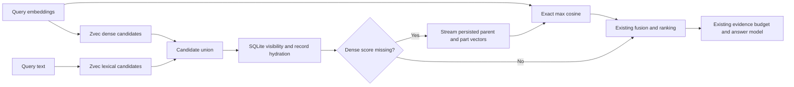

# Completing hybrid retrieval scores from durable memory

Status: implementation frozen; ATM, cutoff-filtered raw/captioned M3, a separate clip-local speech
M3 treatment, and artifact-disjoint LoCoMo-refined validation completed. A later LongMemEval
full-500 attempt stopped during corpus formation and produced no QA result. This document makes no
SOTA claim.

## Result navigation

- Complete ATM main-SGM (1,013 public questions): score completion changes the fixed-denominator
  mean from 0.43792 to 0.62505, while adding local retrieval latency and using more known reader
  tokens. This is the clearest positive result and remains an exposed single-corpus characterization.
- Caption-formed M3 (the fixed 20-unit/267-question roster) and six-conversation LoCoMo show no
  established score-completion quality gain. A separate public-SDK clip-local speech treatment on
  that M3 roster improves the fixed-denominator score from 0.10112 to 0.24345. This is an input
  treatment result rather than evidence that the default speech backend produces that score. The
  M3 roster is not the official 100-video Robot benchmark, and the LoCoMo roster is artifact-disjoint
  rather than an official holdout.
- LongMemEval full-500 stopped during corpus formation. It ran no QA, so it has no accuracy result.
- Kernel-level acceleration did not produce an end-to-end retrieval speedup. Formation, answer,
  judge, embedding, storage, and latency costs are reported in their own units rather than folded
  into one price claim.

## Decision

Keep MindBridge's embedded architecture and complete the scores of candidates found only by
the lexical route. Reuse SQLite's persisted document embeddings and the query embeddings already
computed for this search. Preserve the existing cosine scales, parent aggregation, ranking
coefficients, eligibility rules, and evidence budget. No model request, schema migration, or
additional dependency is needed by the scoring algorithm.



The investigation began from the dirty working tree on September 8, preserving all previous
changes and leaving a separate, pre-existing EgoLife v5-speech job undisturbed. This report does
not claim to have launched, completed, or evaluated that job. The fixed Ego100 raw-causal study
described in the historical appendix was a distinct experiment executed during this research; the
project owner later removed EgoLife from product acceptance scope. The comparison baseline is the
initial working-tree snapshot, not the older commit used in the September 7 study.

## Structural problem

Candidate generation unions dense and lexical results. However, a parent absent from the bounded
dense result set receives dense relevance zero. For partial keyword coverage, the lexical score
does not enter base relevance; it contributes only a bounded coverage bonus. That bonus can lift a
candidate, but it does not replace the missing semantic measurement and can systematically
undervalue the candidate. For example, before time and context factors, lexical coverage 0.5 gives
the old path relevance 0.15; completing a missing maximum cosine of 0.5 gives relevance 0.575.

This is a problem in the connection between candidate generation and ranking. Merely changing a
fusion weight would not recover the missing measurement. Increasing every dense route's depth
would spend work on parents that the lexical route has already identified.

For a lexical-only parent, compute the maximum cosine similarity over every stored document part
and every query vector already prepared for that search. The resulting relevance is the
nonnegative part of the cosine;
confidence is one half of one plus the cosine. These are the existing dense route's scales.
Normalize explicitly: provider vectors need not have unit length. Bound floating-point roundoff
at minus one and one. SQLite remains the authority for which embeddings and records exist.

Only missing dense parent scores are completed. Dense-route candidates retain their existing
scores. This intentionally avoids silently changing an approximate dense search into a different
full reranker. The lexical candidate limit bounds the additional parent set; long memories can
still have many parts, so CPU cost must be measured rather than assumed negligible.

## Relationship to prior work

[Hindsight](https://arxiv.org/abs/2512.12818) motivates treating memory as structured evidence and
combining retrieval paths. [WorldMM](https://arxiv.org/abs/2512.02425) retains complementary visual
and textual memories at multiple temporal scales. [xMemory](https://arxiv.org/abs/2602.02007)
organizes intact evidence hierarchically and selects complementary representatives. These support
investigating memory organization and retrieval beyond adjusting top-k; they do not establish the
effectiveness or originality of this implementation.

The proposed contribution is a concrete correction to MindBridge's use of its durable multi-part
memory representation. Exact cosine scoring and hybrid candidate unions are established methods.
No claim of a new general retrieval algorithm is made.

Two tempting alternatives were rejected during code review, before reserved evaluation outcomes.
Native dense parent grouping already exists, and the observed query path did not prove that a new
selector could recover independent semantic facets beyond the vectors already returned. One
logical query operation may produce several model inputs; the prepared search merges aggregate,
focused, and atomic inputs and removes duplicate vectors before retrieval. Observed ATM requests
commonly returned two 2,048-dimensional query vectors, but their individual semantics were not
identified. A SQLite FTS replacement remains a separate hypothesis for constrained lexical search;
it is not part of this change.

## Acceptance protocol

- Compare against an immutable snapshot of the initial working tree, using separate physical
  stores with the same corpus and persisted embeddings.
- Use exact shared query vectors across arms; do not replay generated answers or judgments.
- Keep already-exposed development diagnostics separate from the reserved ATM main slice.
- Freeze the implementation before inspecting reserved scores. Do not revise it from those scores
  and continue to call the same questions held out.
- Measure evidence recall and complete evidence coverage separately from answer quality.
- Include a fixed double-depth dense-candidate control where practical. This checks whether a
  gain can be obtained more cheaply by ordinary overfetch; it is not a sweep over tuned depths.
- Keep the same answer model, prompts, result limit, evidence budget, and error denominator.
- Record CPU retrieval time, additional persisted-vector reads, model requests and returned usage.
  Extra local computation is a cost even if model-call counts remain equal.
- Test mixed vector norms, negative similarity, multiple parts and query vectors, corrupt vectors,
  partial lexical candidates, forgotten/stale records, temporal visibility and index rebuilding.
- Run all repository quality gates and the pinned documentation checks before delivery.

The initial synthetic profile contains 2,000 records with 32-dimensional deterministic vectors.
It is a software performance diagnostic, not evidence of real embedding quality or end-to-end
superiority. The separate pre-existing EgoLife v5-speech job was left on its own frozen code and
artifacts; no state or outcome from that job is claimed here.

## Corrected ATM retrieval comparison

The reserved main slice contains 263 questions selected by source order before inspecting its
outcomes. Every question has annotated evidence. All three conditions completed 263 rows without
execution errors or query-cache misses. They use the same closed corpus, frozen configuration,
and exact query vectors. The implementation was frozen before these outcomes; no outcome-driven
revision has been made.

This is `atm-bench-main-sgm`, source positions [750:1013], over 11,034 text/log records with no
media assets and 13,787 persisted 2,048-dimensional WeMM embeddings. It tests textual personal
memory retrieval, not visual understanding. The slice is disjoint from the 40 exposed development
questions at [710:750]. An ID-only audit found no collisions in 24,493 rows from 81 prior sample
artifacts. This is an observed artifact audit, not proof of an independent official blind holdout;
snapshot filenames are not used as evidence of selection timing.

| Condition | Mean Recall@10 | Mean Recall@12 | Complete gold coverage at 12 |
| --- | ---: | ---: | ---: |
| Initial September 8 working tree, route depth 100 | 0.506274 | 0.508682 | 130 / 263 |
| Frozen score completion, route depth 100 | 0.804355 | 0.808981 | 202 / 263 |
| Initial working tree, fixed route depth 200 control | 0.510076 | 0.511217 | 131 / 263 |

At 12 results, 87 questions improve and two decline. The mean traced parent candidate count is
212.45 in both primary arms and 420.73 in the double-depth control. This separates completing
features on the same candidate union from simply retrieving more candidates. Recall is a fraction
of annotated evidence, not answer accuracy. All questions share one personal memory corpus;
these measurements do not establish performance across independent people or official SOTA.
The paired difference is 0.300299; a fixed-seed, 10,000-resample descriptive bootstrap over these
questions gives a percentile interval of [0.246162, 0.355830]. This resampling does not supply the
missing variation across users or corpora.

The final fixed-ABBA, zero-provider timing run measures initial versus score completion at 50.243
versus 57.421 ms median, 147.449 versus 166.637 ms p95, and 65.870 versus 74.148 ms mean. Score
completion is slower on this corpus. The algorithm adds no embedding or generation request, but its
extra local compute outweighs the measured scoring-kernel speedup in the complete retrieval path.
The timing boundary and provenance limit are reported under Numerical and resource checks.
End-to-end answer quality and returned-token usage are assessed separately.

The corrected result is recorded in
`.benchmarks/research/2026-09-08-evaluation-audit/paired-retrieval-v1/atm-reserve263-corrected-retrieval-summary-v2.json`.
An independent full source comparison confirms that the candidate changes only the new scoring
module, streaming store projection, retrieval integration, and trace documentation. Dependencies
and the lockfile are unchanged.

### Comparator correction

The first execution mistakenly selected the September 7 commit snapshot as its baseline instead
of the initial September 8 working-tree snapshot. Those comparisons were withdrawn and their
artifacts preserved. No answer-generation experiment had begun. The corrected runs attest the
actual imported source paths and compare the intended snapshots. Candidate code and query vectors
were unchanged. The incorrect comparison remains a disclosed execution error even though the
corrected development-set values happen to agree numerically.

A separate diagnostic also incorrectly looked for `None` in a numeric trace field to detect missing
dense measurements; the field uses zero. That diagnostic was withdrawn. Source comparison and
paired traces, together with the regression distinguishing a measured zero from a missing score,
are the basis for attribution.

### Post-freeze resource correction

Review found that retaining a scoring exception and its traceback could retain the partially
consumed SQLite generator and its connection. A synthetic reproduction observed two additional
SQLite/WAL file descriptors. The final integration explicitly closes the iterator on success and
failure, with a close-on-error regression. This is a post-freeze error-path correction: the scoring
kernel, vector projection, ranking logic, and successful retrieval results are unchanged. Answer
validation uses a new frozen snapshot containing this correction. The original snapshot and its
retrieval artifacts remain preserved.

The final working tree also changes the streaming accessor's return annotation from `Iterator` to
`Generator`, so the type checker can verify its use with `closing()`. This changes no runtime
computation. Frozen answer runs retain the earlier annotation; the final review patch includes the
typing correction.

## ATM end-to-end answer comparison

Both arms use Qwen3.8-27B, the same answer prompts and evidence budgets, and the existing vendored
task scoring rules. All 263 planned questions remain in the denominator. The candidate has one
upstream connection reset: the request was forwarded, received no response bytes or usage, and is
scored zero. There was no retry or replacement run. No other generation or scoring error occurred.

| Measure | Initial working tree | Score completion |
| --- | ---: | ---: |
| Mean task score, fixed 263-question denominator | 0.41898 | 0.59801 |
| Number questions, 92 | 0.50000 | 0.57609 |
| List-recall questions, 42 | 0.17125 | 0.43513 |
| Open-ended questions, 129 | 0.44186 | 0.66667 |
| Abstentions | 123 | 53 |
| Generation failures | 0 | 1 |

There are 60 improved, 13 declined, and 190 unchanged question scores. The mean paired gain is
0.17902; a descriptive fixed-seed, 10,000-resample question bootstrap gives a percentile interval
of [0.12072, 0.23764]. These are mixed task scores, including partial list credit, rather than a
count of wholly correct answers. The shared personal corpus and reader/judge choice prevent an
official SOTA comparison.

The 134 number/list questions use deterministic scoring; the 129 open-ended questions use the
existing model-judge plan. The baseline makes 129 judge calls and the candidate 128 because its
failed generation retains a zero score. This difference is not question selection. Generated
answers and judgments are never replayed. Query-embedding replay is only a paired experimental
control: preparing that cache has a separate model cost, and normal product queries still embed.

Receipts attest identical question identities, corpus hashes, configuration, cached query responses,
and embedding-request multisets. The baseline loaded a runner version whose final exit status
treated provider failures as an unsuccessful process. Before the candidate run, reporting was
corrected to retain failures as outcomes. A preserved, hash-verified runner diff changes only the
completed receipt and exit behavior, not requests, prompts, scoring, selection, or stores.

The fixed-denominator aggregate is recorded in
`.benchmarks/research/2026-09-08-evaluation-audit/paired-qa-v1/atm-reserve263-fixed-planned-denominator-quality-v1.json`.

### Returned token usage

| Provider-reported tokens | Initial working tree | Score completion |
| --- | ---: | ---: |
| Answer input/prompt | 2,095,752 | 2,196,172 known; one request unknown |
| Answer output/completion | 4,896 | 6,286 known; one request unknown |
| Answer generation | 2,100,648 | 2,202,458 known; one request unknown |
| Judge input/prompt | 70,889 | 71,787 |
| Judge output/completion | 11,867 | 12,290 |
| Evaluation judges | 82,756 | 84,077 |
| Combined | 2,183,404 | 2,286,535 known; incomplete |
| Combined per planned question | 8,301.92 | 8,694.05 known; incomplete |

The candidate's reported subtotal is already 103,131 tokens higher, about 4.72%, before the unknown
usage of its failed request. The task-score gain therefore does not establish lower per-query
token cost. Judge tokens are evaluation overhead and are separated from product answer tokens.
Its 1,390 additional known answer-output tokens are small relative to the input increase, but this
does not prove that longer answers are harmless or that fewer abstentions mean more true facts.
The model judge is shared with the answer-model family, so task score, abstention count, annotated
evidence recall, and returned token usage remain separate observations rather than interchangeable
accuracy claims.
No currency estimate is made without an attested price schedule. Together with the additional CPU
work, these results support stronger answers under the same call and evidence-budget settings;
they do not establish a simultaneously faster and cheaper operating point.

The independent read-only cost audit is
`.benchmarks/research/2026-09-08-evaluation-audit/paired-qa-v1/atm-reserve263-token-cost-audit-v1.json`.

### Post-hoc reader-only control

After the primary ATM result was known, the existing frozen evaluator ran all 263 questions with
its `mindbridge_blind_v1` no-memory prompt. This is a reader-prior control with a different prompt,
not another retrieval arm, an input to code selection, or an official SOTA comparator. All planned
questions completed without error. The fixed-denominator mean is 0.05703 (15 score units): number
and list means are zero, while the open-ended mean is 0.11628. The run made 263 generation calls
and 129 judge calls with no answer or judge cache. Provider-reported usage is 30,310 answer tokens
and 83,569 judge tokens, 113,879 combined or 433.0 per planned question. Its serial 1,499-second
duration is not a latency comparison.

The durable receipt stores aggregate call and usage accounting rather than raw per-request usage
events. Its counts and arithmetic were independently checked against the result and sample
artifacts. The receipt is
`.benchmarks/research/2026-09-08-evaluation-audit/atm-reserve263-posthoc-blind-v1/execution-receipt-v1.json`
(SHA-256 `b43f06b0f58a3653cd3cb42ff5def265aada655fb57f3a0802c7d0e0cc263af0`).

### Post-hoc evidence-budget ablation

After the primary result, a fixed 2-by-2 characterization added the only missing evidence-budget
cells: initial and score-completion retrieval at public `ask` limit 8. The original limit-12 cells
remain the primary result. This is a post-hoc budget ablation, not a sweep, a new held-out set, or a
source for code changes. Limit 8 changes the public retrieval pool from 36 to 24 and the grounded
evidence from 12 to 8; it does not hold the old pool fixed through a private harness. Both new cells
use the same 263 questions, corpus, strict query-vector cache, model settings, failure denominator,
and serial concurrency, with baseline 8 executed before candidate 8. No answer or judge response is
replayed.

| Code arm and public limit | Mean task score | Grounded gold recall | Complete coverage | Answer tokens | Judge tokens |
| --- | ---: | ---: | ---: | ---: | ---: |
| Initial, 12 | 0.41898 | 0.50868 | 130 / 263 | 2,100,648 | 82,756 |
| Score completion, 12 | 0.59801 | 0.80898 | 202 / 263 | 2,202,458 known; one unknown | 84,077 |
| Initial, 8 | 0.42776 | 0.50000 | 129 / 263 | 1,377,801 | 82,229 |
| Score completion, 8 | 0.57129 | 0.77859 | 194 / 263 | 1,506,358 | 84,088 |

Grounded recall uses the actual persisted evidence source IDs for each call and the annotated gold
sources. It does not substitute the first eight entries of an older top-12 list. Mean task score
includes partial list credit and is not a fraction of wholly correct answers.

At limit 8, score completion exceeds the initial tree by 0.14354: 55 questions improve, 15
decline, and 193 are unchanged; the descriptive paired question-bootstrap interval is [0.08650,
0.20152]. Reducing the limit changes the initial arm by 0.00877, interval [-0.02471, 0.04109], and
the completion arm by -0.02671, interval [-0.07361, 0.02040]. The difference-in-differences is
-0.03549, interval [-0.09537, 0.02441]. These intervals resample the fixed questions and do not
cover endpoint or corpus variation.

The predeclared observational working-point thresholds are both met: score-completion limit 8 is
0.15231 above initial limit 12, interval [0.09718, 0.20766], while its complete answer usage is
594,290 tokens lower, a 28.29% reduction. This is an observed working point on one shared ATM
corpus. It is neither a statistical noninferiority claim nor evidence of lower cost or stronger
answers across corpora; the cutoff-filtered video characterizations below remain negative. Judge cost is
evaluation overhead and is not included in the product-token threshold.

The frozen public-SDK runner differs from the accepted limit-12 runner only in its required public
limit assertion. Its SHA-256 is
`85e7040f5850bfa344a9faa63f15f80cc7059222e30e47ab7efa2b33b7e4cb83`. The full four-cell
aggregate, input hashes, usage, paired contrasts, and bootstrap method are recorded in
`.benchmarks/research/2026-09-08-evaluation-audit/paired-qa-v1/atm-reserve263-budget8-posthoc-fixed-planned-denominator-quality-v2.json`.
The original v1 was preserved; v2 adds actual grounded-evidence recall and coverage at SHA-256
`2d03b19322cfe896cf4fadac1f56fe9079e18ea75f894d841493b8f9d7c803f8`.

## ATM complete main-sgm characterization

The final ATM study runs the complete 1,013-question `atm-bench-main-sgm` public split, rather than
combining the earlier 263-question reserve with later results. It keeps source order, the fixed
route depth of 100, public answer limit 12, one shared 11,034-record corpus, one strict query-vector
cache, and the same answer and judge models. This entire public split is exposed characterization,
not an official holdout or SOTA comparison. All planned rows remain in the denominator; execution
errors receive score zero.

| Measure | Initial working tree | Score completion | Paired difference |
| --- | ---: | ---: | ---: |
| Mean task score, 1,013-question denominator | 0.43792 | 0.62505 | +0.18712 |
| Number questions, 360 | 0.46389 | 0.58611 | +0.12222 |
| List-recall questions, 139 | 0.23463 | 0.56238 | +0.32775 |
| Open-ended questions, 514 | 0.47471 | 0.66926 | +0.19455 |
| Abstentions | 448 | 197 | -251 |
| QA error rows | 1 | 4 | +3 |

There are 247 improved, 56 declined, and 710 unchanged scores. A fixed-seed,
10,000-resample question bootstrap gives a descriptive 95% interval of [0.15572, 0.21851] for the
mean paired difference. Questions share one corpus, so the interval does not represent variation
across people, corpora, readers, judges, or service conditions. The initial error is one generation
failure. Score completion has three generation-error questions and one judge-error question. The
judge error consumed three failed HTTP attempts; counts of failed attempts and failed questions are
therefore reported separately.

The full ranked window is at most 36 sources and must not be confused with the 12 sources submitted
to the reader. Its annotated-source micro recall is 0.52025 initially and 0.81126 with score
completion. The ranked top-12 prefix recall is 0.49348 and 0.75772. A separate scorer-free public
`ask_stream` replay reconstructs the actual 12-source reader context for all 1,013 questions, and
the paid request audit proves every paid canonical reader body equals its own replay body. On that
fixed denominator, submitted-context recall is 719 / 1,457 (0.49348), with complete gold coverage
on 547 questions, versus 1,104 / 1,457 (0.75772), with complete coverage on 791 questions. This is
evidence-input quality, not answer factual accuracy. The formal aggregate also retains a conditional
live-outcome view over the 1,012 initial and 1,009 completion rows without any QA error; its shorter
denominator excludes the completion judge error as well as generation errors.

Paid canonical reader bodies differ between arms on 742 questions and are equal on 271, exactly
matching the preflight replay comparison. This confirms that the retrieval change commonly reaches
the reader on this corpus. It does not remove reader and judge nondeterminism or prove that every
observed score difference was caused by retrieval. A post-hoc fixed-denominator decomposition
attributes 0.00740 of the total 0.18712 mean difference to the 271 equal-body questions and 0.17972
to the 742 different-body questions. The equal-body contribution is direct evidence that live
reader/judge variation or service drift remains; the larger different-body contribution is
consistent with an input-path effect but is not, by itself, an unconditional causal estimate.

| Provider-reported lifecycle cost | Initial | Score completion |
| --- | ---: | ---: |
| Answer Qwen tokens | 8,042,125 known; 1 attempt unknown | 8,420,854 known; 3 attempts unknown |
| Judge Qwen tokens | 328,576 | 334,284 known; 3 attempts unknown |
| Answer HTTP attempts | 1,013 | 1,013 |
| Judge HTTP attempts | 513 | 514 |

The two answer-and-judge arms return 17,125,839 known Qwen tokens in total, with seven forwarded
attempts of unknown usage. Query embedding is a separate WeMM accounting dimension: 303 exact prior
responses are imported without a new forward, while 710 new requests return 1,420 vectors and
report 45,690 tokens. These token types are not added into a common price. The strict query cache is
an experimental pairing cost rather than normal product behavior, and no currency estimate is made.

The formal result is
`.benchmarks/research/2026-09-08-evaluation-audit/atm-main-full1013-analysis-v1/final-analysis-v1/result.json`.
Its independent recomputation is under the adjacent `independent-review-v1/receipt.json`; the same
directory contains the fixed-denominator submitted-reader-context supplement. The paid input and
cost audits are
`.benchmarks/research/2026-09-08-evaluation-audit/atm-main-full1013-paid-request-audit-v2/receipt.json`
and
`.benchmarks/research/2026-09-08-evaluation-audit/atm-main-full1013-cost-ledger-v2/receipt.json`.

## M3 cutoff-filtered video comparison protocol

M3 uses all 267 questions from the same fixed 20 video units, with 1,433 raw video records and
4,299 persisted 2,048-dimensional WeMM embeddings. This is an exposed characterization set and
does not supply an official held-out result.

The originally considered M3 speech stores contain post-hoc identity linkage that can reach answer
prompts. Deleting future clips alone cannot undo this preprocessing. Those stores were rejected
before M3 answer execution. Existing raw stores with zero identity and speech rows were found for
every fixed unit; source-ID sets and embedding spaces match. The first eligible absolute path in
lexicographic order was fixed per unit, independently of outcomes. Both code arms use this same
raw manifest. A raw-versus-speech difference is not attributed to this patch.

The existing public answer API has no hard relative-media cutoff argument. The harness therefore
clones each closed corpus into a separate physical store and processes cutoff groups in descending
order, deleting records whose end exceeds the cutoff through the public SDK before asking. Equality
at the cutoff is retained, matching the existing task rule. Raw evidence eligibility is checked for
both ranked and grounded sources; source stores remain unchanged. Formation, reinforcement, and
answer learning are disabled. Checksummed, fsynced deletion journals support interrupted attempts
without moving the cutoff forward.

Two independent synthetic end-to-end checks run both frozen sources through the existing evaluator
and public `ask_stream`. They verify equal deletion sets, unchanged source hashes, and absence of a
unique future canary in earlier generation requests. This supports cutoff-filtered raw-evidence
visibility,
not equivalence to chronological prefix ingestion: an index built over the complete corpus and
then pruned can retain a different ANN topology from an index built incrementally.

A separate zero-provider geometry audit rules out one narrower chunk-boundary concern for this
fixed roster. All 267 question cutoffs equal a clip end; none falls strictly inside a clip, the
cutoff-to-last-retained-end gap is zero for every question, and all 1,413 adjacent clip pairs within
the 20 units are contiguous. Whole-clip pruning therefore discards no pre-cutoff prefix of a
straddling clip here. This structural result does not explain answer scores or generalize to a
dataset whose cutoffs fall inside chunks.

### Historical out-of-scope EgoLife record

The fixed Ego100 experiment run during this research and its later read-only diagnostics are
preserved in
[Historical out-of-scope EgoLife diagnostics](historical-egolife-diagnostics-2026-09-08.md).
The project owner removed that benchmark from product acceptance and future optimization. Its
negative outcomes and costs remain visible there but are not part of the ATM/M3/LoCoMo acceptance
narrative.

### M3 raw-video cutoff result

The fixed 20-unit, 267-question M3 Robot characterization is also a negative result. The initial
tree scores 31 / 267 (0.11610) and score completion scores 27 / 267 (0.10112), for a paired
difference of -0.01498: ten questions improve, 14 decline, and 243 are unchanged. Both arms finish
all 267 generation and 267 judge calls without a provider failure or query-cache miss. The ordered
ranked source IDs and ordered grounded source IDs are identical for every question. Thus the
observed score difference is not evidence for either a ranking improvement or a ranking regression;
the live answer and judge calls remain variable even when retrieval evidence is unchanged.

Provider-reported answer usage is 7,603,206 tokens for the initial tree and 7,602,634 for score
completion; judge usage is 83,728 and 83,158, respectively. Every call reports usage. The small
completion-token differences describe model outputs, not a demonstrated cost saving from retrieval.
The recorded generation-request SHA sets are disjoint even though every durable prompt, ranked
source list, memory list, evidence interval, and reference field exposed in the samples is equal.
Raw historical request bodies were not retained, so this audit cannot prove which unrecorded field
caused the hashes to differ. A separate M3 single-question reconstruction confirms that the loader
supplies no reference time and that two
fresh frozen-runtime bodies differ only in the SDK-injected wall-clock reference line; normalizing
that line makes those reconstructed bodies byte-identical. That is mechanism evidence, not a
reconstruction of the unavailable 267 historical bodies. Future M3 pairs must pass one fixed
evaluation reference time to both arms without writing it into observation occurrence fields. The
reconstruction receipt is
`.benchmarks/research/2026-09-08-evaluation-audit/m3-reference-clock-diagnostic-v1/receipt.json`
(SHA-256 `7cc1fbbab77d4a09d26fec585fd95993eee5be83e4808db5f08967dad5b471e5`).

The cutoff-pair validator passes the fixed roster, raw zero-identity/speech store manifest,
relative cutoffs, exact cached query requests, configuration, and planned denominator. The raw
stores contain only three embeddings per record and no visual descriptions, so this experiment
does not test the score-completion path against meaningful lexical scene descriptions. That is not
the sole possible explanation for unchanged ranks. Most units have fewer than 100 parents, but the
ANN depth is spent on embedding parts before parent deduplication, so parent count does not prove
that the dense route admitted every eligible parent. The historical outcome does not retain
dense-route or lexical-only union counts, so their per-question activation is not observed and no
single route bottleneck is assigned. Only the final ranked and grounded lists are known to match.
The result is recorded in
`.benchmarks/research/2026-09-08-evaluation-audit/paired-qa-v1/m3all267-causal-fixed-planned-denominator-quality-v1.json`
(SHA-256 `c5e76bba57f9ae8db31497736e6fede02643c61595c2b3aadec65030389e1979`).
The request-hash diagnostic is
`.benchmarks/research/2026-09-08-evaluation-audit/paired-qa-v1/m3all267-request-sha-multiset-diagnostic-v1.json`
(SHA-256 `a99374ec49f73ec299056a5b12add1c5ebdcbf9d051610ba4f507eec233e4236`).

### Visual-formation feasibility and cost

A separate formation-only pilot enables MindBridge's existing opt-in visual describer on the first
canonical clip from each of five fixed M3 units. It uses five physical stores and one public
`AsyncMemory.add` per clip; it reads no questions or gold labels and runs no QA. All five writes
succeed. Each new store contains one video record, one cached visual description, and four
normalized 2,048-dimensional WeMM retrieval parts in the configured
`tencent/WeMM-Embedding-2B:2048:messages-v1:l2-v1` space. The pilot makes five visual calls and five
embedding calls, with no retry, cache hit, or failure. Reported usage is 5,873 visual tokens and
36,088 embedding tokens; sequential unit time totals 20.48 seconds. The stores occupy 17.96 MiB of
allocated space and the complete recorded run adds 19.42 MiB.

The five deterministic memory IDs match the corresponding raw-corpus IDs because public add sees
the same canonical content, source metadata, and media bytes. Their `created_at` values are new;
this remains a separately formed corpus rather than an in-place enrichment of the raw stores.

This verifies public-SDK formation and its accounting, not caption quality or retrieval benefit.
Descriptions are nondeterministic model outputs rather than ground truth. Before the full run, the
five fixed clips projected about 1.68 million visual tokens, 10.34 million embedding tokens, roughly
98 minutes at the pilot's serial mean, and 3.4 to 5.2 GiB for 20 stores. Those were planning ranges;
the measured full-corpus values below supersede them. The pilot receipt is
`.benchmarks/research/2026-09-08-evaluation-audit/m3-vision-caption-shared-corpus-pilot-v1/run-v1/receipt.json`
(SHA-256 `36cad3af36734e0021be959a29cef8e7ba4fe04038d71c0d9be65807e6dc455f`);
the independent aggregate audit is SHA-256
`7f91da363a85a051262cf7f4d3fc3867f5c4d2f34ff75f5ec4c06e3310b0e046`.

The first authorized full-corpus launcher was terminated by the execution service after two visual
request bodies entered the recorder but before any response or journal event was durable. Their
upstream outcome and usage are unknown and must not be imputed as zero or mixed into the recovery
attempt. The partial stores are excluded. This is an execution-artifact failure, not a caption or
backend outcome.

The recovery run also exposes why provider-attempt counts and usable captions must stay separate.
For one clip, two identical visual requests both return HTTP 200 and valid JSON, but the requested
single-asset output has arities five and two. The frozen SDK retries once, then correctly commits
the raw video and its base embeddings without a caption or caption-cache row. Re-adding that already
committed deterministic memory does not revisit visual formation, so a controlled captioned corpus
must retain and report this missing-caption outcome rather than retry it based on quality. The
diagnostic reads no question and makes no provider call; it is
`.benchmarks/research/2026-09-08-evaluation-audit/m3-vision-caption-shared-corpus-full-v1/caption-invalid-diagnostic-v1/README.md`
(SHA-256 `ad9f4f8d953f8a016b4ec64ec643c6eb6d8a8a99922a0d91fcd0ff48dc534567`).

The recovery completes all 1,428 fresh public-add operations and combines them with the five fixed
pilot seeds, producing 20 closed physical stores and all 1,433 canonical records. The frozen
runner's original strict `complete` field is false because it assumes one caption, exactly four
embeddings, and exactly one successful vision HTTP response per fresh clip. Those are not public-add
invariants. A separate, predeclared structural audit accepts all 20 stores without changing that
historical result: SQLite contains every canonical source and asset, the durable outboxes are empty,
and all 5,706 SQLite embedding IDs equal the derived Zvec ID set. There are 1,407 usable caption
rows and 26 retained captionless records, a 98.19% usable-caption rate. The raw and formed stores
share all 1,433 memory IDs, while every `created_at` value changes; 1,407 canonical contents differ
and 26 remain equal. The raw store has 4,299 embeddings and the formed store 5,706. These are
complete formation-condition differences and are not attributed to caption text alone.

That Zvec ID comparison is a hydration and cardinality check, not proof that the audited source
tree stayed byte-identical. A later diagnostic shows that opening Zvec with `read_only=True` and
memory mapping can still rewrite `.proxima` files: six fixed-size files changed in one raw unit and
one file changed in the corresponding formed unit. The SQLite and media checks remain valid, and
the observed ID equality remains valid, but the post-audit derived-index bytes are a new stable
state rather than the pre-audit byte state. No later experiment may open those source directories.
After all audits, raw and formed stores were copied under their owner locks into separate sealed
sources with zero-byte SQLite WALs. One digest algorithm covers every copied regular file, including
all Zvec files; source-before, source-after, and destination digests matched for all 40 unit stores,
and the sealing process made zero Zvec calls. Each future arm must verify and clone the same sealed
bytes before its first SDK open, then record any first-open path changes on the disposable clone.
The Zvec open diagnostic is SHA-256
`61b0f219e7d9932b63a46e29b76f808c0dd4e435477a4aec89a7fb2cafd500c9`; the sealed-source receipt is
SHA-256 `fd20459535b1bcbb0bac887cf498ee1d0e95d40e4db32ded45bdb960b7ae3e64`.

Including the five seeds, the known corpus construction uses 1,433 logical vision operations and
1,462 actual vision HTTP attempts: 29 clips make the frozen SDK's one allowed format retry. All
HTTP statuses are 2xx, yet 26 clips still have no usable caption because response shape is a
separate outcome. Qwen reports 1,546,646 prompt and 160,064 completion tokens, 1,706,710 total.
WeMM reports 1,433 requests and 10,189,506 input/total tokens. These model families' accounting
units are reported separately, with no currency conversion. In the recovery-run location, the
formed stores occupy about 5.06 GB of logical files and 3.24 GB of allocated blocks; the sealed-copy
measurement used for QA is reported with the five-cell result below. The terminated first run's two
requests remain unknown additional operational cost and are not imputed as zero. The all-store structural receipt
is SHA-256 `3d3ee5c6f5256a4510e6bdf24ca0d38e2dbc50791ae0671a4c9fa60b662fe81f`;
the independent aggregate and lifecycle-cost audit is SHA-256
`804a8eeae75b1fd111c3419aba1ce95b829d9a6bcbcdf22dbba3b01525867365`.

A separate product robustness patch changes only the second visual-description request after a
shape/count parse failure: it adds an explicit shape correction while retaining the two-attempt
limit and the strict parser. It does not backfill old memories. A bounded canary replays the two
fixed captionless assets' recorded invalid first responses without another first provider call,
then forwards the new corrective request. Both second requests return exactly one nonblank
description, using 1,195 and 1,207 reported tokens. This proves only that the endpoint accepts the
corrective request shape; it does not measure recovery rate, description quality, or downstream
retrieval. The full formation corpus and every ranking/QA result in this report use the earlier
frozen model-adapter source, so none of their quality is attributed to this later reliability fix.
The canary receipt is
`.benchmarks/research/2026-09-08-evaluation-audit/m3-vision-caption-shared-corpus-full-v1/caption-corrective-canary-v1/result/receipt.json`
(SHA-256 `0197643390f835573c91d42528328c8635c1596478cb22102f1f56b978b6b59b`).

### Captioned M3 request-path diagnostic

Before paid QA, a zero-provider replay runs the actual public `ask_stream` path for all 267 fixed
M3 questions against both frozen ranking implementations and both generation video caps. It fixes
the evaluation clock, exact query-vector cache, per-question cutoffs, sealed corpus bytes, runtime, and
model controls; a local streamed endpoint captures each canonical reader request body. Here,
canonical means complete non-media JSON plus each ordered media item's MIME type, decoded-byte
digest, and length, rather than raw HTTP framing bytes.

At video limit eight, 266 of 267 canonical bodies are identical across ranking implementations; the
same 266/267 equality holds at video limit four. The one mismatch at each cap prevents collapsing
either paid pair under the predeclared all-267 equality rule. No subset is selected or separately
scored. The replay does not retain score-completion eligible/completed-parent counts, dense-route
distinct-parent counts, or lexical-only eligible-parent counts. Those mechanisms remain unobserved;
neither unit size, ANN depth, nor caption presence is used to infer why 266 inputs do not change.

There is a useful conditional bound on the request-change path. M3's per-question score lies in
`[0, 1]`. If identical canonical reader requests have identical reader-and-judge conditional
distributions, with no service drift or hidden-state difference, the only changed input can alter
the expected mean by at most `1 / 267 = 0.0037453`, or 0.3745 percentage points, at either cap.
This is not a confidence interval or an unconditional bound on the observed live-batch gap: endpoint
nondeterminism and drift can move scores on the 266 identical requests. The zero-provider collapse
receipt is
`.benchmarks/research/2026-09-08-evaluation-audit/m3-captioned-qa-2x2-protocol-v1/five-cell-runner-v1/full-request-replay-v2/cap-collapse-v1.json`
(SHA-256 `f2d9cd43e411e18fe8e34a45db41b98bebed680fe857174774975a83427ba600`).

### Captioned M3 five-cell result

The paid study retains all five predeclared cells: a fixed-clock raw initial/video-8 reference and
the formed-corpus 2-by-2 of initial versus score-completion ranking and video limits eight versus
four. Each cell completes all 267 scheduled questions with zero answer or judge failure, zero query
embedding cache miss, and complete provider usage. The fixed-denominator score is binary and no
official source-ID gold exists for M3, so source recall and complete evidence coverage are not
reported.

| Physical observable | Score (correct / 267) | Question bootstrap 95% interval | Unit-cluster bootstrap 95% interval | Abstained | Answer prompt / completion tokens | Judge tokens |
| --- | ---: | ---: | ---: | ---: | ---: | ---: |
| Raw, initial, video 8 | 0.10487 (28) | [0.07116, 0.14232] | [0.06950, 0.14022] | 172 | 7,598,277 / 4,014 | 82,809 |
| Formed, initial, video 8 | 0.06367 (17) | [0.03745, 0.09363] | [0.04059, 0.08803] | 195 | 8,113,355 / 7,663 | 86,461 |
| Formed, score completion, video 8 | 0.07116 (19) | [0.04120, 0.10487] | [0.04183, 0.10294] | 199 | 8,113,450 / 3,462 | 82,257 |
| Formed, initial, video 4 | 0.08240 (22) | [0.05243, 0.11610] | [0.05535, 0.11111] | 190 | 4,558,772 / 4,340 | 83,138 |
| Formed, score completion, video 4 | 0.06742 (18) | [0.03745, 0.10112] | [0.04120, 0.09575] | 197 | 4,558,865 / 3,298 | 82,098 |

The primary estimate weights all 267 questions equally. The descriptive question bootstrap uses
seed 0, 10,000 resamples, and linear percentiles. Because questions share scenes, the second
interval resamples all 20 units with replacement and retains every selected question in each sampled
unit with multiplicity; it is still descriptive because there are only 20 clusters. Unit-equal
macros are 0.10323, 0.06547, 0.06867, 0.08149, and 0.06547 in table order and do not replace the
question-weighted scores.

| Predeclared paired contrast | Mean difference | Question bootstrap 95% interval | Unit-cluster bootstrap 95% interval |
| --- | ---: | ---: | ---: |
| Formed score completion - initial, video 8 | +0.00749 | [-0.01873, 0.03371] | [-0.02016, 0.03425] |
| Formed score completion - initial, video 4 | -0.01498 | [-0.04120, 0.01124] | [-0.04286, 0.01120] |
| Formed initial/video 8 - raw initial/video 8 | -0.04120 | [-0.07865, -0.00375] | [-0.07813, -0.00388] |
| Difference-in-differences: `(completion-initial)@4 - (completion-initial)@8` | -0.02247 | [-0.05993, 0.01498] | [-0.05929, 0.01901] |

None of these results establishes a caption-formation benefit, a score-completion benefit on M3,
or statistical noninferiority. Raw versus formed changes text, embeddings, index realization,
`created_at`, and generation evidence together, so its negative contrast is not caption-only
causality. Within each formed cap, every paid request matches its own zero-provider replay, while
the two ranking implementations have 266 identical canonical reader requests and one different
request. The one changed request scores zero in both arms at both caps. The observed score gaps on
the 266 identical inputs cannot be attributed to backend request changes; endpoint variability or
drift is a sufficient alternative explanation, but this study does not identify a unique cause.
Under the conditional-distribution assumptions stated above, the score-completion request-change
path remains bounded by 0.3745 percentage points per cap; the live gaps are not bound by that
conditional calculation.

The complete 20-unit table is retained because the cluster count is small:

| Unit | Questions | Raw I8 | Formed I8 | Formed C8 | Formed I4 | Formed C4 |
| --- | ---: | ---: | ---: | ---: | ---: | ---: |
| `kitchen_10` | 13 | 0.2308 | 0.0000 | 0.0000 | 0.1538 | 0.0000 |
| `kitchen_11` | 15 | 0.0667 | 0.1333 | 0.2000 | 0.1333 | 0.2000 |
| `kitchen_12` | 20 | 0.2000 | 0.1000 | 0.1000 | 0.1500 | 0.1500 |
| `kitchen_13` | 13 | 0.2308 | 0.0769 | 0.2308 | 0.0769 | 0.0769 |
| `kitchen_14` | 13 | 0.0769 | 0.0769 | 0.0769 | 0.0769 | 0.0769 |
| `kitchen_15` | 14 | 0.0000 | 0.0000 | 0.0000 | 0.0000 | 0.0000 |
| `kitchen_16` | 14 | 0.0714 | 0.0714 | 0.0714 | 0.0714 | 0.0714 |
| `kitchen_17` | 12 | 0.0833 | 0.0000 | 0.0000 | 0.0833 | 0.0833 |
| `kitchen_18` | 13 | 0.0000 | 0.0769 | 0.0000 | 0.0769 | 0.0000 |
| `kitchen_19` | 13 | 0.0000 | 0.0000 | 0.0000 | 0.0000 | 0.0000 |
| `kitchen_20` | 17 | 0.0588 | 0.0588 | 0.0588 | 0.0588 | 0.0588 |
| `kitchen_21` | 10 | 0.2000 | 0.2000 | 0.0000 | 0.1000 | 0.2000 |
| `kitchen_22` | 14 | 0.0714 | 0.0000 | 0.0714 | 0.0714 | 0.0714 |
| `kitchen_23` | 12 | 0.0000 | 0.0000 | 0.0833 | 0.0833 | 0.0000 |
| `living_room_01` | 13 | 0.1538 | 0.0769 | 0.1538 | 0.0769 | 0.0769 |
| `living_room_02` | 12 | 0.2500 | 0.0833 | 0.0833 | 0.1667 | 0.0833 |
| `living_room_03` | 13 | 0.1538 | 0.0769 | 0.0769 | 0.0000 | 0.0769 |
| `living_room_04` | 9 | 0.0000 | 0.1111 | 0.0000 | 0.0000 | 0.0000 |
| `living_room_05` | 15 | 0.1333 | 0.0000 | 0.0000 | 0.0000 | 0.0000 |
| `living_room_07` | 12 | 0.0833 | 0.1667 | 0.1667 | 0.2500 | 0.0833 |

The formed corpus adds a one-time known Qwen formation total of 1,706,710 tokens to any formed
cell. Formation plus answer totals are therefore 9,827,728 for formed initial/video 8, 9,823,622
for formed score completion/video 8, 6,269,822 for formed initial/video 4, and 6,268,873 for formed
score completion/video 4. Judge tokens remain the separate values in the table. WeMM formation is
also separate: 1,433 requests and 10,189,506 reported input units. Each cell makes 267 strict-cache
query embedding requests with zero miss, but the runner does not retain comparable WeMM query-token
or latency accounting. The raw corpus's original formation cost is unavailable, so the raw cell is
not treated as free and no currency or break-even claim is made.

The sealed raw stores contain 3,367,799,284 logical bytes and occupy 3,373,744,128 filesystem bytes;
the sealed formed stores contain 5,060,952,633 logical bytes and occupy 5,072,596,992 filesystem
bytes. These sealed-copy measurements differ from the recovery run's 3,236,175,872 allocated bytes
because copying can change filesystem extent allocation. The reported source for future QA is the
sealed-copy measurement; both are retained rather than silently substituted. The terminated first
formation launch's two visual request outcomes and usage remain unknown.

The formal aggregate is
`.benchmarks/research/2026-09-08-evaluation-audit/m3-captioned-qa-2x2-protocol-v1/final-analysis-v2/result.json`
(SHA-256 `db9b48847c734986baf74100852ee2bc88823f868cf9ed1fbf42428195dca442`).
Its corrected, deidentified paid-input diagnostic is SHA-256
`da54ab7a6d3decc007ee3f680c9b4fcea1908a1f0242195cf109a97363e9149f`;
the earlier v1 diagnostic is superseded. An independent recomputation from all five sample journals
exactly reproduces the means, unit table, both bootstrap schemes, contrasts, interaction, and receipt
usage. It also measures sealed storage without opening SQLite or Zvec; the receipt is
`.benchmarks/research/2026-09-08-evaluation-audit/m3-captioned-qa-2x2-protocol-v1/final-analysis-v2/independent-review-v3.json`
(SHA-256 `42667aca11c8987a0ecda44a6fbeb160775b5f52639fbde0d3f4e9d329c05dc9`).

### Clip-local speech formation

A later benchmark-only treatment tests whether clip-local parsed speech changes the fixed M3
video-4 reader inputs. It uses the same exposed 20-unit/267-question roster and the frozen
score-completion implementation. It is not the complete official M3 Robot benchmark. The source is
the independently sealed raw corpus, and the treatment retains every raw video asset, source ID,
occurrence interval, and metadata field. For the 1,162 clips with nonempty local ASR, a public-SDK
replacement adds only the deterministic segment transcript to the old content before deleting the
old record; 271 clips without transcript remain unchanged. The transcript renderer excludes the
cross-clip identity linkage that invalidated the earlier speech stores, and a structural audit
confirms that all segment ends stay within their clips.

Formation completes all 1,162 public replacements with one HTTP 200 embedding attempt each and no
generation, vision, speech, answer, judge, or gold access. The 20 sealed stores contain all 1,433
source IDs, 5,461 SQLite embeddings, the same 5,461 derived-index IDs, and no pending outbox row.
WeMM reports 8,094,090 tokens for formation; all attempts report usage. This cost is separate from
the two QA arms. The treatment uses previously produced local transcripts as benchmark input under
a model configuration with runtime speech disabled. It therefore does not add automatic speech
transcription to the product or measure an ASR provider.

Before paid QA, both raw-C4 and speech-C4 complete all 267 scorer-free public `ask_stream` replays
with zero query-cache miss, unbound request, or proxy-integrity failure. Every canonical reader
input changes between the two arms. Here the retained canonical artifact contains the complete
non-data JSON plus, for each ordered media item, its MIME type, decoded-byte SHA-256, and decoded
length. The actual raw HTTP body is not retained, although its contemporaneous digest is journaled.
The paid arms later reproduce their own replay canonical input and contemporaneous raw-body digest
for all 267 questions. This establishes equality of the runner-recorded digests; it is not an
independent rehash of raw transport bytes.

Both fixed-denominator paid arms complete all 267 answers and judges with no failed or unscored row.
The result is:

| Fixed exposed 20-unit/267-question condition | Correct | Question-weighted score | Unit-equal macro |
| --- | ---: | ---: | ---: |
| Raw video, evidence cap 4 | 27/267 | 0.10112 | 0.09712 |
| Clip-local speech plus raw video, evidence cap 4 | 65/267 | 0.24345 | 0.24712 |
| Speech minus raw | +38 | +0.14232 | +0.15001 |

The paired rows have 50 improvements, 12 regressions, and 205 ties. Resampling the 20 physical
units with their actual question multiplicities gives a 95% cluster-bootstrap interval of
0.08421–0.20290 for the question-weighted difference (seed 0, 10,000 resamples). This supports an
improvement for the complete public-SDK speech-input treatment on this fixed, exposed roster. It
does not isolate transcript text from the associated delete-and-readd indexing path, compare
against the rejected cross-clip identity-bearing speech representation, or show that the default
`SpeechBackend` automatically reaches 0.24345. The result does not justify removing or changing
the product's existing identity features.

All 267 canonical reader inputs differ between arms. Only one question retains the same ordered
ranked source IDs, grounded source IDs, submitted source IDs, and submitted media digests. Raw-C4
submits 882,128 UTF-8 text bytes; speech-C4 submits 1,681,416. The speech arm's submitted contexts
contain 2,739 repeated ASR-bearing source appearances, 5,768 segment appearances, and 714,624
transcript characters. These are input-shape observations, not official source recall: M3 supplies
no bound source-ID gold for this analysis. They also prevent attribution of the score change to a
single retrieval or reader mechanism.

QA uses 4,130,696 known Qwen tokens in raw-C4 (4,047,822 answer; 82,874 judge) and 4,393,063 in
speech-C4 (4,308,825 answer; 84,238 judge). Each phase has 267 HTTP 200 responses and complete
usage. The separate one-time speech formation uses 1,162 WeMM requests and 8,094,090 reported WeMM
tokens. Qwen and WeMM tokens are reported separately because they are different model families and
are not interchangeable price units. The persisted local-ASR provider cost is unavailable, and no
new ASR call was made.

The formal result is
`.benchmarks/research/2026-09-08-evaluation-audit/m3-clip-local-speech-c4-preparation-v1/final-analysis-v1/result.json`
(SHA-256 `5b7899aabab8e15091f743f3fd5ced2d32bd7c674a0cfe9e703db65f810bc8a4`).
An independent implementation rechecks all bound input files, the fixed 20-unit/267-question
population, effective score and error handling, unit multiplicities, paired bootstrap, and all four
QA attempt journals without importing the frozen statistics kernel. Its receipt is
`.benchmarks/research/2026-09-08-evaluation-audit/m3-clip-local-speech-c4-preparation-v1/final-analysis-v1-independent-review-v2/receipt.json`
(SHA-256 `fa7a3340016bf2581383b492781eb625e5f72eee95b3463316ae8a7b2ba44f7d`).

#### Adding video with an existing clip-local transcript

An application that already has timed transcripts can write the video and transcript together
through the public SDK. Construct `Memory` without a transcriber and with `index_speech=False` so
this write does not run automatic ASR or speaker identity analysis. The helper below preserves the
caller-provided transcript text, orders segments by their declared source position, and converts
clip-local bounds to the source timeline. An empty `segments` sequence still stores the video. The
`embedder` shown below is a caller-configured embedder that supports video input; the snippet does
not provide a standalone model configuration.

```python
from collections.abc import Sequence
from dataclasses import dataclass
from datetime import datetime, timedelta
from pathlib import Path

from mindbridge import Memory, MemoryType


@dataclass(frozen=True)
class TranscriptSegment:
    position: int
    start_seconds: float  # Relative to this clip.
    end_seconds: float
    text: str


def add_pretranscribed_clip(
    memory: Memory,
    *,
    video: Path,
    source_id: str,
    source_offset_seconds: float,
    clip_duration_seconds: float,
    occurred_at: datetime | None,
    segments: Sequence[TranscriptSegment],
):
    if source_offset_seconds < 0 or clip_duration_seconds <= 0:
        raise ValueError("invalid clip bounds")
    ordered = sorted(segments, key=lambda segment: segment.position)
    positions = [segment.position for segment in ordered]
    if positions != sorted(set(positions)) or any(position < 0 for position in positions):
        raise ValueError("segment positions must be unique and non-negative")

    lines: list[str] = []
    for segment in ordered:
        if not 0 <= segment.start_seconds < segment.end_seconds <= clip_duration_seconds:
            raise ValueError("segment lies outside the clip")
        if not segment.text:
            raise ValueError("segment text must be non-empty")
        start = source_offset_seconds + segment.start_seconds
        end = source_offset_seconds + segment.end_seconds
        lines.append(f"[video-relative {start:.3f}-{end:.3f}s] {segment.text}")

    header = f"[source_id: {source_id}]"
    rendered = header
    if lines:
        rendered += "\n\n[automatic speech transcript]\n" + "\n".join(lines)
    occurred_end = occurred_at + timedelta(seconds=clip_duration_seconds) if occurred_at else None
    return memory.add(
        (rendered, video),
        occurred_at=occurred_at,
        occurred_end=occurred_end,
        metadata={
            "source_id": source_id,
            "start_seconds": source_offset_seconds,
            "end_seconds": source_offset_seconds + clip_duration_seconds,
        },
        memory_type=MemoryType.EPISODIC,
    )


with Memory(
    "./data/video-memory",
    embedder=embedder,
    transcriber=None,
    index_speech=False,
) as memory:
    add_pretranscribed_clip(
        memory,
        video=Path("clip-0042.mp4"),
        source_id="camera-7-0042",
        source_offset_seconds=1_230.0,
        clip_duration_seconds=30.0,
        occurred_at=datetime.fromisoformat("2026-09-08T12:30:00+00:00"),
        segments=[TranscriptSegment(0, 2.4, 5.1, "Please bring the blue mug.")],
    )
```

This is an application-supplied text condition. It does not show an improvement from the default
`SpeechBackend`, and it does not assign speaker or identity fields. Use one initial write when the
transcript is already available; the example does not demonstrate replacing a committed memory.
A single text part contains its header and transcript, whereas the measured formation retained the
caller's original text as one part, added a separate transcript part, and deleted and re-added the
record. The example demonstrates API use, not byte-equivalent reproduction of the treatment or a
0.24345 score guarantee.
A local public-SDK test exercised these exact code bytes with a valid embedding fixture and no
external model call; its receipt is
`.benchmarks/research/2026-09-08-evaluation-audit/m3-clip-local-speech-c4-preparation-v1/public-sdk-pretranscribed-clip-doc-check-v2/receipt.json`
(SHA-256 `67e04b34edb962c7affb7e236d4968740d49cdef2773c21cfc84c161e26b9d9b`).

## LoCoMo-refined cross-scene validation

The additional text-memory validation was frozen before any outcome was read. It uses the complete
source-order suffix `conv-43`, `conv-44`, `conv-47`, `conv-48`, `conv-49`, and `conv-50`: 3,802
memories and 857 questions in six physical stores. The selected qid sequence has zero overlap with
the 525 qids retained by earlier exposed artifacts. This makes the population artifact-disjoint;
it is not an official holdout or a claim about model pretraining.

Formation uses only public `Memory.add_many` in 61 text-only batches and the configured WeMM
embedding model. It enables no vision, speech, transcription, formation LLM, or remote reader.
Every question's aware corpus-resolved reference clock is preserved; none needs the benchmark
fallback clock, and `known_at` is not invented. The resulting six closed stores and exact query
response cache are shared between the initial and score-completion arms. Arms run serially, with
global answer concurrency four, all answers durably complete before judge concurrency four, and no
answer or judge response cache.

The protocol fixes all 857 rows and retains failures as zero. Its three-hour provider budget begins
at the first WeMM forward and also stops new forwards at `2026-09-09T01:30:00Z`, with at most 180
seconds for accepted in-flight requests. Formation or query-prime failure produces a top-level
`INCOMPLETE` receipt with 857 missing rows for each arm; it does not fabricate samples or shrink the
population. Across the roster, 937 reference-level judge calls per arm are planned before
exact/empty-answer skips, while parser or transport retry attempts are recorded separately.

A zero-provider, four-way out-of-order canary exercises the real public `ask_stream` and evaluator
paths, including identical embedding request bodies that can correspond to different qids. It
records digest multiplicity and the complete ambiguous qid set instead of assigning ownership by
arrival order. A valid-first judge canary performs four logical question judgments, five
reference-level calls, and five HTTP requests with one attempt each. The M3 completion gate,
selection, clocks, complete sealed-tree copying, runtime identity, strict cache, qid binding,
concurrency, deadline, and failure accounting all pass independent review with zero provider calls.
The frozen v4 candidate is
`.benchmarks/research/2026-09-08-evaluation-audit/locomo-refined-cross-scene-v1/review-candidate-v4/freeze.json`
(SHA-256 `a84a61298cd4e0f8fcb0adaf1af6e495bfd67a5e670860677627786c650a363a`);
the preparation-failure canary is SHA-256
`60f5abe7cd01bfe4b1da40474f24b36991a13a5bfba134821757edd410cc7b09`.

The primary measure is the repository's frozen binary judge score over all 857 questions. The
paired question-weighted difference remains primary; a unit-equal macro and a seed-0,
10,000-resample six-conversation cluster bootstrap are descriptive because six clusters are few.
Resolved source annotations exist for 853 questions and support a separately labelled
candidate-window recall diagnostic; four unavailable cases remain explicit. Its Qwen3.8-27B judge
is not the repository's publication-comparable LoCoMo judge.

### Execution and lifecycle accounting

Preparation completed all 61 public `add_many` document batches and all 857 query primes. The 918
WeMM requests reported 323,860 input tokens with no failure. The corpus contains exactly 3,802
records and 3,802 vectors; an earlier 3,904-vector estimate incorrectly multiplied all 61 batches
by 64 and omitted the final partial batch. Both arms reuse this sealed corpus and strict query
cache.

Two administrative failures remain in the ledger. The first attempt failed before any provider
call because the embedding-cache output directory had not been created. The next attempt completed
the 918 WeMM calls and sealed preparation, then stopped before any Qwen call when its Python 3.11
runtime lacked `opentelemetry.sdk`. The reviewed continuation retained the original first-forward
deadline, reused the sealed preparation without replaying WeMM, and ran both arms under the same
existing Python 3.12.11 environment. Both complete 857 answer operations and 857 logical judge
operations with no missing or error rows. These are execution repairs, not model or retrieval
changes.

All answer usage is known. The initial arm used 1,580,072 prompt and 26,958 completion tokens
(1,607,030 total); score completion used 1,580,170 prompt and 30,429 completion tokens (1,610,599
total). Judging used 601,497 prompt and 15,786 completion tokens (617,283 total) over 877 HTTP
attempts for the initial arm, and 607,088 prompt and 15,840 completion tokens (622,928 total) over
880 attempts for score completion. The difference between 857 logical judgments and the HTTP
counts comes from reference-level calls and recorded evaluator retries; it is not a change in the
question denominator.

### Cross-scene result

| Condition | Correct / 857 | Mean frozen score | Abstained |
| --- | ---: | ---: | ---: |
| Initial snapshot | 580 | 0.6768 | 109 |
| Score completion | 567 | 0.6616 | 107 |

The paired difference is -0.01517 (48 questions improve, 61 decline, and 748 are unchanged). The
six-conversation cluster-bootstrap 95% interval is [-0.04065, 0.01995], and the unit-equal macro
difference is -0.01446. Per-conversation differences are `conv-43` -0.04321, `conv-44` -0.01754,
`conv-47` +0.06569, `conv-48` -0.00606, `conv-49` -0.03704, and `conv-50` -0.04861. This does not
show an improvement or establish non-inferiority.

For the 853 questions with resolvable source annotations, both arms retrieve 1,105 of 1,279 source
IDs in the complete candidate window, a micro recall of 0.86396. This is a candidate-window measure
over as many as 36 ranked sources, not grounded Recall@12. The actual grounded top-12 evidence also
matches between aggregate arms: 961 of 1,279 source IDs, or 0.75137, with complete coverage for 662
of 853 questions. Every question has 12 evidence intervals from 12 unique sources, and its evidence
source set equals its ranked top-12 source set.

The live paid-input audit finds equal canonical reader-request hashes for 853 questions and unequal
hashes for four. Ordered grounded sources have the same 853/4 split, while complete ranked windows
are equal for 729 questions and differ for 128. The four unequal-body questions score three in each
arm; the net 13-point decline occurs among the 853 equal-body questions. This does not identify a
retrieval effect: reader and judge nondeterminism, endpoint drift, and other hidden live state remain
possible. The 853 questions with equal request hashes and the separate 853 questions with resolved
source annotations happen to have the same count; they are different classifications and are not
treated as the same membership. Only canonical request hashes and total byte counts were retained,
not raw bodies or isolated text-field byte counts; this task is text-only and has no request media.

The formal result is
`.benchmarks/research/2026-09-08-evaluation-audit/locomo-refined-cross-scene-v1/final-analysis-v2/result.json`
(SHA-256 `268ce2e412df4fb83c0cd12fc21ac5825de2886a5450f29fae8ed348a64a83b4`).
Its receipt is SHA-256 `14a4bd57d8a4b5a88cabe787fafe0ed682d6da48ff1a5a2ae15a7d5065e158cc`.
The paid-input mechanism audit is SHA-256
`3ff1ee85acdc5b361f5f846791722e9ac802c426ec3b74b3a9a35b109ccdf6b7`, and the grounding-structure
supplement is SHA-256 `bc11cf9abda1e5e5ed7805e0de5db34db1db83a0e715e0ba1d1c8a4ecaf1ff50`.
An independent recomputation of the denominator, scores, per-unit statistics, bootstrap, usage,
candidate-window recall, paid-input partitions, and grounding structure is
`.benchmarks/research/2026-09-08-evaluation-audit/locomo-refined-cross-scene-v1/final-analysis-v2/independent-review-v1.json`
(SHA-256 `2d1dd7398690d63c3fe356d5e63a75a98dae5cf5937de98a8774c23f26baf10b`).

## Incomplete LongMemEval full-500 attempt

A final cross-domain diagnostic predeclared all 500 LongMemEval-S questions in source order, with a
separate fixed 484-question artifact-disjoint summary. It retained all 247,174 supplied history
items in 500 physical stores and mapped every per-question source ID to an opaque source-order ID;
the original `(question, source)` map remained in a mode-0600 audit file. This prevented benchmark
labels embedded in 11,304 source records from entering indexed markers or reader metadata while
leaving utterance text and timestamps unchanged. The original minute-resolution `question_date`
was the common SDK reference clock. Seventy-seven questions contain benchmark-supplied sessions
later on the same day, so the planned study was an offline full-history characterization rather
than a strict causal-at-question evaluation.

The same integrity rule is now part of the default LongMemEval adapter: every stored turn or split
block receives a per-question `M000000`-style source-order ID, and `has_answer` is mapped to those
same opaque IDs for scoring. The adapter version changes so response caches from the earlier label
scheme are not reused. A full 500-question structural audit verified 247,174 mapped memories and
479 questions with source-level gold, without model calls. This is a benchmark-integrity fix; the
incomplete run below provides no retrieval or answer-quality result for it.

The run stopped during WeMM corpus formation, before any retrieval, answer, judge, or score
operation. The initial attempt completed 63 embedding requests and recorded one connection reset on
a 92-input request. A reviewed continuation made the two remaining transport-only attempts for that
same body; both reset. A separate one-input health probe then succeeded with 11 reported tokens and
was kept outside the corpus and cache. The final, predeclared recovery preserved the exhausted
92-input sequence as fixed contiguous 46+46 children, but its first child reset on all three allowed
attempts. The original body was never forwarded again, the second child was never sent, and the run
stopped without further splitting, retry policy changes, or a smaller question denominator.

Across formation attempts, 63 corpus responses report 1,300,792 WeMM input tokens. The separate
health probe reports 11 more. Six failed transport attempts have unknown usage and are not counted
as zero. Six complete stores can be audited; the retained incomplete seventh store contains 320 of
513 planned records and is not used for a full-500 conclusion. There is no complete 500-store
corpus, strict 500-query cache, or end-to-end
LongMemEval quality evidence. Consequently the 500 planned rows are marked unexecuted, not scored as
incorrect. The final recovery `INCOMPLETE` record is
`.benchmarks/research/2026-09-08-evaluation-audit/longmemeval-full500-cross-scene-v1/full-pipeline-v3/preparation/INCOMPLETE.json`
(SHA-256 `f44486849136ddd3ad37b059f575743f46a34b949d1bf983e643ad6897edd94c`).
The independently reviewed recovery protocol is
`.benchmarks/research/2026-09-08-evaluation-audit/longmemeval-full500-cross-scene-v1/formation-recovery-independent-review-v1/receipt.json`
(SHA-256 `64dfeec4fc1b9d20cdfcba0233c9856755a1f9dde9ea7eb04dccac941bf753ea`).
The terminal process audit is
`.benchmarks/research/2026-09-08-evaluation-audit/longmemeval-full500-cross-scene-v1/terminal-process-audit-v1/receipt.json`
(SHA-256 `16d5fa3e6e893155fd11b6e74f4a84e6599b8c49c4f70041410bdcdb7135ea82`).

## Evaluated alternatives

The rejected EgoLife temporal-neighbor, facility-location, and exact-cosine diagnostics are
preserved in the
[historical out-of-scope appendix](historical-egolife-diagnostics-2026-09-08.md). They no longer
define product acceptance or planned work.

Evidence cropping by the winning embedded text part was also rejected. Persisted embedding rows do
not currently identify a part kind, section, or source offset, and the retrieval trace does not name
the winning part. Answer evidence is the whole hydrated parent. Cropping from overlapping sampled
keys without exact part provenance could silently remove a date, correction, or version qualifier.
No crop is shipped until the durable representation can reconstruct and audit the exact source span.

A native-video encoding cache was measured and rejected. On three source-order clips totaling
35.18 MiB, warm read-plus-base64 encoding took 50.19 ms median; reading, hashing, and reusing a cached
46.91 MiB encoding took 16.99 ms, saving 33.19 ms. The microbenchmark excludes request serialization,
network, and model time and does not establish a useful end-to-end gain. That evidence does not
justify another cache and its invalidation surface. The receipt is
`.benchmarks/research/2026-09-08-evaluation-audit/native-video-encoding-micro-v1/receipt.json`
(SHA-256 `41d7120e85b1f7ea5223851f6eb0fa257540fb8076ed029e0b0c37271513ae1a`).

## Numerical and resource checks

A final zero-provider ATM latency diagnostic uses the public `search_with_trace` path in fixed ABBA
order. Every block starts from a fresh store clone, runs the same five warmup questions, then times
all 263 fixed queries; all 1,052 measured calls succeed, and all four blocks make 268 exact-cache
embedding requests with zero miss. The source trees match their frozen artifacts, model generation,
judge, scorer, and gold fields are unused, and the runner records host load around the complete
study.

Across the two 263-query blocks per arm, the initial tree has 50.24 ms median, 147.45 ms p95, and
65.87 ms mean retrieval time. Score completion has 57.42 ms median, 166.64 ms p95, and 74.15 ms
mean. Its measured overhead is therefore about 14.3% at the median and 12.6% at the mean on this
corpus. This does not establish lower end-to-end latency. The per-query timer excludes store clone,
imports, index open, warmup, grounding projection, and reporting. Full-block process CPU totals are
49.29 seconds for the initial arm and 53.22 seconds for score completion, while full-block wall
totals are 68.71 and 57.73 seconds; the first initial block's much larger cold-start overhead makes
those wall totals unsuitable as a retrieval comparison.

The v5 runner checks the source SQLite digest before each clone and verifies it remains unchanged
through copying. The review also verifies all 188 initial-tree artifact files and all 91 candidate
manifest files against their extracted sources. It did not record a full source-store tree digest
before the first block, so the post-run full-tree digest cannot prove full byte equality across the
study; no SDK opened the source store, but that is still a provenance limitation. The aggregate is
`.benchmarks/research/2026-09-08-evaluation-audit/paired-retrieval-v1/atm263-latency-v5/aggregate-receipt-v1.json`
(SHA-256 `c629bb136d9cb3558f137778628cf95b9d43df5827120f0f4a44358c0f56363c`).

An outcome-free inserted-timer profile isolates the completion function on the same 263 questions.
It measures 8.240 ms per query, or 11.62% of measured search wall time. SQLite fetch plus FP32 decode
accounts for 40.83% of completion wall time and maximum dot products account for 40.66%; document
normalization accounts for 12.92%. Every instrumented result equals the frozen scoring function.
These fractions identify work inside one fixed-order diagnostic. The clocks and wrapper add
overhead, and the run is neither ABBA nor an end-to-end latency estimate. The independent receipt is
`.benchmarks/research/2026-09-08-evaluation-audit/paired-retrieval-v1/atm263-score-completion-stage-profile-v1/independent-review-v1/receipt.json`.

A bounded document-token memo was also tested and rejected. Its 1,072 public retrieval results and
traces match the uncached path byte for byte, but the fixed ABBA run has only an 8.83% memo hit rate.
With a 1,024-entry and 4 MiB charged-payload limit, it is 3.67% slower in wall time and 0.58% slower
in thread CPU. The capacity was not tuned after this result, and the prototype was not connected to
the product. Its independent receipt is
`.benchmarks/research/2026-09-08-evaluation-audit/lexical-token-cache-prototype-v1/independent-review-v1/receipt.json`.

An independent real-Zvec test compares eight FP32 vectors, including non-unit and opposite
directions, under two query vectors. The maximum absolute relevance/confidence difference from
the exact scoring helper is approximately 7.52e-8. The new scores therefore use the same scale as
native dense results; they are not inflated to favor lexical candidates.

For 100 parents with three 2,048-dimensional parts each, the warm SQLite-plus-scoring diagnostic
takes a median 13.63 ms and reads 2.34 MiB of raw vectors. A sampled stress case with 60 parents and
129 parts takes 339.90 ms and reads 60.47 MiB. Linear extrapolation to 600 such parents is about
3.40 seconds and 604.7 MiB, not a measured full-size run. This worst-case cost is material.

The store streams rows instead of materializing every vector. Its query plan uses the existing
`embeddings_memory_idx`; an unnecessary ordering clause was removed to avoid a temporary sorter.
No part-count truncation or silent score omission is used to improve the reported performance.

### Post-freeze dot-product implementation

After the quality runs were frozen, the completed-score kernel adopted
[`math.sumprod`](https://docs.python.org/3/library/math.html#math.sumprod) when the interpreter
provides it. Python documents `sumprod` as the sum of pairwise products, added in 3.12, with
extended-precision intermediates for float and mixed int/float inputs. MindBridge still supports
Python 3.10 and 3.11, so those versions retain the prior `sum(map(operator.mul, ...))` fallback.
Interpreter checks exercised the fallback on 3.10.21 and 3.11.13 and the native path on 3.12.11 and
3.14.7.

The synthetic kernel comparison includes normalization, two 2,048-dimensional query dot products
per part, maximum selection, clamping, and relevance/confidence conversion. Results were:

| Runtime and workload | Prior median | `sumprod` median | Relative speedup |
| --- | ---: | ---: | ---: |
| Python 3.12.11, 300 parts | 42.087 ms | 36.158 ms | 1.164x |
| Python 3.12.11, 7,740 parts | 414.171 ms | 262.576 ms | 1.577x |
| Python 3.14.7, 300 parts | 42.010 ms | 37.347 ms | 1.125x |
| Python 3.14.7, 7,740 parts | 446.346 ms | 282.064 ms | 1.582x |

The sampled numerical cases had zero observed output difference, but Python's extended-precision
semantics do not promise bit identity. Acceptance therefore used a separate fixed ATM replay over
all 263 questions. The final implementation produced identical ordered top-12 source IDs for every
question and identical, unique full generation-request body hashes through real public
`Memory.ask_stream`; the generation endpoint was a local streamed stub, so no answer or judge model
was called. Exact request equality covers the question, media bytes, prompts, model controls, and
grounding evidence payload. All 262 previously successful calls also retained the same grounded
memory and source IDs. The prior run's one transport failure is reported separately: its request and
top-12 list are equal, while it has no comparable successful model-grounded result.

This is a transparent post-freeze computation change, accepted only after the replay. It changes no
threshold, candidate set, context budget, schema, dependency, or model request. The synthetic receipt
is `.benchmarks/research/2026-09-08-evaluation-audit/score-kernel-sumprod-v1/receipt.json`
(SHA-256 `29f2ca085e1fe3354ab6770133addb300dfb32a90358e4710bf860d55b5c6b93`).
The public replay receipt is
`.benchmarks/research/2026-09-08-evaluation-audit/paired-retrieval-v1/atm-reserve263-sumprod-equivalence-v1/equivalence-receipt-v1.json`
(SHA-256 `974abf27b6f05607a8ca19e7a4a9dbf6087601c950814ea8979baa51d20cf566`).

## Source and validation boundary

The task-owned review patch contains 27 files relative to the preserved initial dirty-tree
snapshot: the score-completion implementation and tests, the evaluation-clock and visual-retry
fixes, the LongMemEval opaque-source adapter correction, and the documentation listed in its file
manifest. It explicitly excludes three concurrently authored `2026-09-08-memory-backend-*`
research documents and every other later live-tree change. A fresh private environment in the
isolated review tree used Python 3.11.3 and imported MindBridge from that tree. The required lock,
format, lint, type, and warning-as-error test gates passed with 1,784 tests; the pinned Markdown and
link checks also passed, with 457 valid links and five redirects among 462 checked links. The final
ATM result added after this Python run is documentation-only and does not change the tested Python
manifest.

An independent task-owned snapshot containing the product changes plus the LongMemEval adapter fix
also passed the same Python and documentation gates with 1,784 tests under its private Python
3.12.11 environment. Its receipt is
`.benchmarks/research/2026-09-08-evaluation-audit/final-product-plus-lme-adapter-v2-gates-v2/receipt.json`
(SHA-256 `87568a3bffaa5288dc897eac8d4e22efa79a641bb7c8f13d06562e24d7fc74ea`).
This is separate from both the Python 3.11.3 review-patch proof and the later mixed-ownership
integration snapshot.

A separate current integration snapshot later passed 1,842 tests. That snapshot contains
additional work of unknown ownership and an untracked configuration fixture required by one of its
tests, so it is evidence that the combined workspace can pass its software gates, not a clean
checkout reproduction or evidence that those additional changes belong to this patch. Frozen ATM,
M3, and LoCoMo quality results remain tied to their recorded source trees and do not automatically
describe the later integrated code.
