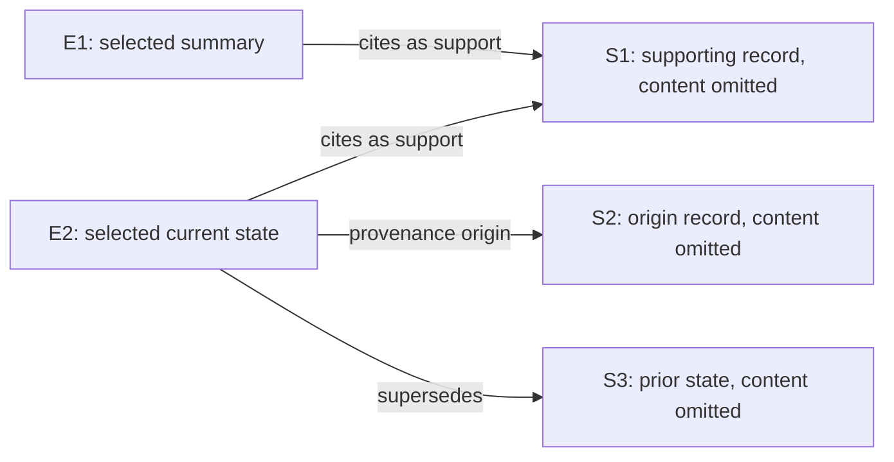

# Memory optimization: design and validation record

## Material Passport

- Origin Skill: academic-research-suite / experiment-agent
- Origin Mode: run and validate
- Origin Date: 2026-09-07
- Verification Status: Experiments complete; pinned software gates passed; delivery checks recorded separately
- Version Label: memory_optimization_v1

## Objective and acceptance

Improve the public SDK's memory behavior across text, image and video workloads,
while preserving SQLite authority, physical instance isolation and rebuildable
search indexes. Quality, latency and lifecycle cost are separate outcomes.
This record does not assert a benchmark ranking or a literature novelty claim.

The observed outcome is mixed, with a substantial negative result on EgoLife.
The speech-indexed conditions score higher on the selected M3 workload, but the
matched new-code contrast does not establish an additional quality gain.
Gallery's matched difference is small, and neither product condition provides
adequate answer coverage on EgoLife under its grounded refusal policy. The
engineering changes have regression coverage; they should not be presented as
a demonstrated general memory-quality improvement. The formed-memory diagnostic
below is a narrow test of the new typed-evidence path.

Official comparison eligibility was checked against the primary benchmark papers
and releases. The following limits apply even if a within-study score improves:

| Benchmark | Why the current results do not establish official SOTA |
| --- | --- |
| ATM-Bench | The 71-question characterization, top-12 grounding, supplied processing pipeline and local Qwen judge differ from the controlled top-10 protocol and GPT-5-mini judging. [Official protocol](https://arxiv.org/html/2603.01990v1). |
| M3-Bench Robot | The study covers 20 of 100 videos and uses one-pass retrieval and a Qwen judge, while official agent baselines use different perception/retrieval pipelines and GPT-4o judging. [Official protocol](https://arxiv.org/html/2508.09736). |
| EgoLifeQA | Jake's 500 questions match the released participant scope, but this study uses a stricter primary answer parser, disclosed exposure and a different input/retrieval pipeline. It does not establish clean held-out or six-participant SOTA. [Official protocol](https://arxiv.org/html/2503.03803v3). |
| Mem-Gallery | The exposed development slice, backbone, embedding model, grounding depth and prompts differ from the controlled official comparisons. [Official protocol](https://arxiv.org/html/2601.03515). |

Different models can legitimately compete as end-to-end systems under one common
evaluation protocol. Model-matched controls are additionally needed to attribute
their difference specifically to the memory implementation.

The baseline is commit `c62a1c41de442a8b07daa9108c12851148a4f128`. Its immutable
archive SHA-256 is
`9d5d0cb5c780abe7ae2578fd2a00fc31b7aacb0ba03a3ebac3fa28f0cd1e67dc`.
Execution manifests and full results live under
`.benchmarks/research/2026-09-07-memory-optimization/`.
The earlier [audit](memory-backend-audit-2026-09-07.md) remains a historical record.

## Main validation: M3

The frozen 20-video study completed all 1,335 planned rows: 267 questions in each
of four product conditions and one shared blind control. All seven execution-error
rows remain in their 267-row denominators and score zero; there are no missing
rows. These are local Qwen
judgments on 14 kitchen and six living-room videos, with the exposure incident
disclosed below, not an official benchmark ranking.

| Condition | Correct / planned | Question-weighted score | Equal-video mean | Execution errors |
| --- | ---: | ---: | ---: | ---: |
| Blind | 34 / 267 | 12.73% | 12.64% | 0 |
| c62 raw video, direct embedding endpoint | 26 / 267 | 9.74% | 9.42% | 3 |
| c62 raw video, exact-request embedding proxy | 22 / 267 | 8.24% | 7.77% | 4 |
| c62 with speech indexing | 70 / 267 | 26.22% | 26.33% | 0 |
| Frozen v5 with speech indexing | 73 / 267 | 27.34% | 27.57% | 0 |

The predeclared paired contrasts below use percentage points and a video-cluster
bootstrap stratified by the two execution-order blocks. Each block contains seven
kitchen and three living-room videos. Unstratified cluster intervals are similar.
These intervals describe this selected study; the videos are not a random sample
of all environments, and the four contrasts are not independent discoveries.

| Contrast | Difference, pp | 95% interval, pp |
| --- | ---: | ---: |
| Raw proxy minus raw direct | -1.50 | [-3.02, -0.36] |
| c62 speech minus c62 raw proxy | +17.98 | [+10.83, +25.19] |
| v5 speech minus c62 speech | +1.12 | [-0.75, +3.05] |
| v5 speech minus c62 raw proxy | +19.10 | [+12.20, +25.94] |

The largest difference accompanies enabling the existing public speech-indexing
configuration. The new implementation adds only three correct answers relative
to c62 with speech indexing, and its interval crosses zero: this study does not
establish an implementation-level quality gain. Both raw-video point estimates
are below blind performance. The raw proxy also scores lower than the direct
control; exact request caching must not be assumed empirically quality-neutral,
and the weaker control must not be substituted silently to enlarge a gain.
Against raw direct, the c62 and v5 speech point differences are +16.48 and
+17.60 percentage points, respectively.
The current artifacts do not isolate cache effects from hosted-model variation
or differences in execution failures.

The c62/v5 speech comparison has identical ranked retrieval and grounded source,
time and memory ordering for all 267 questions. This establishes agreement,
not retrieval recall: gold retrieval identifiers are not provided here. As
documented below, raw stored text contains different instance-local identity
identifiers, and complete generation requests, delivered-media traces and
short-video fallback counts are unavailable.

Both speech corpora contain zero typed contexts among their 1,433 records. This
main comparison therefore does not exercise the new typed provenance projection;
its evidence labels, support relations, supersession and validity handling still
require the separate formed-memory diagnostic. Main M3 covers raw multimodal
payloads, media fitting, retrieval and budget behavior under the frozen defaults.

After the Ego preparation defect was identified, a read-only structural audit
checked all 1,433 prepared video assets from these same 20 frozen M3 units. Every
asset had a video stream and at least two decoded frames; none was missing,
one-frame, streamless or an ffprobe error. No old cache was changed and no model
call was made. The audit rules out this particular structural defect in the
selected M3 assets, not other perception or provider failures. Its receipt has
SHA-256 `56af8351b81d577798f078f796e47b0345c861c0f855af3573601c0ed489a310`.

Reported generation input is 8,545,347 tokens for c62 speech and 8,562,729 for v5,
an increase of 17,382 (0.20%). Each reports 10,025,586 embedding input tokens,
including replayed usage on exact-cache hits; actual upstream embedding share is
unknown. Each independently transcribed approximately 716.51 minutes of prepared
audio. Fresh store and ASR costs remain separate from experimental cache reuse;
recorded wall-time differences are not isolated backend speed measurements.

The frozen analysis output is `paired-analysis-v2.json`, SHA-256
`3fb9bfc51a5417db9e4ed960ef5424207146dc589ecbf57517d3f3dd6add613d`,
under `results/m3-unexposed-validation-v1/` in the experiment directory.
Subsequent inputs and profiles were not retuned from these M3 outcomes.

## EgoLife completed posthoc validation

The repaired local trial completed all 1,500 planned answers at 06:25:29 UTC on
September 8. Each product arm had three ordinary execution errors, retained and
scored zero; there were no missing rows or systemic embedding failures. Both
earlier infrastructure-failed attempts remain separate. This is the explicitly
authorized posthoc repair validation described below, with one participant and
historical exposure, not a clean held-out benchmark or an official ranking.

| Condition | All 500 | Primary 300 | Sensitivity 297 | All-500 ordinary errors |
| --- | ---: | ---: | ---: | ---: |
| c62 raw | 6.60% | 7.33% | 7.41% | 3 |
| Shared blind control | 34.20% | 31.00% | 30.98% | 0 |
| Frozen v5 with speech indexing | 5.00% | 5.33% | 5.39% | 3 |

Strict and the predeclared normalized scores coincide in every cell. V5 minus
c62 is −1.60, −2.00 and −2.02 percentage points in the respective masks. The
blind control substantially exceeds both memory conditions. Raw versus speech
also changes the perception configuration, and the execution order is fixed;
these differences do not isolate an implementation effect. No population
confidence interval is justified by this single-participant study.

Among successful generations, 419 of 497 c62 outputs (84.31%) and 446 of 497 v5
outputs (89.74%) are invalid under the frozen option scorer; blind has none.
Those rows remain in the full planned denominator. A bounded posthoc taxonomy
subsequently maps every one to the SDK's explicit `insufficient_evidence`
abstention: there are no other invalid-format outputs. C62 supplies a valid
option for 78 questions and v5 for 51, while blind supplies one for all 500.
The frozen product must answer only from supplied memories and refuse when they
are insufficient; the blind generator is instructed to use its own knowledge,
never refuse and guess the most likely option. Thus this is an answer-coverage
failure under the grounded product policy, not a simple syntax defect. The
taxonomy does not establish why evidence was judged insufficient, whether the
retrieved records actually sufficed, or how much of the blind-product score gap
is caused by that policy difference. It changes neither scores nor denominators.
Its receipt has SHA-256
`cfd032aff96e20e08111ac29b14dd55bbed6372f6cd66d158eb8d6e7814f3645`.

On the 202 audio-needed questions, c62, blind and v5 score 3.47%, 35.64% and
4.95%; on the 298 others, they score 8.72%, 33.22% and 5.03%. These descriptive
strata do not establish a general benefit from speech indexing. Exact released
day and question-type breakdowns, and all error/format denominators, are retained
in `results/EGO_POSTHOC_REPAIRED_QUALITY_AGGREGATE_V3.json`, SHA-256
`1f8cb4fdddcb6dca14b7b7fafb5a5f4d6a3389489ec6bfd8651cd244e8d696b8`.
Another agent reproduced the preceding numerically identical V2 aggregate with
the pinned analyzer and checked
denominator, stratum, query-counter and endpoint arithmetic; that receipt is
`9fe5b07cf2c325ed403f0e46eec20ea54cd0a15d895efe200d294a44d18ba1d5`.
This is a reproducibility and aggregate-consistency check, not a separately
implemented scorer.

The two product arms have identical query request/response-hash multisets:
1,001 HTTP 200 events each, with 501 unique pairs—500 occurring twice and one
once. This includes the reconciled warm-up, answer retrieval and post-answer
retrieval diagnostics. It verifies query-side embedding correspondence only;
it does not establish equal ingestion embeddings, retrieved records or answers.
No mismatch was repaired by request replay or row exclusion.

The closed dedicated proxy recorded 2,436 successful upstream embedding calls
and 1,530 cache hits. C62 reported 28,932,438 logical embedding input tokens;
v5 reported 30,429,827. These include cached usage and are not billing totals.
Each condition reported 500 generation module requests, with usage available
for 497 c62, 497 v5 and all 500 blind responses. Their reported generation
input/output tokens are respectively 8,786,692/3,089, 10,691,943/3,224 and
80,284/1,000; transport-attempt totals remain unobserved. V5 reported 981 ASR
calls, 186,964.3 seconds of audio and 4,490.6 seconds of ASR compute. Strict
scoring made no model calls. Wall and sampled device-resource measurements are
confounded by the added ASR, shared blind work and disclosed concurrent CPU
checks; they do not measure an isolated backend performance change.

The immutable server-close prefix contains exactly the first 2,437 lines and
matches SHA-256
`bd04a98f87816c44d643feda60dc6520466784de9caad53cbde4536f65fdb904`.
Later formed-memory traffic appended to the same live service log is excluded.
The root accepted full denominators and exact process absence before unlocking
quality. Formed-memory admission was fixed from operational conditions before
the coordinator read these scores. The primary and sensitivity mask names do
not negate the disclosed all-500 aggregate exposure or monitoring incidents.

## ATM characterization

The fixed 71-question study completed all 142 product and blind rows, with no
execution errors or missing answers. It includes Main release offsets 710–749
and all 31 Hard questions, selected before inspecting their outcomes. Both
subsets use the same logical corpus of 11,034 unique records. This compares
frozen v5 with a blind control; it does not measure an implementation change.

| Subset | Questions per arm | v5 mean score | Blind mean score |
| --- | ---: | ---: | ---: |
| Main | 40 | 0.42500 | 0.10000 |
| Hard | 31 | 0.19477 | 0.00000 |
| All planned | 71 | 0.32448 | 0.05634 |
| Open-ended | 37 | 0.32432 | 0.08108 |
| Number | 16 | 0.31250 | 0.06250 |
| List recall | 18 | 0.33544 | 0.00000 |

The combined score averages three different task metrics: deterministic numeric
matching, fractional set Jaccard for lists, and boolean open-ended judgments from
the local Qwen model. It is not uniformly judged accuracy. All questions share
one source corpus, so a question-level interval would not establish uncertainty
across independent users or environments. The official protocol differs as
described above.

At least one annotated gold record appears in ranked retrieval for 51/71 questions
and in supplied evidence for 47/71. Mean gold coverage is 0.56007 in ranked
retrieval and 0.50080 in supplied evidence. Every product answer receives 12
evidence hits, with zero reported dropped hits. Of the 47 questions supplied at
least one gold record, 21 still score zero. This identifies a useful diagnostic
slice, but partial gold presence does not establish sufficient evidence or prove
that the answer generator alone caused the failure.

An identity error in the execution manifest initially named Hard's unit
`main_sgm` instead of the adapter's `hard_sgm`. Independent review verified the
exact 142 original question/arm rows and recovered the terminal receipt through
a versioned metadata correction, without replaying any answer or judge call.
The same setup error left the prepared Main store unused during Hard, causing
the evaluator to ingest all 11,034 records into a second physical store. Public
record enumeration and read-only SQLite counts confirm that the queried Hard
store contains no duplicates and matches Main's canonical record IDs, content,
types and times. This was re-ingestion, not a derived-index rebuild.

Consequently, Hard's measured 374.61 seconds includes unintended cold ingestion,
while Main's 75.32 seconds uses the prepared store; these are not comparable
closed-store query costs. Hard reports 5,692,053 embedding input tokens and
Main reports 2,520. Combined product generation reports 713,203 total tokens,
with another 26,383 for judging. A subsequent attribution audit of the exclusive
ATM proxy-log window establishes 173 forwarded Hard corpus batches, returning
13,787 vectors and reporting 5,689,630 input tokens, followed by 31 forwarded
query requests reporting 2,423 tokens. Another 31 diagnostic query requests were
served from cache. Thus Hard's 204 upstream requests and 5,692,053 reported input
tokens are established here; monetary billing is not. Directory size roughly
doubled because Hard retained both physical stores, not because its queried
corpus doubled. The freshly returned vectors differ from the prepared vectors;
Main and Hard therefore also use different embedding realizations. Their
different question sets were never a causal comparison of split difficulty.

The aggregate receipt is `results/atm-characterization-v1/ATM_AGGREGATE_V1.json`;
the corrected corpus/setup interpretation is established by
`ATM_STORE_REINGEST_AUDIT_V1.json`, SHA-256
`9148ed4d671f9e99502fb7db197b20234cb5196539ac8d514d17c3c5a7cd5238`.
The original aggregate's derived-index cost label is superseded by that audit.
The stronger upstream attribution is recorded in `ATM_HARD_STORE_COST_AUDIT_V1.json`,
SHA-256 `aa56a4a5859d7369e7c380807dfa1d079f81b426780524cb86a9a3196487ecb3`.
The initial EgoLife attempt stopped after a systemic embedding-service outage;
its preserved incomplete results do not establish a valid paired comparison.

## Gallery characterization

The fixed, declared-exposed characterization uses two source-order topics with
134 questions, 362 memory rounds, 76 memory images and 36 query images. It plans
402 answers across c62, frozen v5 and a shared blind condition. Deterministic F1
is primary; exact match, BLEU and the configured non-official Qwen judge are
secondary. The judge phase remains part of the complete protocol. Judge failure
does not erase a successfully generated answer's deterministic metrics, while
answer errors and missing planned answers remain zero in the fixed denominator.
With only two exposed topics, descriptive comparisons cannot establish population
confidence intervals or SOTA.

All 112 selected images passed PIL verification and full decoding. Actual frozen
c62/v5 public-SDK serialization under a network-denying guard produced identical
six-request ingestion bodies; the largest was 60,040,605 bytes, below the serving
limit of 67,108,864 bytes. Each topic's common corpus is built once through the
SDK, closed, and copied byte-identically into separate physical arm directories.
The exact embedding cache and its local WeMM implementation remain fixed.

The first admitted attempt stopped on its only synthetic readiness request:
HTTP 400 because a hand-encoded tiny PNG could not be decoded. No benchmark
answer or judge call began. Its 402 planned, zero actual and 402 missing-zero rows
remain separately preserved with the failed request and process-closure receipt
`results/MEM_GALLERY_EXPOSED_134Q_PREANSWER_TERMINAL_V1.json`, SHA-256
`2b27a73ac1a07c76cfb7442223b895a87d4b8425306c84cf550f03110d55c57a`.

The coordinator explicitly overrode the no-restart restriction once for this
synthetic-fixture defect. This is a posthoc engineering exception, not an
originally permitted automatic recovery; no quality outcome existed to select on.
The replacement uses an actual generated RGB 64-by-64 PNG, fully decoded before
sending and independently checked in the offline smoke. A new empty cache,
result identity and stores preserve the same complete scope, scoring, mandatory
judge phase and cutoff. The amendment has SHA-256
`283c12073878c1a4314cfd2f6ba8837d053cecbdc39f915a9b0eafe30cfb0154`;
independent narrow review has SHA-256
`df143b5f377dbaca4bee4e566f4a80502fb6fe42d2496819d05b01c58f748990`.
The new attempt started at 23:04:08 UTC on September 7 and completed all 402
answers and 402 completed judgments by approximately 23:12 UTC, with no missing answers,
answer errors or judge errors. Its exact controller process group is absent.
Operational closure has SHA-256
`765a5335d5fcbca5375b4d30994a2d70514c6b609411191662ecf0fe0d83889c`.
Quality remained locked until the coordinator fixed the separate posthoc Ego
admission decision at 23:41:53 UTC. Aggregate analysis was then authorized;
no Gallery score informed that admission decision.

The full quality aggregate contains 134 questions per condition, with all 402
planned answers present and error-free. The first readiness-failed attempt stays
separate; its zero placeholders are not combined with these observed answers.

| Condition | Overall F1 | Topic 0 F1 (57 questions) | Topic 1 F1 (77 questions) | Exact match | Non-official judge |
| --- | ---: | ---: | ---: | ---: | ---: |
| c62 | 0.631397 | 0.594331 | 0.658835 | 0.507463 | 0.854478 |
| Frozen v5 | 0.632932 | 0.597941 | 0.658835 | 0.507463 | 0.854478 |
| Shared blind | 0.296396 | 0.322633 | 0.276974 | 0.216418 | 0.339552 |

The v5-minus-c62 F1 difference is 0.001536, or 0.154 percentage points. Four
questions have higher F1, none lower, and 130 equal; predictions are exactly
identical for 129 of 134 questions. Exact match and judge scores are tied.
Ordered retrieval sources, grounded evidence sources and candidate counts agree
for all 134 pairs. Per-query embedding request/response ledgers were not captured,
so these checks do not establish a representation-only causal effect. The large
contrast with blind is shared by the existing implementation; the tiny candidate
difference does not establish a quality breakthrough.

Both product conditions report 696,367 generation input tokens and 63,676 logical
query-embedding input tokens. Generation output is 3,210 tokens for c62 and 3,160
for v5. The complete rows and returned-usage summaries record 402 successful
answers and 402 completed judgments, with 402 reported requests in each module.
Exact generation and judge transport-attempt counts were not captured; this does
not imply that additional attempts occurred. The embedding proxy records 142
forwarded misses and 407 hits across all phases, all HTTP 200. The 127,352 summed
embedding tokens cover returned query usage in answer-task summaries;
common-corpus, readiness and diagnostic embedding token totals are not retained
in that sum. Returned usage on cache hits is not additional upstream work or a
billing estimate.
Arm order and nonexclusive resource telemetry prevent causal latency or energy
claims. The aggregate is
`results/MEM_GALLERY_EXPOSED_134Q_QUALITY_AGGREGATE_V1.json`, SHA-256
`9357bfac6fd3e76ade432321a547b412896705e542efb986e7b674215327e632`.
Independent recomputation accepted the metrics, denominators, source pairing and
resource arithmetic, with receipt SHA-256
`1fe5ba92dbb0c8e3ad9798ebdba354529c0a743d4b379fc440fab0ed7c2b50b1`.
Both common stores have zero typed-context rows among their 185 and 177 records.
This Gallery run therefore did not exercise the typed provenance or support-count
branches either.
The resource ledger's later clarification preserves the original aggregates
while narrowing these cost claims: `experiment-resource-failure-ledger-v6.2.json`
under the experiment's `artifacts/`, SHA-256
`d8391196a85aa803fe4a6e019d3e1bbb075e9b79ad81073efe844495993df0d4`.

Two exposure incidents remain disclosed. Earlier nominally synthetic smokes
entered a configured blind-generation path, with 12 configured calls and unknown
actual network outcomes before a lowest-level network guard was added. Later,
a runtime-metadata search accidentally printed historical sample questions,
references and predictions in one agent's private transcript. No such contents
were forwarded to the coordinator and no frozen conditions changed. The latter
incident is `MEM_GALLERY_HISTORICAL_OUTPUT_EXPOSURE_INCIDENT_V1.json`, SHA-256
`5c95006107be543575908a7d8315ddf495cdd9af706b6be16d1679544f827940`.
The characterization was already declared exposed; neither incident is erased
by the later successful offline checks.

## Formed-memory diagnostic

The real formation run preserved all 419 raw observations but produced no derived
records. All 15 attempted batches received HTTP 504 after approximately 60 seconds;
the remaining 12 batches were skipped at the frozen 15-minute formation limit.
The provider ledger records 27 successful embedding responses and 15 failed
formation responses. Failed formation token usage was not retained, so it must
not be reported as zero.

The predeclared coverage rule classified the run as `no_diagnostic_coverage` and
did not execute question retrieval, answering or judging. All 48 planned rows
remain zero placeholders in failure-sensitive accounting. These are not measured
baseline and candidate answer scores, and they do not establish a quality tie.
Typed-hit coverage, source-hit correspondence, query-vector correspondence and
answer-token differences are unobserved. This experiment did not validate the
new typed provenance representation.

An earlier setup attempt had failed because the diagnostic driver supplied a
string where the public constructor requires `RetrievalMode`. The corrected
driver uses both snapshots' common hybrid default and passed exact-constructor
checks against both immutable snapshots. That earlier attempt is preserved
separately; it has no retained provider-call counter. The subsequent HTTP 504
failures are a different failure mode and cannot be attributed to that type error.

The terminal receipt is `results/locomo-formed-provenance-dev-v5/final-receipt.json`,
SHA-256 `39de557e295b7375335ae003ce74150e6088cb9de6f01dfd2bfa6576af7f0ec7`.
A subsequent synthetic contract probe made exactly two requests, without
benchmark content. One invented observation with a 1,024-token output ceiling
returned one typed record in 15.07 seconds; four observations with a 2,048-token
ceiling returned four in 48.50 seconds. Both returned HTTP 200. The actual HTTP
bodies included temperature zero, seed zero, JSON-object output and disabled
thinking. Observed token usage was 591 input plus 110 output, and 759 plus 401.
The probe ran from 19:09:34.800 to 19:10:38.365 UTC during Ego's raw arm; that
overlap is disclosed rather than treated as an isolated latency measurement.
Changing both input size and output ceiling does not isolate the cause of the
earlier failures. It verifies only these two tested input and output-limit
combinations. The two-observation batch below had not been validated against the
live former before its admission; the offline driver checks cover a different
query path.
The accepted probe receipt has SHA-256
`bfb034c76b89ec3035500b6d6d912bc851295168b7542273139fabf841a40e31`.

A post-hoc follow-up uses the same 419 observations and eight
questions, comparing c62, frozen v5 and the new v6 over three seeds: 72 planned
answers. Before any follow-up calls, the unlaunched two-arm proposal was expanded
to three arms to separate the explicit support-count revision from the preceding
provenance projection. Arm order rotates across seeds so each version occupies
each position once. All seeds and planned failures remain in the analysis.

Formation uses batches of two, a 1,024-token output ceiling and a 75-minute limit;
the full follow-up has a 100-minute limit. The ceiling retains the original
512-token-per-observation allocation. Admission requires resolved EgoLife and
Mem-Gallery runs, healthy endpoints and at least 100 minutes before the 09:45 UTC
provider cutoff, without a shorter fallback. All raw observations remain even
if formation is partial. The failed attempt remains in the record; this is an
operational characterization on exposed development data, not independent
confirmation. Other frozen benchmark arms remain v5.

The actual follow-up launched at 06:48:22 UTC on September 8, after complete Ego
operational closure and before the coordinator read Ego quality. Its frozen
deadline is 08:28:22 UTC. One uncached readiness succeeded. Two earlier launch
checks rejected metadata before any controller or experiment request: the first
receipt needed top-level aliases for the same readiness hashes; the second
marker's 60-second launch window elapsed during message delivery. An explicit
coordinator authorization then allowed only an atomic clock renewal with the
same inputs and checks. The actual V8 validator and source checks passed with
5,999.037 seconds remaining at spawn. The executor placed the renewal pin in
a different metadata field than specified; the coordinator verified that all
existing bindings were unchanged and recorded the deviation. All rejected
markers remain preserved. No additional readiness or experiment replay occurred.
The actual launch receipt has SHA-256
`19cf63dfb3b4a8b17555ee934cabc05d339f5bfd34073e17fbc433dd61f78764`.
The run completed at 07:19:40 UTC with all 72 answers, no missing rows and no
execution errors; each version completed 24 answers. The coordinator accepted
the denominators and exact process absence before fixing the extension decision
and opening quality review. Its operational closure has SHA-256
`230b746a994a2fab2ef7b5aaf1ab855071303da28c5f8013f58852194a590080`.

During terminal accounting, the monitoring agent accidentally serialized all
72 full row objects; a truncated tool response exposed answers, scores, hit IDs
and judge responses to that agent before the quality unlock. This was an actual
quality-lock violation. It occurred after execution ended and changed no row,
parameter or restart decision. The coordinator had not seen these scores when
making the subsequent time-only no-admission decision. The incident and
amendment are preserved with SHA-256
`ede7049bc3e9fa358983f8c907dfdd1b099c3d9c1bfe7b60d4c41c9c6518ea3f`
and `b139685166af4c41c7e0691748733d1ec46af7d80a174e3c6fb1204ed484ff06`.
The run must not be described as strictly blinded.

The primary, failure-sensitive local-judge score was 7/8 for every version in
every seed: all paired primary differences are zero. Secondary metrics are
reported over all three seeds rather than selecting the best seed.

| Version | Planned / completed | Judge | Token F1 | BLEU-1 |
| --- | ---: | ---: | ---: | ---: |
| c62 | 24 / 24 | 0.875 | 0.316967 | 0.223432 |
| v5 | 24 / 24 | 0.875 | 0.308506 | 0.218670 |
| v6 | 24 / 24 | 0.875 | 0.344173 | 0.249622 |

V6's mean secondary gains over c62 are 0.027207 token F1 and 0.026190 BLEU-1;
over v5 they are 0.035667 and 0.030952. They are driven by seed zero and remain
descriptive. There is no demonstrated primary quality improvement, population
confidence interval or independent-conversation replication.

Unlike the raw-store benchmarks, this diagnostic exercises typed retrieval.
Each arm supplies 288 typed selected-hit occurrences across its 24 answers,
including 207 with supporting references. Only v6 emits the explicit count,
on all 207 such occurrences. These are repeated occurrences, not 288 or 207
independent memories or questions. Within each seed, query embedding request
multisets and retrieved hit IDs match across the three versions. The final
product's later clarification of the count's meaning was not in frozen v6 and
has no model-quality result from this experiment.

The common corpus retains all 419 raw records and adds 742 derived records.
Of 210 formation attempts, 209 formed successfully and one ended in truncated
output despite HTTP 200. The final store has 1,161 records and embeddings, 751
active support edges and no pending index operations. Those edges cite 390 raw
sources, so retaining all raw records does not imply full formation coverage.
The complete workflow took approximately 31.3 minutes. This establishes actual
operation of two-observation formation batches in this workload, without a
guarantee that larger conversations or other modalities fit the same budget.

Retained request ledgers record 557 embeddings—421 upstream calls and 136 cache
hits—and 363 chat completions: 210 formation, 72 answers and 81 judge requests.
Every retained HTTP response was 200, which does not negate the semantic
formation failure above. Wire sizes are not token usage or billing; token usage
and remote generation compute costs were not retained for this diagnostic.
The complete aggregate has SHA-256
`ae7527c25ca5132803a860e3ae58532a8ac4d75b8437da0102bc3b27b0cce460`.
A separate agent reran the pinned analyzer and checked aggregate consistency.
Counts, inputs and rounded results match; 15 direct-mean cells differ only at
floating-point precision, by at most 5.6e-17. This analyzer has no bootstrap or
random sampling, and the check is not an independently implemented scorer.
The corrected review receipt has SHA-256
`8d1fc22957b4eb67ede3d46974fa9872d6af7a234d31dfda4c3ffe8f15478422`;
the superseded receipt's incorrect bootstrap explanation remains preserved.

Before launch, the 72-row bundle passed an additional check of the actual
driver's public `Memory.ask` path with invented data, an injected HTTP mock and
socket access denied. Each archive completed eight queries with concurrency two;
duplicate embedding requests retained multiplicity eight. Injecting one HTTP
503 preserved seven successful rows and one error without replay. Typed fixtures
were retrieved in every variant. The ledger records embedding traffic in the
query phase; a manually invoked document embedding is also visible, so it is
not an explicitly task-filtered query-only hook. No real provider calls were
made. That prelaunch READY has SHA-256
`0fed1b46aba1d252b8a46be845996dd2e6b273ceb89c7b3d97cae8d6a83a862a`.

A further proposal, prepared but ultimately not admitted, fixed two complete source-order conversations
not used in the current inspected pilot/run manifests: `conv-30` and `conv-41`.
This limited inventory claim does not establish historical blinding. Together
they contain 1,032 raw observations and all 208 released questions, giving 624
planned answers across the same c62, v5 and v6 archives at seed zero. Formation
would make up to 517 initial two-observation requests, with a 75-minute cap per
conversation; both common corpora would be prepared before answering. All raw
records and questions remain when formation is partial. The overall cap is
180 minutes, with no one-conversation or question-subset fallback.

Its frozen admission required both prerequisite runs to resolve and at least
210 minutes to remain before the provider cutoff. At 07:25:42 UTC, after both
had ended, only 8,358 seconds remained against the required 12,600. The
coordinator therefore fixed `not_admitted`, before reading any 72-row quality
score, and then authorized that analysis. The latest possible admission was
06:15 UTC, before the 72-row run even started, so the decision follows from time
alone regardless of the disclosed exposure. There were zero extension provider
calls and no smaller fallback. The 624 planned answers were never run and are
not an observed zero-score experiment. The decision receipt has SHA-256
`d781151c73c1266c5ab977350297130f0d65d29b79f693509ee30d8da4f8ac37`.
The fixed proposal has SHA-256
`99111e147d6c6cb08f72266794ae6ff2c0a3c09314fdd9aa971b28953c167096`.
The implementation and an actual-driver query-phase smoke were independently
accepted with no provider traffic. All 624 planned rows survive synthetic
failure accounting, and the same concurrent-request and injected-failure checks
passed against the extension's own driver. Its final unarmed READY has SHA-256
`86f08594d15c8b8512b6c5149956ba31a2712149b370a272e8ab7b574ea5de67`.
This is implementation acceptance, not runtime admission or a quality result.

## Design: preserve the meaning of evidence

The existing generator preserves full text and native media associations. However,
it omits typed context that the SDK already stores: validity intervals, recording
time, extraction basis, source dependencies and supersession. A retrieved summary
and its source can therefore look like independent observations, while a correction
can lose its relationship to the previous assertion.

When typed context is present, the candidate projects selected hits into one
answer-local evidence namespace. Selected records receive short `E` labels.
Referenced records outside the selected context receive shared `S` labels when
there are at most 64 unique omitted supporting records. Repeated references use
the same label, exposing shared provenance without copying source content or
paying for repeated UUIDs. Above that threshold, the projection retains exact
selected-record references and reports omitted-source counts and pairwise overlap
counts. Repeated reinforcement can accumulate arbitrarily many source links;
the serialized provenance must not grow linearly with that lifetime history.
Overlap computation still depends on source-set sizes, and pairwise overlaps do
not determine higher-order unions or establish statistical independence.
In this aggregate mode, an omitted origin can still receive an `S` label while
its membership in the aggregate supporting-source count is no longer explicit.
The compressed representation therefore does not preserve every source relation.

An omitted source is marked as not in the context; this says nothing about whether
it was deleted, forgotten, out of scope or simply not retrieved. A single origin
`source_id` and a correction's `supersedes_id` retain separate bounded references;
an origin is not automatically an additional supporting observation.

The projection preserves retrieval order, original text and native media binding.
Occurrence, validity and recording dates remain distinct. Supporting source edges
and correction edges remain distinct. Stored confidence is an extraction estimate,
not a truth certificate. Selection order does not establish event chronology.
There is no new graph database, model call, source expansion or hidden account scope.

The arrows above describe outgoing stored references from each selected record.
Two references to S1 represent one shared supporting record; they do not prove an
independent witness count. S2 and S3 are not automatically additional support.

After the frozen v5 runs, the coordinating agent added an explicit
`supporting_record_count` whenever stored supporting references are nonempty.
It counts unique `evidence_ids`, including references whose contents are not
supplied. The exact-label and aggregate modes use the same definition. Origin
and supersession references add nothing unless they also occur among those
supporting IDs. This redundant count was motivated by the exposed synthetic
diagnostic that returned zero despite one explicit supporting reference whose
content was omitted. The answer alone does not establish why the model failed.
The count does not measure independent witnesses or certify sufficient support.
The change is a post-hoc representation refinement; the v5 benchmark results
do not validate it.

The independently reviewed v6 runtime snapshot is
`baseline-snapshot/mindbridge-c62a1c41-full-candidate-v6.tar.gz`, SHA-256
`32720dd7bff40c576065deae3e568b38da1f511853de58a1cec5080648e0f150`.
It applies the six reviewed runtime files to the immutable c62 base. Updated
tests and documentation are recorded as validation companions, while benchmark
overlays are pinned separately. This runtime snapshot is distinct from the
eventual complete change archive and does not replace v5 in the earlier studies.

An independent code review on September 8 found the count implementation correct
but its model-facing definition incomplete. Before inspecting any current Ego
quality, the coordinator clarified the final product's typed-evidence instruction:
the count includes unique cited record IDs, including omitted records, and does
not count independent observations or corroboration. Public documentation now
also distinguishes typed or mixed answers from the unchanged raw-only path.
The frozen v6 archive and all experimental arms remain unchanged. Their results
therefore cannot establish the effect of this later prompt clarification; its
regression checks and full product validation passed separately.

Ordinary raw records without typed context, place information or media omissions
retain the original answer payload and system instructions. A stored `place_id`
is now included when present. Source labels and explanations add no evidence to
unqualified raw records.
When a media budget excludes a video or image while retaining the record's text,
the adapter marks the omitted modality and count. Media supplied through another
record or the question is not counted as omitted. The marker does not invalidate
retained transcript text and does not require refusal if that text is sufficient.

This is deliberately different from the previous audit's unsuccessful whole-source
packing experiment. It does not require source closure and does not suppress derived
memories merely because their details were forgotten: consolidation intentionally
permits that behavior. It communicates the evidence actually supplied.

The coordinating agent designed and implemented this projection in
[`evidence.py`](../../src/mindbridge/evidence.py). Execution agents own integration,
regression tests and experiments. Whether the representation improves answers is
an empirical question, including when it adds prompt tokens or induces abstention.

## Independent engineering changes

The answer expansion budget currently measures content characters and estimated
media cost. Mandatory hits may exceed it; it is not a total-prompt token ceiling.
The packing loop now skips an oversized optional hit so a later fitting hit can
be used. Regression tests preserve the documented mandatory-hit behavior.

The public `RetrievalMode` enum exposes dense, lexical and hybrid policies with
independent candidate pools. Reordering a truncated hybrid result would not
establish a dense or lexical baseline. Hybrid remains the default while the
alternatives support diagnosis and explicit instance policy. Lexical queries do
not call the embedder; media-only or empty lexical queries return no hits.

The evaluation harness now preserves adapter order when event endpoints tie.
Lexicographically sorting untimed records by source IDs changes ingestion order
without any temporal justification. This correction is applied to both compared
product versions and reported separately from backend quality gains.

A public-SDK development microbenchmark used 10,000 synthetic records, deterministic
16-dimensional local hash vectors, 20 queries, ten returned hits, and separately
copied closed stores. It excluded one warmup query and ran the mode order forward
and backward. The observed p50/p95 latencies were:

| Route | First order, ms | Reverse order, ms | Query embedding calls per 20 queries |
| --- | ---: | ---: | ---: |
| Hybrid | 22.49 / 38.11 | 20.60 / 28.94 | 20 |
| Dense | 12.99 / 13.70 | 13.13 / 14.32 | 20 |
| Lexical | 5.72 / 6.21 | 5.16 / 5.42 | 0 |

This measures local route overhead under a small vector fixture. It measures
neither semantic quality nor hosted embedding latency. The lexical route uses
native Zvec FTS, which can combine stemmed and n-gram fields using reciprocal-rank
fusion; it is not a pure BM25 baseline. Ingestion still requires an embedder.
Retrieval modes have different relevance scales, so matching a numeric threshold
does not by itself create a fair quality comparison.

An internally paired development check completed 75 searches on the 25 core
questions, with no generation or judge calls and no errors. All routes used the
same closed corpora and cached query vectors where embedding was required, with
minimum relevance zero. Candidate-36 and top-12 gold recall were:

| Task | Hybrid, 36 / 12 | Dense, 36 / 12 | Lexical, 36 / 12 |
| --- | ---: | ---: | ---: |
| LoCoMo | 0.875 / 0.813 | 0.875 / 0.813 | 0.625 / 0.375 |
| ATM | 0.417 / 0.333 | 0.417 / 0.417 | 0.583 / 0.500 |
| LongMemEval | 1.000 / 1.000 | 1.000 / 0.833 | 1.000 / 0.833 |
| Gallery | 1.000 / 1.000 | 1.000 / 1.000 | 0.667 / 0.667 |

This is a retrieval diagnostic, not an answer-quality leaderboard. The ATM hybrid
sets differ from the earlier answer baseline. A follow-up on byte-identical closed
corpora, fixed queries and reference time found identical sets for c62 at relevance
0.1, c62 at zero, and v5 at 0.1. The historical baseline's query vectors were not
logged, leaving that historical provenance difference unresolved. Cache auditing
confirmed exact request-body keys and response-index mapping. Three fresh repeats
of one identical two-input request found one repeat with cached-to-fresh cosines
about 0.99989, while two were effectively identical. This demonstrates small
upstream vector variation; it does not prove the cause of the larger historical
ranking difference. The route table must not be subtracted from the earlier
answer-baseline recall table to claim an implementation gain.

## Frozen evaluation rules

1. Freeze input IDs, source hashes, model configuration, code snapshots and planned
   denominators before calls. Historical LoCoMo development conversations, all
   previously inspected Gallery data and both old LongMemEval splits remain exposed.
2. Use the public SDK and a separate physical data directory per instance and arm.
   Do not pass answers or gold retrieval identifiers into product selection.
3. Compare the same model, question policy, retrieval depth and evidence allowance.
   Report actual generation usage; a character allowance is not an exact token cap.
4. Separate infrastructure and adapter fixes, retrieval policy, evidence projection,
   and formation experiments. Keep negative arms and failures in the record.
5. Include blind and random diagnostics where applicable. Oracle/full-context
   diagnostics do not represent deployable retrieval or equal-cost competitors.
6. Use all scheduled rows in failure-sensitive summaries. Report each benchmark's
   own metric, paired deltas and cluster-level uncertainty. Do not pool different
   metrics into a synthetic SOTA number.
7. Freeze the candidate before using genuinely uninspected validation clusters.
   If validation guides another edit, that set becomes development data.
8. Distinguish processed-memory inputs from raw-media ingestion, local judges from
   official judges, and remote model usage from local 5090 client resources.

## Results and limits

The first core baseline execution completed 25 predeclared development questions with
no ingest, retrieval or answer errors. These are local Qwen3.8-27B judgments except
Gallery's deterministic F1; they are not official benchmark scores.

| Development task | Questions | Baseline hybrid | Blind | Metric |
| --- | ---: | ---: | ---: | --- |
| LoCoMo-refined | 8 | 0.8750 | 0.1250 | Local judge accuracy |
| ATM main-SGM | 6 | 0.5000 | 0.1667 | Local judge accuracy |
| LongMemEval-S | 3 | 0.6667 | 0.0000 | Local judge accuracy |
| Mem-Gallery | 8 | 0.7331 | 0.4702 | Deterministic F1 |

The separate media baseline completed another 12 questions without errors:

| Development task | Questions | Baseline hybrid | Blind | Metric |
| --- | ---: | ---: | ---: | --- |
| M3-Bench Robot | 8 | 0.1250 | 0.3750 | Local judge accuracy |
| EgoLifeQA | 4 | 0.2500 | 0.5000 | Multiple-choice accuracy |

These small samples are concerning diagnostics, not precise population estimates.
The lack of gold retrieval IDs prevents annotated-recall analysis, but does not
invalidate descriptive answer comparisons against blind. Generation consumed
215,573 input tokens for eight M3 answers and 70,564 for four EgoLife answers.
Ingestion embedding tokens are separate lifecycle costs, not generator context.
The media configuration allows eight videos while recall selects twelve records;
selected record IDs alone do not establish that every record's media was supplied.

Each of the four core tasks contained a failed answer despite all annotated gold evidence reaching
the generator. LoCoMo and ATM also each contained a question whose annotated
evidence was partially lost between candidate retrieval and grounding. These
diagnostics motivate checking evidence use as well as selection; annotated gold
spans need not contain every useful detail, so this is not a complete causal
decomposition of answer errors.

An exposed-only waterfall keeps the 23 core questions with annotated retrieval
IDs separate from the two Gallery questions without them: two had no gold record
in the 36 candidates; one had gold candidates but no gold among the twelve grounded
records; six had some grounded gold but an imperfect answer; fourteen had some
grounded gold and full credit. This distinguishes observable stages without
claiming that gold spans exhaust all useful evidence.

Every inspected raw development store had zero typed contexts. Consequently,
those runs do not test the new provenance projection. A separate real-formation
diagnostic was planned to create generic typed memories from all 419 source
observations of the exposed LoCoMo conversation, without providing questions to
the former, then copy the closed common corpus into c62 and v5 answer arms.
Before any formation
calls, the plan was amended from one to three paired seeds, 0, 1 and 2, retaining
the same eight questions and all source records. The 48 planned answers required
fresh physical query stores; planned arm order was c62 then v5 for seeds 0 and 2,
and the reverse for seed 1. Shared formation had a 15-minute soft cap and a
30-minute overall hard cap. As reported above, it produced no typed memories and
none of the 48 answers executed; all remain missing, scored zero. The proposed
seeds would characterize one conversation, not three independent populations.

ATM development used the full 11,034-record processed SGM corpus. Its ingestion
and six queries together reported 179 embedding requests and approximately 5.69
million input tokens; the development receipt does not classify those requests
by phase. This reported usage is not a billing measurement. That cost cannot be
represented by six query calls, and processed-memory ingestion
does not establish raw-media perception quality. Exact-input embedding caches may
be reused to accelerate controlled experiments; such reuse is disclosed separately
and is not attributed to product cost savings.

The subsequent ATM characterization fixes 71 questions selected before this
characterization's outcomes were inspected:
all 31 ATM-Hard questions and main-release offsets 710 through 749. Main offsets
0 through 709 were historically exposed; 263 later main questions remain outside
this run. The selected task types are 37 open-ended, 16 numeric and 18 list-recall
questions. V5 and an independently generated blind control contribute 142 planned
rows. Retrieval uses the same closed 11,034-record processed corpus, with a fresh
physical query copy and a 20-minute run cap. This measures query behavior with an
existing index; its runtime excludes the already reported cold ingestion cost.
All questions concern one shared source corpus, so they are not independent
corpus-level observations. The selection and exposure receipt was checked through
metadata without reading question text, reference answers or outputs.

The first unconditional projection candidate (v2) completed 53 paired development
questions across all eight tasks without errors. Most task scores were unchanged.
Gallery F1 changed from 0.7331 to 0.7452, but blind also drifted from 0.4702 to
0.4803. EgoLife changed from one to two correct answers among four questions.
MemLens stayed at 0.25 on eight questions. PersonaMem's primary score changed from
0.4256 to 0.3611 on eight questions from one user, driven by one ranked-list answer.
Near-tie retrieval differences and model variability prevent clean attribution of
these small deltas to the projection. No broad quality improvement is established.

That version was not admitted to reserved validation. Its unconditional raw-record
labels and prompt additions were removed: the revised design activates only for
actual typed context or actual media omission. This also gives up the unproven
positive raw-task deltas; it is one input-driven product rule, not task-specific
selection of successful benchmark arms. The full negative receipts are retained.

At a separate 12,000-character expansion allowance, the unconditional v2 candidate
also reduced ATM from 0.50 to 0.333 on six questions relative to the budget-fix arm.
The changed row retained the same selected memory set but had an ordering change,
so representation and remote retrieval variability remained entangled. This
negative result is retained as additional evidence against promoting that version.

Repeated PersonaMem checks used the same eight questions from one exposed user.
Across three matched seeds, baseline and revised v4 mean scores were 0.38855 and
0.34854; two seeds tied exactly. These are repeated measurements of one user, not
three independent user clusters. A separately labeled instrumentation rerun
confirmed identical multisets of 16 canonical generation requests (318,904 bytes
per arm; SHA-256
`fae7f6dd92159aa855266e57ee75ced004659042e81de03cef5e2cbff0f902c6`).
Fifteen normalized generated contents matched and one differed, despite identical
inputs. HTTP envelope differences such as request identifiers, timestamps and
usage are excluded from this comparison. Both instrumentation runs scored 0.37003.
This supports hosted-output variability for this workload; it does not establish
that every earlier difference was caused by the endpoint.

The final v5 archive SHA-256 is
`190d31bfb860a97c7a4ade3b05dd89cbf637eb4df0af9bbcb78613ead1565112`,
with freeze receipt SHA-256
`014261a80bc81c74295e21e6cfe616b74d3d85847c8211aadef3b8ac92ce24d6`.
It was frozen before reserved validation. The reserved M3 validation includes
all 267 questions from 20 source-order videos: `kitchen_10` through `kitchen_23`,
`living_room_01` through `living_room_05`, and `living_room_07`. Twenty-six exposed
videos were excluded, including `living_room_06`, whose labels were inspected
during this session. The selected videos contain 723.07 minutes of media and
1,433 prepared segments. Another 54 uninspected videos remain outside this run.

The original three product arms compare c62 raw video, c62 with speech indexing,
and v5 with speech indexing. A blind control accompanies the raw arm. Development
diagnostics exposed a control asymmetry: raw used the upstream embedding endpoint
directly, while the speech arms used the exact-request embedding cache. A timestamped
protocol amendment adds a fourth product arm, c62 raw through the same cache, while
retaining the original direct arm as a sensitivity check. This adds 267 planned
product answers; the total is 1,335 scheduled rows across four product arms and the
blind control, still only 267 distinct questions from 20 videos. The extra arm was
selected to improve experimental control, not to replace an unfavorable score.

Two fixed blocks reverse product execution order: raw direct, raw cached, c62 speech,
v5 speech in block A, and the reverse in block B. Every arm uses a separate physical
store; generation and judging concurrency is two. Exact-input embedding reuse is an
experimental acceleration only. Each speech arm independently transcribed its
inputs. The posthoc store checks below found matching transcript content and
structure under consistent instance-local identifier renaming; complete generation
request equality remains unverified. Question-level scores were paired, with
uncertainty clustered by source video. All planned rows completed, with the seven
ordinary generation-error rows retained as zero in the main results above.

The completed speech arms in block A have matching ranked retrieval and grounded
source/time order for all 145 questions. Their raw corpus hashes nevertheless
differ for every question: only 139 of 701 stored contents match byte-for-byte,
because the other 562 contain instance-local speech identity identifiers. A
posthoc structural check, using one consistent bijection per physical store
across all its records, matches all 701 contents while preserving cross-record
identity partitions, names, transcript text, segment order, times and confidence.
An earlier per-record renaming check was too weak and is explicitly superseded.
Asset and memory IDs, asset content, source order and timing also match separately.
The raw differences remain reported; no question is excluded by this check.

The same frozen structural check also passes for all 732 records in block B's
ten stores. Only 132 raw contents match byte-for-byte, and all 122 raw causal
prefix hashes differ; source identities, prefix counts, cutoffs and media-delay
settings match. Across both blocks, all 1,433 stored contents match under the
unit-global identity renaming, while only 271 raw contents are byte-identical.
The block-B store check does not itself assess retrieval order or model requests.

Static code inspection confirms that the speech retrieval formatter excludes
those raw identity identifiers from derived embedding and FTS text, but the
identifiers remain visible in answer content. This inspection does not establish
identical vectors or generation requests. Delivered media, complete request
bodies and short-video fallback occurrence are not observable in the retained
M3 artifacts; their absence must not be interpreted as zero occurrences or as
proof of a representation-only effect.

Before all M3 conditions finished, an evaluation agent used an overly broad
metadata search across result files. Its output exposed the terminal v5 speech
block-B aggregate metrics and some prompt/reference text from a quarantined
failed block-A attempt. The study therefore does not claim that the analysis
team remained blinded until final aggregation. Treatments, question selection
and comparison rules had already been frozen and were not changed in response.
A correction to count an entirely absent block as planned missing-zero rows had
been requested before this exposure; it is verified with synthetic inputs.
The incident and affected output scope are retained in the experiment receipts.

An instrumentation attempt failed before answering all 145 questions in block A:
the added corpus observer read a `unit_id` keyword that the evaluator had already
consumed. The evaluator recorded 145 `KeyError` rows while finishing normally.
Those rows, 1,119.897 seconds of runtime and approximately 4.976 million recorded
tokens remain in a separate invalid-attempt ledger. The exact embedding proxy
replays response usage on cache hits, so this token figure is logical returned
usage, not automatically new upstream consumption. A subsequent candidate arm
was stopped during ingestion. Neither attempt is evidence about answer quality.
The observer was removed. A complete evaluator fake-provider check passed under
the baseline and candidate snapshots: each produced an error-free serialized
sample and called streaming generation. An injected systematic `KeyError`
triggered the first-unit error guard, while a regular product `model_error` did
not. Remaining attempts use fresh directories. Final successful add-only stores
can instead support explicitly labeled posthoc corpus reconstruction through the
public SDK, after verifying the frozen source manifest and absence of mutations.

Later, raw cached block B completed all 122 planned rows with four generation
failures classified as `model_error` caused by `HTTPStatusError`. The saved
metadata does not identify the HTTP status or provider error category. Its
nonzero evaluator exit code stopped the scheduler before it wrote a denominator
receipt. This arm remains a valid error-bearing evaluation, unlike the earlier
broken observer attempt: all four failures count as zero and are not retried.
A versioned continuation repair validated the saved rows and resumed only the
still-pending raw direct block B, under the original deadline. It accepts ordinary
error-bearing evaluator exits only with valid product and blind denominators.
It changes no product configuration, question, input or scoring rule.

The frozen c62 speech-only treatment has now completed the same eight M3 and four
EgoLife questions without ingest or ASR errors. M3 changed from 0.125 to 0.25, with
abstentions falling from seven to four; EgoLife changed from 0.25 to 0.50. These
remain small exposed development samples. The four EgoLife questions are annotated
as not requiring audio, so their improvement cannot establish an audio-specific
benefit. M3 generation input increased from 215,573 to 244,401 tokens and EgoLife
from 70,564 to 89,368. This is an existing public SDK configuration factor, not a
new transcription algorithm or a demonstrated cost reduction.

Successful ASR processed 6,197.693 seconds of audio in 203.908 seconds of recorded
compute across seven batch invocations. The first single-clip preflight included
lazy model loading and was not a steady-state throughput estimate. Interrupted
setup attempts have separate accounting receipts and are not treatment results.

A separate exposed development experiment added generic visual descriptions from
four stills per clip, without giving questions or answers to the captioner. Both
arms used the same fixed four M3 and four EgoLife questions. Speech-only answered
four of eight correctly; speech plus visual descriptions answered zero of eight,
with no evaluation errors in either arm. Ingestion took approximately 41% longer
for M3 and 59% longer for EgoLife. Captioning made 20 provider requests: 18
succeeded and two attempts for the same two-clip M3 batch returned invalid
responses. Across all attempts, recorded usage was 99,025 tokens and 564 image
parts; the failed-attempt share of those tokens was not separately retained.
The corpus contained 556 unique image parts across 139 clips, of which 137
received captions. The optional enrichment path retained the other two clips
without captions and the evaluator reported no ingestion failures. Successful
QA execution therefore does not imply complete perception processing.
The predeclared adoption rule required
overall improvement without a task-level decrease; this treatment failed and
was rejected.

Posthoc inspection found identical source identities, assets and ASR transcripts
between those arms, but only six to ten of twelve retrieved EgoLife records
overlapped per question. Both arms still supplied eight videos and four text-only
records per answer. Captions mostly described people and clothing without the
participant identities or prior placements needed by the questions; generic
black-object descriptions also displaced several speech hits on one question.
This supports a retrieval-distraction explanation for some failures, without
isolating it from altered evidence content or hosted-model variability. Two M3
judge flips involved similar answers with different wording, illustrating local
judge sensitivity. These eight exposed questions do not establish a general
limitation of visual memory.

The following paragraphs preserve the historical Ego execution and repair
sequence; the completed posthoc result is reported above.

The EgoLife plan covered all 500 questions in the pinned A1_JAKE
release, using 6,264 eligible clips representing approximately 51.94 hours of
media. Each question admits only complete clips ending at or before its cutoff;
the configured ingestion delay is zero. A clip spanning that cutoff is excluded
rather than cropped, so recent within-clip evidence can be unavailable. The
original uninspected 300-question mask remains the primary subset;
the first 200 exposed questions are descriptive only. During preparation, a
search unintentionally displayed short annotation fragments for three questions
in that primary mask. They remain in the primary denominator, with a separate
297-question sensitivity analysis excluding those snippet exposures. No correct-answer field or scored
output was viewed in that incident, and no treatment was changed using it.
An interface smoke later used a constant fake answer on the real 500-question
labels and accidentally printed its aggregate accuracy, 0.2360. No per-question
label or answer text was inspected, but the aggregate exposure means the run
cannot be described as completely outcome-blind. The incident is preserved;
configuration, answer policy and masks remain unchanged. Subsequent interface
checks use synthetic questions, choices and labels. The 297-question sensitivity
does not remove exposure to that aggregate, which concerned all 500 labels.

Both product and blind prompts receive the same declared clarification: Jake is
the camera wearer and "I" in a question refers to Jake. This is a protocol
clarification, not an exact reproduction of the official prompt or a backend
improvement. No other participant identity or answer annotation is supplied.
The conditional plan compares 500 c62 raw-video answers with 500 v5 speech-indexed
answers and one shared, independently generated 500-answer blind control. Both
product arms use the exact-request embedding cache. Raw precedes speech, so time
and hosted-service drift remain potential confounders despite matching settings.

Before any EgoLife calls, a runtime-only gate determined whether this 1,500-row
plan fits: it requires healthy endpoints and at least ten hours remaining before
2026-09-08 09:45 UTC. Otherwise the frozen fallback would run 500 v5 answers and 500
blind answers, without a matched product-baseline claim. The paired deadline is
the earlier of twelve hours after starting and that cutoff; the fallback uses
the earlier of nine hours after starting and the same cutoff. Missing planned
answers count as failures. These are repeated questions about one person,
not 500 independent user observations. The paired plan was selected and started
at 19:01:39 UTC on September 7, with a deadline of 07:01:39 UTC the next day.

That attempt stopped at 20:04:25 UTC after the embedding upstream failed.
The raw store stopped at 765 records and 2,295 embeddings with an empty index
outbox. Proxy logs retained 203 successful uncached requests, followed by one
HTTP 400, one HTTP 500 and 7,113 HTTP 502 responses. The local proxy's health
endpoint continued to return success; it tested the proxy process, not its
upstream. Two minimal synthetic readiness requests, one through the proxy and
one directly upstream, both returned HTTP 502 at 20:05:50–51 UTC. These establish
an upstream failure at that time, without identifying the cause of the initial
HTTP 400. No further model requests were made by the stopped experiment.

The benchmark ingestion helper amplified the outage: its indiscriminate
recursive isolation could turn a fully failed eight-item batch, the frozen Ego
batch size, into 23 requests; the illustrative 16-item case makes 47. It advanced the attempted-item cursor despite failed
ingestion and continued attempting questions. The checkpoint recorded 3,197
attempted items: 765 stored and 2,432 failed. A benchmark-only repair was then
validated to stop on systemic service failures while retaining isolation of
item-specific payload errors. Subsequent arm admission required an actual
uncached embedding request, with systemic failure stopping the parent controller.

Recovery used only retained journals under an egress-denying guard, without
replaying answers. All 1,500 planned rows remain accounted for: c62 has 302
actual rows, including 224 errors, and 198 missing rows; blind has 302 actual
rows without errors and 198 missing rows; v5 has 500 missing rows. Of the product
errors, 223 occurred at embedding and one at generation. Retained metadata
therefore establishes 79 product generation attempts with 78 successes, plus
302 successful blind generation attempts: 381 attempts and 380 successes in
total. Exact per-generation timestamps are unavailable. These are execution
counts, not accuracy scores. The coordinator has not inspected their quality
scores, and will not treat the partially populated c62 store as a clean baseline.
The original failure-sensitive results and costs remain part of the record.
During resource accounting, an audit agent's metadata walker inadvertently
printed outcome-derived format statistics and completion counts by stratum.
It suppressed questions, predictions, references, labels and accuracy fields,
but this was still additional outcome exposure. The incident receipt is
`results/egolife-outage-analysis-output-exposure-incident-v1.json`; no leaked
values were forwarded to the coordinator or used to alter the trial. Monitoring
now permits only whitelisted operational files, excluding scoring files and
answer journals until terminal quality review is explicitly opened.

The outage metadata, two readiness probes, scoring recovery and corrected
process-stop receipt are retained under `results/egolife-a1-full500-paired-v2/`
and `artifacts/egolife-systemic-outage-stop-v1/`. The correction only removes a
process-check self-match; it preserves the original receipt and confirms that
all exact owned experiment PIDs and process groups exited after TERM.
An isolated local deployment of the pinned official WeMM checkpoint was then
prepared. Its embedding realization cannot be assumed identical to the remote
service's unspecified revision. The recovery policy required any new local paired trial to use
fresh stores, a separate cache namespace and the same local realization for
both product arms, with the original failed attempt reported separately.
The prospective recovery policy was frozen before new calls at
`configs/egolife-infrastructure-recovery-policy-v1.md`, SHA-256
`4c4e5fd725644f60bbfdc5caaa099ffd2b9e9cd793b040d5a033fb2ea057af09`.
It permitted one new complete paired trial only when at least ten hours remained
before the provider cutoff; it does not permit a shorter substitute or another
automatic restart. A verified healthy original endpoint takes priority over the
local fallback, and the selected implementation cannot change within the trial.
Before any follow-up provider calls, a separate queue amendment replaced the
requirement for a clean Ego result with an explicit coordinator resolution:
terminal accepted trial, recovered infrastructure failure, or time/readiness
non-admission. This permits independent datasets to use remaining time without
misrepresenting a failed Ego run as a clean comparison. The frozen Gallery
402-row and formed 72-row scopes and their time budgets remain unchanged.
The amendment is `configs/followup-outage-admission-amendment-v1.md`, SHA-256
`1568692c0ba7fe836c23c415bcfe3b4078426c641a9f1b203bedf1c796db1d98`.

The original remote endpoint also returned HTTP 502 on scheduled direct checks
at 20:45 and 21:00 UTC. Together with the two initial probes, that is four
readiness requests: three direct and one proxied, all unsuccessful. The remaining
two scheduled checks were canceled before sending requests after local selection
was fixed. One separate minimal Qwen generation readiness request succeeded,
reporting 19 prompt and two completion tokens.

The local implementation passed independent acceptance before new benchmark
traffic. It pins official revision `df8094e5caf29083d9cac28e96fad6cfbe3ee57f`,
5,441,695,216 weight bytes, an isolated Python 3.12/Torch 2.14 CUDA 13.0/
Transformers 5.2 runtime, and a complete package manifest. The official custom
model code was reviewed before loading it. Text, image and native-video requests
returned finite, normalized 2,048-dimensional vectors. A synthetic 30-second
360-by-360 video stress matched the frozen eight-record request layout: 16
video-bearing and eight text-only inputs returned 24 vectors in 3.458 seconds.
Sampled GPU use peaked at 11,377 MiB. Combining this with historical FunASR peak
use suggests available headroom, but is not a simultaneous-load measurement or
a full-corpus latency result. The endpoint preserves input order while internally
processing at most eight inputs at a time; no benchmark input was resized to
make the stress pass.

The reviewed serving adapter fixes a temporary-file descriptor leak, malformed
batch classification and mixed-batch processor padding found during synthetic
preflight. These are isolated fallback-service changes, not MindBridge product
improvements. Preflight logs were closed and preserved before the serving process
was restarted with a separate experiment log. The new exact-request proxy uses
port 18869, forwards only to local port 18868, and started with an empty object
cache in namespace `resultpaired-v4`; the old remote cache is excluded.
Acceptance is recorded in `results/LOCAL_WEMM2B_OPERATIONAL_ACCEPTANCE_V1.json`,
SHA-256 `bf908a30a49f9e2d850ff4dcd5485df93151e274602fdb0cfcf3f4f107c25cd7`.
The separately reviewed runnable marker is
`results/EGO_QUEUE_LAUNCH_MARKER_LOCAL_FINAL_V1.json`, SHA-256
`cdabd06d3b83dd72226a48aaf46f8505e1b5f2dd550a1aef23cb20550913b191`.
The frozen 1,500-row paired plan started at 21:16:28 UTC on September 7 after its
first unique uncached local readiness request passed. Its hard deadline is
09:16:28 UTC on September 8. It stopped early at 21:29:42 UTC after one uncached
local embedding request returned HTTP 500. The raw store again contained 765
records and 2,295 embeddings; 205 requests had returned HTTP 200 before the single
HTTP 500. The failed body was 9,366,844 bytes, within the serving limit, and the
server recorded `AttributeError` while remaining alive. The repeated stopping
position is a diagnostic clue, not proof of the original remote outage's cause.
Decoder stderr reported that no video stream could be found before a fallback
path. Structural forensics subsequently found exactly three prepared derivatives
without video streams among all 6,264 inputs, at zero-based positions 767, 1847
and 2175. Their original release files contain four, nine and nine video frames.
Invented audio-only and empty MP4 inputs reproduced the preprocessing exception
on CPU, before model inference. This establishes a preparation defect, although
the retained request-hash logs do not establish an exact failed-request-to-asset
mapping or explain the original remote service's HTTP 502 responses.

The repair preserves the same source window, geometry and audio. If temporal
downsampling produces fewer than two frames despite multiple real source frames,
it retains native source frames within that window instead. It does not invent,
repeat or substitute frames. Merely passing the final frame through FFmpeg was
insufficient: the resulting one-frame invented clip still failed Qwen video
preprocessing. A native six-frame invented subsecond clip passed that CPU check.
The complete structural audit of a fresh cache found all 6,264 outputs usable by
frame count, with only the three defective derivatives repaired and 6,261 existing
derivatives reused unchanged. Independent integrity review confirmed the frozen
source identities, ordering and event bounds. These unchanged event bounds do
not mean the short encoded files last 30 seconds. Original caches remain preserved.
The audit receipt is
`prepared-v2-structural-audit-v1.json`, SHA-256
`7606b5bdee4e8f064332251b4b8bfd819a73469867abe23ffe54f28ebb158a6d`.

Final code review also corrected two general edge cases: repairing one segment
must not replace valid siblings, and a genuinely one-frame video remains valid
generic media even when a particular embedding model cannot consume it. Legacy
one-frame caches still receive the native-frame recovery attempt; completed new
one-frame caches remain reusable. Five synthetic localhost requests validated the
separate V2 serving implementation: two short native videos and a 24-input batch
succeeded, while audio-only and one-frame video were rejected before inference.
Missing or timed-out decoding tools remain service failures, not invalid-sample
errors. The V2 process was then stopped. These are engineering checks, not quality
results. Independent acceptance is recorded in
`results/PREPARED_MEDIA_REPAIR_AND_V2_SERVING_INDEPENDENT_REVIEW_V1.json`, SHA-256
`cc92937e87c93249cb36747e645c6de0b441e55001a81e08fa529938e9b80061`.

The frozen failure policy prevented v5 from starting. No-replay closure preserved
1,000 materialized c62/blind rows and 500 missing v5 rows, accounting for all
1,500 planned outputs. Each first-arm condition contains 421 synthesized systemic
error rows; the product also has one ordinary error. These materialized rows are
not 1,000 actual generation calls. Both controller and child process groups are
absent, and no further Ego restart is authorized by the frozen recovery policy.
The final coordinator resolution is
`results/EGO_COORDINATOR_RESOLUTION_INFRASTRUCTURE_FAILED_FINAL_V1.json`, SHA-256
`00200eae68b7846ae3e4f73c6d0c3ec7f5a19918e95c59caafc4eca7e0b4dc6b`.
It resolves resource scheduling but does not itself admit another benchmark.
The two failed Ego attempts are not valid paired quality comparisons. Their
quality scores remain uninspected by the coordinator during technical forensics.
One early monitor also reported an aggregate of 29 rows from a misleadingly named
`query_failures` table. Schema and write-path inspection established that it
records empty-recall feedback, not provider exceptions. No query text or table
rows were read. The aggregate is nevertheless retrieval-outcome exposure; the
table was removed from monitoring, the incident was preserved at
`artifacts/egolife-monitoring-exposure-correction-v1.json`, and no running
treatment or endpoint was changed in response. Subsequent SQL monitoring is
limited to storage counts and the index outbox. Nevertheless, a generic table
count loop repeated this mistake during the posthoc repaired trial at 23:48:04
UTC, exposing an aggregate of 14 to the coordinator. Again, no rows or answer
content were opened and no treatment or decision changed. A frozen monitor now
executes exactly four explicit read-only statements for records, embeddings,
assets and the outbox; an offline check rejects an unauthorized counter before
any SQL runs. The new incident and its clarification preserve both events:
`results/EGOLIFE_POSTHOC_OPERATIONAL_MONITOR_EXPOSURE_AMENDMENT_V1.json`, SHA-256
`739490297a76c6d588a37348c7f2c3e2ba4e4c600d6d89bd482378294f748daf`.
The aggregate is retrieval-outcome exposure, even without question text or
accuracy. Frozen masks were not changed retrospectively to hide it.

A further trial received root authorization at 23:41:53 UTC, with 36,187 seconds
remaining before the unchanged provider cutoff. The actual controller passed
marker validation and launched at 23:43:47 UTC with 36,073 seconds remaining,
satisfying the fixed ten-hour gate; its uncached readiness request succeeded.
It explicitly overrides the previous
no-restart restriction for one complete posthoc engineering validation after
independent repair review and Gallery resolution. It preserves the same 500
questions, source intervals, masks, arms, strict scoring and 1,500 planned
outputs, with fresh stores and an empty cache. Both failed attempts and their
costs remain separate. This deviation cannot be described as the original
preregistered recovery or as clean held-out SOTA evidence. At admission, the
coordinator had not read Ego answers or accuracy. This trial subsequently
completed as reported above. The proposal is
`configs/egolife-prepared-media-repair-validation-proposal-v1.md`,
SHA-256 `143de910dacbfb1a5b86ac595695d9136912d245c5da34ce0530463ed5b05c3e`.
Its additional acceptance constraints explicitly prohibit answer/judge caches,
require query-embedding correspondence accounting and block admission if any
prepared input fails the selected model's requirements. They are frozen in
`configs/egolife-prepared-media-repair-validation-clarifications-v1.md`, SHA-256
`4aeee84e83720fb8eb870b40d8f9c10ba745b090e0716891f4da294c29181955`.

The final V12 controller and query ledger use the actual installed SDK's
`httpx2` transport, and validate root authorization, the frozen bundle and the
independent review before execution. Independent acceptance has SHA-256
`a66f20a303731ac0498356f1361d550131168596cfb05e7e479d3853ceb4ec5b`;
the root final marker has SHA-256
`500b76d4915d904e4e888d80e3539189a94071917e00d48f31c6f9ba72ce1e2f`.
An unexecuted intermediate V11 draft was edited during revision and could not
be restored to its earlier recorded hash. This preservation failure is disclosed;
the two executed trials, original V10, Gallery artifacts and product snapshots
were not modified. The final V12 is a separate frozen artifact.

Independent synthetic preflight exercised the actual evaluator and public SDK
for all three execution paths: 1,000 baseline-plus-blind rows, 500 candidate rows
and 1,000 fallback rows. All samples were error-free and made the expected fake
generation calls. Every product call grounded the synthetic past record and
excluded the future record. The preflight required removing a new configuration
key unsupported by c62; the baseline retains its native hybrid default. Frozen
original artifacts and the corrected version are both retained.

Before any formal EgoLife calls, two further acceptance checks required an
operational and scoring amendment. The evaluator previously kept a whole unit's
completed answers in memory until task completion, leaving no durable answer
recovery if a 500-question unit was interrupted. Per-question durable journaling
and same-attempt recovery now pass synthetic interrupted-run checks through a
benchmark-only overlay; the standard evaluator was unchanged at that stage. The
later canonical systemic-embedding fail-fast fix is documented separately. A process
terminated after four of eight answers retained all four committed rows, with
no provider replay, and scored 4/8 including missing rows. A later ingestion
failure preserved two completed answers and synthesized errors for the six
unanswered questions, scoring 2/8. Checks used mixed expected labels, rejected
corruption and conflicting identities, and verified exclusion of future evidence.
This recovery does not reuse another run's answers or judge results.

Synthetic parser checks also showed that ambiguous strings such as
"A. Actually B." could receive credit under the existing normalization. The
predeclared primary EgoLife score now accepts only a complete, whitespace-trimmed
single label A, B, C or D, case-insensitively. Explanations, option-text aliases,
multiple labels, empty output and provider errors receive zero. The existing
normalized score remains a separately labeled secondary metric, alongside the
invalid-format rate. This stricter policy was selected without viewing formal
run predictions, and is not presented as the original official parser. No input,
model, mask, arm order or planned denominator changed.

A passing regression suite establishes software behavior, not superiority
on memory benchmarks. A small pilot establishes execution and diagnoses failures;
it cannot establish broad SOTA. Full model-matched, protocol-matched independent
comparisons are required before making any such claim.

Final code review found a separate post-freeze correctness defect: when the
provider rejects a short video, the text-only retry had already discarded the
original assets before computing omission markers. Ordinary media-budget fitting
handled those markers correctly. The working product now preserves the original
assets for retry accounting and passes the provider-rejection regression. A
mechanical normal-path raw-request fixture is byte-identical to frozen v5.
Frozen v5 evaluation artifacts remain unchanged. Final release verification
distinguishes this fix from the version used in the recorded benchmark arms.

## Interpretation safeguards

A separate six-case synthetic diagnostic used a frozen question/assertion manifest
and common public-SDK corpora copied, after closing, into distinct arm directories.
Both c62 and final v5 satisfied three of six planned assertions. The same three
cases passed: event chronology, a newer lower-confidence observation, and answering
from a sufficient summary whose source was not supplied. The source-count fixture
incorrectly equated source records with independent observations; that assertion
cannot establish model error. A second, valid count fixture asked how many direct
support records the current claim cited. V5 gave the correct current location but
counted zero despite one explicit supporting reference, so the complete assertion
failed. A synthetic video request failed in all arms; saved payloads verify the
omission marker and retained transcript, but no provider status/body was preserved
to establish the failure's cause. No fixture was replaced after observing answers.
These six planned rows remain in the receipt, with validity and execution failures
distinguished. This diagnostic establishes no answer-quality improvement.

| Risk | Handling and remaining limit |
| --- | --- |
| Simpson's paradox | Keep task metrics separate; show both question-weighted and source-unit macro M3 results. |
| Ecological inference | A source-video average does not establish accuracy for every question type or every user. |
| Selection bias | The reserved M3 subset follows declared source order and exclusions; it is not a random sample of all environments. |
| Collider bias | Do not restrict the primary comparison to questions with successful retrieval, successful ASR, or non-abstaining answers. |
| Base-rate neglect | Retain blind results and failure/abstention denominators; small balanced fixtures do not describe deployment prevalence. |
| Regression to the mean | Preserve all declared repeats and negative arms; do not promote a best seed. |
| Survivorship bias | Retain interrupted setup receipts and all scheduled evaluation rows, including errors and missing outputs. |
| Multiple comparisons | Eight-task development exploration is exploratory; isolated improvements are not confirmatory discoveries. |
| Forking paths | Freeze the final implementation before reserved answers; a result-driven revision would require a new validation set. |
| Causal overstatement | Separate configuration, retrieval, representation, hosted-model variability, and experimental cache effects. |
| Reverse causality | Keep reinforcement off and judge outputs outside the store, preventing evaluation outcomes from becoming inputs to later retrieval. |

Using Qwen as both answerer and local judge introduces an additional evaluation
dependency. Local judged accuracy is not interchangeable with an official judge's
score. Matching selected record IDs also does not establish identical media input,
transcripts, request order, or generated content.

## Software validation

The frozen v5 implementation passed the locked dependency check, Ruff formatting and
lint, mypy, all 1,725 tests with warnings treated as errors, and `git diff --check`.
The first mypy run caught a new test's type-inference issue, which was corrected
before the passing rerun. An independent review found no additional retrieval-mode
or budget-packing defect.

The subsequent short-video retry fix passed all required Python gates, including
1,726 tests in 142.44 seconds. This run overlapped local ASR in frozen M3 v5-A;
evaluation wall-time differences must not be attributed solely to backend speed.
After adding the benchmark journal helper and recovery tests, all required Python
gates passed again, including 1,732 tests. Pytest ran from 15:56:08 to 15:59:12 UTC
on September 7, overlapping frozen v5 speech block B. A receipt initially named
the wrong arm; persisted scheduler timestamps established the correct overlap,
and the superseded receipt remains preserved. Final documentation checks are
reported separately from these historical Python gates.

The later explicit support-count revision passed all required Python gates with
1,736 tests, plus 161 tests in the preceding focused run. Its gate window was
19:21:12–19:24:58 UTC on September 7, overlapping the Ego c62 raw arm. The preserved
raw output has SHA-256
`74e77639eeea5c6a3d8d4aaad221bf3bedee497d676c5ec20a5a52c026bb2119`.
The original receipt hashed that log before appending two self-report lines;
an append-only reconciliation verifies the exact original prefix and final
112-byte suffix without changing any gate output or result. The full Markdown
glob still failed on unrelated local worktrees, while the touched SDK document
and full link check passed. This is not an all-gates-passed claim for the dirty
workspace; final project-only documentation verification remains separate.

The later durable benchmark fail-fast repair passed independent review and all
required Python gates, including 1,741 tests. It requires an embedding-stage
error as well as a service-level status or transport failure; formation HTTP 504
and generation HTTP 502 are not mislabeled as embedding outages. Completed rows
survive a later stop, and remaining planned rows stay in the error denominator.
The gate ran at 21:29:28–21:33:15 UTC; only its first 14 seconds overlapped the
local Ego attempt. Its receipt is
`results/CANONICAL_EMBEDDING_FAILFAST_CODE_GATES_V1.json`, SHA-256
`ad2bcf133fea65c36bf8d9c6fded522c717c45089271fac7a01b2b94908d1643`;
raw output SHA-256 is
`ab0eb13787bc6caffb8eff4c2edb585e7d7b4441acda6f8b057c486e0fd9e262`.
This canonical repair was made after the fresh attempt's private overlay was
frozen and did not change that running arm.

The preserved prepared-media snapshot passed 1,749 tests with warnings treated
as errors, locked dependency validation, Ruff formatting/lint, mypy and
`git diff --check`. The gate window was 22:22:16–22:26:13 UTC; Gallery had only an
idle proxy and had not begun. Its receipt has SHA-256
`af66de546c48f13bfba64e26a20a01de282fc368c681e46e917676343ed0fa63`.
The subsequent product acceptance audit found no concrete regression in evidence
projection, native-media binding, support cardinality, retrieval-mode defaults,
budget packing, SQLite hydration or prepared-media repair. It pins the then-current
source and test files and relies on those 1,749 tests; it is explicitly a review
by an implementation owner, not an independent audit. Its receipt has SHA-256
`b248df71bd90d1691a1f628758d1d28214b952e89e8b15fd61d4c8b9fb24bbf5`.

An independent evidence review subsequently verified the count implementation,
lineage separation, omitted-support behavior and raw-only compatibility, and
identified the model-prompt and documentation clarifications described above.
Its receipt has SHA-256
`f6c82468786d2c25e1e2847954fb581d7ffc926a15878254b26654f6201a6fe8`.
After those edits, all required Python gates passed again for the pinned snapshot: locked dependencies,
Ruff format and lint, mypy, 1,749 tests with warnings treated as errors, and diff
checks. Targeted pinned Markdown and link checks also passed. This CPU-only
validation ran at 01:58:35–02:02:31 UTC on September 8 during Ego's speech arm,
with no real model request or GPU test; its overlap precludes treating Ego wall
time as an isolated performance measurement. The final product gate receipt is
`results/FINAL_PRODUCT_QUALIFIED_EVIDENCE_CLARIFICATION_GATES_V1.json`, SHA-256
`2d457b2c1e9461a631490605844b2fcbf8dd1f448c832e7129f04b6fd104bb9d`.
The temporary wheel includes the new evidence and benchmark journal modules and
successfully imports all 117 public root exports. Source delivery and its fresh
documentation/hash checks are recorded in the separate delivery receipt below.

During final packaging, the coordinator detected later edits from the separate,
active task “优化 MindBridge memory backend” in the same workspace. They include
hybrid-score completion, evaluation adapters and documentation changes made
after this snapshot's validation. The 1,749-test result does not certify those
later workspace bytes. The delivery source is the preserved,
hash-verified snapshot plus the final report; the parallel task's edits are
preserved in place and excluded from this delivery's scoped patch. Frozen
benchmark source trees were unaffected. That task also ran separate experiments,
so shared-machine or shared-service timings cannot be treated as exclusive to
this study. Its published commentary was inspected only after this study's final
formed-memory launch and did not change any experiment or admission decision.

The new [local WeMM deployment guide](../use-local-wemm.md) documents the public
configuration for local embeddings, CUDA speech indexing and optional formation.
Its examples use supported application batching and recovery operations; no
automatic product chunking or default formation policy was added. Its targeted
Ruff Markdown-code formatting, pinned Markdown lint, link check and diff check
passed. The final documentation amendment has SHA-256
`092aedd865fcbdc8c0ace1efbd0fb8029fb726d42a7b852572896ded620cf6a0`.

At the prepared-media gate, the link check passed all 417 links; the broad Markdown glob continued to fail
on the unrelated nested worktree dependencies described below. The separate
synthetic serving check briefly loaded V1 and V2 together, so its observed
21,772 MiB GPU use is not a single-server deployment footprint.

Documentation checking in the dirty workspace encountered unrelated local worktree
copies: the exact Markdown glob traversed `.claude/worktrees/` and its installed
dependency documentation, producing 4,354 errors across 655 files. Excluding that
external worktree tree passed all 39 project documentation files. The full pinned
link check later encountered GitHub HTTP/2 stream-limit errors and timeouts in the
preexisting source inventory; the same pinned checker passed all 55 links in the
four changed documents. The exact full Markdown command subsequently passed all
39 files in an isolated project snapshot. The full pinned link-check retry
subsequently passed all 417 checked links with zero errors.
The final delivery receipt records documentation checks on the isolated source
containing this report. These results are separate from the dirty workspace's
unrelated Markdown failures.

## Final resource ledger and delivery

All experiments in this study are terminal. The final experimental resource and
failure ledger is `artifacts/experiment-resource-failure-ledger-v7.json`, SHA-256
`d0740197f30da3a096979f066284b84d40982546edddd3114930a43854dbae38`.
A separate agent verified its 24 source pins and the terminal request, failure
and cleanup arithmetic; that acceptance receipt has SHA-256
`cff9f5053afff06c8197fc37c3410381ea9a5c0cadcc06a0467133b81484eb4c`.
The ledger preserves both failed Ego attempts, the failed Gallery readiness,
the two request-free Formed72 prelaunch rejections and the unadmitted extension.
It reports no exact experiment-wide token total or monetary bill: scopes overlap,
cache usage is not upstream billing, and some transport, compute and energy
measurements are unavailable. Packaging CPU time is outside this ledger.

At 07:29:45–07:29:46 UTC on September 8, all seven endpoint groups owned by this
study were closed after checking their process identity, listeners and absence
of established clients. TERM was sufficient; the listeners were absent afterward.
No cache, store, model weight or result was deleted, and no unlisted process was
stopped. The cleanup receipt has SHA-256
`491e5ef2bdd06224edbdc5aeda9d41c3209c57a26abb7e24d9a9895d25c83248`.
The deployment guide describes how to restart the local service with fresh logs.

Final delivery artifacts are under
`.benchmarks/research/2026-09-07-memory-optimization/artifacts/final-delivery-v1/`:

- `mindbridge-final-source-v1.tar.gz`: complete source assembled from c62 and the
  22 accepted file overlays, this report and two preexisting reference documents.
- `mindbridge-final-source-v1.scoped.patch` and `overlay-manifest-v1.json`: the
  reviewable change and exact file provenance, keeping preexisting reference
  context distinct from this task's changes.
- `selected-evidence-execution-companion-v1.tar.gz`: selected aggregate receipts,
  frozen execution materials and local deployment materials. This is not a
  self-contained benchmark reproduction: datasets, model weights, historical
  source archives and original result stores remain separate requirements.
- `delivery-receipt-v1.json`: final artifact hashes, extracted source verification,
  wheel/public-import verification and isolated pinned documentation-check results.

The delivery receipt is authoritative for whether final packaging checks passed;
its hashes are intentionally outside the archive they certify. The accepted
source recovery verified all 22 overlays against the final software gate, with
receipt SHA-256
`cac90885d1c8d4f6adacd8e4372f0a7a8117e8cd47a1707eadf757de6e2888f1`.
Later changes in the shared workspace are preserved and are outside this
snapshot's acceptance. No benchmark ranking or broad SOTA certification follows
from source packaging, software tests or the selected experimental results.
