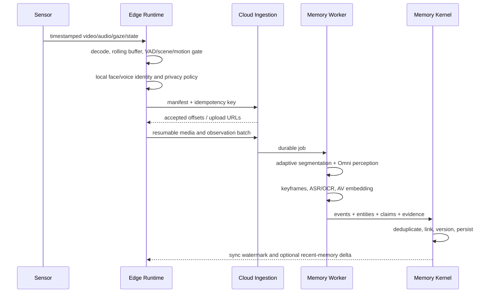
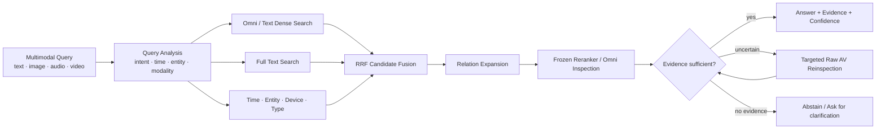
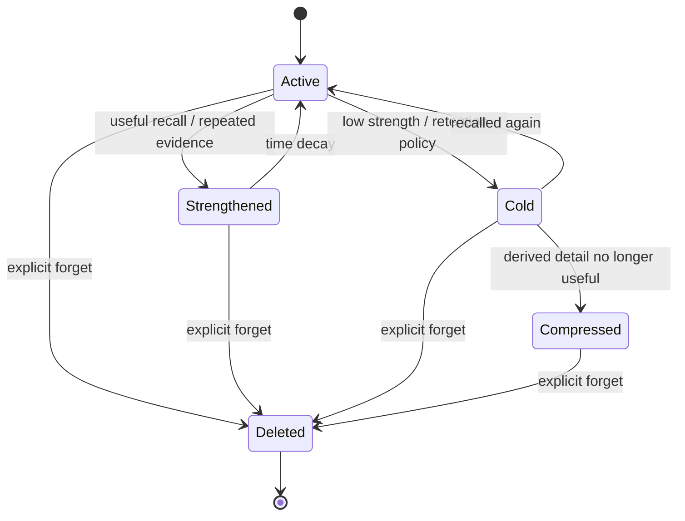

# MindBridge 技术实现架构

> 状态：基线方案（Baseline）
> 版本：0.1
> 更新日期：2026-08-11

## 1. 文档目的

本文定义 MindBridge 的首版技术实现架构、核心数据模型、端云边界、模型与检索策略、API、部署方式和评测路线。它是后续代码实现、Benchmark、技术选型和架构评审的共同基线。

MindBridge 不是机器人、Agent 或大模型。MindBridge 是**记忆本身**：一个 Agentic Native、Embodied、Multimodal-first 的 Memory-as-a-Service（MaaS）系统。

它将机器看到、听到和经历过的连续信号，转化为能够：

- 被检索和追问；
- 回到原始视听证据；
- 随时间合并、强化、纠错和沉淀；
- 按策略衰减，并接受可验证的显式遗忘；
- 被任何机器人、Agent 或应用通过稳定函数调用使用；

的长期记忆。

一句话架构定义：

> **Model is frozen, Memory is alive; evidence is durable, representations are rebuildable.**

## 2. 已确认的目标与约束

### 2.1 产品目标

1. 第一优先级是能力 SOTA，同时所有能力必须能够收敛为可部署的 MaaS 产品。
2. 首批端侧平台是 NVIDIA Jetson 和机器人主机。
3. 人脸识别与声纹识别尽可能在端侧完成；身份模板默认不离开设备。
4. 不要求完全离线。云端是长期记忆和重型推理的主路径，端侧提供连续采集、隐私处理、近期记忆和断网缓冲。
5. 文本侧以 LoCoMo 为核心 Benchmark；多模态侧覆盖 EgoLifeQA、SuperMemory-VQA 和 M3-Bench，并以 SOTA 为目标。

### 2.2 强制设计原则

1. **视听优先**：能由 VLM/Omni 直接理解的内容，不先降格为纯文本再处理。
2. **证据优先**：文本描述、摘要和事实都是派生表示；原始图像、视频、音频及其时间跨度才是最终证据。
3. **冻结模型**：不进行 SFT、LoRA、QLoRA、RL 或任何模型权重微调。
4. **非参数演化**：系统通过记忆状态、索引、实体原型、召回统计、反馈和生命周期策略自学习，而不是修改模型参数。
5. **生态优先**：优先使用官方 SDK、Hugging Face、NVIDIA、OpenAI-compatible、PostgreSQL 等成熟生态，不重复实现通用能力。
6. **轻量起步**：首版采用模块化单体、异步 Worker 和一套主数据库；只有实际指标证明不足时才拆分。
7. **可替换但不泛化过度**：保存模型版本和原始证据以支持重新编码，但不为尚不存在的提供商设计复杂工厂层。
8. **当前阶段效果优先**：代码和模型以实际能力为筛选标准，暂不把 License 作为技术方案过滤条件；仍需记录来源和精确版本以保证可复现。
9. **工程质量是功能要求**：命名、可读性、复杂度、类型、错误处理和测试均是合并门禁，不接受“功能能跑但以后再整理”。

### 2.3 非目标

首版不建设：

- 通用 Agent 编排框架；
- 自研基础模型、Embedding 模型或模型训练平台；
- 自研视频解码、向量数据库、消息队列或 HTTP 客户端；
- 多数据库并存的“全家桶”架构；
- 提前拆分的微服务、Kafka、独立图数据库或独立时序数据库；
- 为某个 Benchmark 特制、无法进入产品路径的旁路实现。

## 3. 系统上下文与总体架构

MindBridge 的职责边界是从连续感知信号到可引用记忆；Agent 只负责提出问题、消费记忆或提交反馈。

```mermaid
flowchart LR
    subgraph DEVICE["Edge Runtime · Jetson / Robot Host"]
        SENSOR["Camera · Microphone · Gaze · IMU · Robot State"]
        CAPTURE["GStreamer / DeepStream Capture\nclock sync · decode · rolling buffer"]
        GATE["Event Gate\nVAD · scene change · motion · gaze"]
        IDENTITY["Local Identity\nface · diarization · voiceprint"]
        EDGE_MEMORY["SQLite Recent Memory\nmanifest · prototypes · outbox"]
        EDGE_OMNI["Optional Local Omni Embedding\nJina v5 Omni Nano"]

        SENSOR --> CAPTURE --> GATE
        GATE --> IDENTITY
        GATE --> EDGE_MEMORY
        IDENTITY --> EDGE_MEMORY
        GATE -. "capable hardware" .-> EDGE_OMNI --> EDGE_MEMORY
    end

    subgraph CLOUD["MindBridge Cloud"]
        INGEST["Ingestion API\nidempotency · policy · tenant"]
        OBJECTS["S3-compatible Object Storage\nraw AV · keyframes · derived clips"]
        WORKER["Memory Worker\neventization · Omni perception · OCR/ASR"]
        EMBED["Embedding Service\nJina v5 Omni Small + Text Small"]
        KERNEL["Memory Kernel\nepisode · entity · claim · provenance"]
        LIFECYCLE["Lifecycle Engine\nconsolidate · strengthen · correct · forget"]
        PG["PostgreSQL + pgvector\nmetadata · vector · text · relation · time"]
        RECALL["Recall Engine\nhybrid retrieve · fuse · rerank · inspect"]
        OMNI["Frozen Omni / VLM\nperception · evidence inspection · answer"]

        INGEST --> OBJECTS
        INGEST --> WORKER
        OBJECTS --> WORKER
        WORKER --> EMBED
        WORKER --> KERNEL
        EMBED --> PG
        KERNEL --> PG
        PG <--> LIFECYCLE
        PG --> RECALL
        OBJECTS --> RECALL
        RECALL <--> OMNI
    end

    CLIENT["Robot · Agent · Application\nREST / Python / MCP"]

    EDGE_MEMORY -->|"resumable sync"| INGEST
    CLIENT -->|"observe · remember"| INGEST
    CLIENT -->|"recall · get · feedback · forget"| RECALL
    RECALL --> CLIENT
```



### 3.1 为什么采用云边分离

端侧离传感器最近，适合承担低延迟、隐私敏感和网络不稳定时仍必须执行的任务；云端适合承担跨设备、跨时间的全局记忆和重型多模态推理。

| 端侧负责 | 云端负责 |
|---|---|
| 连续采集、硬件时间戳和滚动缓存 | 原始证据的长期对象存储 |
| VAD、场景变化、运动、注视等事件门控 | 重型 Omni/VLM 理解与证据重看 |
| 人脸、说话人分离和声纹身份 | 全局实体消歧与跨时间关系构建 |
| 设备域近期记忆和断网 Outbox | 统一多模态 Embedding 和长期索引 |
| 隐私策略、脱敏和上传决策 | 记忆合并、强化、纠错、沉淀与遗忘 |
| 强设备上的可选轻量 Omni Embedding | 混合召回、重排、回答与证据引用 |

不要求完全离线意味着端侧不需要复制完整云能力。断网时保证“继续记录、不丢队列、可查近期”；恢复连接后幂等补传。

## 4. 记忆领域模型

### 4.1 核心概念

| 概念 | 定义 | 是否可作为最终证据 |
|---|---|---|
| `MediaObject` | 原始或派生的图像、视频、音频对象 | 是 |
| `Observation` | 某设备在某时刻记录到的一段传感器观察 | 是 |
| `EvidenceSpan` | 指向媒体对象中精确时间、帧、区域或音频区间的引用 | 是 |
| `Event` | 由一个或多个 Observation 组成的语义完整事件 | 否，必须回指 EvidenceSpan |
| `Episode` | 一组具有连续目标、地点、人物或叙事关系的 Event | 否 |
| `Entity` | 人、物体、地点、设备、组织或抽象主题 | 否 |
| `Claim` | 从证据推导出的可追踪事实、状态、意图或关系 | 否 |
| `Summary` | 对 Event、Episode、日或主题的压缩表示 | 否 |
| `MemoryRecord` | 对外统一返回的 Episode、Claim、Summary 或显式记忆 | 否 |

任何派生内容都必须带 `evidence_ids`、模型版本和生成时间。缺少证据的派生内容只能标记为
`unverified`，不能伪装成观察事实。通过 `remember` 原样提交的来源陈述标记为 `attested`：它可
作为“某调用者曾这样陈述”的依据，但不等同于传感器证据支持的 `verified` 事实。

### 4.2 分层记忆

MindBridge 使用可逐级展开的层级，而不是把所有内容压成一段摘要：

```text
Timeline / Person
└── Day or Session
    └── Episode / SuperEvent
        └── Event / MacroEvent
            └── EvidenceSpan / SubEvent
                ├── video frames
                ├── audio span
                ├── OCR / ASR
                └── gaze / IMU / robot state
```

该结构吸收 Qwen Video Memory 的层级下钻思路和 M3-Agent 的实体中心多模态图，但以持续流式经历而不是单个静态视频为基本场景。

### 4.3 记忆类型

- **感知记忆**：短期滚动媒体和尚未稳定的 Observation。
- **工作记忆**：端侧近期 Event、当前任务涉及的人物和环境状态。
- **情景记忆**：带时间、地点、人物和证据的 Episode/Event。
- **语义记忆**：从多个 Episode 沉淀出的 Claim、实体属性和关系。
- **程序记忆**：从重复过程归纳出的步骤，但始终保留代表性证据。
- **前瞻记忆**：用户承诺、计划、提醒和尚未完成的意图。

这些是同一套领域模型的不同 `memory_type`，首版不为每种类型建设独立数据库。

### 4.4 时间与版本

所有记录同时保留“世界发生时间”和“系统知道时间”：

- `occurred_at` / `ended_at`：事件在真实世界中的时间范围；
- `observed_at`：设备产生观察的时间；
- `ingested_at`：云端接收时间；
- `valid_from` / `valid_to`：Claim 在世界中被认为有效的区间；
- `created_at` / `superseded_at`：该版本在系统中的存续区间。

纠错不直接覆盖旧事实。新 Claim 通过 `supersedes`、`supports` 或 `contradicts` 关系连接旧版本，从而回答“当时我们以为什么”和“后来发现了什么”。

### 4.5 最小云端数据表

首版使用 PostgreSQL + pgvector，关系图通过普通关系表表达：

| 表 | 主要职责 |
|---|---|
| `media_objects` | 对象存储地址、哈希、编解码信息、保留策略 |
| `observations` | 设备、传感器、时间范围、同步偏差和上传状态 |
| `evidence_spans` | 精确媒体时间段、帧区间、ROI、音轨和 Observation 引用 |
| `events` | 事件边界、类型、显著度、状态和父层级 |
| `entities` | 规范实体及设备域匿名身份映射 |
| `entity_mentions` | 实体在 Event/EvidenceSpan 中的出现 |
| `claims` | 带时态、置信度和版本的事实/意图/关系 |
| `claim_evidence` | Claim 与证据的多对多映射 |
| `relations` | Event、Entity、Claim 之间的有类型边 |
| `embeddings` | 对象类型、对象 ID、模型、版本、任务、维度和向量 |
| `memory_feedback` | 召回结果的有用、错误、遗漏和纠正反馈 |
| `deletion_tombstones` | 跨端云传播的显式删除状态，不保留被删内容 |
| `jobs` | 可追踪的导入、编码、重建和删除工作状态 |

初期不引入 Neo4j、Milvus/Qdrant 或 TimescaleDB：

- 关系遍历先使用关联表和递归 CTE；
- 时间查询先使用 B-tree/BRIN 索引；
- 稠密向量使用 pgvector；
- 精确文字检索使用 PostgreSQL Full Text Search；
- 只有实际数据规模或 Benchmark 证明单库成为瓶颈时才拆分。

### 4.6 最小端侧数据

SQLite 只保存继续采集和近期召回必需的信息：

- 媒体滚动缓存的 manifest 和校验和；
- 待同步 Observation/Event Outbox；
- 设备域人脸和声纹 prototype；
- 近期 Event、可选本地向量及其过期时间；
- 云端确认的同步 watermark 和删除 tombstone。

## 5. 写入与记忆构建

### 5.1 连续观察流程



### 5.2 事件切分

固定长度切片只能作为推理输入上限，不能直接等同于记忆边界。首版采用：

1. VAD、镜头变化、运动状态、注视变化、人物进入/离开和机器人任务状态产生候选边界；
2. 合并极短片段，避免每帧形成一个 Event；
3. 对过长片段按可配置的 `max_analysis_window` 切分，并保留重叠区；
4. Omni 模型判断语义边界并将相邻片段合并为 Event/Episode；
5. 原始时间范围保持不变，后续可以重新切分而不重新采集。

M3-Agent 的 30 秒切片可作为首个 Benchmark 基线，但最终边界由真实 Jetson 负载和多模态检索效果校准。

### 5.3 多模态理解

对于每个候选 Event，优先让 Omni/VLM 同时查看画面和音频，产生：

- 时间对齐的视听事件描述；
- 人物、物体、地点、动作和交互；
- ASR、说话人区间、OCR 和空间定位；
- 事件开始/结束、重复次数和关键帧；
- 显著度、可验证 Claim 和不确定性；
- 对全部输出的 EvidenceSpan 引用。

ASR、OCR 和 caption 是可检索视图，不是原始经历的替代品。遇到召回问题时，系统应回看媒体，而不是仅让文本 LLM 阅读 caption。

### 5.4 幂等和可恢复性

- 每个 Observation 使用 `tenant_id + device_id + boot_id + sequence` 构造稳定幂等键；
- 媒体对象按内容哈希去重，分片上传支持断点续传；
- manifest 先于大媒体上传，使云端能判断缺失范围；
- Worker 必须可重试，写入使用 upsert/唯一约束防止重复记忆；
- 设备同时记录单调时钟和墙上时钟，上传时附带估计时钟偏差；
- 云端确认 watermark 后，端侧才可按保留策略释放滚动缓存。

首版 `mindbridge.edge` 已把这一恢复语义落实为文件型 SQLite Outbox：数据库启用 WAL 与
`synchronous=FULL`，文件权限收紧为 `0600`；`tenant_id + device_id + boot_id + sequence` 同时受
稳定 ID 和唯一约束保护，同一序列异内容立即冲突。GStreamer/DeepStream 关闭片段后，薄 capture
handoff 只计算 size/SHA-256、稳定对象键、时钟区间和幂等键并入队，不接管 NVIDIA 的解码、编码
或门控。同步器先用 Boto3 标准凭证链上传 tenant-scoped S3 对象，再通过异步 Python SDK 调用
`observe`。媒体上传成功会单独落盘，因此 API 暂时离线不会重复传大文件；receipt、水位推进和
Outbox 删除在一个 SQLite 事务中完成，进程在任意网络步骤崩溃都可安全重放。失败仅保存错误码和
次数，不保存异常正文或凭证；重试节奏交给机器人 supervisor/systemd，避免框架内再造守护进程。
本地媒体不会被同步器擅自删除，滚动缓存只能在读取 watermark 后按设备策略释放。

## 6. 模型与 Embedding 架构

### 6.1 初始模型配置

MindBridge 采用“明确默认、保存版本、允许重建”的策略。模型不微调。

| 能力 | 初始实现 | 运行位置 |
|---|---|---|
| AV 理解、caption、时间定位、计数 | Qwen Omni，通过 OpenAI-compatible API；以当前可用最强版本为默认 | 云端 |
| 视觉 OCR、grounding、补充检查 | Qwen VL/VLM 或对应成熟专用模型 | 云端，必要时端侧 |
| 跨模态主召回 | `jina-embeddings-v5-omni-small-retrieval` | 云端 |
| 文本派生表示 | `jina-embeddings-v5-text-small`，与 Omni Small 对齐 | 云端 |
| 端侧跨模态近期召回 | `jina-embeddings-v5-omni-nano-retrieval` | 强 Jetson/机器人主机，可选 |
| 人脸检测与身份向量 | InsightFace/SCRFD/ArcFace 生态中的预训练实现 | 端侧 |
| 说话人分离与声纹 | SpeakerLab/ERes2NetV2 等预训练实现 | 端侧 |
| 最终回答和证据核验 | 能直接读取候选图像、视频和音频的冻结 Omni/VLM | 云端 |

具体模型 ID、服务地址和版本属于部署配置；数据中必须记录精确 `model_id` 和 `revision`。

### 6.2 Jina v5 Omni 的职责

`jina-embeddings-v5-omni-small-retrieval` 是云端默认的**第一阶段跨模态候选召回器**，不是最终判断器，也不是人脸或声纹模型。

采用它的原因：

- 文本、图像、视频和音频进入统一语义空间；
- 与 `jina-embeddings-v5-text-small` 对齐，派生文本可以使用更便宜的文本塔编码；
- 支持 retrieval 专用的 query/document 编码；
- 支持 Matryoshka 截断维度，便于端侧或低成本索引试验；
- 可以通过 Hugging Face 和 vLLM 生态直接使用，不需要自研加载和 serving。

首版约定：

- 云端主索引保存 Small 的完整 1024 维归一化向量；
- Nano 的 768 维向量只进入独立端侧近期索引，不和云端 Small 向量混查；
- 对查询调用 `encode_query()`，对记忆对象调用 `encode_document()`；
- 每条向量保存 `model_id`、`revision`、`task`、`dimension`、`normalized` 和 `created_at`；
- 切换模型时创建新向量版本并后台重建，不原地混用不同空间。

生产实现将两侧放在不同进程中，但严格使用同一冻结空间：Memory Worker 通过 Hugging Face
`sentence-transformers` 的 `encode_document()` 生成 EvidenceSpan 向量；API 通过 vLLM 的
OpenAI-compatible `/embeddings` 端点生成 `encode_query` 语义的查询向量。两条路径默认固定到
revision `12949877f0092093f366c6450340011320152a05`。文本请求使用 OpenAI SDK 的
`embeddings.create()`；SDK 尚未声明类型的多模态 `messages` 也只通过同一 SDK 的低层
`post()` 发送，不另写 HTTP 客户端。API 因此不加载 Jina 权重，模型只存在于 Worker 或独立
vLLM pooling 进程。

### 6.3 为什么必须保留多种索引

一个通用 Omni 向量不能同时解决全部问题：

- “画面/声音表达了什么”属于通用语义；
- “具体是谁”属于生物身份；
- “第几次、什么时候、之前还是之后”属于结构化时间；
- 姓名、数字、型号和原话需要精确文字检索；
- 复杂问题需要回到原始媒体进行二次核验。

因此首版同时保留：

1. Jina Omni 跨模态稠密向量；
2. Jina Text 派生文本稠密向量；
3. PostgreSQL Full Text Search；
4. 时间、设备、人物、地点和类型索引；
5. 端侧隔离的人脸/声纹身份向量；
6. Event、Entity 和 Claim 的关系边。

### 6.4 Jetson 模型分级

| 设备档位 | 默认行为 |
|---|---|
| Orin Nano/NX 等资源受限设备 | 事件门控、人脸/声纹、滚动缓存和上传；通用 Omni Embedding 交给云端 |
| AGX Orin 或高配机器人主机 | 在不影响主感知任务时运行 Jina Omni Nano，建立端侧近期索引 |
| 带独立 GPU 的机器人主机 | 可运行完整本地近期召回和部分 Omni 理解；云端仍负责全局长期记忆 |

是否启用 Nano 由实际吞吐、显存、功耗和主任务余量决定，不按“能够加载模型”判断。端侧使用 TensorRT/DeepStream/GStreamer 等 NVIDIA 原生生态，保留帧率、分辨率、VAD 和事件窗口等硬件校准参数。

### 6.5 冻结模型边界

禁止：

- 对任何基础模型或 Embedding 模型进行 SFT、LoRA、QLoRA、RL；
- 为 Benchmark 训练隐藏分类头或数据集专用模型；
- 用线上用户数据更新模型权重。

允许：

- Prompt、tool calling、inference-time 多轮检查；
- 使用官方发布的 retrieval/task adapter 权重；
- 选择、组合或替换更强的预训练模型；
- 更新记忆、实体 prototype、索引、阈值、Top-K 和生命周期状态；
- 根据反馈统计调整召回预算，但所有策略可追踪、可回滚；
- 使用原始证据对新模型重新编码。

## 7. 召回、追问与回答

### 7.1 Recall Pipeline



### 7.2 查询步骤

1. 解析查询中的时间、人物、地点、物体、事件类型和预期答案形式；媒体查询直接进入 Omni 分析。
2. 并行执行跨模态稠密、文本稠密、全文、时间和实体检索。
3. 使用 Reciprocal Rank Fusion（RRF）合并不同分值空间的结果，避免训练融合模型。
4. 沿 `before/after`、`same_episode`、`mentions`、`supports` 等关系展开少量邻居。
5. 用冻结 reranker 或 Omni/VLM 查看候选证据，而不是只看摘要。
6. 对计数、先后、多跳和细节问题定向重读原始片段。
7. 返回答案、MemoryRecord、EvidenceSpan、置信度和推理追踪 ID。
8. 证据不足时明确拒答或请求补充，而不是从相似摘要中猜测。

当前可运行基线已经实现 EvidenceSpan 稠密检索、PostgreSQL FTS、结构化过滤、RRF 和原始
视听证据重看。纯媒体查询只使用跨模态稠密候选，避免把“最近记忆”伪装成相关结果；文本查询
并行运行稠密与稀疏召回。关系展开、专用 reranker 和多轮定向重读按 Benchmark 失败案例加入，
不预先建设空框架。

### 7.3 追问

`recall` 返回的每条记忆都带稳定 ID 和证据。后续追问通过 `conversation_id`、`previous_recall_id` 或显式 `memory_ids` 限定上下文；服务端不把整段历史无限拼接，而是保留本轮使用过的证据集合和查询约束。

### 7.4 计数和时间问题

“出现几次”“第一次/最后一次”“在某件事之前发生了什么”不能仅依赖语义 Top-K：

- `enumerate` 模式扫描满足条件的全部 Event；
- 时间范围和去重规则先结构化执行；
- Omni 负责验证每个候选是否确实构成目标事件；
- 最终结果返回全部 occurrence 的时间戳和证据。

该路径借鉴 Qwen Video Memory 的 `enumerate_events` 和 `search_by_time` 能力。

## 8. 自学习、自进化与自遗忘

### 8.1 模型冻结，记忆演化

MindBridge 的学习对象是记忆状态：

- 新 Event 与既有 Episode/Entity 建立联系；
- 重复观察形成更稳定的 Claim；
- 用户纠正产生新版本并降低错误 Claim 的可信度；
- 人脸和声纹 embedding 更新设备域 prototype/centroid；
- 召回反馈更新不同查询类型的候选预算和阈值统计；
- 高频、有用、近期或高显著度记忆获得更高保留强度；
- 低价值且长期未使用的派生表示被压缩或清除。

所有变化写入审计字段和来源，不能产生无法解释的“模型自己记住了”。

### 8.2 Consolidation

后台 Consolidator 周期性执行：

1. 使用向量相似度、时间重叠和实体重叠发现候选重复；
2. 由 Omni/VLM 对候选证据进行合并验证；
3. 将相邻 Event 组织为 Episode；
4. 从多个证据形成 Claim，并保留每个支持/冲突证据；
5. 生成日、人物、地点和主题级 Summary；
6. 对已替代的派生摘要降级，但不覆盖历史事实；
7. 更新访问频次、有效反馈、关联价值和最后使用时间。

不允许仅因向量相似就自动合并身份或互相矛盾的事件。

### 8.3 记忆强度

首版使用透明、可配置的统计分数，不训练遗忘模型：
```text
strength = salience
         + log(1 + useful_access_count)
         + positive_feedback
         + relation_utility
         + novelty
         - age_decay
         - negative_feedback
```

各项原始值和最终决策都要可观测。系数首先由 Benchmark 和产品回放集校准；需要为不同硬件采集频率和使用场景保留调节参数。

首版自动演化由 `mindbridge-lifecycle` 作为租户级计划任务执行：一次完整扫描固定同一
`evaluated_at`，按稳定 `memory_id` cursor 分页，并用原状态、分数和计数做乐观更新。扫描期间若
发生反馈、纠错或删除，则并发操作优先，本次过期结果不会覆盖新状态；下一轮计划任务重新评估。
系数和冷热阈值均为显式参数，部署在完成 Benchmark 与真实机器人回放校准后再锁定。

### 8.4 遗忘状态机



- **Cold**：移除热索引或迁移媒体到低成本存储，但仍可恢复召回。
- **Compressed**：保留上层 Claim/Summary 和必要证据，清理可重建派生表示。
- **Deleted**：显式遗忘；删除原始证据、派生媒体、向量、缓存和相关身份映射，并向端侧传播 tombstone。

显式 `forget` 优先级高于自动保留策略。删除审计只记录对象 ID、范围、执行状态和时间，不保存被删除内容。

## 9. Agent 与开发者接口

### 9.1 核心函数

MindBridge 对外只暴露少量稳定语义：

| 语义 | Python/领域函数 | REST | MCP Tool |
|---|---|---|---|
| 提交连续或离散观察 | `observe(...)` | `POST /v1/observations` | `memory_observe` |
| 显式写入需要长期保留的内容 | `remember(...)` | `POST /v1/memories` | `memory_remember` |
| 多模态召回和回答 | `recall(...)` | `POST /v1/recall` | `memory_recall` |
| 获取记忆及其证据 | `get(memory_id)` | `GET /v1/memories/{id}` | `memory_get` |
| 提交有用、错误、遗漏或纠正 | `feedback(...)` | `POST /v1/feedback` | `memory_feedback` |
| 显式遗忘某段内容或范围 | `forget(...)` | `POST /v1/forget` | `memory_forget` |

HTTP、Python 和 MCP 共享同一层 use case，不各自复制业务逻辑。

### 9.2 `recall` 最小请求

```json
{
  "query": {
    "text": "我最后一次把红色螺丝刀放在哪里？",
    "media": []
  },
  "filters": {
    "person_ids": [],
    "device_ids": [],
    "occurred_after": null,
    "occurred_before": null
  },
  "mode": "answer",
  "limit": 20,
  "include_evidence": true
}
```

### 9.3 `recall` 最小响应

```json
{
  "answer": "它最后一次出现在工作台右侧的蓝色工具盒旁。",
  "confidence": 0.91,
  "memories": [
    {
      "id": "mem_...",
      "type": "episodic",
      "occurred_at": "2026-08-11T09:42:13+08:00",
      "summary": "用户将红色螺丝刀放在蓝色工具盒旁。",
      "evidence_ids": ["evd_..."]
    }
  ],
  "evidence": [
    {
      "id": "evd_...",
      "media_id": "media_...",
      "start_ms": 184200,
      "end_ms": 188900,
      "thumbnail_url": "..."
    }
  ],
  "trace_id": "trace_..."
}
```

### 9.4 API 语义要求

- 所有写接口支持 `idempotency_key`；
- 长任务立即返回 receipt/job ID，不占用同步请求；
- Observation 处理状态通过 `GET /v1/jobs/{job_id}?tenant_id=...` 查询，调用方在状态为
  `succeeded` 后再发起依赖派生记忆的 Recall；
- 所有列表使用 cursor 分页；
- Recall 默认返回证据，不只返回自然语言答案；
- `forget` 是幂等操作，并能查询端云传播状态；
- 每个响应带 `trace_id`，便于 Benchmark 和线上问题复现；
- OpenAPI 是 REST 契约的唯一事实来源，MCP Tool schema 从同一 Pydantic 模型生成。

## 10. 生态依附与技术栈

### 10.1 选择顺序

对通用能力执行以下顺序：

1. 官方 SDK；
2. Hugging Face 或硬件原生生态；
3. 已安装、成熟的开源库；
4. 上游官方代码；
5. 只有以上均不能满足时，编写最薄的适配代码。

### 10.2 首选生态

| 能力 | 首选实现 | 禁止重复实现的内容 |
|---|---|---|
| 模型加载 | `transformers`、`sentence-transformers` | tokenizer、processor、pooling、批处理 |
| 模型和数据下载 | `huggingface_hub` | 自写下载器、缓存和断点逻辑 |
| Benchmark 数据 | `datasets`，优先官方 loader | 手工抓取和私有数据格式 |
| 云端模型 serving | vLLM/OpenAI-compatible server | 自研推理 HTTP 协议 |
| 兼容模型调用 | `openai.AsyncOpenAI(base_url=...)` | `requests`/`httpx` 手写供应商接口 |
| 非 OpenAI-compatible 服务 | 服务官方 SDK | 通用 REST 包装器 |
| Jetson 媒体与推理 | DeepStream、GStreamer、TensorRT | 自研解码、帧管线和 runtime |
| 视频/音频 | FFmpeg、ffprobe、PyAV、TorchCodec | 自研编解码器 |
| API 与 schema | FastAPI、Pydantic、OpenAPI | 自研 Web 框架和 schema 系统 |
| Agent 接入 | MCP 官方 SDK | 独立维护第二套业务接口 |
| 数据库 | PostgreSQL、pgvector、官方驱动 | 自研索引或存储引擎 |
| 对象存储 | S3-compatible 官方 SDK | 自研分片上传协议 |
| 异步任务 | Celery + Redis（首版） | 自研可靠消息队列 |
| 可观测性 | OpenTelemetry | 自研 tracing/metrics 协议 |

若上游代码不能作为依赖直接使用，可以 vendor 最小必要部分，但必须记录仓库、commit、修改补丁和调用边界。MindBridge 不维护与上游功能等价的长期 fork。

### 10.3 OpenAI-compatible 统一调用

Qwen、vLLM 或其他提供 OpenAI-compatible endpoint 的模型统一使用 OpenAI SDK：

```python
from openai import AsyncOpenAI

client = AsyncOpenAI(api_key=api_key, base_url=base_url)
```

供应商差异收敛到模型名、`base_url` 和必要请求字段；不为每个供应商新增一套 HTTP client。仅当服务不兼容且没有官方 SDK 时，才允许一个局部、可删除的薄适配器。

## 11. 工程实现规范（强制）

本章不是风格建议，而是代码进入主分支的 Definition of Done。MindBridge 的工程目标是：一个首次接触模块的工程师能够从名称、类型和测试理解行为，而不必先解读框架、隐式状态和历史包袱。

“优雅”不等于聪明或抽象层数多，而是：

- 名称准确，调用方式自然；
- 控制流短，失败方式明确；
- 领域逻辑只存在一处；
- 依赖方向稳定，外部生态被限制在边界；
- 删除和替换代码容易；
- 凌晨排障时无需猜测。

### 11.1 领域词汇与命名

代码、数据库、API、MCP 和文档必须使用同一套领域词汇：`Observation`、`EvidenceSpan`、`Event`、`Episode`、`Entity`、`Claim`、`MemoryRecord`。同一概念不得在不同模块中分别叫 `item`、`record`、`node` 或 `data`。

| 对象 | 规则 | 推荐示例 | 拒绝示例 |
|---|---|---|---|
| 命令函数 | 动词 + 明确对象 | `build_event`、`link_evidence`、`forget_memory` | `process`、`handle_data`、`do_task` |
| 查询函数 | 使用 `get/list/find/search/recall` 区分语义 | `get_event`、`find_candidate_events` | `query_data`、`fetch_stuff` |
| 布尔函数 | 使用 `is/has/can/should` | `is_evidence_sufficient` | `check_evidence`、`evidence_flag` |
| 标识符 | 写出实体和 ID | `event_id`、`evidence_id` | `id`、`eid`、`x` |
| 带单位数值 | 名称包含单位 | `duration_ms`、`size_bytes`、`frame_rate_fps` | `duration`、`size`、`rate` |
| 集合 | 使用复数名词 | `candidate_events` | `event_list_data` |
| 常量 | 大写并表达业务意义 | `MAX_UPLOAD_ATTEMPTS` | `THREE`、`LIMIT` |

补充规则：

- Python 使用 `snake_case` 函数/变量、`PascalCase` 类型、`UPPER_SNAKE_CASE` 常量；
- 除 AV、ASR、OCR、VLM、ID 等领域通用缩写外，不创造项目私有缩写；
- 名称应说明业务意图，而不是实现方式，例如 `recall_memories` 优于 `run_pgvector_query`；
- `async` 不写进函数名，异步性由签名表达；
- 公共函数不得使用含义不明的布尔位置参数，例如 `recall(query, True, False)`；使用具名参数或 Enum；
- 一个新术语必须先进入领域词汇表，不能通过代码扩散后再补定义。

公共用例保持简短、对称且可预测：

```python
async def observe(request: ObserveRequest) -> ObservationReceipt: ...
async def remember(request: RememberRequest) -> MemoryRecord: ...
async def recall(request: RecallRequest) -> RecallResult: ...
async def get_memory(memory_id: MemoryId) -> MemoryRecord: ...
async def record_feedback(request: FeedbackRequest) -> FeedbackReceipt: ...
async def forget(request: ForgetRequest) -> ForgetReceipt: ...
```

### 11.2 函数设计与复杂度

1. 一个函数只做一件可命名的事，并保持同一抽象层级。
2. 优先使用 guard clause/early return，正常路径不超过三层缩进。
3. 纯转换逻辑优先写成无 I/O 的纯函数；事务、网络和模型调用留在用例或 Adapter 边界。
4. 公共函数必须完整标注输入、返回值和可能抛出的领域错误。
5. 参数超过 5 个通常说明缺少明确请求对象；不得用无类型 `**kwargs` 隐藏接口。
6. 非机械函数超过 50 行、圈复杂度超过 10 或嵌套超过 3 层时，PR 必须拆分或写出不能拆分的具体理由。
7. 不通过把代码搬进大量一行私有函数来伪造低复杂度；拆分后的函数必须拥有独立业务含义。
8. 禁止依赖可变全局状态、导入时副作用和调用顺序才能成立的隐式协议。
9. 同一个规则在多个调用方重复出现时，应修正在共同路径；Bug 修复必须定位根因并检查全部调用方。

行数和复杂度是评审触发线，不是质量本身。一个清晰的 55 行状态机可以保留；一个散落在 12 个函数中的隐式流程仍然必须重写。

### 11.3 简洁性、复用与抽象

每次新增代码依次回答：

1. 这段能力是否真的需要存在？
2. 仓库中是否已经有相同领域函数、类型或调用路径？
3. Python 标准库或数据库原生能力是否已经解决？
4. Hugging Face、OpenAI SDK、NVIDIA 或现有依赖是否已经提供？
5. 只有前四项都不成立时，才写最小实现。

强制规则：

- 一个实现不创建 Interface + Factory + Registry；只有外部边界明确易变或已经存在第二个实现时才抽象；
- 不为“未来可能需要”添加参数、配置、Hook、基类、事件总线或兼容层；
- 两次重复可以先保持局部清晰；第三次出现且语义稳定时再提取公共逻辑，避免错误抽象；
- 优先组合，不建立深继承树；领域实体不继承 SDK/ORM 类型；
- 不保留注释掉的代码、未使用 feature flag、死分支或“以后会用”的 helper；Git 已保存历史；
- 新依赖必须删除明显更多的自研代码，并且不能与现有依赖能力重复；
- 能用数据库唯一约束、外键、事务和索引保证的规则，不在多个业务函数中重复模拟。

### 11.4 模块边界与依赖方向

| 层 | 可以做 | 不可以做 |
|---|---|---|
| `api` | 协议转换、鉴权、输入验证、调用 use case | SQL、Prompt、Embedding、记忆合并规则 |
| `core` | 领域类型、规则、用例和领域错误 | 导入 FastAPI、OpenAI、Transformers、数据库驱动 |
| `ingest/recall/lifecycle` | 编排领域操作和声明事务边界 | 复制领域规则、直接处理 HTTP |
| `models` | 封装 Hugging Face/OpenAI SDK 的模型 I/O | 决定记忆是否合并、保留或删除 |
| `edge` | 采集、身份、近期记忆和同步 | 知晓云端数据库内部结构 |
| infrastructure adapter | PostgreSQL、S3、Redis、SDK 细节 | 向上泄漏供应商响应对象 |

依赖只能由外向内：协议和基础设施依赖核心，核心不反向依赖框架。API、Worker 和 MCP 必须调用同一个 use case，禁止维护三套实现。

禁止出现：

- 包含不相关功能的 `utils.py`、`helpers.py`、`common.py`；
- 掌握全部流程的 `MemoryManager`、`GodService` 或万能 Repository；
- 循环 import；
- SQL、对象存储路径、Prompt 或模型名称散落在业务模块；
- 为每个模型供应商复制一套 recall/ingest 流程；
- 模型返回的原始 `dict` 穿过多个层级后才解析。

单文件超过 400 行或单模块出现 15 个以上平铺文件时触发边界评审，但不为满足数字机械拆文件。

### 11.5 类型与数据契约

- 所有外部输入在信任边界立即使用 Pydantic 校验；数据库结果和 SDK 响应在 Adapter 内转换为内部类型；
- 核心模块不得用裸 `dict[str, Any]` 传递 Event、Claim、RecallResult 等领域数据；
- 禁止无范围的 `Any`。第三方 SDK 类型不完整时，只允许在最窄 Adapter 中使用带错误码的 `type: ignore`；
- 时间必须是带时区的 `datetime`，持久化统一使用 UTC，展示时再转换；
- duration、offset、size、confidence 等值必须有明确单位和合法范围；
- 枚举状态使用 Enum/Literal，不用散落的字符串；
- ID、幂等键、模型版本和 EvidenceSpan 是公共契约的一部分，不得隐式生成后丢失；
- 关键不变量同时由应用校验和数据库约束保护，例如唯一键、外键和 `CHECK`。

Schema 变更必须向后兼容或带显式迁移；不得在 Worker 和 API 不同时升级时产生无法读取的中间状态。

### 11.6 错误处理、重试与数据安全

1. 使用有意义的领域错误，例如 `EvidenceNotFound`、`ModelUnavailable`、`MemoryAlreadyDeleted`；不向上抛出含供应商细节的裸异常。
2. 不吞异常、不用空 `except`、不以 `None` 同时表达“未找到”和“处理失败”。
3. 仅对幂等且瞬时失败的 I/O 重试；使用有上限的指数退避和 jitter。
4. 每次外部调用必须有 timeout；批处理必须有并发上限、取消和部分失败语义。
5. 数据写入先确定事务边界；媒体、数据库和任务状态无法原子提交时使用可恢复状态，而不是假装原子。
6. `forget`、身份模板、同步 watermark 等数据安全路径必须优先保证正确性，不能以“代码更短”为由删除校验。
7. 日志保留 `trace_id`、对象 ID 和错误类别，不记录密钥、原始生物特征或完整用户记忆。
8. 捕获异常后改变错误语义时使用异常链，保留根因用于排障。

### 11.7 异步与性能

- 相互独立的网络、模型或存储调用应并行执行，但必须通过 Semaphore、Worker 并发或服务配额限制扇出；
- 禁止在 async event loop 中执行同步媒体解码、CPU 密集推理或阻塞 SDK；这些工作进入 Worker/thread/process 或原生 runtime；
- 不进行没有测量数据的缓存、批处理或微优化；先记录 trace，再优化最慢路径；
- 数据库查询只选择需要字段，分页查询必须有稳定排序和索引；禁止无界列表和生产环境全表拉取；
- 媒体和向量按流/批处理，不能为方便一次性读入无限长度视频；
- 每项优化必须保留等价性测试，并记录换取的延迟、吞吐、显存或成本收益。

### 11.8 Prompt 与模型调用代码

- 能通过 Hugging Face processor、`sentence-transformers` 或 OpenAI SDK 完成的输入构造，不手拼协议或 base64 JSON；
- Prompt 按能力集中、命名和版本化，例如 `extract_event_v1`，不能散落在 API handler 和 Worker 中；
- 优先使用结构化输出，并在模型边界立即做 schema 校验；不靠脆弱正则从自然语言中猜 JSON；
- 模型 ID、revision、task、采样参数和 Prompt 版本全部进入 trace/run manifest；
- 模型供应商特例只存在于 Adapter，核心逻辑只消费领域结果；
- fallback 必须显式、可观测且有次数上限，禁止悄悄切换模型导致 Benchmark 不可复现。

### 11.9 注释、Docstring 与文档

- 代码通过名称和类型表达“做什么”，注释只解释“为什么”、不变量、硬件限制和反直觉取舍；
- 禁止把代码逐行翻译成注释；代码变化后失真的注释比没有注释更差；
- 公共函数必须有简短 Docstring，说明语义、关键参数、返回值、领域错误和最小示例；
- 有意保留的简单实现必须说明已知上限和升级触发条件；
- TODO 必须包含原因和可追踪 issue，不接受无期限的 `TODO: refactor later`；
- API、配置和运行命令变更必须在同一 PR 更新 OpenAPI/README/本文档。

### 11.10 测试要求

- 非平凡分支、循环、解析、时间逻辑、召回融合和安全删除至少留下一个能在回归时失败的自动化测试；
- Bug 修复先证明根因，并为共享路径添加回归测试；不只测试报告问题的单个调用方；
- 测试名称描述行为和条件，例如 `test_recall_abstains_when_evidence_is_missing`，禁止 `test_works`；
- 单元测试优先验证领域行为；第三方模型、数据库和对象存储使用少量契约/集成测试，不把所有东西 mock 成实现细节；
- 测试必须确定性。时间、随机数、模型版本和外部响应需要固定或显式注入；
- `forget`、幂等上传、Claim 版本和端云 tombstone 覆盖成功、重复、部分失败和恢复路径；
- 影响召回行为的变更必须运行 Golden Recall；影响架构能力的变更必须运行对应 Benchmark smoke subset；
- 不以覆盖率百分比替代测试质量，但任何未覆盖的关键失败路径都阻止合并。

### 11.11 自动化质量门禁

引入首批 Python 代码时，在 `pyproject.toml` 和 CI 中一次性配置成熟工具，不自研检查器：

| 门禁 | 建议工具/命令 | 要求 |
|---|---|---|
| 格式化 | `ruff format --check .` | 必须通过 |
| Lint 与复杂度 | `ruff check .`，启用明确规则和 `C901` | 必须通过；禁止全局忽略 |
| 类型 | `mypy src` | `core`、API schema 和公共函数严格；第三方边界局部豁免 |
| 测试 | `pytest` | 必须通过，无静默 skip |
| 数据库迁移 | migration upgrade + schema test | 必须可从上一版本升级 |
| API 契约 | OpenAPI/MCP schema snapshot | 非预期破坏即失败 |
| 召回回归 | Golden Recall smoke set | 证据 Recall 或回答质量显著下降即失败 |
| 文档与空白 | `git diff --check` + Markdown/link check | 必须通过 |

禁止通过大范围 `# noqa`、`type: ignore`、跳过测试或降低规则来让 CI 变绿。例外必须限制到单行、写明错误码和原因，并在 Code Review 中显式确认。

### 11.12 Code Review 拒绝项

出现以下情况时默认拒绝合并：

- `process_data`、`MemoryManager` 等无法从名称判断职责的核心 API；
- API handler、Celery task 或 MCP tool 内包含领域业务规则；
- 新建与 OpenAI/Hugging Face/NVIDIA 官方能力重复的客户端或处理器；
- 为单个实现加入 Factory、Registry、深继承或通用插件系统；
- 跨模块传递无 schema 的 `dict/Any`；
- 捕获异常后只记录日志并继续返回成功；
- 复制粘贴同一修复到多个调用方而不处理共同根因；
- Benchmark 专用分支进入生产代码，或根据问题 ID/答案内容改变行为；
- 没有 EvidenceSpan 的事实被标记为已验证记忆；
- 依赖、模型或 Prompt 版本没有锁定；
- 大量重命名、格式化和行为变化混在同一 PR，无法可靠评审；
- 新增代码没有最小必要测试，或文档与实现明显不一致。

### 11.13 Definition of Done

每个变更合并前，作者和 Reviewer 必须能回答“是”：

- [ ] 名称是否只看签名就能理解意图、输入和结果？
- [ ] 是否复用了仓库、标准库、平台能力或成熟生态？
- [ ] 是否删除了不必要的抽象、重复代码和死代码？
- [ ] 领域规则是否位于唯一正确的共同路径？
- [ ] 输入、输出、单位、状态和失败方式是否有类型/Schema？
- [ ] 外部调用是否有 timeout、有限重试、并发上限和可观测 trace？
- [ ] 是否有一个最小测试能在该行为破坏时失败？
- [ ] 是否保留证据、幂等、隐私和显式遗忘等不可妥协约束？
- [ ] 是否更新了受影响的 API、配置、运行命令和技术文档？
- [ ] 这段代码半年后是否仍比重新实现更容易理解和修改？

## 12. 部署架构

### 12.1 首版进程拓扑

首版是模块化单体，不是微服务集合：

```text
Edge
└── mindbridge-edge
    ├── capture / gating
    ├── local identity
    ├── SQLite recent memory
    └── sync client

Cloud
├── mindbridge-api       # REST + MCP，共享 use cases
├── mindbridge-worker    # ingestion、perception、embedding、lifecycle
├── PostgreSQL + pgvector
├── S3-compatible object storage
├── Redis + Celery
└── model endpoints      # vLLM / provider APIs
```

API 和 Worker 可以使用同一个 Python package、两个进程部署。只有当吞吐、故障域或团队边界证明需要时，才将 ingestion、recall、lifecycle 或 model serving 拆成独立服务。

Worker 通过 `mindbridge.celery_app:app` 启动，Redis 消息只传
`tenant_id`、`observation_id`、`job_id`。原始媒体、Evidence 和任务状态均以 PostgreSQL/S3
为事实来源。每个 prefork child 只加载一个固定 revision 的 Jina v5 Omni；默认并发为 1，
多 GPU 通过每张卡一个 Worker 进程扩展，避免一个模型被 CPU 核数意外复制。API 进程不导入
或加载 Jina，而是用 OpenAI SDK 调用独立 vLLM pooling 端点。VLM 与 Jina revision 必须由
部署配置固定并写入派生记录；凭证只从进程环境或基础设施 secret 注入。

### 12.2 推荐代码边界

未来实现代码时保持最少的稳定模块：

```text
src/mindbridge/
├── api/          # REST、MCP、Pydantic schema
├── core/         # Event/Claim/Memory 领域模型与 use cases
├── ingest/       # observation、eventization、sync processing
├── recall/       # retrieve、fusion、rerank、evidence inspection
├── lifecycle/    # consolidation、decay、forget
├── models/       # HF 和 OpenAI SDK 的薄调用边界
└── edge/         # Jetson capture、identity、SQLite、outbox

tests/
├── unit/
├── integration/
└── benchmarks/
```

这是逻辑边界，不要求每个目录立即存在。实现以首条端到端路径需要的最少文件开始。

### 12.3 扩展触发条件

| 当前选择 | 只有出现以下证据才升级 |
|---|---|
| PostgreSQL + pgvector | 单机/集群召回延迟、容量或写放大不达标 |
| 关系表 | 真实查询需要高深度、大规模图遍历且递归 CTE 成为瓶颈 |
| PostgreSQL 时间索引 | 时序聚合和保留操作成为主要负载 |
| Celery + Redis | 需要长周期工作流、跨区域一致性或大规模事件回放 |
| 模块化单体 | 模块具有独立扩缩容和故障隔离需求，且团队能承担服务治理 |
| 云端主推理 | 已验证的端侧模型达到质量、延迟、功耗和并发预算 |

## 13. 安全与隐私边界

1. 人脸和声纹模板默认仅存在于设备加密存储中，云端只接收设备域匿名 `person_id` / `speaker_id` 和置信度。
2. 跨设备身份合并必须是显式策略，不能通过通用 Omni 相似度自动完成。
3. 原始媒体上传前执行设备/租户的隐私策略；可选择裁剪、模糊、静音或仅上传事件摘要。
4. 端云通信使用 TLS，媒体对象和数据库使用静态加密；密钥不写入配置文件或日志。
5. REST 使用 Bearer API key 认证，并把每个 key 绑定到显式 `tenant_id` allowlist；请求体或查询参数中的租户必须在认证主体的 allowlist 内，否则在进入 Kernel 前返回 `403`。生产 REST 缺少认证配置时拒绝启动，只有 `/healthz` 公开。
6. 多租户数据必须在 API、任务、对象路径和数据库查询中携带 `tenant_id`；PostgreSQL RLS 作为纵深防御。
7. Evidence URL 使用短时签名 URL，Recall 返回证据 ID 而不是永久公开地址。
8. `forget` 删除原始对象、派生片段、向量、全文索引、缓存和身份映射，并通过 tombstone 防止离线设备重新上传。
9. 备份保留与显式删除的最终完成时间必须可查询，不能把逻辑隐藏当作物理删除。

## 14. Benchmark 与 SOTA 路线

### 14.1 Benchmark 能力映射

| Benchmark | 主要验证能力 | MindBridge 对应机制 |
|---|---|---|
| LoCoMo | 长期对话、单跳、多跳、时间和开放域记忆 | Claim 版本、全文+稠密召回、时间关系、证据回答 |
| EgoLifeQA | 跨小时/天的第一视角视听、身份和生活事件 | 端侧身份、分层 Episode、AV 证据和跨日关联 |
| SuperMemory-VQA | 多证据、自然提问、物体位置、意图、时间线和拒答 | evidence coverage、关系展开、枚举、证据充分性判断 |
| M3-Bench | 机器人视角长期记忆、人类理解、常识提取和跨模态推理 | 在线记忆构建、实体中心图、迭代召回和原始媒体核验 |

### 14.2 统一评测路径

每个 Benchmark 只实现薄数据适配器：

1. 官方数据通过 Hugging Face 官方 CLI/Hub 库或官方 Git 仓库按 revision 获取；
2. 视频、音频、图像和对话统一通过生产 `observe`/`remember` 接口写入；
3. 问题统一通过生产 `recall` 接口执行；
4. 结果转换为官方评测格式；
5. 不允许 Benchmark 专用存储、隐藏答案、专用模型或绕过召回的长上下文直塞；
6. 模型、Prompt、索引参数和代码 commit 固定进 run manifest。

可执行适配基线固定 LoCoMo revision `3eb6f2c585f5e1699204e3c3bdf7adc5c28cb376`、M3-Agent
revision `0e3e41939bd8a0b66d756e7b7eb8d5fe9992da5c`、EgoLife 数据 revision
`143fb319be7aa5ae210c936bf4f0f3a86092afb0` 和 SuperMemory-VQA 数据 revision
`1d228e0f10049a8a84c458dded2aa25b1e21ce8f`。适配器只转换推理所需字段；EgoLife 的
`target_time`、`keywords`、`reason` 与 SuperMemory 的 `answer_evidence` 不进入运行契约。
媒体通过 Hugging Face Hub 官方客户端按 revision 获取，仓库不保存数据副本或自研下载器。
`dataset-adapters-smoke.json` 记录源文件 SHA-256、适配器版本和完整样本计数；当前门禁覆盖
LoCoMo 1,986 题、M3 两个 split 共 4,490 题、EgoLifeQA 500 题和 SuperMemory-VQA 4,853 题。

M3-Bench 的生产 runner 沿用官方 30 秒、零起点连续切片约定。媒体由 FFmpeg 和标准 S3
工具在运行前准备，MindBridge 只读取包含 URI、SHA-256、时长和绝对时间原点的强类型 manifest。
官方 `before_clip=N` 按包含边界解释；执行顺序固定为“写入第 N 个片段 → 轮询持久化 Job 至
`succeeded` → 回答该边界的问题”，未来片段不会提前进入该租户记忆。没有 `before_clip` 的问题
在整段视频完成后回答。输出采用官方 JSONL 字段，并附带记忆、证据和 trace 诊断；sidecar run
manifest 同时固定标注与媒体 revision/hash、代码、感知模型与 Prompt、回答模型与 Prompt、Jina
revision、召回参数和最终输出 hash。基准路径不使用固定 sleep、标签提示或 Benchmark 专用存储。

EgoLifeQA runner 将官方 `DAYn/HHMMSSFF` 映射到单调时间轴，其中 `FF` 按 release 的百分之一秒
处理。prepared manifest 只接受按时间排序、互不重叠且带 SHA-256/时长的 addressable 视频。
问题按时间排序执行；只有 `clip.end <= query_time` 的片段才依次 `observe` 并等待 Job 成功，跨越
提问时刻的片段整体延后。召回问题仅包含原问题和四个候选项，答案按官方 A/B/C/D 精确准确率
计算；无法从受约束输出中无歧义解析时记为未作答。

SuperMemory-VQA runner 以 participant 为隔离单元，将各 session 的 Unix 起点和局部 segment
时间合成绝对时间。问题截止点取官方 `question_evidence` 最早 span 的开始；同时兼容 release 中
6 条旧版单 `time_span` 记录。视频/音频通过 `observe`，官方因隐私只发布而不提供原始音频的
对齐 transcript 通过生产 `remember` 接口写入；答案标签、choice type 和 answer evidence 均不
进入 API 请求。回答模型返回四个候选项的完整排序，生产 abstention 映射到数据集显式的
“This question can not be answered.” 选项，输出计算 Ans-F1、QA-Acc 与 QA-MRR。

所有 runner 强制接收 `run_id`，并将其写入 tenant ID 与 sidecar manifest。每次运行使用新的
`run_id`，从结构上阻断上一次完整摄入留下的未来记忆污染本次较早问题；输出还固定数据、prepared
media、代码、模型、Prompt、检索参数和预测文件哈希。

### 14.3 分层指标

只看最终答案分数无法定位问题，必须同时报告：

| 层级 | 指标 |
|---|---|
| 事件构建 | 边界覆盖、人物/说话人准确率、时间定位、Claim groundedness |
| 检索 | Evidence Recall@K、MRR/nDCG、时间范围命中、多证据覆盖率 |
| 回答 | 官方 Accuracy/F1/LLM Judge、证据一致性、拒答准确率 |
| 系统 | ingest throughput、queue lag、P50/P95 recall latency、GPU time、成本 |
| 端侧 | FPS、显存、功耗、丢帧、缓存增长、断网恢复成功率 |
| 生命周期 | 重复率、错误合并率、纠错生效时间、删除完成率、索引压缩率 |

SOTA 声明必须使用官方 split、公开 run manifest 和可重放结果；同时报告质量、延迟和成本，避免只优化 Judge。

### 14.4 Embedding Bake-off

Jina v5 Omni Small 是默认实现，但每次替换前使用同一证据集比较：

- text→video、text→audio、image→event、audio→event；
- 单证据与多证据 Recall@K；
- 人物、物体、地点、动作、OCR 和时间问题；
- 长期数据增长后的召回退化；
- 索引速度、显存、存储维度和每小时媒体成本。

候选模型可以直接拿来评估，但不微调。胜出模型必须在通用 Benchmark 和真实机器人回放上同时成立。

## 15. 测试与可观测性

### 15.1 自动化测试

- 领域单元测试：时间区间、Claim 版本、RRF、衰减和删除范围；
- 集成测试：媒体上传、Worker 重试、PostgreSQL/pgvector、对象存储；
- 端云测试：重复上传、乱序、时钟偏差、断网恢复和 tombstone；
- 模型契约测试：固定样本验证输出 schema、维度和 query/document 语义；
- Golden Recall：少量真实 AV 片段及固定证据答案，阻止召回链路静默退化；
- Benchmark 回归：提交时跑小切片，定期跑完整四套 Benchmark。

### 15.2 可观测性

使用 OpenTelemetry 贯穿：

```text
observe receipt
→ media upload
→ eventization
→ model calls
→ embedding/index write
→ recall candidate sources
→ rerank/reinspection
→ answer/evidence
```

日志只记录 ID、耗时、模型版本、token/frame/audio 秒数和错误；默认不写原始人脸、音频内容、完整 Prompt 或用户记忆正文。

## 16. 实施阶段

### Phase 0：契约与基线

- 固化本文的 Event、EvidenceSpan、Claim、Embedding schema；
- 建立 `pyproject.toml`，配置 Ruff、mypy、pytest 和最小 CI 门禁；
- 建立 LoCoMo 和一个多模态 Benchmark 的最小适配器；
- 跑通 Jina v5 Omni Small、Text Small 和一个 Omni/VLM；
- 产出可复现的 baseline run manifest。

验收：同一输入可重复写入且不重复建忆；Recall 能返回答案和可打开的证据时间段。

### Phase 1：端云垂直切片

- Jetson/机器人主机采集、事件门控、SQLite Outbox；
- 端侧人脸/声纹 prototype；
- 云端导入、对象存储、Event 构建、pgvector 索引；
- `observe`、`recall`、`get` 最小 API。

验收：断网继续记录，恢复后幂等同步；可以跨模态找到机器人经历过的具体片段。

### Phase 2：长期记忆能力

- 分层 Episode、Entity/Claim 关系和时间版本；
- 混合召回、RRF、关系展开和原始媒体重看；
- `remember`、`feedback`、`forget`；
- consolidation、纠错、强度和冷热状态。

验收：四套 Benchmark 全部进入统一生产路径，并能分解检索和回答指标。

### Phase 3：SOTA 与产品化

- Embedding/Omni 模型 bake-off；
- Benchmark 失败案例回放和查询策略优化；
- Jetson 性能、功耗和端侧 Nano 评估；
- 多租户、配额、审计、备份删除和运行 SLO；
- Python SDK、MCP 和完整 OpenAPI 文档。

验收：目标 Benchmark 达到可复现 SOTA；质量配置可以直接部署为 MaaS，而不是另起一套演示系统。

## 17. 关键架构决策记录

| ADR | 决策 | 接受的代价 | 重审触发条件 |
|---|---|---|---|
| ADR-001 | 原始视听证据优先，文本是派生视图 | 存储与重看成本更高 | 只有法规或硬件禁止保留原始媒体 |
| ADR-002 | Jetson 做身份/门控/近期记忆，云端做全局重型记忆 | 依赖网络，端侧能力不完全 | 明确提出完全离线产品需求 |
| ADR-003 | 模型全部冻结，学习发生在记忆和策略层 | 放弃任务微调可能带来的单榜收益 | 用户明确取消“不微调”约束 |
| ADR-004 | Jina v5 Omni Small 为云端跨模态主召回，Nano 为可选端侧召回 | 单向量不能独立完成身份、时间和多跳 | 同条件 bake-off 出现稳定更强模型 |
| ADR-005 | PostgreSQL + pgvector 为首版唯一主数据库 | 极端规模下不如专用引擎 | 实测容量或 P95 延迟不达标 |
| ADR-006 | 模块化单体 + Worker，不提前微服务化 | 进程级隔离较粗 | 模块出现明确独立扩缩容和故障域需求 |
| ADR-007 | 官方 SDK/HF/NVIDIA/OpenAI-compatible 优先 | 受上游 API 和版本变化影响 | 上游无法满足必要能力且无替代实现 |
| ADR-008 | Benchmark 走生产 API，不建旁路 | 迭代速度可能慢于特制脚本 | 不重审；这是 SOTA 可产品化的前提 |
| ADR-009 | 可读性、简洁性、类型和测试作为合并门禁 | 首次实现需投入工具配置和评审成本 | 不重审；工程质量是产品能力的一部分 |

## 18. 待实测后锁定的参数

以下内容不应在缺少数据时拍脑袋固定：

- 首批 Jetson 的具体 SKU、内存和留给 MindBridge 的功耗/显存预算；
- 事件门控阈值、最大分析窗口和片段重叠；
- 端侧滚动缓存时长和云端原始媒体保留期；
- 每租户设备数、媒体小时数和 Recall QPS；
- 质量优先配置下可接受的 P95 回答延迟和单小时媒体成本；
- Jina Nano 是否在各设备档位常驻；
- 生命周期分数系数、冷热阈值和自动压缩策略。

这些参数都必须通过真实机器人录制、完整 Benchmark 和故障演练决定，并作为可观测配置保存。

## 19. 参考实现与 Benchmark

### 19.1 架构与实现

- [Qwen-MM-Plugins API cookbook](https://github.com/QwenLM/Qwen-MM-Plugins/blob/main/cookbooks/api/usage.md)：Omni AV caption、ASR、说话人、时间定位和计数工具。原 `cookbooks/omni-av/usage.md` 内容现已并入该路径。
- [Qwen-MM-Plugins Video Memory cookbook](https://github.com/QwenLM/Qwen-MM-Plugins/blob/main/cookbooks/video-memory/usage.md)：层级图记忆、Embedding、下钻检索、计数和时间查询。
- [M3-Agent](https://github.com/bytedance-seed/m3-agent)：在线记忆构建、情景/语义记忆、实体中心多模态图以及 M3-Bench。
- [VideoRAG](https://github.com/HKUDS/VideoRAG)：图驱动索引、层级上下文、视听双通道和长视频检索。
- [EgoLife / EgoRAG](https://github.com/EvolvingLMMs-Lab/EgoLife)：第一视角长期生活数据、身份、层级记忆和长上下文 QA。

### 19.2 Embedding

- [jina-embeddings-v5-omni paper](https://arxiv.org/abs/2605.08384)
- [jina-embeddings-v5-omni-small](https://huggingface.co/jinaai/jina-embeddings-v5-omni-small)
- [jina-embeddings-v5-omni-nano](https://huggingface.co/jinaai/jina-embeddings-v5-omni-nano)

### 19.3 Benchmark

- [LoCoMo](https://github.com/snap-research/locomo)
- [EgoLifeQA](https://egolife-ai.github.io/)
- [SuperMemory-VQA](https://github.com/AIoT-MLSys-Lab/supermemory-vqa)
- [M3-Bench](https://github.com/bytedance-seed/m3-agent#m3-bench)
