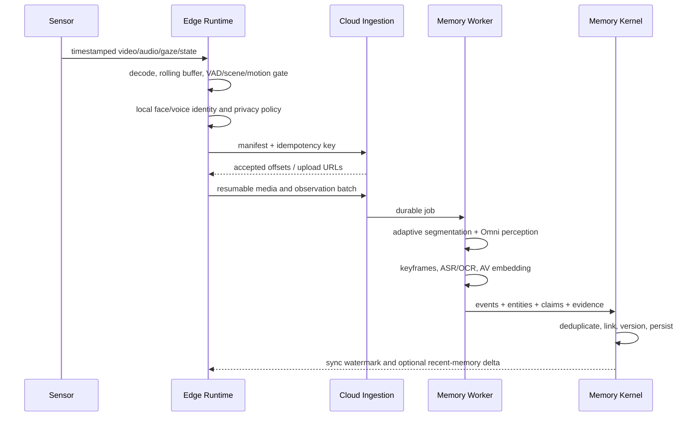
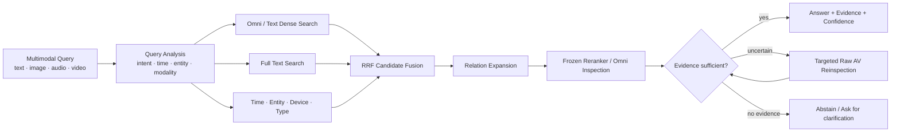
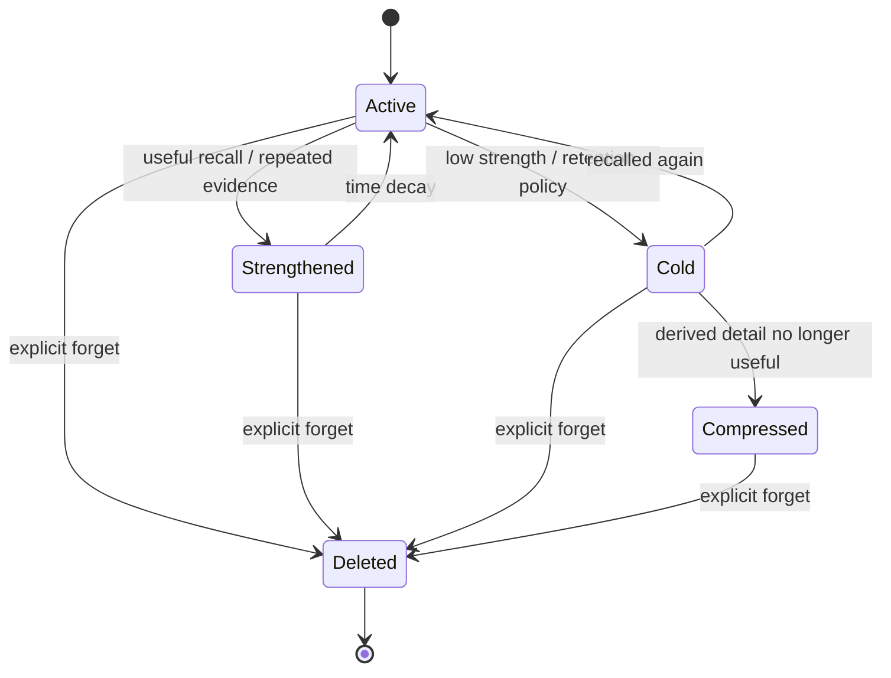

# MindBridge 技术实现架构

> 状态：RTX 5090 实测基线（Phase 3 效果优化中）
> 版本：0.7
> 更新日期：2026-08-13

## 1. 文档目的

本文定义 MindBridge 的首版技术实现架构、核心数据模型、端云边界、模型与检索策略、API、部署方式和评测路线。它是后续代码实现、Benchmark、技术选型和架构评审的共同基线。

MindBridge 不是机器人、Agent 或大模型。MindBridge 是**记忆本身**：一个 Agentic Native、Embodied、Multimodal-first 的 Memory-as-a-Service（MaaS）系统。

它将机器看到、听到和经历过的连续信号，转化为能够：

- 被检索和追问；
- 回到原始视听证据；
- 随时间合并、强化、纠错和沉淀；
- 按策略衰减，并接受可验证的显式遗忘；
- 被任何机器人、Agent 或应用通过稳定函数调用使用；

的长期记忆。

一句话架构定义：

> **Model is frozen, Memory is alive; evidence is durable, representations are rebuildable.**

## 2. 已确认的目标与约束

### 2.1 产品目标

1. 第一优先级是能力 SOTA，同时所有能力必须能够收敛为可部署的 MaaS 产品。
2. 首批端侧平台是 NVIDIA Jetson 和机器人主机。
3. 人脸识别与声纹识别尽可能在端侧完成；身份模板默认不离开设备。
4. 不要求完全离线。云端是长期记忆和重型推理的主路径，端侧提供连续采集、隐私处理、近期记忆和断网缓冲。
5. 文本侧以 LoCoMo 为核心 Benchmark；多模态侧覆盖 EgoLifeQA、EgoTempo、Video-MME、SuperMemory-VQA 和 M3-Bench，并以 SOTA 为目标。

### 2.2 强制设计原则

1. **视听优先**：能由 VLM/Omni 直接理解的内容，不先降格为纯文本再处理。
2. **证据优先**：文本描述、摘要和事实都是派生表示；原始图像、视频、音频及其时间跨度才是最终证据。
3. **冻结模型**：不进行 SFT、LoRA、QLoRA、RL 或任何模型权重微调。
4. **非参数演化**：系统通过记忆状态、索引、实体原型、召回统计、反馈和生命周期策略自学习，而不是修改模型参数。
5. **生态优先**：优先使用官方 SDK、Hugging Face、NVIDIA、OpenAI-compatible、PostgreSQL 等成熟生态，不重复实现通用能力。
6. **轻量起步**：首版采用模块化单体、异步 Worker 和一套主数据库；只有实际指标证明不足时才拆分。
7. **可替换但不泛化过度**：保存模型版本和原始证据以支持重新编码，但不为尚不存在的提供商设计复杂工厂层。
8. **当前阶段效果优先**：当前研究与效果验证不以 License 作为候选过滤条件，代码和模型只要有助于能力即可复用；仍记录来源、精确 revision 和工件 hash，商业发布前再单独完成合规审查。
9. **工程质量是功能要求**：命名、可读性、复杂度、类型、错误处理和测试均是合并门禁，不接受“功能能跑但以后再整理”。

### 2.3 非目标

首版不建设：

- 通用 Agent 编排框架；
- 自研基础模型、Embedding 模型或模型训练平台；
- 自研视频解码、向量数据库、消息队列或 HTTP 客户端；
- 多数据库并存的“全家桶”架构；
- 提前拆分的微服务、Kafka、独立图数据库或独立时序数据库；
- 为某个 Benchmark 特制、无法进入产品路径的旁路实现。

## 3. 系统上下文与总体架构

MindBridge 的职责边界是从连续感知信号到可引用记忆；Agent 只负责提出问题、消费记忆或提交反馈。

```mermaid
flowchart LR
    subgraph DEVICE["Edge Runtime · Jetson / Robot Host"]
        SENSOR["Camera · Microphone · Gaze · IMU · Robot State"]
        CAPTURE["GStreamer / DeepStream Capture\nclock sync · decode · rolling buffer"]
        GATE["Event Gate\nVAD · scene change · motion · gaze"]
        IDENTITY["Local Identity\nface · diarization · voiceprint"]
        EDGE_MEMORY["SQLite Recent Memory\nmanifest · prototypes · outbox"]
        EDGE_OMNI["Optional Local Omni Embedding\nJina v5 Omni Nano"]

        SENSOR --> CAPTURE --> GATE
        GATE --> IDENTITY
        GATE --> EDGE_MEMORY
        IDENTITY --> EDGE_MEMORY
        GATE -. "capable hardware" .-> EDGE_OMNI --> EDGE_MEMORY
    end

    subgraph CLOUD["MindBridge Cloud"]
        INGEST["Ingestion API\nidempotency · policy · tenant"]
        OBJECTS["S3-compatible Object Storage\nraw AV · keyframes · derived clips"]
        WORKER["Memory Worker\neventization · Omni perception · OCR/ASR"]
        EMBED["Embedding Service\nJina v5 Omni Small + Text Small"]
        KERNEL["Memory Kernel\nepisode · entity · claim · provenance"]
        LIFECYCLE["Lifecycle Engine\nconsolidate · strengthen · correct · forget"]
        PG["PostgreSQL + pgvector\nmetadata · vector · text · relation · time"]
        RECALL["Recall Engine\nhybrid retrieve · fuse · rerank · inspect"]
        OMNI["Frozen Omni / VLM\nperception · evidence inspection · answer"]

        INGEST --> OBJECTS
        INGEST --> WORKER
        OBJECTS --> WORKER
        WORKER --> EMBED
        WORKER --> KERNEL
        EMBED --> PG
        KERNEL --> PG
        PG <--> LIFECYCLE
        PG --> RECALL
        OBJECTS --> RECALL
        RECALL <--> OMNI
    end

    CLIENT["Robot · Agent · Application\nREST / Python / MCP"]

    EDGE_MEMORY -->|"resumable sync"| INGEST
    CLIENT -->|"observe · remember"| INGEST
    CLIENT -->|"recall · get · feedback · forget"| RECALL
    RECALL --> CLIENT
```



### 3.1 为什么采用云边分离

端侧离传感器最近，适合承担低延迟、隐私敏感和网络不稳定时仍必须执行的任务；云端适合承担跨设备、跨时间的全局记忆和重型多模态推理。

| 端侧负责 | 云端负责 |
| --- | --- |
| 连续采集、硬件时间戳和滚动缓存 | 原始证据的长期对象存储 |
| VAD、场景变化、运动、注视等事件门控 | 重型 Omni/VLM 理解与证据重看 |
| 人脸、说话人分离和声纹身份 | 全局实体消歧与跨时间关系构建 |
| 设备域近期记忆和断网 Outbox | 统一多模态 Embedding 和长期索引 |
| 隐私策略、脱敏和上传决策 | 记忆合并、强化、纠错、沉淀与遗忘 |
| 强设备上的可选轻量 Omni Embedding | 混合召回、重排、回答与证据引用 |

不要求完全离线意味着端侧不需要复制完整云能力。断网时保证“继续记录、不丢队列、可查近期”；恢复连接后幂等补传。

## 4. 记忆领域模型

### 4.1 核心概念

| 概念 | 定义 | 是否可作为最终证据 |
| --- | --- | --- |
| `MediaObject` | 原始或派生的图像、视频、音频对象 | 是 |
| `Observation` | 某设备在某时刻记录到的一段传感器观察 | 是 |
| `EvidenceSpan` | 指向媒体对象中精确时间、帧、区域或音频区间的引用 | 是 |
| `Event` | 由一个或多个 Observation 组成的语义完整事件 | 否，必须回指 EvidenceSpan |
| `Episode` | 一组具有连续目标、地点、人物或叙事关系的 Event | 否 |
| `Entity` | 人、物体、地点、设备、组织或抽象主题 | 否 |
| `Claim` | 从证据推导出的可追踪事实、状态、意图或关系 | 否 |
| `Summary` | 对 Session、日、人物、地点或主题的树形压缩表示 | 否 |
| `MemoryRecord` | 对外统一返回的 Episode、Claim、Summary 或显式记忆 | 否 |

任何派生内容都必须带 `evidence_ids`、模型版本和生成时间。缺少证据的派生内容只能标记为
`unverified`，不能伪装成观察事实。通过 `remember` 原样提交的来源陈述标记为 `attested`：它可
作为“某调用者曾这样陈述”的依据，但不等同于传感器证据支持的 `verified` 事实。

### 4.2 分层记忆

MindBridge 使用可逐级展开的层级，而不是把所有内容压成一段摘要：

```text
Timeline / Person
└── Day or Session
    └── Episode / SuperEvent
        └── Event / MacroEvent
            └── EvidenceSpan / SubEvent
                ├── video frames
                ├── audio span
                ├── OCR / ASR
                └── gaze / IMU / robot state
```

该结构吸收 Qwen Video Memory 的层级下钻思路和 M3-Agent 的实体中心多模态图，但以持续流式经历而不是单个静态视频为基本场景。

### 4.3 记忆类型

- **感知记忆**：短期滚动媒体和尚未稳定的 Observation。
- **工作记忆**：端侧近期 Event、当前任务涉及的人物和环境状态。
- **情景记忆**：带时间、地点、人物和证据的 Episode/Event。
- **语义记忆**：从多个 Episode 沉淀出的 Claim、实体属性和关系。
- **程序记忆**：从重复过程归纳出的步骤，但始终保留代表性证据。
- **前瞻记忆**：用户承诺、计划、提醒和尚未完成的意图。

这些是同一套领域模型的不同 `memory_type`，首版不为每种类型建设独立数据库。

### 4.4 时间与版本

所有记录同时保留“世界发生时间”和“系统知道时间”：

- `occurred_at` / `ended_at`：事件在真实世界中的时间范围；
- `observed_at`：设备产生观察的时间；
- `ingested_at`：云端接收时间；
- `valid_from` / `valid_to`：Claim 在世界中被认为有效的区间；
- `created_at` / `superseded_at`：该版本在系统中的存续区间。

时间窗口采用半开语义：片段为 `[occurred_at, ended_at)`，`occurred_before=t` 只接受
`occurred_at < t`。因此从 `t` 恰好开始的下一片段不会泄漏给在 `t` 提问的 Recall，重复运行也
必须保持同一边界。

纠错不直接覆盖旧事实。新 Claim 通过 `supersedes`、`supports` 或 `contradicts` 关系连接旧版本，从而回答“当时我们以为什么”和“后来发现了什么”。

### 4.5 最小云端数据表

首版使用 PostgreSQL + pgvector，关系图通过普通关系表表达：

| 表 | 主要职责 |
| --- | --- |
| `media_objects` | 对象存储地址、哈希、编解码信息、保留策略 |
| `observations` | 设备、传感器、时间范围、同步偏差和上传状态 |
| `evidence_spans` | 精确媒体时间段、帧区间、ROI、音轨和 Observation 引用 |
| `events` | 事件边界、类型、显著度、状态和父层级 |
| `entities` | 规范实体及设备域匿名身份映射 |
| `entity_mentions` | 实体在 Event/EvidenceSpan 中的出现 |
| `claims` | 带时态、置信度和版本的事实/意图/关系 |
| `claim_evidence` | Claim 与证据的多对多映射 |
| `relations` | Event、Entity、Claim 之间的有类型边 |
| `embeddings` | 对象类型、对象 ID、编码模型/版本、兼容空间/版本、任务、维度和向量 |
| `memory_feedback` | 召回结果的有用、错误、遗漏和纠正反馈 |
| `deletion_tombstones` | 跨端云传播的显式删除状态，不保留被删内容 |
| `jobs` | 可追踪的导入、编码、重建和删除工作状态 |

初期不引入 Neo4j、Milvus/Qdrant 或 TimescaleDB：

- 关系遍历先使用关联表和递归 CTE；
- 时间查询先使用 B-tree/BRIN 索引；
- 稠密向量使用 pgvector；
- 精确文字检索使用 PostgreSQL Full Text Search；
- 只有实际数据规模或 Benchmark 证明单库成为瓶颈时才拆分。

### 4.6 最小端侧数据

SQLite 只保存继续采集和近期召回必需的信息：

- 媒体滚动缓存的 manifest 和校验和；
- 待同步 Observation Outbox 与已确认但尚未完成的云端 processing job；
- 设备域人脸和声纹 prototype；
- 云端确认的近期 Event/Claim MemoryResult、本地 Evidence 引用、可选本地向量及可配置过期时间；
- 云端确认的同步 watermark 和删除 tombstone。

删除增量按数据库生成的单调序号分页；wall-clock 只记录请求时间，不能决定游标顺序，否则时钟回拨或
同一时间提交会让新 tombstone 永久落到端侧已保存的游标之前。

端侧轮询已确认的云端 Job 时优先检查从未轮询的记录，再按最近轮询时间公平轮转。`failed` Job
仍可能由云端 Worker 重试，因此端侧既不擅自丢弃，也不允许它长期占住有界窗口、阻塞后续成功记忆。

## 5. 写入与记忆构建

### 5.1 连续观察流程



采集热路径现在接受两种不落盘的原生输入：GStreamer/OpenCV appsink 的 BGR frame 直接进入
`InsightFaceVideoEncoder.encode_frame()`，任意边界的 16 kHz mono PCM16 bytes 直接进入
`FunASRStreamingTranscriber.push_pcm16()`。在线 Paraformer 复用官方 cache，以 600ms 模型窗口消费
PCM，并用异步锁提供背压；frame 与音频 offset 均以当前 Observation 起点的毫秒时间对齐。这里不再
把“模型支持 streaming”偷换成“读取已关闭 MP4”：实际 5090 测试以 60 次 100ms push 完成 6 秒
音频，模型推理耗时 0.369 秒、峰值 CUDA allocation 872 MiB。

在线 transcript 是低延迟、可丢弃的 provisional view，不直接写成长期身份或最终 Event。现有
GStreamer/DeepStream 仍负责零拷贝采集、AEC、编码和有界 rolling fragment；VAD/场景/任务 gate
关闭一个可解码 fragment 后，统一 FunASR 质量路径再一次完成 VAD、离线 ASR、标点、diarization
与 speaker centroid，随后才进入加密身份和 durable Observation。这样原始流不会等待云端或模型，
而最终记忆仍有可重放媒体。断流时 cache 和 partial result 必须一起丢弃，禁止把不完整 utterance
伪装成已确认事实。

媒体未声明 `duration_ms` 时，首个 EvidenceSpan 使用 Observation 的完整时间区间；显式的媒体
时长仍作为更精确的证据终点，但不得超过 Observation 时间窗，避免可选元数据把整段经历退化为
零长度证据或把未来媒体带入当前 Observation。

### 5.2 事件切分

固定长度切片只能作为推理输入上限，不能直接等同于记忆边界。首版采用：

1. VAD、镜头变化、运动状态、注视变化、人物进入/离开和机器人任务状态产生候选边界；
2. 合并极短片段，避免每帧形成一个 Event；
3. 对过长片段按可配置的 `max_analysis_window` 切分，并保留重叠区；
4. Omni 模型判断语义边界并将相邻片段合并为 Event/Episode；
5. 原始时间范围保持不变，后续可以重新切分而不重新采集。

M3-Agent 的 30 秒切片只保留为其 Benchmark 协议；TaskMem 的 10 秒输入块和约 50 秒滚动上下文
提供更适合连续流的初始候选。两者都不能成为产品常量，最终边界由真实 Jetson 负载、事件完整率和
多模态检索效果校准。

### 5.3 多模态理解

对于每个候选 Event，优先让 Omni/VLM 同时查看画面和音频，产生：

- 时间对齐的视听事件描述；
- 人物、物体、地点、动作和交互；
- ASR、说话人区间、OCR 和空间定位；
- 事件开始/结束、重复次数和关键帧；
- 显著度、可验证 Claim 和不确定性；
- 对全部输出的 EvidenceSpan 引用。

ASR、OCR 和 caption 是可检索视图，不是原始经历的替代品。遇到召回问题时，系统应回看媒体，而不是仅让文本 LLM 阅读 caption。

`observe` 回执公开本次 Observation 的 source `evidence_ids`。同一时段的 OCR、物体/空间描述、
端侧匿名身份、ASR 和数据集发布文本都复用这些 ID；VLM 派生的 Entity、Claim 与 Event 再收窄为
Event 级子区间。这样文本命中只负责定位，回答阶段仍从 EvidenceSpan 解析并重新签名原始
video/audio，而不是把 caption 当作最终证据。没有原始媒体的公开发布表示仍可作为 attested
memory-layer 输入，但必须在评测报告中与原始视听复现分开。

当前在线构建路径在一次冻结 Omni 调用中同时提取 Event、Entity 和 Claim；EntityMention 与
Claim 必须引用 Event 内的 EvidenceSpan，Claim 的有效时间必须落在 Event 内。模型首先引用输入
source span；应用层随后按 Event 与 source 的时间交集生成稳定、精确的 Event EvidenceSpan，并在
同一对象图中重写 Event、EntityMention、Claim 与 Memory 引用。完整性校验要求所有派生引用恰好
等于本批 Event spans，事务会先写这些 spans 再写图，任何越界或冲突都整批回滚。原始媒体只编码
一次；原始 AV 向量命中时，PostgreSQL 将其映射到同 Observation、同媒体且位于该 source span 内
的 Event spans，避免复制一个全片向量来冒充多个“精确向量”。Worker 随后用
Jina Omni Small 编码原始 source EvidenceSpan，用同一兼容空间的 Jina Text Small 批量编码 Event 描述
和 Claim 陈述，并在一个 PostgreSQL 事务中写入 Event、Entity、EntityMention、Claim、
MemoryRecord、类型关系、向量和成功 Job 状态。任何模型输出越界、关系悬空、版本冲突或向量错误
都会回滚整批派生数据。VLM 与后续 Jina 阶段分别获取新的短期签名 URL，禁止跨越长模型调用复用
可能过期的地址；重试使用稳定 ID 且不会合并不同的证据集合。跨 Event 实体消歧、Episode
合并和多次经历归纳属于后续 Consolidation，不在在线写入路径中凭名称猜测。

当前 `perceive_events_v9` 直接吸收 M3-Agent/TaskMem 已验证有效的原子事件、稳定人物 ID、外观变化、
对话、关系和因果线索要求，但没有照搬其可直接输出 `Equivalence` 的做法：身份关联仍由端侧可撤销
证据门禁负责。Prompt 还要求推断的意图/关系写出可见或可闻依据并降低 confidence，片段边界不得把
未完成动作写成完成事实。它还要求先独立盘点视觉变化、语音/环境声、OCR 和身份轨迹，再做跨模态
对齐；Event 使用能支撑该次 occurrence 的最窄可信区间，不默认整片。这个 Prompt 服务所有
Observation，不读取 Benchmark 类型或答案。

### 5.4 幂等和可恢复性

- 每个 Observation 使用 `tenant_id + device_id + boot_id + sequence` 构造稳定幂等键；
- 媒体对象按规范化为小写的 SHA-256 内容哈希去重；端侧对象键同样以 tenant + SHA-256
  寻址，重复内容只覆盖同一不可变对象，不留下数据库无法引用的上传；分片上传支持断点续传；
- manifest 先于大媒体上传，使云端能判断缺失范围；
- Worker 必须可重试，写入使用 upsert/唯一约束防止重复记忆；
- 设备同时记录单调时钟和墙上时钟，上传时附带估计时钟偏差；
- 云端确认 watermark 后，端侧才可按保留策略释放滚动缓存。

首版 `mindbridge.edge` 已把这一恢复语义落实为文件型 SQLite Outbox：数据库启用 WAL 与
`synchronous=FULL`，文件权限收紧为 `0600`；`tenant_id + device_id + boot_id + sequence` 同时受
稳定 ID 和唯一约束保护，同一序列异内容立即冲突。GStreamer/DeepStream 关闭片段后，薄 capture
handoff 可把封装视频和同步的 16 kHz 原生音频 sidecar 放进同一个 Observation；两条媒体共享世界
时间区间但各自保存 SHA-256、对象 ID 和 EvidenceSpan。它只计算 size/SHA-256、稳定对象键、时钟
区间和幂等键并入队，不接管 NVIDIA 的解码、编码或门控。同步器先用 Boto3 标准凭证链上传
tenant-scoped S3 对象，再通过异步 Python SDK 调用
`observe`。媒体上传成功会单独落盘，因此 API 暂时离线不会重复传大文件；receipt、水位推进和
Outbox 删除在一个 SQLite 事务中完成，进程在任意网络步骤崩溃都可安全重放。失败仅保存错误码和
次数，不保存异常正文或凭证；重试节奏交给机器人 supervisor/systemd，避免框架内再造守护进程。
watermark 只表示该 boot 已确认的最大序号，不充当逐条回执；晚到的低序号仍交给云端幂等约束处理。
每轮 tombstone 拉取有页数上限，但未追平云端游标时同步器必须停止上传，下一轮从持久化游标继续，
避免离线积压超过单轮预算时复活已遗忘内容。
本地媒体不会被同步器擅自删除，滚动缓存只能在读取 watermark 后按设备策略释放。

## 6. 模型与 Embedding 架构

### 6.1 初始模型配置

MindBridge 采用“明确默认、保存版本、允许重建”的策略。模型不微调。

| 能力 | 初始实现 | 运行位置 |
| --- | --- | --- |
| AV 理解、caption、时间定位、计数 | Qwen Omni，通过 OpenAI-compatible API；以当前可用最强版本为默认 | 云端 |
| 视觉 OCR、grounding、补充检查 | Qwen VL/VLM 或对应成熟专用模型 | 云端，必要时端侧 |
| 跨模态主召回 | `jina-embeddings-v5-omni-small-retrieval` | 云端 |
| 文本派生表示 | `jina-embeddings-v5-text-small-retrieval`，与 Omni Small 对齐 | 云端 |
| 端侧跨模态近期召回 | `jina-embeddings-v5-omni-nano-retrieval` | 强 Jetson/机器人主机，可选 |
| 人脸检测、跟踪与表征 | SCRFD-2.5GF-KPS + ArcFace R50；YuNet + SFace 为轻量生态对照 | 端侧 |
| 流式 ASR | FunASR causal Paraformer，官方 cache 与 600ms 模型窗口 | 端侧 |
| VAD、质量 ASR、标点、diarization | 一个 FunASR `AutoModel` 组合官方 VAD、ASR、punc、speaker model | 端侧 |
| 声纹表征 | 上述 FunASR 调用直接返回 ERes2NetV2 speaker centroid；资源受限时再 bake-off CAM++ | 端侧 |
| 活跃说话人与 face↔voice | LR-ASD + 多 Observation 可撤销证据；GateFusion 为质量挑战者 | 端侧 |
| 最终回答和证据核验 | 能直接读取候选图像、视频和音频的冻结 Omni/VLM | 云端 |

这些是进入目标 Jetson bake-off 的首选候选，不是未经实测的 FPS 承诺。完整指标、运行时、
分档和晋级门禁见[端侧人物一致性感知模型选型](edge-identity-sota.md)。具体模型 ID、服务地址和版本
属于部署配置；数据中必须记录精确 `model_id` 和 `revision`。

### 6.2 Jina v5 Omni 的职责

`jina-embeddings-v5-omni-small-retrieval` 是云端默认的**第一阶段跨模态候选召回器**，不是最终判断器，也不是人脸或声纹模型。

采用它的原因：

- 文本、图像、视频和音频进入统一语义空间；
- 与 `jina-embeddings-v5-text-small-retrieval` 对齐，派生文本可以使用更便宜的文本塔编码；
- 支持 retrieval 专用的 query/document 编码；
- 支持 Matryoshka 截断维度，便于端侧或低成本索引试验；
- 可以通过 Hugging Face 和 vLLM 生态直接使用，不需要自研加载和 serving。

首版约定：

- 云端主索引保存 Small 的完整 1024 维归一化向量；
- Nano 的 768 维向量只进入独立端侧近期索引，不和云端 Small 向量混查；
- 对查询调用 `encode_query()`，对记忆对象调用 `encode_document()`；
- 每条向量分别保存真实编码器的 `model_id/revision` 与可混查的
  `space_id/space_revision`，同时保存 `task`、`dimension`、`normalized` 和 `created_at`；
- 切换模型时创建新向量版本并后台重建，不原地混用不同空间。

生产实现将编码器放在不同进程中，但严格声明同一冻结兼容空间：Memory Worker 通过 Hugging Face
`sentence-transformers` 的 `encode_document()` 生成 EvidenceSpan 向量，并通过独立 vLLM
OpenAI-compatible endpoint 用 Text Small 批量生成 Event/Claim/Summary document 向量；API 通过 Omni
Small endpoint 生成 query 向量，并用同一个 Text Small 服务编码显式记忆。Omni 固定 revision
`12949877f0092093f366c6450340011320152a05`，Text Small
固定 revision `6856e76bb72982e58de0620458a4e8b3614da340`。文本请求使用 OpenAI SDK 的
`embeddings.create()`；SDK 尚未声明类型的多模态 `messages` 也只通过同一 SDK 的低层
`post()` 发送，不另写 HTTP 客户端。数据库按 `space_id/space_revision` 检索、按
`model_id/revision` 保留真实生产者；升级任一编码器都创建新空间并重建，不把未经验证的版本混查。
API 因此不加载 Jina 权重，模型只存在于 Worker 或独立 serving 进程。

同一对象、编码器 revision、空间和 task 的向量写入保持幂等。考虑 GPU/F16 serving 对同一文本可能
产生末位浮点抖动，重放向量的余弦相似度不低于 `0.999999` 时视为同一内容；低于阈值仍作为
“同版本不同向量”拒绝，不能用容差掩盖模型或输入变化。

### 6.3 为什么必须保留多种索引

一个通用 Omni 向量不能同时解决全部问题：

- “画面/声音表达了什么”属于通用语义；
- “具体是谁”属于生物身份；
- “第几次、什么时候、之前还是之后”属于结构化时间；
- 姓名、数字、型号和原话需要精确文字检索；
- 复杂问题需要回到原始媒体进行二次核验。

因此首版同时保留：

1. Jina Omni 跨模态稠密向量；
2. Jina Text 派生文本稠密向量；
3. PostgreSQL Full Text Search；
4. 时间、设备、人物、地点和类型索引；
5. 端侧隔离的人脸/声纹身份向量；
6. Event、Entity、Claim 和 Summary Memory 的关系边。

### 6.4 Jetson 模型分级

| 设备档位 | 默认行为 |
| --- | --- |
| Orin Nano | SCRFD-500MF 或 YuNet/SFace；FunASR/llama.cpp acoustic path 进入同条件 bake-off；通用 Omni Embedding 交给云端 |
| Orin NX | SCRFD-2.5GF + ArcFace；FunASR 在线 Paraformer + Event-close 统一 speech pipeline；LR-ASD 通过实测后启用 |
| AGX Orin | SCRFD-10GF；FunASR CUDA 质量路径与在线路径；有余量时运行 LR-ASD、Jina Omni Nano 与质量挑战者 |
| 带独立 GPU 的机器人主机 | 可运行完整本地近期召回和部分 Omni 理解；云端仍负责全局长期记忆 |

是否启用任一模型由完整管线的吞吐、显存、功耗、温度和主任务余量决定，不按“能够加载模型”
判断。端侧使用 TensorRT/DeepStream/GStreamer 等 NVIDIA 原生生态，保留帧率、分辨率、VAD、
diarization 缓冲和事件窗口等硬件校准参数。ONNX 是可移植工件；TensorRT engine 必须按 Jetson
SKU、JetPack、TensorRT、精度和 shape profile 构建及缓存，不能跨设备镜像盲目复用。

### 6.5 冻结模型边界

禁止：

- 对任何基础模型或 Embedding 模型进行 SFT、LoRA、QLoRA、RL；
- 为 Benchmark 训练隐藏分类头或数据集专用模型；
- 用线上用户数据更新模型权重。

允许：

- Prompt、tool calling、inference-time 多轮检查；
- 使用官方发布的 retrieval/task adapter 权重；
- 选择、组合或替换更强的预训练模型；
- 更新记忆、实体 prototype、索引、阈值、Top-K 和生命周期状态；
- 根据反馈统计调整召回预算，但所有策略可追踪、可回滚；
- 使用原始证据对新模型重新编码。

### 6.6 端侧匿名身份实现

端侧不自研人脸、diarization、声纹或 ASD 网络。人脸质量路径使用
SCRFD-2.5GF-KPS + ArcFace R50；YuNet + SFace 作为有官方 ONNX 工件的轻量对照。语音默认路径已
从 NeMo + FunASR + 单独 ERes2NetV2 三段编排收敛为一个 FunASR `AutoModel`：SeACo-Paraformer
ASR、FSMN-VAD、CT-Transformer punctuation 和 ERes2NetV2 speaker model 在一次 `generate()` 中
返回带毫秒边界、标点、speaker label 的 `sentence_info`，并通过 `return_spk_center` 返回每个
speaker 的 192 维 centroid。MindBridge 删除了自维护的 NeMo turn 融合、波形二次解码和声纹模型
二次推理；模型网络、聚类和预处理全部复用上游。

`recognize_identities_in_av_segment()` 将同步 video/audio sidecar 串成一个可等待入口；
`auto` 在 CUDA 可用时选择 GPU，并核对模型实际 device/provider，显式要求 GPU 却静默回落会立即
失败。CPU 只承担 SQLite、哈希、FFmpeg、调度和无加速器时的降级推理。质量合格且累计语音不少于
1 秒的 centroid 才写入设备域模板；短、低置信或不同 speaker 重叠的区间仍保留精确时间与
transcript，但标为 `scope=observation`，不得污染长期身份。FunASR 不提供可校准的逐 turn
diarization probability，因此当前 confidence 是必须由真实麦克风集校准的部署门槛，不能解释成
模型概率。活跃说话人检查复用 TaskMem 的可视锚点思路，
由 FFmpeg 在发送给 VLM 的临时视频上绘制 `F0/F1/...` face box 并保留 16kHz mono 音轨，使模型在
一个原生 AV 请求中联合检查口型、声音起止和可见行为；所有 VLM 请求仍只通过异步
OpenAI SDK；模型输出仅形成可撤销关联证据，不直接合并模板。LR-ASD/DeepStream/TensorRT 仍是
目标 Jetson 的下一轮质量/效率候选，不能写成已经上线的实现。

ASR 或 diarization 无法无歧义归属的区间不会被丢弃，而是以 observation scope 保留 transcript；
ASD 关联使用配置的模型 deployment revision 作为稳定证据键，不使用可能随请求变化的 provider
fingerprint。后续片段没有新增 ASD 命中时，仍会用同一 revision 复核历史累计证据。

FunASR causal Paraformer 已接入持续 PCM chunk，并复用上游 cache；speaker label、标点和长期
voiceprint 仍只在 Event/window 关闭后由统一质量路径确认，因为当前 upstream realtime diarization
会在窗口增长时重新聚类，标签尚不稳定。入口会在当前空闲 CUDA 显存不少于 8 GiB 时并发人脸和
统一 speech pipeline；不足时串行复用 GPU，
CPU 降级也保持串行，避免模型线程争抢。该门槛是 5090 软件验证默认值，不是 Jetson 标定结果；
调用方可以用 `parallel_model_inference` 按机器人主任务的显存预算显式覆盖。

MindBridge 只维护一个设备本地身份记忆边界：

1. 每个模板绑定 `tenant_id`、`device_id`、模态、来源 Observation、模型 ID/revision 和维度；本地
   sample key 由 Observation 与片段内 sample ID 共同派生，避免每个视频从 `0ms` 计时造成跨片段冲突；
2. embedding 归一化后使用 cosine similarity 与可校准阈值匹配，不跨模型空间比较；
3. 每个匿名身份默认最多保留 32 个样本，持续观察只更新有界 prototype 样本集；
4. embedding 使用设备注入的 256-bit key 进行 AES-256-GCM 加密，SQLite 主文件权限为
   `0600`；密钥来自 TPM/设备 Secret Manager，不写入数据库、配置或日志；
5. 首版在单设备有界样本集上做线性扫描；只有 trace 证明它成为瓶颈时才引入 FAISS；
6. 合格 ASD 区间保存 Observation、时间范围、face/voice 匿名 ID、置信度和关联模型版本；
7. face↔voice 至少跨多个 Observation、满足累计时长和时长加权置信度，并在两个方向互为最佳且
   都以足够 margin 胜过第二名；任何歧义都保持未绑定；
8. 关联证据有界、幂等并按读取时计算；竞争证据或 tombstone 会立即撤销解析，不合并原始模板；
9. 通过门禁的 voice 在后续上传时解析为对应 face pseudonym，同时保留 `kind=voice` 和声纹模型
   provenance；禁止仅按时间重叠或 LLM 单次输出建立等价关系；
10. 云端 `ObserveRequest.identity_observations` 只包含匿名 `identity_id`、`face|voice`、
   时间区间、置信度和模型版本，Schema 明确禁止额外 embedding 字段；
11. Worker 按时间重叠把匿名身份写成 `person` Entity 和 EvidenceSpan 级
   `entity_mentions`，因此 `RecallFilters.person_ids` 走生产检索路径；
12. Observation 或 identity tombstone 在端侧同一事务中删除加密样本和关联证据，防止遗忘后
    重新识别或重新绑定。

端侧闭环会统一后续上传的匿名 ID，但当前云端契约不会回写已经导入的历史 voice Entity。只有产品
明确要求历史回补时，才新增模型版本化、可撤销的 cloud identity-alias 关系，不能批量覆写实体或
让 Omni 猜测。完整依据与 bake-off 契约见[端侧人物一致性感知模型选型](edge-identity-sota.md)。
所有阈值必须按设备摄像头、麦克风、距离、语言和环境噪声校准并写入部署配置，不能把论文最佳值
硬编码进代码。

## 7. 召回、追问与回答

### 7.1 Recall Pipeline



### 7.2 查询步骤

1. 解析查询中的时间、人物、地点、物体、事件类型和预期答案形式；媒体查询直接进入 Omni 分析。
2. 并行执行跨模态稠密、文本稠密、全文、时间和实体检索。
3. 使用 Reciprocal Rank Fusion（RRF）合并不同分值空间的结果，避免训练融合模型。
4. 沿 `before/after`、`same_episode`、`mentions`、`supports` 等关系展开少量邻居。
5. 用冻结 reranker 或 Omni/VLM 查看候选证据，而不是只看摘要。
6. 对计数、先后、多跳和细节问题定向重读原始片段。
7. 返回答案、MemoryRecord、EvidenceSpan、置信度和推理追踪 ID。
8. 证据不足时明确拒答或请求补充，而不是从相似摘要中猜测。

当前可运行基线已经实现 EvidenceSpan、Event、Claim 和显式 MemoryRecord 的稠密检索、
PostgreSQL FTS、结构化过滤、RRF 和原始视听证据重看。Event/Claim 命中通过有类型的
`represented_by` 关系映射回 MemoryRecord，映射后再次应用租户、时间、人物、设备和记忆类型
过滤。纯媒体查询只使用跨模态稠密候选，避免把“最近记忆”伪装成相关结果；文本查询并行运行
稠密与稀疏召回。pgvector HNSW 查询在事务内启用 `strict_order` iterative scan，避免过滤条件
导致候选不足，因此部署要求 pgvector 0.8+。稠密命中的 Event/Claim 会在 PostgreSQL 内做一次
有界关系展开：直接覆盖 `asserts`、`contains`、`same_episode`、`supports`、`contradicts`、
`supersedes`、`before` 和 `after` 的双向邻居；经 `mentions/about` 共享 Entity 的邻居，每个命中
最多取 16 个。直接表示始终先于关系邻居排序，所有展开结果在映射为 MemoryRecord 后再次执行
完整结构化过滤。更深的通用图遍历、专用 reranker 和多轮定向重读只按 Benchmark 失败案例加入。
每个 Omni 回答或枚举波次使用当时新签的查询媒体 URL；模型完成后再为响应 Evidence 签名，Agent
收到的链接不能因为模型推理耗时而已经过期。

当前回答模型还可在证据不足或有实质歧义时返回最多两个独立 `retrieval_queries`。应用层每轮并发
执行补充查询，与此前全部候选做 RRF；最多两轮 refinement。时间重排可能额外触发一次证据回答。
当查询没有带来新的 Top-K 时，回答器会收到已尝试查询并切换实体、关系、时间、视觉或因果方向，而不是重复
同一个无效查询。显式 `memory_ids`
追问不越过调用方范围。补充查询不会写入事实、不会读取 Benchmark 标签，也不能用另一个人物或
实体的相关证据修正问题前提；其数量进入 trace，最终答案仍必须由 MemoryRecord/EvidenceSpan
支撑。结构化输出允许“临时答案 + 补充查询”，用于保留已有部分证据，但最终回答 Prompt 要求
最短、类型正确且拒绝错误实体前提。M3-Agent 的公开配置是每步取 2 个片段、最多 5 个 retrieval
step；Qwen Video Memory 常见路径是一次定位后再下钻 1--2 次。MindBridge 采用后者的产品预算，
不会照搬 M3 最后一轮“必须合理猜测”的 Benchmark 策略：耗尽预算仍无证据就拒答。该有限反思
替代无限 Agent loop，保持调用成本和尾延迟有界。

对于 `latest/last/most recent` 与 `first/earliest`，回答器还返回结构化 `temporal_order`。应用层只在
最终相关 Top-K 内按 `occurred_at/ended_at` 重排并重新回答；扩大后的候选池仍保持相关度排序，不能
让较新的弱相关记录淘汰直接命中。`before/after` 保持相关度排序，避免把“最新”错误泛化成所有时间
问题，也避免扫描整库来迎合题面。

Memory 向量命中层级任一节点时走独立的树形展开查询：PostgreSQL 沿 MemoryRecord
`contains` 边有向递归下钻来源子节点；向上只取单跳父节点，并对该父节点的 siblings 按请求预算
限额。所有直接向量命中先于扩展节点排序，并对每个结果重新应用完整结构化过滤。这样既允许来源
命中回到相邻上下文，也不会把一个大 Summary 的整个连通分量递归展开到候选集。
这让无证据的 `unverified` 导航摘要不能直接支撑回答，而其下方原样保存的 `attested` 来源仍可被
Omni 引用。该展开只用于全库语义检索；调用方显式传入的 `memory_ids` 始终保持严格范围，不隐式
加入父子节点。直接 Memory 向量排名与层级展开排名作为两个独立信号进入同一个 RRF；不能让一个
Summary 命中携带的整组子节点挤掉其他直接命中。

### 7.3 追问

`recall` 返回的每条记忆都带稳定 ID 和证据。当前生产契约通过请求顶层显式 `memory_ids`
完成后续追问：调用方回传上一轮需要继续追问的 Memory ID，服务端将其作为严格候选范围，跳过
新的全库语义检索，但仍执行租户、版本、删除状态、结构化过滤和原始证据核验。最多可限定 100 条
且 ID 不得重复；`enumerate` 同样只在该范围内按时间验证。服务端不保存或无限拼接整段会话历史。
只有产品需要服务端托管会话时，再增加 `conversation_id` 或 `previous_recall_id` 状态。

### 7.4 计数和时间问题

“出现几次”“第一次/最后一次”“在某件事之前发生了什么”不能仅依赖语义 Top-K：

- `enumerate` 模式扫描满足条件的全部 Event；
- 时间范围和去重规则先结构化执行；
- Omni 负责验证每个候选是否确实构成目标事件；
- 最终结果返回全部 occurrence 的时间戳和证据。

该路径借鉴 Qwen Video Memory 的 `enumerate_events` 和 `search_by_time` 能力。

生产实现中，`enumerate` 不受普通召回 `limit` 的 Top-K 截断：PostgreSQL 先按租户、人物、
设备、记忆类型和时间范围完整扫描，并按 `occurred_at` 排序；文本仅作为 Omni 的判定问题，
不作为 FTS 预过滤条件。候选以 16 条为一批、最多 4 批并行，Omni 直接查看原始视听证据或
明确标记的 `attested` 文本，只能返回当前批次内且不重复的 Memory ID。最终 `answer` 是十进制
occurrence 数量，`memories` 与 `evidence` 返回全部命中项。单次扫描硬上限为 1000 条；查询第
1001 条作为截断哨兵，命中时返回 `enumeration_limit_exceeded`，要求调用方缩小时间或实体范围，
而不是静默给出错误计数。

## 8. 自学习、自进化与自遗忘

### 8.1 模型冻结，记忆演化

MindBridge 的学习对象是记忆状态：

- 新 Event 与既有 Episode/Entity 建立联系；
- 重复观察形成更稳定的 Claim；
- 用户纠正产生新版本并降低错误 Claim 的可信度；
- 人脸和声纹 embedding 更新设备域 prototype/centroid；
- 召回反馈更新不同查询类型的候选预算和阈值统计；
- 高频、有用、近期或高显著度记忆获得更高保留强度；
- 低价值且长期未使用的派生表示被压缩或清除。

所有变化写入审计字段和来源，不能产生无法解释的“模型自己记住了”。

### 8.2 Consolidation

后台 Consolidator 周期性执行：

1. 使用向量相似度、时间重叠和实体重叠发现候选重复；
2. 由 Omni/VLM 对候选证据进行合并验证；
3. 将相邻 Event 组织为 Episode；
4. 从多个证据形成 Claim，并保留每个支持/冲突证据；
5. 生成 Session、日、人物、地点和主题级 Summary；
6. 对已替代的派生摘要降级，但不覆盖历史事实；
7. 更新访问频次、有效反馈、关联价值和最后使用时间。

不允许仅因向量相似就自动合并身份或互相矛盾的事件。

当前 Episode、Claim 与 Summary 路径已经实现为同一个 `mindbridge-consolidate` 租户级计划任务。每轮以
严格早于固定 `evaluated_at` 的记录作为稳定快照，新生成的聚合只会在下一轮继续演化。
PostgreSQL 只枚举
`active`、尚无父节点的基础 Event，并用可校准的时间邻近、实体重叠或同一 Jina 兼容空间中的
Event 向量相似度扩展最多 64 个候选。Omni/VLM 必须直接读取候选引用的全部原始 AV
EvidenceSpan，并通过严格 schema 返回互不重叠的 Event 分组；摘要相似本身不能触发合并。

应用层随后确定性派生 Episode、联合 Observation/Evidence 来源、verified Episodic
MemoryRecord、`contains`/`same_episode`/`represented_by` 关系以及 Text Small Event 向量。
Episode 内按发生时间排序且互不重叠的相邻 Event 还会写成对的 `before`/`after` 边；重叠 Event
不强行排序，只连接相邻项以保持线性边数。一次
PostgreSQL 事务按稳定顺序锁定全部子 Event，只有仍为 active、基础层且未被占用的完整分组才能
提交；Episode、来源链接、MemoryRecord、关系、向量和子节点父指针要么全部成功，要么全部回滚。
并发 Consolidator、重试和显式遗忘发生竞争时，已经提交或删除的一方优先，过期提案不会覆盖新
状态。稳定 ID 包含子 Event、模型 revision、Prompt version 和固定 `evaluated_at`，同一次扫描可
安全重放。计划频率交给既有 CronJob、systemd 或 Celery beat，不在框架内再造调度器。

Claim 路径只枚举当前、未被吸收的 verified Claim，以共享 Entity 或同一 Jina v5 空间中的 Claim
向量发现候选，并排除已有 `supports`、`contradicts` 或 `supersedes` 决策的 Claim 对。冻结的
Omni/VLM 直接检查每条 Claim 对应的原始图像、视频和音频，通过严格 schema 产生两类互斥结果：

- 两条及以上独立证据支持同一持久事实时，生成一个联合全部 EvidenceSpan 和 Entity 的 verified
  Semantic Claim、Semantic MemoryRecord、Text Small Claim 向量，以及来源 Claim 指向新 Claim
  的 `supports` 边；
- 证据不兼容时只生成显式有向 `contradicts` 或 `supersedes` 边；`supersedes` 的来源必须是时间上
  更晚的 Claim，并同时关闭旧 Claim 及其所代表的 MemoryRecord。

一次 PostgreSQL 事务按 Claim ID 排序加行锁，完整写入新 Claim、Evidence、MemoryRecord、关系和
Embedding；并发过期提案只能成为幂等重放或被跳过。显式遗忘替代来源时，若不存在其他替代边或
用户纠正，旧 Claim 与其 MemoryRecord 会在同一删除事务中恢复为当前版本。整个过程不微调任何
模型，也不依赖通用工作流引擎。

Summary 路径不为日、人物、地点和主题各复制一套平行记忆。它建立单父树：一个当前 MemoryRecord
最多被一个上层 Summary 通过 `contains` 吸收，而 Summary 自身可在后续 sweep 成为更高层来源。
PostgreSQL 只枚举严格早于 `evaluated_at`、未删除、未 supersede、尚无 Summary 父节点的 verified
或 attested Episodic/Semantic Memory；候选由可校准的时间邻近、Evidence 对应的共享 Entity，或
同一 Jina 兼容空间的向量相似度扩展，单页最多交给 Omni 64 条。Event/Claim 所代表的 Memory
直接复用 `represented_by` 来源对象的现有向量，显式 Memory 和 Summary 使用自己的 Memory 向量，
不重复保存等价 embedding。种子和候选按 `occurred_at, memory_id` 稳定分页，游标直接携带这两个
值而不反查上一条记录，因此并发 `forget` 不会中断续页；时间排序也避免一页无谓混入多个相距很远的
Session。

冻结 Omni/VLM 直接检查候选引用的原始图像、视频和音频，并通过严格 schema 返回互不重叠的
Memory 分组、`session/day/person/place/topic` scope、摘要和 salience。只有全部来源均为 verified
且联合 EvidenceSpan 非空时，新 Summary 才是 verified；只要含 attested 来源就生成 unverified
导航摘要，绝不把调用者陈述升级为传感器事实。Text Small 为每个新 Summary 生成对齐的 1024 维
Memory document 向量；稳定 ID 包含来源 Memory、scope、Omni revision、Prompt version 和固定
`evaluated_at`。

提交事务按 Memory ID 排序锁定全部来源，再次检查当前版本、删除屏障和既有父节点，一次写入
Summary Memory、联合 Evidence、`contains` 边和向量。数据库唯一索引从根本上保证一个 Memory
只有一个 Summary 父节点；不同模型 revision 的并发提案也只能有一个成功。删除 Summary 本身保留
其子 Memory；删除任一子 Memory 或其 Observation 时，则递归删除依赖它的 Summary 祖先，避免
遗忘后残留派生内容。三个阶段共享同一固定快照，因此本轮 Episode/Claim 新写入只会在下一轮进入
Summary，计划任务不会读到自己的写入。

### 8.3 记忆强度

首版使用透明、可配置的统计分数，不训练遗忘模型：

```text
strength = salience
         + log(1 + useful_access_count)
         + positive_feedback
         + relation_utility
         + novelty
         - age_decay
         - negative_feedback
```

各项原始值和最终决策都要可观测。系数首先由 Benchmark 和产品回放集校准；需要为不同硬件采集频率和使用场景保留调节参数。

首版自动演化由 `mindbridge-lifecycle` 作为租户级计划任务执行：一次完整扫描固定同一
`evaluated_at`，按稳定 `memory_id` cursor 分页；年龄衰减从最近一次真实访问开始计算，没有访问
时才从创建时间开始。更新以原状态、分数、计数和访问时间做乐观锁。扫描期间若
发生反馈、纠错或删除，则并发操作优先，本次过期结果不会覆盖新状态；下一轮计划任务重新评估。
PostgreSQL 以内部 `lifecycle_changed_at` 水位排除固定快照之后创建、访问、反馈或恢复的记录。
系数和冷热阈值均为显式参数，部署在完成 Benchmark 与真实机器人回放校准后再锁定。

生产 Recall 用例只在结构化过滤、融合和 tombstone 检查完成后，对实际参与本轮结果的 Memory
原子增加 `useful_access_count` 并推进 `last_accessed_at`；较旧或重放的请求不能把访问时间倒拨。
Cold Memory 被真实召回时在同一事务恢复为 Active，后续计划扫描再按完整强度公式重新评分。

### 8.4 遗忘状态机



- **Cold**：移除热索引或迁移媒体到低成本存储，但仍可恢复召回。
- **Compressed**：保留上层 Claim/Summary 和必要证据，清理可重建派生表示。
- **Deleted**：显式遗忘；删除原始证据、派生媒体、向量、缓存和相关身份映射，并向端侧传播 tombstone。

显式 `forget` 优先级高于自动保留策略。删除审计只记录对象 ID、范围、执行状态和时间，不保存被删除内容。
树形 Summary 的遗忘沿依赖方向向上级联而不向下误删：删除叶子会删除所有依赖该叶子的祖先
Summary，删除 Summary 则保留可独立存在的原始子 Memory。

## 9. Agent 与开发者接口

### 9.1 核心函数

MindBridge 对外只暴露少量稳定语义：

| 语义 | Python/领域函数 | REST | MCP Tool |
| --- | --- | --- | --- |
| 提交连续或离散观察 | `observe(request)` | `POST /v1/observations` | `memory_observe` |
| 显式写入需要长期保留的内容 | `remember(request)` | `POST /v1/memories` | `memory_remember` |
| 多模态召回和回答 | `recall(request)` | `POST /v1/recall` | `memory_recall` |
| 获取记忆及其证据 | `get_memory(tenant_id, memory_id)` | `GET /v1/memories/{memory_id}` | `memory_get` |
| 提交有用、错误、遗漏或纠正 | `record_feedback(request)` | `POST /v1/feedback` | `memory_feedback` |
| 显式遗忘某段内容或范围 | `forget(request)` | `POST /v1/forget` | `memory_forget` |

HTTP、Python 和 MCP 共享同一层 use case，不各自复制业务逻辑。
顶层 `remember` 与 `get_memory` 返回扁平的 `MemoryResult`：它保留 `MemoryView` 字段、请求
`trace_id`，并直接附带短期签名的 `EvidenceView`；Recall 内嵌的记忆仍使用不重复 Trace 和 URL 的
`MemoryView`。

### 9.2 `recall` 最小请求

```json
{
  "tenant_id": "tenant_...",
  "query": {
    "text": "我最后一次把红色螺丝刀放在哪里？",
    "media_object_ids": []
  },
  "memory_ids": [],
  "filters": {
    "person_ids": [],
    "device_ids": [],
    "occurred_after": null,
    "occurred_before": null
  },
  "mode": "answer",
  "limit": 20,
  "include_evidence": true
}
```

### 9.3 `recall` 最小响应

```json
{
  "answer": "它最后一次出现在工作台右侧的蓝色工具盒旁。",
  "confidence": 0.91,
  "memories": [
    {
      "memory_id": "mem_...",
      "memory_type": "episodic",
      "occurred_at": "2026-08-11T01:42:13Z",
      "ended_at": "2026-08-11T01:42:18Z",
      "created_at": "2026-08-11T01:42:20Z",
      "summary": "用户将红色螺丝刀放在蓝色工具盒旁。",
      "evidence_ids": ["evd_..."],
      "verification_status": "verified",
      "state": "active",
      "salience": 0.8,
      "strength": 0.9,
      "useful_access_count": 1,
      "positive_feedback_count": 0,
      "negative_feedback_count": 0,
      "last_accessed_at": "2026-08-11T02:00:00Z",
      "supersedes_memory_id": null,
      "superseded_at": null
    }
  ],
  "evidence": [
    {
      "evidence_id": "evd_...",
      "media_object_id": "media_...",
      "start_ms": 184200,
      "end_ms": 188900,
      "media_url": "https://objects.example.test/signed-media",
      "media_url_expires_at": "2026-08-11T02:05:00Z"
    }
  ],
  "trace_id": "trace_..."
}
```

### 9.4 API 语义要求

- 所有写接口支持 `idempotency_key`；
- 长任务立即返回 receipt/job ID，不占用同步请求；
- Observation 处理状态通过 `GET /v1/jobs/{job_id}?tenant_id=...` 查询；成功状态原子携带本次
  生成的 `memory_ids`，调用方可直接 `get_memory` 获取证据完整的近期记忆，也可再发起 Recall；
- 所有列表使用 cursor 分页；
- Recall 默认返回证据，不只返回自然语言答案；
- `forget` 是幂等操作，并能查询端云传播状态；
- 删除列表的 cursor 必须属于同一租户且仍然存在；无效 cursor 明确报错，不能用空页伪装同步完成；
- 单个 Observation 最多携带 8 个媒体对象和 512 个匿名身份区间，所有声纹区间的 transcript
  合计不得超过 65,536 个字符；显式 Memory 最多引用 100 个
  EvidenceSpan，Recall 的人物或设备过滤各最多 100 个，避免公共请求制造无界签名、模型和 SQL 扇出；
- 每个响应带 `trace_id`，便于 Benchmark 和线上问题复现；
- OpenAPI 是 REST 契约的唯一事实来源，MCP Tool schema 从同一 Pydantic 模型生成。

## 10. 生态依附与技术栈

### 10.1 选择顺序

对通用能力执行以下顺序：

1. 官方 SDK；
2. Hugging Face 或硬件原生生态；
3. 已安装、成熟的开源库；
4. 上游官方代码；
5. 只有以上均不能满足时，编写最薄的适配代码。

### 10.2 首选生态

| 能力 | 首选实现 | 禁止重复实现的内容 |
| --- | --- | --- |
| 模型加载 | `transformers`、`sentence-transformers` | tokenizer、processor、pooling、批处理 |
| 模型和数据下载 | `huggingface_hub` | 自写下载器、缓存和断点逻辑 |
| Benchmark 数据 | `datasets`，优先官方 loader | 手工抓取和私有数据格式 |
| 云端模型 serving | vLLM/OpenAI-compatible server | 自研推理 HTTP 协议 |
| 兼容模型调用 | `openai.AsyncOpenAI(base_url=...)` | `requests`/`httpx` 手写供应商接口 |
| 非 OpenAI-compatible 服务 | 服务官方 SDK | 通用 REST 包装器 |
| Jetson 媒体与推理 | DeepStream、GStreamer、TensorRT | 自研解码、帧管线和 runtime |
| 视频/音频 | FFmpeg、ffprobe、PyAV、TorchCodec | 自研编解码器 |
| API 与 schema | FastAPI、Pydantic、OpenAPI | 自研 Web 框架和 schema 系统 |
| Agent 接入 | MCP 官方 SDK | 独立维护第二套业务接口 |
| 数据库 | PostgreSQL、pgvector、官方驱动 | 自研索引或存储引擎 |
| 对象存储 | S3-compatible 官方 SDK | 自研分片上传协议 |
| 异步任务 | Celery + Redis（首版） | 自研可靠消息队列 |
| 可观测性 | OpenTelemetry | 自研 tracing/metrics 协议 |

若上游代码不能作为依赖直接使用，可以 vendor 最小必要部分，但必须记录仓库、commit、修改补丁和调用边界。MindBridge 不维护与上游功能等价的长期 fork。

### 10.3 OpenAI-compatible 统一调用

Qwen、vLLM 或其他提供 OpenAI-compatible endpoint 的模型统一使用 OpenAI SDK：

```python
from openai import AsyncOpenAI

client = AsyncOpenAI(api_key=api_key, base_url=base_url)
```

供应商差异收敛到模型名、`base_url` 和必要请求字段；不为每个供应商新增一套 HTTP client。仅当服务不兼容且没有官方 SDK 时，才允许一个局部、可删除的薄适配器。

共享 OpenAI 调用默认省略 `reasoning_effort`，确保非推理模型和不同 OpenAI-compatible
服务不会收到不支持的字段。只有经过部署验证的 Omni Answerer 才通过
`MINDBRIDGE_ANSWER_REASONING_EFFORT` 显式配置档位；Benchmark CLI 必须用
`--answer-reasoning-effort` 记录实际部署值（未发送时记为 `omitted`）。模型 revision 变化时
重跑 `omitted`、`low` 和 `medium` bake-off，不把某一供应商的参数强加给共享调用边界。

Omni Answerer 先保留供应商原生结构化生成并立即做 Pydantic 校验；只有首次答案不是合法 schema
时，才用同一模型、同一上下文和 OpenAI SDK 的 `json_object` mode 重试一次。正常请求不承担
JSON mode 的质量偏移，fallback 也不切换模型或无限重试。

音频内容块保留服务端的真实兼容契约：Qwen Chat 使用 URL 型 `input_audio`，vLLM 多模态
Embedding 使用 `audio_url`。两者共享 OpenAI SDK 和图像/视频构造，但不把这两个不同的音频
schema 伪装成一个通用格式。

## 11. 工程实现规范（强制）

本章不是风格建议，而是代码进入主分支的 Definition of Done。MindBridge 的工程目标是：一个首次接触模块的工程师能够从名称、类型和测试理解行为，而不必先解读框架、隐式状态和历史包袱。

“优雅”不等于聪明或抽象层数多，而是：

- 名称准确，调用方式自然；
- 控制流短，失败方式明确；
- 领域逻辑只存在一处；
- 依赖方向稳定，外部生态被限制在边界；
- 删除和替换代码容易；
- 凌晨排障时无需猜测。

### 11.1 领域词汇与命名

代码、数据库、API、MCP 和文档必须使用同一套领域词汇：`Observation`、`EvidenceSpan`、`Event`、`Episode`、`Entity`、`Claim`、`MemoryRecord`。同一概念不得在不同模块中分别叫 `item`、`record`、`node` 或 `data`。

| 对象 | 规则 | 推荐示例 | 拒绝示例 |
| --- | --- | --- | --- |
| 命令函数 | 动词 + 明确对象 | `build_event`、`link_evidence`、`forget_memory` | `process`、`handle_data`、`do_task` |
| 查询函数 | 使用 `get/list/find/search/recall` 区分语义 | `get_event`、`find_candidate_events` | `query_data`、`fetch_stuff` |
| 布尔函数 | 使用 `is/has/can/should` | `is_evidence_sufficient` | `check_evidence`、`evidence_flag` |
| 标识符 | 写出实体和 ID | `event_id`、`evidence_id` | `id`、`eid`、`x` |
| 带单位数值 | 名称包含单位 | `duration_ms`、`size_bytes`、`frame_rate_fps` | `duration`、`size`、`rate` |
| 集合 | 使用复数名词 | `candidate_events` | `event_list_data` |
| 常量 | 大写并表达业务意义 | `MAX_UPLOAD_ATTEMPTS` | `THREE`、`LIMIT` |

补充规则：

- Python 使用 `snake_case` 函数/变量、`PascalCase` 类型、`UPPER_SNAKE_CASE` 常量；
- 除 AV、ASR、OCR、VLM、ID 等领域通用缩写外，不创造项目私有缩写；
- 名称应说明业务意图，而不是实现方式，例如 `recall_memories` 优于 `run_pgvector_query`；
- `async` 不写进函数名，异步性由签名表达；
- 公共函数不得使用含义不明的布尔位置参数，例如 `recall(query, True, False)`；使用具名参数或 Enum；
- 一个新术语必须先进入领域词汇表，不能通过代码扩散后再补定义。

公共用例保持简短、对称且可预测：

```python
async def observe(request: ObserveRequest) -> ObservationReceipt: ...
async def remember(request: RememberRequest) -> MemoryRecord: ...
async def recall(request: RecallRequest) -> RecallResult: ...
async def get_memory(memory_id: MemoryId) -> MemoryRecord: ...
async def record_feedback(request: FeedbackRequest) -> FeedbackReceipt: ...
async def forget(request: ForgetRequest) -> ForgetReceipt: ...
```

### 11.2 函数设计与复杂度

1. 一个函数只做一件可命名的事，并保持同一抽象层级。
2. 优先使用 guard clause/early return，正常路径不超过三层缩进。
3. 纯转换逻辑优先写成无 I/O 的纯函数；事务、网络和模型调用留在用例或 Adapter 边界。
4. 公共函数必须完整标注输入、返回值和可能抛出的领域错误。
5. 参数超过 5 个通常说明缺少明确请求对象；不得用无类型 `**kwargs` 隐藏接口。
6. 非机械函数超过 50 行、圈复杂度超过 10 或嵌套超过 3 层时，PR 必须拆分或写出不能拆分的具体理由。
7. 不通过把代码搬进大量一行私有函数来伪造低复杂度；拆分后的函数必须拥有独立业务含义。
8. 禁止依赖可变全局状态、导入时副作用和调用顺序才能成立的隐式协议。
9. 同一个规则在多个调用方重复出现时，应修正在共同路径；Bug 修复必须定位根因并检查全部调用方。

行数和复杂度是评审触发线，不是质量本身。一个清晰的 55 行状态机可以保留；一个散落在 12 个函数中的隐式流程仍然必须重写。

### 11.3 简洁性、复用与抽象

每次新增代码依次回答：

1. 这段能力是否真的需要存在？
2. 仓库中是否已经有相同领域函数、类型或调用路径？
3. Python 标准库或数据库原生能力是否已经解决？
4. Hugging Face、OpenAI SDK、NVIDIA 或现有依赖是否已经提供？
5. 只有前四项都不成立时，才写最小实现。

强制规则：

- 一个实现不创建 Interface + Factory + Registry；只有外部边界明确易变或已经存在第二个实现时才抽象；
- 不为“未来可能需要”添加参数、配置、Hook、基类、事件总线或兼容层；
- 两次重复可以先保持局部清晰；第三次出现且语义稳定时再提取公共逻辑，避免错误抽象；
- 优先组合，不建立深继承树；领域实体不继承 SDK/ORM 类型；
- 不保留注释掉的代码、未使用 feature flag、死分支或“以后会用”的 helper；Git 已保存历史；
- 新依赖必须删除明显更多的自研代码，并且不能与现有依赖能力重复；
- 能用数据库唯一约束、外键、事务和索引保证的规则，不在多个业务函数中重复模拟。

### 11.4 模块边界与依赖方向

| 层 | 可以做 | 不可以做 |
| --- | --- | --- |
| `api` | 协议转换、鉴权、输入验证、调用 use case | SQL、Prompt、Embedding、记忆合并规则 |
| `core` | 领域类型、规则、用例和领域错误 | 导入 FastAPI、OpenAI、Transformers、数据库驱动 |
| `ingest/recall/lifecycle` | 编排领域操作和声明事务边界 | 复制领域规则、直接处理 HTTP |
| `models` | 封装 Hugging Face/OpenAI SDK 的模型 I/O | 决定记忆是否合并、保留或删除 |
| `edge` | 采集、身份、近期记忆和同步 | 知晓云端数据库内部结构 |
| infrastructure adapter | PostgreSQL、S3、Redis、SDK 细节 | 向上泄漏供应商响应对象 |

依赖只能由外向内：协议和基础设施依赖核心，核心不反向依赖框架。API、Worker 和 MCP 必须调用同一个 use case，禁止维护三套实现。

禁止出现：

- 包含不相关功能的 `utils.py`、`helpers.py`、`common.py`；
- 掌握全部流程的 `MemoryManager`、`GodService` 或万能 Repository；
- 循环 import；
- SQL、对象存储路径、Prompt 或模型名称散落在业务模块；
- 为每个模型供应商复制一套 recall/ingest 流程；
- 模型返回的原始 `dict` 穿过多个层级后才解析。

单文件超过 400 行或单模块出现 15 个以上平铺文件时触发边界评审，但不为满足数字机械拆文件。

### 11.5 类型与数据契约

- 所有外部输入在信任边界立即使用 Pydantic 校验；数据库结果和 SDK 响应在 Adapter 内转换为内部类型；
- 核心模块不得用裸 `dict[str, Any]` 传递 Event、Claim、RecallResult 等领域数据；
- 禁止无范围的 `Any`。第三方 SDK 类型不完整时，只允许在最窄 Adapter 中使用带错误码的 `type: ignore`；
- 时间必须是带时区的 `datetime`，在公共契约边界归一为 UTC 后再做幂等比较和持久化，展示时再转换；
- duration、offset、size、confidence 等值必须有明确单位和合法范围；
- 枚举状态使用 Enum/Literal，不用散落的字符串；
- ID、幂等键、模型版本和 EvidenceSpan 是公共契约的一部分，不得隐式生成后丢失；
- 关键不变量同时由应用校验和数据库约束保护，例如唯一键、外键和 `CHECK`。

Schema 变更必须向后兼容或带显式迁移；不得在 Worker 和 API 不同时升级时产生无法读取的中间状态。

### 11.6 错误处理、重试与数据安全

1. 使用有意义的领域错误，例如 `EvidenceNotFound`、`ModelUnavailable`、`MemoryAlreadyDeleted`；不向上抛出含供应商细节的裸异常。
2. 不吞异常、不用空 `except`、不以 `None` 同时表达“未找到”和“处理失败”。
3. 仅对幂等且瞬时失败的 I/O 重试；使用有上限的指数退避和 jitter。
   OpenAI SDK 连接错误及 408、409、429、5xx 归一为可重试 `ModelUnavailable`；其余 SDK
   请求错误归一为不可重试且脱敏的 `ModelRequestError`。PostgreSQL 只重试连接异常、连接池超时、
   序列化失败、死锁、连接耗尽、服务启停和 SQLSTATE `57014` 查询取消；后者覆盖部署配置的
   `statement_timeout`，连接边界回滚完整事务后才允许有界重试。鉴权和 SQL 错误不重试。
   Celery 分开计算等待旧 Worker claim 与瞬时 I/O 失败的重试预算，前者不能耗尽后者。
4. 每次外部调用必须有 timeout；批处理必须有并发上限、取消和部分失败语义。
5. 数据写入先确定事务边界；媒体、数据库和任务状态无法原子提交时使用可恢复状态，而不是假装原子。
6. `forget`、身份模板、同步 watermark 等数据安全路径必须优先保证正确性，不能以“代码更短”为由删除校验。
7. 日志保留 `trace_id`、对象 ID 和错误类别，不记录密钥、原始生物特征或完整用户记忆。
8. 捕获异常后改变错误语义时使用异常链，保留根因用于排障。

### 11.7 异步与性能

- 相互独立的网络、模型或存储调用应并行执行，但必须通过 Semaphore、Worker 并发或服务配额限制扇出；
- 禁止在 async event loop 中执行同步媒体解码、CPU 密集推理或阻塞 SDK；这些工作进入 Worker/thread/process 或原生 runtime；
- 不进行没有测量数据的缓存、批处理或微优化；先记录 trace，再优化最慢路径；
- 数据库查询只选择需要字段，分页查询必须有稳定排序和索引；禁止无界列表和生产环境全表拉取；
- 媒体和向量按流/批处理，不能为方便一次性读入无限长度视频；
- 每项优化必须保留等价性测试，并记录换取的延迟、吞吐、显存或成本收益。

### 11.8 Prompt 与模型调用代码

- 能通过 Hugging Face processor、`sentence-transformers` 或 OpenAI SDK 完成的输入构造，不手拼协议或 base64 JSON；
- Prompt 按能力集中、命名和版本化，例如 `extract_event_v1`，不能散落在 API handler 和 Worker 中；
- 优先复用上游经过公开任务验证的 Prompt 约束，但必须删除与本系统证据、隐私或输出 Schema 冲突的
  部分；来源和取舍写入架构文档，不能逐 Benchmark 复制提示词；
- 优先使用结构化输出，并在模型边界立即做 schema 校验；不靠脆弱正则从自然语言中猜 JSON；
- 模型 ID、revision、task、采样参数和 Prompt 版本全部进入 trace/run manifest；
- 模型供应商特例只存在于 Adapter，核心逻辑只消费领域结果；
- fallback 必须显式、可观测且有次数上限，禁止悄悄切换模型导致 Benchmark 不可复现。

### 11.9 注释、Docstring 与文档

- 代码通过名称和类型表达“做什么”，注释只解释“为什么”、不变量、硬件限制和反直觉取舍；
- 禁止把代码逐行翻译成注释；代码变化后失真的注释比没有注释更差；
- 公共函数必须有简短 Docstring，说明语义、关键参数、返回值、领域错误和最小示例；
- 有意保留的简单实现必须说明已知上限和升级触发条件；
- TODO 必须包含原因和可追踪 issue，不接受无期限的 `TODO: refactor later`；
- API、配置和运行命令变更必须在同一 PR 更新 OpenAPI/README/本文档。

### 11.10 测试要求

- 非平凡分支、循环、解析、时间逻辑、召回融合和安全删除至少留下一个能在回归时失败的自动化测试；
- Bug 修复先证明根因，并为共享路径添加回归测试；不只测试报告问题的单个调用方；
- 测试名称描述行为和条件，例如 `test_recall_abstains_when_evidence_is_missing`，禁止 `test_works`；
- 单元测试优先验证领域行为；第三方模型、数据库和对象存储使用少量契约/集成测试，不把所有东西 mock 成实现细节；
- 测试必须确定性。时间、随机数、模型版本和外部响应需要固定或显式注入；
- `forget`、幂等上传、Claim 版本和端云 tombstone 覆盖成功、重复、部分失败和恢复路径；
- 影响召回行为的变更必须运行 Golden Recall；影响架构能力的变更必须运行对应 Benchmark smoke subset；
- 不以覆盖率百分比替代测试质量，但任何未覆盖的关键失败路径都阻止合并。

### 11.11 自动化质量门禁

引入首批 Python 代码时，在 `pyproject.toml` 和 CI 中一次性配置成熟工具，不自研检查器：

| 门禁 | 建议工具/命令 | 要求 |
| --- | --- | --- |
| 格式化 | `ruff format --check .` | 必须通过 |
| Lint 与复杂度 | `ruff check .`，启用明确规则和 `C901` | 必须通过；禁止全局忽略 |
| 类型 | `mypy src` | `core`、API schema 和公共函数严格；第三方边界局部豁免 |
| 测试 | `pytest` | 必须通过，无静默 skip |
| 数据库迁移 | migration upgrade + schema test | 必须可从上一版本升级 |
| API 契约 | OpenAPI/MCP schema snapshot | 非预期破坏即失败 |
| 召回回归 | Golden Recall smoke set | 证据 Recall 或回答质量显著下降即失败 |
| 文档与空白 | `git diff --check` + Markdown/link check | 必须通过 |

禁止通过大范围 `# noqa`、`type: ignore`、跳过测试或降低规则来让 CI 变绿。例外必须限制到单行、写明错误码和原因，并在 Code Review 中显式确认。

### 11.12 Code Review 拒绝项

出现以下情况时默认拒绝合并：

- `process_data`、`MemoryManager` 等无法从名称判断职责的核心 API；
- API handler、Celery task 或 MCP tool 内包含领域业务规则；
- 新建与 OpenAI/Hugging Face/NVIDIA 官方能力重复的客户端或处理器；
- 为单个实现加入 Factory、Registry、深继承或通用插件系统；
- 跨模块传递无 schema 的 `dict/Any`；
- 捕获异常后只记录日志并继续返回成功；
- 复制粘贴同一修复到多个调用方而不处理共同根因；
- Benchmark 专用分支进入生产代码，或根据问题 ID/答案内容改变行为；
- 没有 EvidenceSpan 的事实被标记为已验证记忆；
- 依赖、模型或 Prompt 版本没有锁定；
- 大量重命名、格式化和行为变化混在同一 PR，无法可靠评审；
- 新增代码没有最小必要测试，或文档与实现明显不一致。

### 11.13 Definition of Done

每个变更合并前，作者和 Reviewer 必须能回答“是”：

- [ ] 名称是否只看签名就能理解意图、输入和结果？
- [ ] 是否复用了仓库、标准库、平台能力或成熟生态？
- [ ] 是否删除了不必要的抽象、重复代码和死代码？
- [ ] 领域规则是否位于唯一正确的共同路径？
- [ ] 输入、输出、单位、状态和失败方式是否有类型/Schema？
- [ ] 外部调用是否有 timeout、有限重试、并发上限和可观测 trace？
- [ ] 是否有一个最小测试能在该行为破坏时失败？
- [ ] 是否保留证据、幂等、隐私和显式遗忘等不可妥协约束？
- [ ] 是否更新了受影响的 API、配置、运行命令和技术文档？
- [ ] 这段代码半年后是否仍比重新实现更容易理解和修改？

## 12. 部署架构

### 12.1 首版进程拓扑

首版是模块化单体，不是微服务集合：

```text
Edge
└── mindbridge-edge
    ├── capture / gating
    ├── local identity
    ├── SQLite recent memory
    └── sync client

Cloud
├── mindbridge-api       # REST + MCP，共享 use cases
├── mindbridge-worker    # ingestion、perception、embedding、lifecycle
├── PostgreSQL + pgvector
├── S3-compatible object storage
├── Redis + Celery
└── model endpoints      # vLLM / provider APIs
```

API 和 Worker 可以使用同一个 Python package、两个进程部署。只有当吞吐、故障域或团队边界证明需要时，才将 ingestion、recall、lifecycle 或 model serving 拆成独立服务。

基础安装只包含 Core 领域类型、Pydantic 契约和 Python SDK。Jetson/机器人主机安装 `edge`
extra；API、MCP 与云端任务安装 `server` extra；只有本地加载 Jina Omni 的 GPU Worker 再叠加
`cloud-models`。端侧安装不得因 SQLite 身份或同步能力被迫携带 Celery、MCP、PostgreSQL、
FastAPI 等服务端栈，子包导入隔离由独立进程测试守护。`edge` 的 Python 依赖只覆盖同步、安全、
OpenAI SDK 和可观测性；不再为声纹二次解码携带 SoundFile，也不携带 NeMo。InsightFace/ONNX
Runtime、FunASR/ModelScope 与设备版 Torch 必须使用与 JetPack/CUDA 匹配的设备镜像工件，不能由
通用 lockfile 覆盖 NVIDIA 运行时。FunASR 自身仍是模型栈而非“轻依赖”，减重来自只维护一套上游
speech runtime、且不把它拖入 Core/SDK/server。llama.cpp 的 FunASR/GGUF 支持适合作为未来
ASR/VAD 多端运行时候选，但当前没有证据证明它完整覆盖 punctuation、diarization 和 voiceprint，
因此不能作为这一统一身份管线的透明替换。

Worker 通过 `mindbridge.celery_app:app` 启动，Redis 消息只传
`tenant_id`、`observation_id`、`job_id`。原始媒体、Evidence 和任务状态均以 PostgreSQL/S3
为事实来源。每个 prefork child 只加载一个固定 revision 的 Jina v5 Omni；默认并发为 1，
多 GPU 通过每张卡一个 Worker 进程扩展，避免一个模型被 CPU 核数意外复制。API 进程不导入
或加载 Jina；API 与 Worker 都用 OpenAI SDK 调用所需的 Omni-query 或 Text-document 兼容端点，
不自行拼装 HTTP 请求。VLM、两个 Jina revision 和共享空间 revision 必须由部署配置固定并写入
派生记录；凭证只从进程环境或基础设施 secret 注入。

### 12.2 推荐代码边界

未来实现代码时保持最少的稳定模块：

```text
src/mindbridge/
├── api/          # REST、MCP、Pydantic schema
├── core/         # Event/Claim/Memory 领域模型与 use cases
├── ingest/       # observation、eventization、sync processing
├── recall/       # retrieve、fusion、rerank、evidence inspection
├── lifecycle/    # consolidation、decay、forget
├── models/       # HF 和 OpenAI SDK 的薄调用边界
└── edge/         # Jetson capture、identity、SQLite、outbox

tests/
├── unit/
├── integration/
└── benchmarks/
```

这是逻辑边界，不要求每个目录立即存在。实现以首条端到端路径需要的最少文件开始。

### 12.3 扩展触发条件

| 当前选择 | 只有出现以下证据才升级 |
| --- | --- |
| PostgreSQL + pgvector | 单机/集群召回延迟、容量或写放大不达标 |
| 关系表 | 真实查询需要高深度、大规模图遍历且递归 CTE 成为瓶颈 |
| PostgreSQL 时间索引 | 时序聚合和保留操作成为主要负载 |
| Celery + Redis | 需要长周期工作流、跨区域一致性或大规模事件回放 |
| 模块化单体 | 模块具有独立扩缩容和故障隔离需求，且团队能承担服务治理 |
| 云端主推理 | 已验证的端侧模型达到质量、延迟、功耗和并发预算 |

## 13. 安全与隐私边界

1. 人脸和声纹模板默认仅存在于设备加密存储中；云端只接收设备域匿名 `identity_id`、模态、
   时间区间、模型版本和置信度，不接收生物 embedding。
2. 跨设备身份合并必须是显式策略，不能通过通用 Omni 相似度自动完成。
3. 原始媒体上传前执行设备/租户的隐私策略；可选择裁剪、模糊、静音或仅上传事件摘要。
4. 端云通信使用 TLS，媒体对象和数据库使用静态加密；密钥不写入配置文件或日志。
5. REST 使用 Bearer API key 认证，并把每个 key 绑定到显式 `tenant_id` allowlist；请求体或查询参数中的租户必须在认证主体的 allowlist 内，否则在进入 Kernel 前返回 `403`。生产 REST 缺少认证配置时拒绝启动，只有 `/healthz` 公开。
6. 多租户数据必须在 API、任务、对象路径和数据库查询中携带 `tenant_id`。PostgreSQL 对所有含 `tenant_id` 的表启用并强制 RLS；连接降权到无 `BYPASSRLS` 的 `mindbridge_runtime`，每个事务通过 `set_config(..., true)` 设置唯一租户。应用查询即使漏写过滤条件也不能越租户读写。
7. Evidence URL 使用短时签名 URL，Recall 返回证据 ID 而不是永久公开地址。
8. `forget` 删除原始对象、派生片段、向量、全文索引、缓存和身份映射，并通过 tombstone 防止离线设备重新上传。
9. 备份保留与显式删除的最终完成时间必须可查询，不能把逻辑隐藏当作物理删除。

## 14. Benchmark 与 SOTA 路线

### 14.1 Benchmark 能力映射

| Benchmark | 主要验证能力 | MindBridge 对应机制 |
| --- | --- | --- |
| LoCoMo | 长期对话、单跳、多跳、时间和开放域记忆 | Claim 版本、全文+稠密召回、时间关系、证据回答 |
| EgoLifeQA | 跨小时/天的第一视角视听、身份和生活事件 | 端侧身份、分层 Episode、AV 证据和跨日关联 |
| SuperMemory-VQA | 多证据、自然提问、物体位置、意图、时间线和拒答 | evidence coverage、关系展开、枚举、证据充分性判断 |
| M3-Bench | 机器人视角长期记忆、人类理解、常识提取和跨模态推理 | 在线记忆构建、实体中心图、迭代召回和原始媒体核验 |
| Video-MME | 短、中、长视频的感知、时序、空间与跨模态选择题 | 分段 AV 证据、长程召回、官方四选一协议 |
| EgoTempo | 第一视角动作前后、频率、顺序、速度与持续时间 | clip 内时间线、事件边界、开放式证据回答 |

### 14.2 统一评测路径

每个 Benchmark 只实现薄数据适配器：

1. 官方数据通过 Hugging Face 官方 CLI/Hub 库或官方 Git 仓库按 revision 获取；
2. 视频、音频、图像和对话统一通过生产 `observe`/`remember` 接口写入；
3. 问题统一通过生产 `recall` 接口执行；
4. 结果转换为官方评测格式；
5. 不允许 Benchmark 专用存储、隐藏答案、专用模型或绕过召回的长上下文直塞；
6. 模型、Prompt、索引参数和代码 commit 固定进 run manifest。

可执行适配基线固定 LoCoMo revision `3eb6f2c585f5e1699204e3c3bdf7adc5c28cb376`、M3-Agent
revision `0e3e41939bd8a0b66d756e7b7eb8d5fe9992da5c`、Video-MME 数据 revision
`ead1408f75b618502df9a1d8e0950166bf0a2a0b`、EgoLife 数据 revision
`143fb319be7aa5ae210c936bf4f0f3a86092afb0`、EgoTempo revision
`7022ba77b4d89f51cf34e499767995ccd5c90c7a` 和 SuperMemory-VQA 数据 revision
`1d228e0f10049a8a84c458dded2aa25b1e21ce8f`。适配器只转换推理所需字段；EgoLife 的
`target_time`、`keywords`、`reason` 与 SuperMemory 的 `answer_evidence` 不进入运行契约。
媒体通过 Hugging Face Hub 官方客户端按 revision 获取，仓库不保存数据副本或自研下载器。
`dataset-adapters-smoke.json` 记录源文件 SHA-256、适配器版本和完整样本计数；当前门禁还覆盖
Video-MME 2,700 题、EgoTempo 500 题，并保留其他已接入评测的完整样本计数。

LoCoMo runner 将原始对话逐 turn 通过 `remember` 写入，并且不向生产接口传入参考答案、证据
标签或 category。Recall query 只包含原始问题，作答格式由统一的 Omni Answerer 契约负责，避免指令文本
污染 query embedding。所有题使用调用方显式给出的同一个 recall limit；生产代码不检查题目措辞、
类别或答案形式来改变候选预算。参数进入 runner version/manifest；输出使用官方 evaluator 识别的
`mindbridge_prediction` 与 `mindbridge_prediction_context`，因此答案 F1 和检索 recall 均走官方
计算路径。CLI 保持与产品一致的统一 Top-20 默认预算；Top-50 只能由调用方显式选择并记录，不能
根据同一评测集切片静默改变默认值。

固定 `conv-26` 的 199 题生产切片中，`qwen3.8-max`、Text Small F16 和官方 evaluator 下，
`pre_reflection_v4` 到 `reflection_v8` 的组合改动使全题 F1 从 `0.6004` 变为 `0.6494`，
non-adversarial F1 从 `0.5426` 变为
`0.6002`，Evidence recall 从 `0.7722` 提升到 `0.7772`。该单会话结果只作为组合优化和回归证据，不作为全量 LoCoMo、
单变量消融或 SOTA 声明；数据、Evaluator、运行配置、输出 hash 和五类指标保存在
[`locomo-conv-26-optimization.json`](../benchmarks/manifests/locomo-conv-26-optimization.json)。

当前 `v10` 删除了旧 runner 对 `would/likely/might` 问题单独扩大候选数的题面特判，并将同一套
最多两轮 retrieval refinement 应用于所有产品查询。真实重跑表明，统一 Top-20 时全题 F1 为
`0.6376`、non-adversarial F1 为 `0.5847`、Evidence recall 为 `0.7638`；统一 Top-50 时分别为
`0.6532 / 0.6117 / 0.8551`。这说明较大的候选预算确实提高长程文本记忆覆盖，但也使该切片的
结果文件从约 173 KB 增至 288 KB，并增加模型上下文和运行时间。因而 Top-50 只作为云端长程
文本的实验 quality 配置证据，不作为 LoCoMo CLI 默认值；原生多媒体或边端请求也不被静默扩容。两次运行使用
完全相同的 419 条记忆、199 个问题、Prompt、模型和并发，仅 `recall_limit` 不同，完整指标与输出
SHA-256 同样保存在上述 manifest 中。

M3-Bench 的生产 runner 沿用官方 30 秒、零起点连续切片约定。媒体由 FFmpeg 和标准 S3
工具在运行前准备，MindBridge 只读取包含 URI、SHA-256、时长和绝对时间原点的强类型 manifest。
除末片外每片必须恰好 30 秒，末片不得超过 30 秒，防止边界题读到未来画面或漏掉时间段。
官方 `before_clip=N` 按包含边界解释；执行顺序固定为“写入第 N 个片段 → 轮询持久化 Job 至
`succeeded` → 回答该边界的问题”，未来片段不会提前进入该租户记忆。没有 `before_clip` 的问题
在整段视频完成后回答。输出采用官方 JSONL 字段，并附带记忆、证据和 trace 诊断；sidecar run
manifest 同时固定标注与媒体 revision/hash、代码、感知模型与 Prompt、回答模型与 Prompt、Jina
revision、召回参数和最终输出 hash。基准路径不使用固定 sleep、标签提示或 Benchmark 专用存储。
原始媒体和发布 caption 同时存在时，runner 把 `[Event]` 行合为一条 episodic memory、把
`[Inference]` 行合为一条 semantic memory，两者均引用 `observe` 回执中的 source EvidenceSpan；
这保留 M3 的信息通道而不制造逐行写入风暴。

EgoLifeQA runner 将官方 `DAYn/HHMMSSFF` 映射到单调时间轴，其中 `FF` 按 release 视频的 20 FPS
帧计数处理；少量大于单秒帧数的非归一化标注沿用官方 frame-index 转换并进位。prepared manifest
只接受按时间排序、互不重叠且带 SHA-256/时长的 addressable 视频。
问题按时间排序执行；只有 `clip.end <= query_time` 的片段才依次 `observe` 并等待 Job 成功，跨越
提问时刻的片段整体延后。发布 caption 同时含 Visual/Audio 行时拆为两条可独立召回的 memory，
存在原始媒体时共同引用 source EvidenceSpan。召回问题仅包含原问题和四个候选项，答案按官方
A/B/C/D 精确准确率计算；无法从受约束输出中无歧义解析时记为未作答。

SuperMemory-VQA runner 以 participant 为隔离单元，将各 session 的 Unix 起点和局部 segment
时间合成绝对时间。问题截止点按官方协议取 `question_evidence` span 的结束；同时兼容 release 中
6 条旧版单 `time_span` 记录。prepared media 必须在每个所选问题的结束点切段，runner 在写入前
拒绝缺失边界的 manifest，从而包含当前视觉且不读到未来。视频/音频通过 `observe`，官方因隐私
只发布而不提供原始音频的对齐 transcript 通过生产 `remember` 接口写入；答案标签、choice type
和 answer evidence 均不进入 API 请求。回答模型返回四个候选项的完整排序；数据集显式的
“This question can not be answered.” 是普通 answerability 选项，不等于 API 的 `null`
abstention。当 transcript 与媒体同时存在时，前者引用后者的 source EvidenceSpan。输出计算
Ans-F1、QA-Acc 与 QA-MRR。

Video-MME 与 EgoTempo 共用通用 `PreparedVideo`/`PreparedVideoSegment` 媒体边界，但数据模型、
官方 Prompt 和输出协议分别保留。Video-MME 从官方 Parquet 读取 900 个视频、输出官方嵌套
`response` 结构；EgoTempo 按 `clip_id` 解析 Ego4D 源区间、每个 clip 只摄入一次，并输出官方
`V/Q/QA/A/C/M` judge 输入。两者都只依赖 `AsyncMindBridge` 公共契约，新增模型提供商无需改动
Benchmark；EgoTempo 的 Gemini judge 保持在固定 revision 的官方 notebook 中，不复制进产品代码。

所有 runner 强制接收 `run_id`，并将其写入 tenant ID 与 sidecar manifest。每次运行使用新的
`run_id`，从结构上阻断上一次完整摄入留下的未来记忆污染本次较早问题；输出还固定数据、prepared
media、代码、模型、Prompt、检索参数和预测文件哈希。

### 14.3 分层指标

只看最终答案分数无法定位问题，必须同时报告：

| 层级 | 指标 |
| --- | --- |
| 事件构建 | 边界覆盖、人物/说话人准确率、时间定位、Claim groundedness |
| 检索 | Evidence Recall@K、MRR/nDCG、时间范围命中、多证据覆盖率 |
| 回答 | 官方 Accuracy/F1/LLM Judge、证据一致性、拒答准确率 |
| 系统 | ingest throughput、queue lag、P50/P95 recall latency、GPU time、成本 |
| 端侧 | FPS、显存、功耗、丢帧、缓存增长、断网恢复成功率 |
| 生命周期 | 重复率、错误合并率、纠错生效时间、删除完成率、索引压缩率 |

SOTA 声明必须使用官方 split、公开 run manifest 和可重放结果；同时报告质量、延迟和成本，避免只优化 Judge。

### 14.4 Embedding Bake-off

Jina v5 Omni Small 是默认实现，但每次替换前使用同一证据集比较：

- text→video、text→audio、image→event、audio→event；
- 单证据与多证据 Recall@K；
- 人物、物体、地点、动作、OCR 和时间问题；
- 长期数据增长后的召回退化；
- 索引速度、显存、存储维度和每小时媒体成本。

候选模型可以直接拿来评估，但不微调。胜出模型必须在通用 Benchmark 和真实机器人回放上同时成立。

## 15. 测试与可观测性

### 15.1 自动化测试

- 领域单元测试：时间区间、Claim 版本、RRF、衰减和删除范围；
- 集成测试：媒体上传、Worker 重试、PostgreSQL/pgvector、对象存储；
- 端云测试：重复上传、乱序、时钟偏差、断网恢复和 tombstone；
- 模型契约测试：固定样本验证输出 schema、维度和 query/document 语义；
- Golden Recall：少量真实 AV 片段及固定证据答案，阻止召回链路静默退化；
- Benchmark 回归：提交时跑小切片，定期跑完整四套 Benchmark。

### 15.2 可观测性

使用官方 OpenTelemetry Python SDK、OTLP/HTTP exporter 和 FastAPI、HTTPX、Psycopg、Celery、
Botocore instrumentation 贯穿：

```text
observe receipt
→ media upload
→ eventization
→ model calls
→ embedding/index write
→ recall candidate sources
→ rerank/reinspection
→ answer/evidence
```

运行时只读取标准 `OTEL_*` 环境变量；设置 common 或 signal-specific
`OTEL_EXPORTER_OTLP_*_ENDPOINT` 才启用，否则保持 no-op。API、MCP、Worker、Edge Sync 和
Lifecycle 与 Episode Consolidator 使用不同的默认 `service.name`。FastAPI server context 通过
HTTPX 传播到模型/API，
并通过 Celery header 传播到 prefork Worker；Worker 的 SDK 与 BatchSpanProcessor 必须在
`worker_process_init` 后初始化，不能在父进程启动后台线程。

统一 telemetry 配置会在创建首个 S3 client 前直接安装 Botocore instrumentation；无需为追踪
提前加载完整 Boto3，也不会让只使用 SQLite identity 的端侧进程加载网络栈。

`observe`、`process_observation`、perception、embedding、recall candidate、evidence resolve、
answer、forget 和 lifecycle 使用命名领域 span。span 只包含 tenant/device/object ID、数量、
状态、模型/revision、Prompt version 和性能数据；不采集 Authorization、请求/响应 body、查询
正文、完整 Prompt、生物 embedding 或原始媒体。API/MCP 返回的 `trace_id` 使用当前 W3C trace
ID；无 SDK 的嵌入式调用才生成独立 fallback ID。

所有使用 `trace_operation` 的领域操作同时产生 `mindbridge.operation.calls` Counter 和
`mindbridge.operation.duration` Histogram。指标维度固定为有限集合的 `operation` 与
`outcome=success|error|cancelled`，不携带租户、对象 ID、正文或异常内容，既能计算吞吐、错误率和
P50/P95/P99，也不会制造高基数或隐私泄漏。SLO 阈值由部署的 Collector/监控规则基于真实负载
配置，不硬编码进业务代码。

日志同样只记录 ID、耗时、模型版本、token/frame/audio 秒数和错误；默认不写原始人脸、音频
内容、完整 Prompt 或用户记忆正文。生产导出先进入 OpenTelemetry Collector，再由 Collector
负责采样、批处理、脱敏和后端路由。

## 16. 实施阶段

### Phase 0：契约与基线

- 固化本文的 Event、EvidenceSpan、Claim、Embedding schema；
- 建立 `pyproject.toml`，配置 Ruff、mypy、pytest 和最小 CI 门禁；
- 建立 LoCoMo 和一个多模态 Benchmark 的最小适配器；
- 跑通 Jina v5 Omni Small、Text Small 和一个 Omni/VLM；
- 产出可复现的 baseline run manifest。

验收：同一输入可重复写入且不重复建忆；Recall 能返回答案和可打开的证据时间段。

### Phase 1：端云垂直切片

- Jetson/机器人主机采集、事件门控、SQLite Outbox；
- 端侧人脸/声纹 prototype；
- 云端导入、对象存储、Event 构建、pgvector 索引；
- `observe`、`recall`、`get` 最小 API。

验收：断网继续记录，恢复后幂等同步；可以跨模态找到机器人经历过的具体片段。

### Phase 2：长期记忆能力

- 分层 Episode、Entity/Claim 关系和时间版本；
- 混合召回、RRF、关系展开和原始媒体重看；
- `remember`、`feedback`、`forget`；
- consolidation、纠错、强度和冷热状态。

验收：四套 Benchmark 全部进入统一生产路径，并能分解检索和回答指标。

### Phase 3：SOTA 与产品化

- Embedding/Omni 模型 bake-off；
- 人脸、diarization、声纹、ASD 与 face↔voice 闭环 bake-off；
- Benchmark 失败案例回放和查询策略优化；
- Jetson 性能、功耗和端侧 Nano 评估；
- 多租户、配额、审计、备份删除和运行 SLO；
- Python SDK、MCP 和完整 OpenAPI 文档。

验收：目标 Benchmark 达到可复现 SOTA；质量配置可以直接部署为 MaaS，而不是另起一套演示系统。

### 16.1 当前实施状态

RTX 5090 同机端云验证的完整协议、四套公开题集结果、生命周期证据、SOTA 可比性边界与下一步
优先级见 [`benchmark-report-5090.md`](benchmark-report-5090.md)。该报告把 released-text
memory-layer 评测与原始视听复现分开，禁止用前者替代多模态 SOTA 声明。

当前完整公开题集基线为：LoCoMo token-F1 `53.09%`、非官方 Qwen Judge `81.43%`；EgoLifeQA
`61.20%`；SuperMemory-VQA Ans-F1/QA-Acc/QA-MRR `67.41%/58.69%/72.65%`；M3-Bench
Robot/Web 非官方 Qwen Judge `30.02%/58.18%`。M3 Web 混合了 908 个 v6 与 12 个 v7 分片，且
包含选择性重跑，因而只是诊断值。逐运行 revision、输入表示、模型、结果 hash 和生命周期工件
固定在 [`benchmark-5090-clean-007.json`](../benchmarks/manifests/benchmark-5090-clean-007.json)。
当前生产 Recall 的单 conversation 组合回归中，LoCoMo non-adversarial token-F1 从 `54.26%`
变为 `60.02%`；由于 Prompt 与反思代码同时变化，该差值不能作为反思的单变量收益。新的真实音频
验证在 RTX 5090 上用一次 FunASR 调用贯通 VAD、ASR、标点、diarization 与 ERes2NetV2 centroid：
20 秒音频推理 1.283 秒、峰值 CUDA allocation 1.93 GiB；同一 centroid 跨两个 Observation 命中
同一 AES-GCM 加密设备身份。另有 6 秒、60 次 100ms PCM push 的真实在线路径。两者都只作为当前代码
增量证据；完整榜单和带真值身份 replay 仍按上述基线口径验收。

当前 `answer_from_evidence_v10` 已完成发布文本↔原始媒体 EvidenceSpan 绑定、最终相关 Top-K 内
newest/oldest 重排、无新增结果时的反思方向切换，以及 Summary 有向下钻与有界单跳父/同父展开；这些改动通过生产路径
回归，但尚未重跑四套完整 split，因此不改写上面的基线数字。跨查询 experience memory 与
Entity/Bridge/Scene/Horizon cue 明确推迟到完整数据证明增益之后，避免为榜单题型预埋旁路。

| 阶段 | 当前状态 | 已落地证据 | 剩余验收 |
| --- | --- | --- | --- |
| Phase 0 | 完成 | 严格领域契约、锁定依赖、CI、Jina smoke、官方数据适配器、可追溯 LoCoMo 与 5090 全量评测 manifest | 无；后续运行继续沿用同一 manifest 门禁 |
| Phase 1 | 软件垂直路径完成 | 原生 BGR/PCM 流入口、采集 handoff、FunASR 统一语音、加密身份 prototype、SQLite Outbox/近期记忆、S3 同步、durable Job、Event 精确 EvidenceSpan/pgvector 与 REST API | 在目标 Jetson 上完成真实摄像头、VAD/场景/运动门控、断网和功耗验收 |
| Phase 2 | 完成（公开发布表示） | Episode/Claim/Summary consolidation、RRF/图展开/媒体重看、反馈纠错、生命周期、显式删除，以及四套 Benchmark 完整公开题集的生产 API 分层结果 | 原始 AV 全量重放属于 Phase 3 严格 SOTA 复现，不再作为 Phase 2 软件门禁 |
| Phase 3 | 进行中 | RLS 多租户、Bearer allowlist、Python SDK、MCP/OpenAPI、OpenTelemetry、端侧 CUDA 人脸/FunASR 统一 speech path、PCM streaming、Omni ASD、发布文本↔原始媒体证据绑定、相关 Top-K 时间重排、无结果方向切换和有界层级展开 | 原始 AV/OCR/object 全量 SOTA 重放、官方 Judge 重跑、身份真值 replay、LR-ASD/TensorRT 与 Embedding bake-off、Jetson/Nano 实测、配额、持久审计和备份删除演练；experience/cue 等完整数据证明收益后再评估 |

“软件路径完成”不等于硬件或榜单验收完成。以下项目不能由单元测试替代：

1. Jetson 的 FPS、显存、功耗、温度、丢帧与断网缓存增长必须在目标 SKU 和真实传感器上记录；
2. Jina Nano 是否常驻、事件门控阈值和媒体保留期必须由同一真实机器人回放集校准；
3. SOTA 只接受官方完整 split、固定代码/模型 revision、公开 run manifest 和可重放输出；
4. 每租户配额、审计保留期、备份擦除窗口和 P95 SLO 必须先获得负载模型与运营约束，再进入配置和门禁。
5. 人物一致性必须报告 false-link、跨日 IDF1、撤销延迟以及完整管线的 FPS/RTF、功耗、温度和
   主任务资源余量；论文单模型指标不能替代目标 Jetson 证据。

## 17. 关键架构决策记录

| ADR | 决策 | 接受的代价 | 重审触发条件 |
| --- | --- | --- | --- |
| ADR-001 | 原始视听证据优先，文本是派生视图 | 存储与重看成本更高 | 只有法规或硬件禁止保留原始媒体 |
| ADR-002 | Jetson 做身份/门控/近期记忆，云端做全局重型记忆 | 依赖网络，端侧能力不完全 | 明确提出完全离线产品需求 |
| ADR-003 | 模型全部冻结，学习发生在记忆和策略层 | 放弃任务微调可能带来的单榜收益 | 用户明确取消“不微调”约束 |
| ADR-004 | Jina v5 Omni Small 为云端跨模态主召回，Nano 为可选端侧召回 | 单向量不能独立完成身份、时间和多跳 | 同条件 bake-off 出现稳定更强模型 |
| ADR-005 | PostgreSQL + pgvector 为首版唯一主数据库 | 极端规模下不如专用引擎 | 实测容量或 P95 延迟不达标 |
| ADR-006 | 模块化单体 + Worker，不提前微服务化 | 进程级隔离较粗 | 模块出现明确独立扩缩容和故障域需求 |
| ADR-007 | 官方 SDK/HF/NVIDIA/OpenAI-compatible 优先 | 受上游 API 和版本变化影响 | 上游无法满足必要能力且无替代实现 |
| ADR-008 | Benchmark 走生产 API，不建旁路 | 迭代速度可能慢于特制脚本 | 不重审；这是 SOTA 可产品化的前提 |
| ADR-009 | 可读性、简洁性、类型和测试作为合并门禁 | 首次实现需投入工具配置和评审成本 | 不重审；工程质量是产品能力的一部分 |
| ADR-010 | face↔voice 只由可审计 ASD 证据跨 Observation 累积并可撤销解析 | 首次绑定更慢，低证据场景保持两个匿名 ID | 同条件实验证明替代方法在 false-link、撤销和部署成本上稳定更优 |
| ADR-011 | 端侧语音默认收敛到 FunASR 在线 ASR + Event-close 统一质量管线，不保留 NeMo 并行栈 | 实时 partial 暂不提供稳定 speaker label | 带真值 replay 证明另一上游栈在同资源下显著降低 DER/false-link，且收益覆盖依赖和编排成本 |

## 18. 待实测后锁定的参数

以下内容不应在缺少数据时拍脑袋固定：

- 首批 Jetson 的具体 SKU、内存和留给 MindBridge 的功耗/显存预算；
- 事件门控阈值、最大分析窗口和片段重叠；
- 各人脸检测档位、diarization 缓冲/人数上限、声纹分桶阈值、ASD 置信度、累计时长、Observation
  数和双向 margin；
- 端侧滚动缓存时长和云端原始媒体保留期；
- 每租户设备数、媒体小时数和 Recall QPS；
- 质量优先配置下可接受的 P95 回答延迟和单小时媒体成本；
- Jina Nano 是否在各设备档位常驻；
- 生命周期分数系数、冷热阈值和自动压缩策略。

这些参数都必须通过真实机器人录制、完整 Benchmark 和故障演练决定，并作为可观测配置保存。

## 19. 参考实现与 Benchmark

### 19.1 架构与实现

- [Qwen-MM-Plugins API cookbook](https://github.com/QwenLM/Qwen-MM-Plugins/blob/main/cookbooks/api/usage.md)：Omni AV caption、ASR、说话人、时间定位和计数工具。原 `cookbooks/omni-av/usage.md` 内容现已并入该路径。
- [Qwen-MM-Plugins Video Memory cookbook](https://github.com/QwenLM/Qwen-MM-Plugins/blob/main/cookbooks/video-memory/usage.md)：层级图记忆、Embedding、下钻检索、计数和时间查询。
- [M3-Agent](https://github.com/bytedance-seed/m3-agent)：在线记忆构建、情景/语义记忆、实体中心多模态图以及 M3-Bench。
- [TaskMem](https://github.com/ByteDance-Seed/TaskMem)：滚动视听上下文、人物一致性和任务驱动记忆研究；训练策略不进入 MindBridge 冻结模型路径。
- [VideoRAG](https://github.com/HKUDS/VideoRAG)：图驱动索引、层级上下文、视听双通道和长视频检索。
- [EgoLife / EgoRAG](https://github.com/EvolvingLMMs-Lab/EgoLife)：第一视角长期生活数据、身份、层级记忆和长上下文 QA。

### 19.2 Embedding

- [jina-embeddings-v5-omni paper](https://arxiv.org/abs/2605.08384)
- [jina-embeddings-v5-omni-small](https://huggingface.co/jinaai/jina-embeddings-v5-omni-small)
- [jina-embeddings-v5-text-small-retrieval](https://huggingface.co/jinaai/jina-embeddings-v5-text-small-retrieval)
- [jina-embeddings-v5-omni-nano](https://huggingface.co/jinaai/jina-embeddings-v5-omni-nano)

### 19.3 端侧人物一致性感知

- [MindBridge 端侧人物一致性感知模型选型](edge-identity-sota.md)
- [InsightFace](https://github.com/deepinsight/insightface)
- [FunASR](https://github.com/modelscope/FunASR)
- [3D-Speaker](https://github.com/modelscope/3D-Speaker)
- [LR-ASD](https://github.com/Junhua-Liao/LR-ASD)

### 19.4 Benchmark

- [LoCoMo](https://github.com/snap-research/locomo)
- [EgoLifeQA](https://egolife-ai.github.io/)
- [SuperMemory-VQA](https://github.com/AIoT-MLSys-Lab/supermemory-vqa)
- [M3-Bench](https://github.com/bytedance-seed/m3-agent#m3-bench)
